# Hemomancy — Complete Mod Reference

> **2026-05-04 Specimen Jar Update:** `SpecimenJarBlockItem`, `SpecimenJarBlock`, and `SpecimenJarBlockEntity` add Hemomancy-only arthropod capture/display/release using the `hemomancy:specimen_jar_capturable` entity type tag. Placed jars store horizontal facing, rotate the displayed specimen toward the placer, and advance the client-only render copy's idle animation.

> **Minecraft Version:** 1.21.1 (NeoForge 21.1.x, Java 21)
> **2026-05-04 Machine Access Update:** `MachineAccessEvents` blocks right-click access to selected Harbinger/Unstained machines until that specific block item has been crafted by the player. Locked machines can still be broken, but drop no loot.
> **Last Updated:** 2026-05-04 (audit against recent `neo-1.21.1` commits: local HutosLib composite build via `settings.gradle`; item-inquiry dialogue JSON loader and 51 `data/hemomancy/dialogue_inquiry/**` entries; dedicated 48x48 NPC portrait textures; Virid Salis trail block/item; Saint package refactor and updated Saint boss AI; Mycelial Crucible + consolidated `immature_fungal_scar`; 9 fungal scar cultivation recipes; scar tier/effect table corrected; entity loot tables corrected to current 1.21 `data/hemomancy/loot_table/entities/` path. Previous 2026-04-30 update: Sanguine Conduit item persistence fix.) **+** Copper Brushing mechanic: `CopperBrushingHandler` — brush unwaxed oxidized copper to strip one oxidation step and drop Virid Salis. **+** 2026-05-03 gameplay expansion: Engram comparator signal (lit=15/unlit=0); Iron Brazier organ-specific reagents; Blood Moon blood-drain + Loom discount + Sanctum mob-sealing; Organ improvements; 5 scar-catalyst memory weaving recipes. **+** 2026-05-04: Scratch-Engraving mechanic — hold vivianite_cluster/flint/quartz/obsidian_flakes and right-click solid surface to place an engram block for 1 heart of damage (`ScratchEngramHandler`). See §13.7 tools table.

<!-- Texture base paths (relative from project root) -->
<!-- Items:  src/main/resources/assets/hemomancy/textures/item/ -->
<!-- Blocks: src/main/resources/assets/hemomancy/textures/block/ -->
<!-- Entity: src/main/resources/assets/hemomancy/textures/entity/ -->
<!-- GUI:    src/main/resources/assets/hemomancy/textures/gui/ -->
<!-- Effects:src/main/resources/assets/hemomancy/textures/mob_effect/ -->
<!-- Armor:  src/main/resources/assets/hemomancy/textures/models/armor/ -->
<!-- MnA:    src/main/resources/assets/hemomancy/textures/mna/ -->

Hemomancy is a blood magic mod built around the *quality* of blood manipulation rather than just quantity. It covers topics of gore, magic, exaggerated biology, fungi, secret societies, and cosmic horror. The power to control blood is the result of a **special fungal infection** — a sentient extraterrestrial fungus that deliberately broke off from a larger hive-mind organism (itself the physical manifestation of an outer-god-type entity) and landed on the Minecraft world, slowly taking hold.

> **Current Gameplay State Snapshot (2026-04-28 audit):**
> - The Harbinger endgame loop is now explicitly wired through Qliphoth Communion + Apotheos gating, with the full Harbinger advancement chain implemented in data + programmatic grant flow.
> - Blood Structure and Cardinal Rite JSONs now use explicit `required_degree` progression gates. Harbinger recipes compare against the player's `IInitiatoryDegree`; Unstained recipes compare against the numbered Unstained progression stage from `HemoCapabilityAccess.getPlayerUnstainedLevel`. Blood cost and `CardinalRiteType`/minor-lesser-greater-grand form no longer imply progression access.
> - Cardinal Rite JSONs also carry a `rankup` boolean. Degree-advancement rites use it for red/gold rank-up highlighting in the Rites tab, and server activation prevents already-higher-rank players from redundantly starting rank-up rites.
> - Blood Moon gameplay and client rendering are synchronized through `BloodMoonEvents`, `PacketSyncBloodMoon`, and `BloodMoonVeinSkyRenderer`: active nights show the red moon texture plus vein/tendril sky overlay while applying the event's gameplay effects.
> - Qliphoth Communion is wired end-to-end: monolith shatter has black shards plus a black orb blast, Bloom of the Qliphoth drops all nine named pomes with owner whispers, creative-spawned pomes still use the current husk order, and `/hemo qliphoth pome reset` reseals the Communion gate.
> - Qliphoth Bloom blocks and their filler shell cannot be broken by normal player mining; removal is intentionally routed through the Rite of Cult Pruning.
> - World-found Harbinger/Unstained machines are individually gated by player crafting history through `MachineAccessEvents`: right-click use is blocked until that exact machine's block item has been crafted. Breaking a locked machine removes it without loot, so structures cannot become unbreakable barriers or free progression skips. Blood Structure crafting awards the vanilla `ITEM_CRAFTED` stat on completion so custom multiblock crafts participate in the same gate.
> - Morphling support gameplay expanded with the new **Morphling Cradle** block entity (owner-bound hosted morphling, aura support, blood upkeep/leech behavior, and floor/wall/ceiling placement support).
> - Blood extraction flow was modernized: **Living Syringe** now uses loadable **Vial Rack** storage (8-vial rack state), and the **Vial Centrifuge** can bulk-load sampled vials directly from racks.
> - Bloodline administration now includes leader-side member expulsion in `BloodlinePoolScreen` + `PacketKickBloodlinePlayer`.
> - Fungal scar cultivation is implemented through the **Mycelial Crucible**: Phase 1 produces one consolidated `immature_fungal_scar` item with target scar metadata, and Phase 2 matures it with aligned enzymes into one of 9 finished fungal scars.
> - NPC item inquiries moved out to datapack JSON under `data/hemomancy/dialogue_inquiry/<npc>/<item_namespace>/<item>.json`, loaded by `ItemInquiryLoader` with optional degree/purity conditions.
> - Client progression UIs were modularized (`HarbingerProgressScreen` + shared tab controllers used by both Harbinger and Unstained screens), and manipulation star overlays now include numeric tendency values.

---

## Table of Contents

1. [Getting Started](#1-getting-started)
2. [Core Player Capabilities](#2-core-player-capabilities)
3. [The Harbinger Path (Hematic Order)](#3-the-harbinger-path-hematic-order)
   - 3.5 [Fungal Whisper Events](#35-fungal-whisper-events)
   - 3.6 [The Fungal Spine and The Realm Beyond](#36-the-fungal-spine-and-the-realm-beyond)
   - 3.7 [The Founding Sanctum (Degree 5)](#37-the-founding-sanctum-degree-5)
   - 3.8 [The Saints System (Degree 3–4)](#38-the-saints-system-degree-34)
4. [The Unstained Path (Anti-Hemomancy)](#4-the-unstained-path-anti-hemomancy)
5. [Mutual Exclusion of Paths](#5-mutual-exclusion-of-paths)
6. [Blood Manipulations](#6-blood-manipulations)
7. [Blood Tendency (Kinship) System](#7-blood-tendency-kinship-system)
8. [Vascular System](#8-vascular-system)
9. [Skill Tree](#9-skill-tree)
10. [Bloodlines](#10-bloodlines)
11. [Morphlings](#11-morphlings)
12. [Scars & Spores](#12-scars--spores)
13. [Items & Materials](#13-items--materials)
14. [Tools & Weapons](#14-tools--weapons)
15. [Armor Sets](#15-armor-sets)
16. [Functional Blocks & Tile Entities](#16-functional-blocks--tile-entities)
17. [Decorative & Building Blocks](#17-decorative--building-blocks)
18. [Recipe Systems](#18-recipe-systems)
19. [Mob Entities](#19-mob-entities)
20. [Projectile & Blood Construct Entities](#20-projectile--blood-construct-entities)
21. [Status Effects & Potions](#21-status-effects--potions)
22. [World Generation & Biomes](#22-world-generation--biomes)
    - 22.1.1 [Blood Moons](#2211-blood-moons)
23. [Structures](#23-structures)
24. [Villagers & Professions](#24-villagers--professions)
25. [Mod Compatibility (MnA / Curios / JEI)](#25-mod-compatibility)
26. [GUIs & Overlays](#26-guis--overlays)
27. [Advancements](#27-advancements)
28. [Keybindings](#28-keybindings)
29. [Commands](#29-commands)
30. [Known WIP / Incomplete Systems](#30-known-wip--incomplete-systems)
31. [Configuration](#31-configuration)
32. [Networking & Packets](#32-networking--packets)
33. [Sound Events](#33-sound-events)
34. [Particle Types](#34-particle-types)

> **See also:** [LORE_REFERENCE.md](LORE_REFERENCE.md) for world lore, faction beliefs, character backstories, cosmology, and narrative themes.

---

## 1. Getting Started

1. **Find Gourd Seeds**  — obtained from breaking grass (advancement: *Strange Seeds*).
2. **Discover a Blood Temple** — a naturally generating structure containing a **Mortal Display** pedestal.
3. **Activate the Blood Temple** — click the Mortal Display to awaken your blood, enabling the mod's features (advancement: *The First Awakening*). This activates your `IBloodVolume` capability (`active = true`).
4. **Obtain the Liber Sanguinum**  — the mod's guide book (entity model: ), crafted using a structure recipe (bookshelf + Sanguine Formation ). (advancement: *Sanctum Sanguinium*).
5. **Craft Befouling Ash**  — a key ingredient for blood structure recipes (advancement: *Ashen Beginnings*).

From here the player can pursue the **Harbinger Path** (blood magic) or eventually diverge to the **Unstained Path** (anti-blood purification).

---

## 2. Core Player Capabilities

All player-attached NeoForge capabilities / attachments, registered in `CapabilityInit` and related init classes:

| Capability | Interface | Purpose |
|---|---|---|
| Blood Volume | `IBloodVolume` | Current/max blood, active state, bloodline link, trickle/auto-draw settings |
| Blood Tendency | `IBloodTendency` | 8-axis alignment scores (kinship with blood tendencies) |
| Vascular System | `IVascularSystem` | Health state of 7 vein sections |
| Known Manipulations | `IKnownManipulations` | Unlocked blood manipulations, selected manip, vein locations |
| Equipped Morphling | `IEquippedMorphling` | Currently equipped morphling for the Living Staff |
| Scar | `IScar` | Scar slot / scar binder state |
| Scar Item Handler | `IScarsItemHandler` | Inventory for scar binder contents |
| Initiatory Degree | `IInitiatoryDegree` | Harbinger rank (0–8) |
| Unstained Progress | `IUnstainedProgress` | Purification path state (purity, clarity, flags) |
| Earthen Vein Location | `IEarthenVeinLoc` | Block capability for earthen vein blocks |
| Visceral Organs | `IVisceralOrgans` | Tracks extracted/modified organs (Spleen, Liver, Lungs, Kidneys, Heart) for the Visceral Mirror ritual system |

---

## 3. The Harbinger Path (Hematic Order)

The default/primary progression. The player embraces hemomancy and rises through the ranks of a secret society called **The Hematic Order** (a.k.a. "The Harbingers").

### 3.1 Blood Volume

- **Interface:** `IBloodVolume`
- **Default:** 0 current / 5,000 max, `active = false`
- Activated by clicking a Blood Temple's Mortal Display
- Blood is spent to cast manipulations and power rituals
- Can be expanded via the Capacity skill (+500 per level)
- Stored in Blood Gourds for portable use
- Has **trickle donation** and **auto-draw** settings for Bloodline pool interaction

### 3.2 Initiatory Degrees

Progression through **Cardinal Rites** — multiblock blood rituals. Each rite advances the player to the next degree:

| Degree | Title | Cardinal Rite |
|--------|-------|---------------|
| 0 | Uninitiated | *(starting state)* |
| 1 | Neophyte of the Crimson Veil | `sanguine_initiation` |
| 2 | Votary of the Hematic Covenant | `votary_rite` |
| 3 | Initiate of the Scarlet Sanctum | `initiate_rite` |
| 4 | Adept of the Sanguine Brotherhood | `sanguine_brotherhood` |
| 5 | Illuminatus of the Crimson Lodge | `illuminatus_rite` |
| 6 | Sanctified of the Bloodline Covenant | `sanctified_rite` |
| 7 | Archon of the Hematic Order | `archon_rite` |
| 8 | Apotheos of the Hematic Order | `apotheos_rite` *(requires Qliphoth Communion — gate enforced in `BloodCraftingKeyPressPacket` before rite start and re-checked in `CardinalRiteEvents` before completion, using the player's `IInitiatoryDegree` capability)* |

Cardinal Rites have:
- A blood cost
- A rite form (`CardinalRiteType`), which controls structure size, cast duration, and boundary behavior
- An explicit `required_degree` JSON field, interpreted as Initiatory Degree for Harbinger rites or Unstained stage for Unstained rites
- A multiblock pattern
- A `rankup` boolean on Harbinger degree-advancement rites, used by the Rites tab to highlight degree rites with a slow red/gold name glow
- An item result
- A casting duration (tick-based, tracked via `ActiveCardinalRite`)
- Boundary enforcement (player must stay in range)
- Unwilling sacrifice processing

### 3.3 Cardinal Rite Casting Flow

Managed by `CardinalRiteEvents`:
1. Player initiates the rite at the correct multiblock
2. An `ActiveCardinalRite` is created, tracking the caster UUID, center position, recipe, duration, and rite size
3. Each tick: particles spawn, boundary checked, sacrifices processed
4. On completion: degree awarded, Unstained progress reset (if any), chat message sent

`BloodCraftingKeyPressPacket` validates the explicit `required_degree` before activation through `RecipeDegreeGates`, then performs the rank-up redundancy check. If a rite's `rankup` flag is true and the caster is already at or above the rank it grants, the server refuses to start the rite so players do not spend materials or time on redundant degree-up rituals. `CardinalRiteEvents` re-checks the same gate before completion so saved/active rites cannot finish after a player loses access. The same packet also accepts structure-spawner-placed rite structures by scanning the matched multiblock pattern rather than assuming the clicked block is the rite origin.

### 3.4 Harbinger NPC Dialogue System

Three Harbinger NPC types provide lore and gameplay hints through the `DialogueTree` framework. All dialogue trees are fully implemented and degree-gated.

**Harbinger Hermit** (`HarbingerHermitDialogueTrees`) — one-of-a-kind NPC found at the starting Blood Temple. Acts as the player's first guide.

| Degree State | Content |
|---|---|
| No blood (pre-initiation) | Offers lore about the Mortal Display, explains his duty as eternal keeper, presents the option to claim the heart and begin hemomancy |
| Degree 0 (uninitiated) | Congratulates the player, offers guidance about the Rite of Sanguine Initiation, drops the Rite Hint item on farewell (triggering `hermit_farewell_die` → kills the hermit) |
| Degree 1 Neophyte | Acknowledges first step; hints toward Votary Rite and manipulation lore |
| Degree 2 Votary | Guidance on blood tendencies and the Somatic Loom; hints toward Scarlet Sanctum |
| Degree 3 Initiate | Points toward Sanguine Brotherhood rite |
| Degree 4 Adept | **Scar lore branch** — explains scars as literal mind-maps of new venous/neural pathways, Cerebral Scarring Station usage; hints toward Crimson Lodge |
| Degree 5 Illuminatus | Reveals Bloodline Covenant system; hints toward Bloodline Covenant rite |
| Degree 6 Sanctified | Final hint — points toward the Rite of the Hematic Order |
| Degree 7 Archon | Kneels before the player: "Archon of the Hematic Order. You are the blood incarnate." |
| Degree 8 Apotheos | Speechless reverence; final words from the keeper who was never given instructions beyond the seventh degree |

**Harbinger Alchemist** (`HarbingerAlchemistDialogueTrees`) — found at Harbinger Outposts. Focuses on machines and crafting systems; dismisses purifying players coldly.

| Degree | Content |
|---|---|
| Uninitiated | Politely refuses: machines require initiation |
| Neophyte | Introduces the Ghastly Alembic; overview of the Outpost machine chain |
| Votary | Explains the Vial Centrifuge and blood tendency separation; **introduces Blood Structure crafting** (recipes unlock by explicit degree/stage gates) |
| Initiate | Reveals the Somatic Loom and explains memory weaving |
| Adept | Introduces the Cerebral Scarring Station (surgical instrument) and Chisel Station (rune encoding) |
| Illuminatus | Reveals higher-degree Blood Structure patterns, including conduit-scale machinery and Morphling Incubator lore |
| Sanctified | Describes the "final synthesis" — all machines as one unified process |
| Archon | Defers to the player's mastery; "I have nothing left to teach" |
| Apotheos | Awe and vertigo: "I built machines to process blood. The machines were always pointing at something. I understand now." Reflects that the player was the product the machines were building toward |
| Purifying | Cold dismissal: "I have no time to teach someone who won't make use of my knowledge" |
| Clarity | Ignores the player entirely |

**Harbinger Vicar** (`HarbingerVicarDialogueTrees`) — found at Harbinger Outposts. Keeper of faction history and doctrine; delivers gravitas and hidden truths at high degrees.

| Degree | Lore Branch |
|---|---|
| Uninitiated | Who the Harbingers are; purpose of the Outpost |
| Neophyte | The Hematic Covenant as a body of rites/wisdom; Votary degree hints |
| Votary | Seven blood tendencies (Fungal, Umbral, Incandescent, Ferric, Vivacious, Ruinous, Neurotic) and their role |
| Initiate | History of the **Scarlet Sanctum**, founded by Archon Erythravane in the Second Age; **Saints lore branch** — directs player toward Trial Chambers and Hallowed Residuum extraction |
| Adept | History of the **Sanguine Brotherhood** — shared blood pools born from war necessity |
| Illuminatus | The **Crimson Lodge**: documented the link between hemomancy and the mycelial network; kept secret to be "arrived at independently"; **Founding Sanctum branch** — explains Sanguine Quintessence and sanctum consecration; degree hint toward Bloodline Covenant rite |
| Sanctified | The **Hematic Order** as a state of being, not a rank; the blood "becomes indistinguishable from the blood of the world"; degree hint toward Archon rite |
| Archon | Hidden lore: *"The Hematic Order never had seven degrees. There have always been eight. The eighth degree is silence."* |
| Apotheos | Speechless reverence; the Covenant was "always meant to be outlived — it is a ladder; what you have become is what was always at the top of it" |
| Purifying | Stern warning; grieves the loss of blood power; urges return before path completes |

**Item inquiry dialogue:** Detailed "ask about held item" responses are now data-driven through `ItemInquiryLoader`. Files live under `data/hemomancy/dialogue_inquiry/<npc_id>/<item_namespace>/<item_path>.json`; supported NPC IDs currently include `alchemist`, `vicar`, `zealot`, and `guardian`. Entries may be simple line lists or ordered conditional branches using `min_degree`, `max_degree`, `min_purity`, and `max_purity`. Current authored count: 51 inquiry entries. The dialogue UI also uses dedicated 48x48 portrait textures for Harbinger and Unstained NPCs (`*_portrait.png`) instead of deriving portraits from the full entity texture.

### 3.5 Fungal Whisper Events

At higher degrees (4–7), the ancient fungal consciousness begins intruding into the player's mind. These are delivered via the `FungalWhisperDialogueTrees` + `FungalWhisperEvents` system — pop-up dialogues from the anonymous `???` speaker with the FUNGAL dialogue theme.

| Degree | Tone | Key Revelations |
|---|---|---|
| 4 Adept | Subliminal / barely perceptible | Itching blood, earthy smell, world-filaments flashing briefly — seeds of doubt only |
| 5 Illuminatus | Clearer intrusions | *"The blood you command... it was not always blood."* Hints of spores, hyphae beneath the surface; the crimson tide was a forest once |
| 6 Sanctified | Direct fungal revelations | *"The first Archons did not discover hemomancy. They were infected by it."* Erythromycelium as original organism; hemomancers as fruiting bodies of one mycelial web |
| 7 Archon | Full truth | *"You have reached the apex of what the infection permits."* The Hematic Order as a reproductive strategy; each degree a stage of sporulation; *"There is no Hematic Order. There never was."* |

Each degree has 3 variant whispers (indices 0–2) for variety. Some variants include branching "What was that?" / "Who are you?" follow-up nodes. A `whisper_truth_acknowledged` event fires when the Archon-tier truth is accepted.

At Archon (Degree 7), **3–5 Fungal Whispers** fire before the Fungal Spine event triggers. The whispers are somewhat disabled during development to allow testing.

### 3.6 The Fungal Spine and The Realm Beyond

After completing Qliphoth Communion by eating all nine pomes from a single bloom and then completing the Rite of Apotheos, a **Fungal Spine** item tears free from the player's back and drops into the world. Using it transports the player's consciousness to the Fungal Dimension.

**The Fungal Dimension:**
- A vast sphere of flesh, meat, and pulsing biology — the local "surface" of the fourth-dimensional Fungal Entity
- Enormous hyphae tendrils arc into the sky; bulb-nodes at their tips eventually break off like spores falling back toward the world
- The world and moon are visible in the sky, suggesting the space exists just above Earth
- The player has no physical body here — they are an astral/consciousness projection
- Everything here is hostile, even to an Archon
- Fungal Whispers occur almost constantly, nearly harassing in frequency
- The player keeps their Fungal Spine and can use it to return to the overworld
- Digging to the bottom of the space and "puncturing" the core severs the connection temporarily (ejecting the player)
- May contain **morphic pools** or podiums as place-based anchors, but the portable **Fungal Spine** is the primary player-owned travel key. See §3.9 for the Archon choice fork behaviour.

**Player Choice at the End:**
- Stay silent and simply return; remain an Archon and tell no one — choice stamped as `hemomancy:archon_choice_made = "silent"` in persistent data
- Continue deeper into the eldritch truth toward the true 8th Degree (transcendence) — choice stamped as `hemomancy:archon_choice_made = "apotheos"`; `apotheos_rite` is now unblocked in combination with the Qliphoth Communion flag
- The Archon may draw a Fungal Spine at any time to return or revisit; the podium delegates to the same helper but is no longer the core dependency

> ~~**Partially implemented:** Terrain generation and player choice mechanics are still in early development. Spawn placement is fixed — both `FungalPodiumBlock.findSafePos()` and `FungalSpineItem.findSafePos()` use `MOTION_BLOCKING_NO_LEAVES` heightmap with a solid-ground upward scan fallback, preventing placement in water. Dimension-exclusive mob population is implemented: `AbhorentThought` (fungal_gardens, fungal_isles, hemorrhagic_plateau), `LumpOfThought` (fungal_isles), and `ErythromyceliumEruptus` (mycelial_depths) are all registered with `SpawnPlacements.ON_GROUND` and `checkMonsterSpawnRules` that gate spawning to `!isInWaterOrBubble()`. Remaining WIP: player choice branching mechanics and morphic-pool alternate exits.~~
> **RESOLVED (morphic pool + choice fork):** Spawn placement and mob population remain as described above. `FungalPodiumBlock.use()` now gates Degree-7 Archons: on first exit attempt (when `hemomancy:archon_choice_made` is absent) the pool fires `FungalWhisperDialogueTrees.coreWitnessDialogue()` instead of teleporting. The two-option fork ("Carry the truth in silence" / "I seek the Eighth Degree") stamps the choice key and then calls `FungalPodiumBlock.performReturnTravel()`. All players with an existing choice proceed directly to the overworld on subsequent uses. Remaining WIP: terrain feature population depth.

### 3.7 The Founding Sanctum (Degree 5)

At **Degree 5 (Illuminatus)**, a Harbinger can perform a founding rite that consecrates an area around their chosen base as a **Harbinger Sanctum**.

- Covers a **5×5 chunk area** centered on the founding location
- All Harbingers present in the sanctum receive enhanced effects: stronger regeneration, lower cooldowns, more potent blood manipulations
- Intended to encourage collective settlement and cooperative play
- A crafting material called **Quintessence** is granted by the Illuminatus rite and is required for the founding ritual

> **Partially implemented:** Buff application logic is functional (`FoundingSanctumEvents` applies Damage Boost, Regeneration, and Damage Resistance to qualifying players within the sanctum radius). The Sanguine Quintessence item is registered, produced by the Exsanguination cardinal rite, and required as a placed catalyst at the sanctum heart. Sanctum locations are persisted via `FoundingSanctumSavedData`. Remaining WIP: sanctum boundary detection confirmation and full gameplay tuning.

### 3.8 The Saints System (Degree 3–4)

At around **Degree 3–4**, the Harbinger Vicar and/or the player's own research direct them to seek out **ancient Saints** — Hemomancers from the world's deep past whose power grew so extraordinary that they were entombed rather than buried.

**Structure:** Each saint has a **Trial Chamber** structure containing:
1. An entrance with a locking mechanism that seals the player inside upon entry
2. The trial itself — a unique puzzle/survival challenge (blood slowly sapped throughout)
3. A gateway that opens only upon trial completion
4. An inner sarcophagus chamber with the saint's corpse

**Extraction vs. Combat:**
- Saint Sarcophagi persist their saint type, corpus state, extraction attempts, and whether a peaceful sample was already yielded.
- If the player's **dominant blood tendency** matches the saint's thematic affinity → peaceful Consecrated Syringe extraction.
- If tendencies do not align → the saint rejects the player and awakens, beginning the saint-specific boss fight.
- Smearing **Foul Paste** on a sarcophagus deliberately triggers that saint's boss fight even after peaceful extraction.
- Boss victories yield the matching Hallowed Residuum directly; peaceful samples become Hallowed Residuum through the Vial Centrifuge.

**Reward (two output types):** Each saint yields two things from their blood:
1. **Hallowed Residuum** (`hallowed_residuum_<saint>`) — extracted by processing a Consecrated Syringe in the Vial Centrifuge. Serves as the catalyst currency for the Somatic Loom's Canon Memory recipes.
2. **Canon Memory** (via Somatic Loom) — placing the Hallowed Residuum as the loom's catalyst and aligning the loom's tendencies to match the saint's pair unlocks that saint's unique SUMMA-rank blood manipulation.

**Saint → Canon Memory → Fungal Scar Family (at-a-glance):**

| Saint | Tendencies | Loom Recipe (mortem true etc.) | Canon Memory | Related Fungal Scar |
|-------|-----------|-------------------------------|--------------|----------------------|
| **Hemorath** | MORTEM + ANIMUS | `mortem: true`, `animus: true` + Residuum of Hemorath | Crimson Tithe | Talaromyces Minus |
| **Seraphae** | LUX + DUCTILIS | `lux: true`, `ductilis: true` + Residuum of Seraphae | Unclosing Eye | Noctifly Agaric / Anastocordyceps nexus / Antiphonomyces resonans |
| **Putriciel** | MORTEM + FLAMMEUS | `mortem: true`, `flammeus: true` + Residuum of Putriciel | Bloom of Rot | Respergillus / Sanguiflora cadens / Saprovitta vestigium |
| **Velorum** | CONGEATIO + TENEBRIS | `congeatio: true`, `tenebris: true` + Residuum of Velorum | Endless Hour | Lumina Devorans / Thanomyces resurgens |

> The older saint-residuum + vanilla-catalyst incubator recipes for fungal scars have been replaced by Mycelial Crucible cultivation recipes. Hallowed Residuum still matters for Canon Memories and Saint rewards; scar growth now keys off the recipe tendency, blood cost, and aligned enzymes.

There are **four Saints** in total; which one a player encounters first is partially randomized.

#### Known Saints

| Saint | Trial Type | Boss Mechanic | Thematic Tendency |
|-------|-----------|---------------|------------------|
| **Hemorath** | Four-basin blood-filling puzzle (fill each basin to correct level, monsters spawn throughout; wrong levels set you back) | Hybrid blood-debt/overload fight. Blood magic spent near the active fight increases the player's debt while also feeding Hemorath's absorbed-blood meter; enough absorbed blood triggers an exsanguination collapse and awards Hallowed Residuum. | MORTEM + ANIMUS (iron permanence, death/life) |
| **Seraphae, the Chain Saint** | Light/containment trial room (WIP) | `SeraphaeEntity`: containment integrity mechanic. Fragments, anchors, and CONDENSING hits increase integrity until Seraphae's bound radiance is chained again; the fight is containment, not execution. | LUX + DUCTILIS (witness, light, neural) |
| **Putriciel** | Absolution-window victory condition — players must deal damage during brief periodic absolution cycles (opens every 300 ticks, lasts 80 ticks); requires 5 successful absolution hits. Rot nova pulses Wither+fire to the whole arena. | `PutricielEntity`: `DATA_ABSOLVED` synched flag; `openAbsolutionWindow()` / `endAbsolutionWindow()` cycle; `hurt()` increments absolution counter during window; ordinary lethal damage outside the intended condition is clamped so the reward cannot be bypassed. | MORTEM + FLAMMEUS (absolution, rot-fire) |
| **Velorum** | Martyrdom resistance — gains brief Resistance I on every hit, creating attack-rhythm windows. Frost nova roots players. Veil of darkness blinds (Nausea for blood-active players). Silence drain strips blood from nearby Harbingers at low HP (≤25%). | `VelorumEntity`: `DATA_MARTYRDOM` synched flag; `fireFrostNova()`, `fireVeilOfDarkness()`, `fireSilenceDrain()` per-tick methods; martyrdom Resistance in `hurt()`, with the synced martyrdom visual/state cleared after the resistance window expires. | CONGEATIO + TENEBRIS (martyrdom, silence, frozen dark) |

> **Partially Implemented:** The shared sarcophagus encounter spine is implemented for all four saints: peaceful aligned extraction, unaligned rejection/awakening, Foul Paste forced awakening, saint-specific boss dispatch, Consecrated Syringe tagging, and direct boss residuum rewards. Hemorath's basin/altar/gate trial remains the first complete trial flow. Seraphae, Putriciel, and Velorum have boss AI implemented and registered, but bespoke Trial Chamber rooms, world placement tuning, models/textures/GeckoLib animations, and final balance are still WIP.

---

### 3.9 Qliphoth Communion (Degree 7 → 8 Prerequisites)

Qliphoth Communion is the multi-step prerequisite chain that unlocks the Rite of Apotheos. It is **fully implemented**. The five stages are:

**Stage 1 — Monolith Shatter**
An Archon (Degree 7) interacts with their **Sanguine Monolith** twice (`SHATTER_INTERACTION_THRESHOLD = 2`). On the second interaction the monolith explodes, drops a **Qliphoth Seed** (`hemomancy:qliphoth_seed`), and fires `FungalWhisperDialogueTrees.postMonolithShatter()` — the Entity comments on what was hidden inside. Clients receive `SpawnMonolithShatterBurstPacket`; `SanguineMonolithShatterRenderer` renders black triangular shards plus a fast black core/shell orb blast from the monolith center.

**Stage 2 — Bloom of the Qliphoth Rite**
The player places the Qliphoth Seed as a catalyst item within the multiblock pattern of the **Bloom of the Qliphoth** cardinal rite (Degree 7 Grand rite, blood cost 1200, uses `nether_wart_block`, `soul_soil`, `blood_wood_log`, `polished_venous_stone`, and `engram_block` as pattern blocks). The rite consumes the seed. On completion `CardinalRiteEvents.completeBloomOfQliphoth()`:
- Places a `QliphothBloomBlock` (1×1×8 multiblock) at the rite center
- Registers the bloom in `QliphothBloomSavedData` (overworld SavedData) with owner UUID, center position, dimension, and 3-chunk radius
- Fires `FungalWhisperDialogueTrees.postBloom()`

The bloom and its invisible filler shell are protected from ordinary player breaking. `QliphothBloomEvents` cancels break attempts against the bloom or any filler attached to it, and `FillerBlock` does not forward filler removal into destroying a Qliphoth Bloom. Intentional cleanup is via the Rite of Cult Pruning.

**Stage 3 — Qliphoth Pome Drops (and Tree Growth)**
`QliphothBloomEvents.onLevelTick()` runs every 40 ticks. Each tick it may attempt `trySpawnPome()` for each bloom (1-in-80 chance). Each pome is tagged:
- `hemomancy:bloom_origin` (Long) — bloom center as `BlockPos.asLong()`
- `hemomancy:husk_index` (Int, 0–8) — ordinal index of the nine Qliphoth husks

The nine husks in order: *Nahemoth, Samael, Gamaliel, Harab Serapel, Golachab, Thagirion, A'arab Zaraq, Satariel, Ghagiel*. Each drop fires `FungalWhisperDialogueTrees.pomeDropped(huskIndex, offerMemo)` to the online bloom owner even if the Qliphoth Communion memo is already known; the memo capture option is only offered when appropriate. Pomes are invulnerable (fire/lava/void) and never despawn (`lifespan = Integer.MAX_VALUE`). A bloom produces exactly 9 pomes then ceases (`MAX_POMES_PER_BLOOM = 9` in `QliphothBloomSavedData`).

After each `incrementPomesDropped()` call, `CardinalRiteEvents.syncQliphothBlooms()` is called so the client receives the updated `pomesDropped` count and can advance the tree's visual growth stage. The tree progresses through 9 visual stages tied to the pome count (see rendering below).

**Tree Visual Growth Stages**

The `QliphothBloomRenderer` reads `bloom.getPomesDropped()` and passes it as a `stage` integer into each draw method. Stage helpers compute per-component fractions:

| Pomes Dropped (stage) | Trunk height | Root length | Branches | Sub-branches | Canopy floaters | Apex black-hole orb |
|---|---|---|---|---|---|---|
| 0 | 25% | 15% | — | — | — | — |
| 1 | 40% | 36% | — | — | — | — |
| 2 | 55% | 57% | — | — | — | — |
| 3 | 70% | 79% | — | — | — | — |
| 4 | 85% | 100% | — | — | — | — |
| 5 | 100% | 100% | — | — | — | — |
| 6 | 100% | 100% | 40% length | — | — | — |
| 7 | 100% | 100% | 70% length | ✓ | — | — |
| 8 | 100% | 100% | 100% | ✓ | ✓ | — |
| 9 | 100% | 100% | 100% | ✓ | ✓ | ✓ |

Implementation: `trunkHeightFrac(stage)`, `rootLengthFrac(stage)`, `branchLengthFrac(stage)` in `QliphothBloomRenderer`. The `pomesDropped` count is stored in `QliphothBloomClientData.BloomEntry` and synced via `PacketSyncQliphothBlooms`.

**Stage 4 — Qliphoth Communion Achieved**
`QliphothPomeItem.trackCommunionProgress()` tracks per-bloom consumption in the player's `IInitiatoryDegree` capability (`pome_communion_progress`, keyed by bloom origin Long). When the ninth pome from a single bloom is consumed:
- `IInitiatoryDegree#setQliphothCommunionDone(true)` is set on the player
- `FungalWhisperDialogueTrees.qliphothCommunion()` fires the nine-shell completion whisper
- HUD pome progress is immediately synced with `PacketSyncPomeProgress`

Creative-spawned / untagged pomes do not have a real bloom origin, so they use a synthetic test origin and still advance the same capability path. Their husk message is inferred from the player's current total pome count before consumption, so creative testing still displays the correct `[huskname]` message for the next pome in order.

**Stage 5 — Rite of Apotheos Unlocked**
`BloodCraftingKeyPressPacket` (server-side rite activation) checks `IInitiatoryDegree#isQliphothCommunionDone()` before allowing the `apotheos_rite` to begin. `CardinalRiteEvents.completeRite()` repeats the same check before granting Degree 8, so old active rites or alternate completion paths cannot bypass the gate. If absent, the player receives: *"The Eighth Degree remains sealed. Consume all nine Qliphoth husks from a single bloom."* If present (and degree ≥ 7), the rite proceeds normally.

When degree rites actually advance the player to Degrees 5, 6, and 7, `FungalWhisperDialogueTrees.spineGrowth(degree)` fires one-shot bodily hints that the Fungal Spine is growing. On successful Degree 8 advancement, `CardinalRiteEvents` plays wet flesh sounds, drops `fungal_spine` behind the player, and opens `FungalWhisperDialogueTrees.fungalSpineEmerged()` with usage guidance.

**Key fields serialized inside the player's `IInitiatoryDegree` capability:**

| Key | Type | Meaning |
|-----|------|---------|
| `pome_communion_done` | Boolean | Communion completed; Apotheos rite now accessible |
| `pome_communion_progress` | CompoundTag | Per-bloom pome consumption counters (keys = bloom origin Long as String) |
| `pome_empowerment_expiry` | Long | Game-time tick when pome manipulation discount expires (0 = none) |
| `pome_total_consumed` | Int | Total pome counter for HUD display, capped at 9 |
| `hemomancy:archon_choice_made` | String | `"silent"` or `"apotheos"` — set when Archon resolves the Fungal Dimension choice fork |

---

## 4. The Unstained Path (Anti-Hemomancy)

The divergent/opposing path. The player abandons blood magic in pursuit of purification and enlightenment, guided by **Unstained Zealot** NPCs and the silent patronage of **Our Lady of Still Waters**.

### 4.1 Our Lady of Still Waters — Patron of the Unstained

The Unstained revere a mysterious figure known only as **Our Lady of Still Waters** (sometimes whispered as *"The Lady of the Forgotten Waters"* or *"She Who Absolves"*). She is described in Unstained scripture as:

- A **tall woman** with **white hair** that cascades like flowing water
- Clad in **white robes** that shimmer faintly with silver thread
- Eyes of **liquid silver** that see through all deception and corruption
- Skin of **pale blue**, as though touched by the still waters

Her origins are unknown — some Unstained texts suggest she is a being from before the fungal infection that birthed hemomancy, a guardian spirit of purity who was driven into hiding when blood magic first took root. Others believe she is a manifestation of the world's immune response to the alien fungus, a living antibody in humanoid form.

**Connection to the Lethean Poppies:**
The **Lethean Poppies** that grow across the world are said to bloom wherever Our Lady once walked. The dew they produce — **Lethean Dew** — carries her essence: the power of forgetting. Just as the mythological River Lethe washed away memories, the lethean poppies help players *forget* their blood manipulations, severing the ties that bind them to hemomancy. The Unstained believe that harvesting and refining these poppies is a sacred act of devotion to their patron.

**Tears of Silthmere** are distilled from Lethean Dew at an Altar of Cleansing, concentrating Our Lady's blessing into a single potent draught. When offered at her altar, these tears trigger a powerful purification — a one-time gift from the Lady herself.

**The Pallid Icon** is an exceedingly rare relic depicting Our Lady, said to have been carved by the first Unstained from pale silver found at the bottom of a forgotten river. Those who possess it are considered to be under her direct protection.

### 4.2 Unstained NPC Dialogue System

Two Unstained NPC types guide the player through the purification journey. All dialogue trees are fully implemented.

**Unstained Zealot** (`ZealotDialogueTrees`) — recruiter; the NPC who first offers the path.

| Player State | Dialogue Branch |
|---|---|
| No blood at all | Dismisses gently: "You bear no mark of the crimson arts." |
| Active blood, Degree 0-1 | Full plea with concerned sadness: the Church treats early infection as something that can still be healed |
| Active blood, Degree 2-4 | Full plea with increasing caution: the Zealot still offers help, but questions the player's motives and attachment to the Covenant |
| Active blood, Degree 5 (Illuminatus) | Full plea with hesitant disdain: aid is still offered, but the Church assumes the request may be manipulation or regret arriving late |
| Active blood, Degree 6+ | Refuses recruitment; the Church believes the stain has rooted too deeply for ordinary hemolytic cure |
| Active blood, Degree 0-5 (plea) | Explains the hemolytic rites, offers craft-hemolytic info branch, `zealot_accept_purification` / `zealot_accept_church` / `zealot_reject_help` outcomes |
| Already on purification path — Corrupted | "Continue your work at the podium, and the stain shall lift." |
| Purity 25–49 (Tainted) | Silver Ward info branch |
| Purity 50–74 (Cleansing) | Altar of Cleansing info branch |
| Purity 75–99 (Absolved) | Clarity Rite info branch |
| Clarity unlocked | Verdigris info branch |
| Enlightened | Final reverence: the journey complete |

**Unstained Acolyte** (`AcolyteDialogueTrees`) — found at Unstained temples; provides stage-aware guidance and tasks.

| Stage | Dialogue Content |
|---|---|
| Not on path | Gentle introduction to the Unstained way; "Who are you?" branch |
| Corrupted (0–24) | Explains how to purify; gives task: gather Ghost Pipe (`acolyte_task_gather_ghost_pipe`) |
| Tainted (25–49) | **Our Lady of Still Waters lore** (3 lines about the Lady's nature); tasks: wreath offering / hemolytic offering |
| Cleansing (50–74) | **Silver Veil lore** (inner layer of purity shielding the soul); task: consecration |
| Absolved (75–99) | Explains the Clarity path (3-line clarity branch) |
| Purified (100, pre-Clarity) | Explains how to unlock Clarity |
| Clarity phase | Verdigris lore; task: chalice offering (`acolyte_task_chalice`) |
| Enlightened | Ultimate reverence: "The Lady weeps for joy." |

### 4.3 Entry Requirements

- Standard path: the player finds a Blood Temple, activates blood control, then later finds an Unstained Church seeking cure or healing
- Unstained Zealots offer purification to blood-active players from **Degree 0 through Degree 5 (Illuminatus)**, with tone shifting from concerned sadness to wary disdain as degree rises
- **Degree 6+** Harbingers are not accepted by the normal Church route; the Church treats them as too deeply rooted in the blood-memory infection for ordinary cure
- The Zealot directs the player to bring **Hemolytic Solution**  to an **Unstained Podium** block

### 4.4 Phase 1: Purity (0–100)

Initiated by using Hemolytic Solution at the Unstained Podium:
- Sets `begunPurification = true`, grants 5.0 starting purity
- **Resets Harbinger degree to 0**

As purity rises, blood magic becomes increasingly penalized:

| Stage | Purity ≥ | Blood Magic Penalty |
|-------|----------|---------------------|
| Corrupted | 0 | None (1.0× cost) |
| Tainted | 25 | +10% cost (1.10×) |
| Cleansing | 50 | +25% cost (1.25×) |
| Absolved | 75 | +50% cost (1.50×) |
| Purified | 100 | **Completely blocked** |

- **Silver Ward** resistance scales linearly: `purity / 100`

#### Purity Sources

**Combat:**

| Source | Purity Gained | Condition |
|--------|---------------|-----------|
| **Killing a Hemomancy mob** | +2.0 | Any entity tagged `hemomancy_mob` |
| **Killing an Undead mob** | +0.5 | Any MobType.UNDEAD (zombies, skeletons, phantoms, etc.) |
| **Killing a Hostile mob** | +0.25 | Any other MobCategory.MONSTER |
| **Flawless kill bonus** | +0.5 extra | Added to any kill reward if player hasn't taken damage in last 5 seconds |

**Survival & Exploration:**

| Source | Purity Gained | Condition |
|--------|---------------|-----------|
| **Hemolytic Solution on Podium** | +10.0 | Each use (first use grants +5.0 and begins path) |
| **Tears of Silthmere on Altar of Cleansing** | +25.0 | One-time blessing from Our Lady of Still Waters |
| **Lethean Poppy Wreath on Altar** | +5.0 | Repeatable offering at the Altar of Cleansing |
| **Completing an Advancement** | +1.5 | Any advancement (boss kills, exploration, progression) |
| **Picking up XP orbs** | +0.1 | Requires active **Hemolysis** effect |
| **Sleeping through the night** | +3.0 | Requires active **Hemolysis** effect; natural wake only |
| **Hemolysis effect tick** | +0.01/tick | Passive gain while Hemolysis is active (very slow) |

**Farming & Mercy:**

| Source | Purity Gained | Condition |
|--------|---------------|-----------|
| **Breeding animals** | +0.3 | Creating life — any successful breeding |
| **Planting crops/saplings/flowers** | +0.05 | Placing a block tagged as crop, sapling, or flower |
| **Healing a tamed animal** | +0.2 | When a tamed pet heals (feeding a wolf, etc.) |
| **Natural self-healing (no blood)** | +0.1 | Healing 2+ hearts with blood volume empty or inactive |

**Restraint & Discipline:**

| Source | Purity Gained | Condition |
|--------|---------------|-----------|
| **Blood magic abstinence** | +0.5 | Every 5 minutes without using any blood manipulation |
| **Empty blood renunciation** | +0.15/min | Blood volume is zero or inactive (abandoned hemomancy) |

*Kill rewards are not gated by Hemolysis — any player on the Unstained path earns purity from kills. XP and sleep rewards require the Hemolysis effect. Abstinence timer resets whenever a blood manipulation is used.*

### 4.5 Phase 2: Clarity (0–100)

Unlocked after reaching Purified (purity = 100) and using **Consecrated Copper** at the Unstained Podium:
- Sets `clarityUnlocked = true`
- **Permanently disables blood magic** (`BloodVolume.active = false`)

| Stage | Clarity ≥ |
|-------|-----------|
| Awakened | 0 |
| Discerning | 25 |
| Vigilant | 50 |
| Resolute | 75 |
| Enlightened | 100 |

- **Verdigris Aura** (anti-blood field) scales linearly: `clarity / 100`
- Reaching 100 clarity = **Enlightenment**, the final state

#### Still Arts

Still Arts are the Clarity-phase counterpart to Blood Manipulations, but they are not crafted Hematic Memories. They are granted by Our Lady of Still Waters and by Unstained rites as the player's silvery vital humor becomes stable enough to carry them.

Implementation spine:
- Registry: `StillArtInit.STILL_ARTS` (`hemomancy:still_arts`)
- Art definition: `common/unstained/stillarts/StillArt`
- Player state: `IKnownStillArts` / `KnownStillArts`, exposed through `HemoCapabilityAccess.getKnownStillArts(player)`
- Sync and use packets: `KnownStillArtsServerPacket`, `UpdateSelectedStillArtPacket`, `UseStillArtKeyPacket`
- Client selection: `RadialChooseStillArtScreen`, opened from the existing charm/radial key after Clarity is unlocked

Current basic Still Arts:

| Art | Required Clarity Stage | Role |
|-----|------------------------|------|
| Silver Rebuke | Awakened | Short-range pale knockback and slowing rebuke |
| Lethean Mute | Awakened | Silences hostile bodies through weakness and confusion |
| Still Pulse | Discerning | Brief defensive stillness and area slowing |
| Pale Diagnosis | Discerning | Reveals nearby suspicious or afflicted bodies |
| Memory Shear | Vigilant | Cuts a monster's immediate hostile fixation and disorients it |
| Absolving Step | Vigilant | Purging step that clears fire, poison, and wither while lunging forward |
| Quietus Bell | Resolute | Protective bell pulse that weakens surrounding hostiles |
| Autoimmune Edge | Enlightened | Dangerous pale backlash against nearby living bodies |

The Rite of Clarity currently grants **Silver Rebuke** as the first Still Art. The reusable non-breaking Unstained rites unlock the remaining arts progressively: Closed Vein grants Lethean Mute; Antiseptic Ground grants Still Pulse and Pale Diagnosis; Glass Lungs grants Memory Shear and Absolving Step once the caster is Vigilant; Moon-Washed Copper grants Quietus Bell, and Autoimmune Edge only answers after Enlightenment. The existing use-manipulation key casts the selected Still Art after Clarity, while pre-Clarity players keep the normal manipulation behavior.
### 4.6 Unstained Progression Level (`getPlayerUnstainedLevel`)

To gate Unstained cardinal rites the same way Harbinger degree gates Harbinger rites, the full purity → clarity path is divided into **8 numbered levels** by `HemoCapabilityAccess.getPlayerUnstainedLevel(Player)`:

| Level | Milestone | Condition |
|-------|-----------|-----------|
| 0 | Not begun | `!hasBegunPurification()` |
| 1 | Begun | `hasBegunPurification()`, purity < 25 |
| 2 | Tainted | purity ≥ 25 |
| 3 | Cleansing | purity ≥ 50 |
| 4 | Absolved | purity ≥ 75 |
| 5 | Purified | `isPurified()` (purity ≥ 100) |
| 6 | Discerning | clarity ≥ 25 |
| 7 | Vigilant | clarity ≥ 50 |
| 8 | Enlightened | `isEnlightened()` (clarity ≥ 100) |

These levels are compared against each recipe's explicit `required_degree` value through `RecipeDegreeGates`, using the same field name as Harbinger Cardinal Rites and Blood Structure recipes. `CardinalRiteType` still controls ritual form and cast behavior, but it does not imply progression access for Unstained rites.

### 4.7 Unstained Cardinal Rites

All Unstained rites have `bloodCost: 0` — they draw from purity/clarity rather than the blood reservoir.

**Purity-Phase Rites (levels 0–5):**

| Rite | File | Rite Form | Required Stage | Effect |
|------|------|-----------|----------------|--------|
| Rite of Lethean Baptism | `lethean_baptism` | Minor | 0 | Begins the Unstained path; sets `begunPurification = true`, grants starting purity |
| Rite of Still Waters | `still_waters` | Minor | 1 (Begun) | Creates a 5-min zone (16 block radius) reducing magic damage by 30% |
| Rite of Pale Consecration | `pale_consecration` | Lesser | 2 (Tainted) | 10-min zone that sears and slows hostile mobs entering the consecrated ground |
| Rite of the Silver Veil | `silver_veil` | Lesser | 2 (Tainted) | Grants Silver Ward effect (30 min, amplifier 1) to the caster |
| Rite of Silthmere's Remembrance | `silthmeres_remembrance` | Greater | 5 (Purified) | Bursts +5 purity and refreshes Silver Ward for all Unstained within 32 blocks |
| Rite of the Lethean Tide | `lethean_tide` | Greater | 3 (Cleansing) | Forcibly ends an active Blood Moon; grants the caster +10 purity |
| Rite of Clarity Ascension | `clarity_ascension` | Greater | 5 (Purified) | Unlocks the clarity phase (`clarityUnlocked = true`); requires full purity enforced in handler |
| Rite of the Closed Vein | `closed_vein` | Minor | 5 (Purified) | Reusable, non-breaking rite; clears Blood Loss, grants Silver Ward, slows nearby hostiles, and grants Lethean Mute after Clarity |
| Rite of the Lethe Covenant | `lethe_covenant` | Grand | 8 (Enlightened) | Establishes a Lethe Covenant domain: 5 chunks, 30 min. Halves spawns, shields Silver Ward from bleed, passively grows purity for Unstained inside |
| Rite of Lethean Judgment | `lethean_judgment` | Grand | 8 (Enlightened) | Offensive: applies Hemolysis (amp 2, 30 s) and disrupts vascular system of all blood-active players within 16 blocks |

**Clarity-Phase Rites (levels 6–8):**

| Rite | File | Rite Form | Required Stage | Effect |
|------|------|-----------|----------------|--------|
| Rite of the Silver Dawn | `silver_dawn` | Greater | 6 (Discerning) | Converts blood-faction blocks to cleansed equivalents in 8-block radius; grants Verdigris Aura (amp 2, 10 min) and +5 clarity |
| Rite of Antiseptic Ground | `antiseptic_ground` | Lesser | 6 (Discerning) | Reusable, non-breaking rite; creates a 15-min antiseptic ground zone and grants Still Pulse + Pale Diagnosis |
| Rite of Glass Lungs | `glass_lungs` | Lesser | 7 (Vigilant) | Reusable, non-breaking rite; clears poison/wither/fire, grants clean breath and slow falling, and grants Memory Shear + Absolving Step |
| Rite of the Pale Vigil | `pale_vigil` | Greater | 7 (Vigilant) | Bursts +10 clarity, Silver Ward (amp 2, 30 min), and Verdigris Aura (amp 2, 30 min) to all clarity-bearing Unstained within 40 blocks. Grants `ADV_VIGILANT`. |
| Rite of Moon-Washed Copper | `moon_washed_copper` | Greater | 7 (Vigilant) | Reusable, non-breaking rite; grants Verdigris Aura/Silver Ward, +5 clarity (+10 at night), Quietus Bell, and Autoimmune Edge if Enlightened |
| Rite of the Lethean Font | `lethean_font` | Grand | 8 (Enlightened) | Pinnacle Unstained rite. Opens a Lethe Covenant domain spanning 8 chunks for 1 hour. Bursts +20 clarity, Silver Ward (amp 3), and Verdigris Aura (amp 3) for 1 hour to all clarity-bearers within 50 blocks. Grants `ADV_ENLIGHTENED_SEEKER`. |

### 4.8 HUD

Unstained players see a dedicated top-right reliquary orb overlay:
- During the purity phase, a round blood-filled orb uses the same organic blood language as the Blood Volume HUD, then washes from red toward silver-white as purity rises
- At full purity, the orb locks into a white/silver state with a glowing halo and solid faceted diamond border, signaling the transformation has become concrete
- During clarity, the orb remains white while clarity progress is represented by halo intensity, size, and pulse strength rather than a second bar
- Five angular stage pips follow the lower V edge of the diamond frame; the active clarity pip highlights in verdigris
- Stage name and exact percent remain visible during normal play

---

## 5. Mutual Exclusion of Paths

The two paths are **mutually exclusive**:
- **Starting Unstained** → resets Harbinger degree to 0
- **Completing a Harbinger degree rite** → resets all Unstained progress (purity → 0, clarity → 0, clarityUnlocked → false, begunPurification → false)
- Message: *"Your purification has been undone by the blood rite."*

---

## 6. Blood Manipulations

Blood manipulations are abilities fueled by blood. Lore-wise, they are dormant memories everyone has access to — unlocked via **Hematic Memory** items.

### 6.1 Manipulation Properties

Each manipulation has:
- **Name** — registry ID
- **Blood cost** — drained from the player's blood volume (modified by Efficiency skill and purity penalty)
- **XP cost** — additional experience cost
- **Alignment level** — required tendency alignment
- **Type** — `QUICK`, `CHARGED`, `PASSIVE`, or `CONTINUOUS`
- **Rank** — `HUMILIS`, `MEDIOCRITAS`, `SUMMA`, `MAGISTER`, `PERFECTUS`
- **Tendency** — which of the 8 blood tendencies it belongs to
- **Vein Section** — which vein section takes strain when cast
- **Cooldown** — tick-based cooldown between uses
- **ManipLevel** — manipulations level up with use

### 6.2 Registered Manipulations

| Name | Cost | Type | Rank | Tendency | Vein Section | Cooldown | Description |
|------|------|------|------|----------|-------------|----------|-------------|
| `venous_travel` | 1000 | Continuous | Mediocritas | Ferric | Right Arm | 20t | Teleport to saved Earthen Vein locations (vein network fast travel) |
| `blood_shot` | 100 | Quick | Humilis | Animus | Head | 10t | Fires a single tracking blood shot projectile in the look direction |
| `deadly_gaze` | 100 | Quick | Humilis | Animus | Head | 20t | Raycasts 100 blocks; launches the targeted entity upward with blood claw FX |
| `blood_needle` | 100 | Quick | Humilis | Animus | Head | 10t | Fires a spread of 10–20 blood needle projectiles with random scatter |
| `blood_rush` | 100 | Passive | Humilis | Animus | Body | 60t | Summons a Wretched Will and grants Blood Rush effect (+20% move/attack speed) |
| `blood_cloud` | 300 | Quick | Summa | Animus | Head | 40t | Launches a Blood Cloud Carrier projectile that deploys an AoE blood cloud |
| `blood_aneurysm` | 400 | Quick | Summa | Animus | Body | 40t | Targets nearest enemy in 10 blocks: deals 8 magic damage + launches target upward, then bursts for 3 splash damage to all entities within 4 blocks of the target. Both values scale with Crimson Mastery. |
| `activation_potential` | 200 | Quick | Mediocritas | Ductilis | Body | 30t | AoE lightning bolt to all entities within 5 blocks, dealing 5 damage each |
| `sanguine_ward` | 10 | Continuous | Mediocritas | Ductilis | Body | 20t | Passive damage reduction shield (logic handled in ManipEvents on hurt) |
| `ferric_transmutation` | 1000 | Quick | Summa | Ferric | Body | 20t | **Sanguine Alloy** — saturates the caster's blood with ferrous compounds for 90s: grants Strength II (iron-enriched blood hits harder) + Sanguine Siphon II (accelerated blood regeneration). Memory item display name: "Memory Sanguine Alloy". |
| `conjure_blade` | 1000 | Quick (Conjuration) | Mediocritas | Ferric | Right Arm | 40t | Conjures a Living Blade into empty main hand |
| `blood_absorption` | 1000 | Quick (Conjuration) | Mediocritas | Ferric | Right Arm | 40t | Conjures a Blood Absorption tool into empty main hand |
| `blood_projection` | 1000 | Quick (Conjuration) | Mediocritas | Ferric | Right Arm | 40t | Conjures a Blood Projection launcher into empty main hand |
| `summon_avatar` | 500 | Quick | Summa | Animus | Body | 100t | Toggles the Blood Avatar form (visual transformation synced to all players) |
| `summon_thrall` | 500 | Quick | Mediocritas | Animus | Body | 60t | Two-step: (1) raycast to spawn a Blood Thrall at source block, (2) raycast again to set its destination — thrall then works autonomously |
| `crimson_flame_conjuration` | 150 | Quick | Humilis | Animus | Right Arm | 15t | Places Crimson Flames on the targeted block face (range 16, scales with Sanguine Reach) |
| `blood_lamp` | 75 | Quick | Humilis | Lux | Left Arm | 10t | Places an invisible light block (level 15) at the targeted surface (range 16, scales with Sanguine Reach) |
| `crimson_sight` | 250 | Quick | Mediocritas | Lux | Head | 60t | Grants Night Vision (60s) and applies Glowing to all mobs within 32 blocks (30s) |
| `crimson_harvest` | 200 | Quick | Humilis | Ductilis | Left Leg | 60t | Bone-meals all growable blocks in a 5×5 area around the caster |
| `hemosynthesis` | 200 | Quick | Humilis | Lux | Body | 40t | Converts blood into food — restores 4 hunger and 4.0 saturation |
| `pyretic_forge` | 350 | Quick | Mediocritas | Flammeus | Body | 30t | Smelts held items in-hand using blood heat (base 8 items, scales with Crimson Mastery) |
| `sanguine_ignition` | 125 | Quick | Humilis | Flammeus | Body | 25t | AoE fire pulse in 5-block radius: sets targets alight for 4s and deals 1 heart ignition damage |
| `vitric_combustion` | 500 | Quick | Summa | Flammeus | Body | 60t | Long-range (22 blocks) targeted blood explosion (8 hearts damage, 8s fire, knockback) — range scales with Sanguine Reach |
| `glacial_grasp` | 125 | Quick | Humilis | Congeatio | Left Arm | 20t | Freezes water in a 7×7 area into Frosted Ice (on-demand Frost Walker) |
| `cryogenic_pulse` | 150 | Quick | Humilis | Congeatio | Body | 30t | AoE cryo burst in 5-block radius: 1.5 hearts damage + Slowness III (3s) + Mining Fatigue I (4s) |
| `glacial_bastion` | 350 | Quick | Mediocritas | Congeatio | Left Arm | 50t | Projects a 3-wide × 3-high ice wall at the targeted location (range 20, scales with Sanguine Reach) |
| `glacial_circulation` | 175 | Quick | Humilis | Congeatio | Body | 100t | Chills blood for 90s: grants Fire Resistance + Slowness I. Works everywhere (unlike GlacialGrasp's water dependency). The tradeoff: fire immunity at the cost of movement speed. |
| `osseous_bloom` | 600 | Quick | Summa | Congeatio | Body | 60t | Crystallisation burst in 6-block radius: deals 25% of each target's **current** HP as freeze damage (punishes full-health targets hardest) + Slowness IV for 4s. Scales with Crimson Mastery. Best as an opener, not a finisher. |
| `sanguine_mending` | 150 | Quick | Humilis | Ferric | Right Arm | 30t | Repairs the held item by 50 durability using blood |
| `vital_reservoir` | 50 | Quick | Mediocritas | Mortem | Heart | 60t | Converts 10 XP levels into 1000 blood volume |
| `hemorrhage` | 100 | Quick | Humilis | Mortem | Right Arm | 20t | Targets the closest living entity within 8 blocks and applies Wither II (6s) |
| `exsanguinate` | 300 | Quick | Mediocritas | Mortem | Right Arm | 50t | Executes a weakened target (≤30% HP) within 10 blocks: deals 1.5× their current HP as damage and restores 600 blood to the caster |
| `void_shroud` | 100 | Quick | Humilis | Tenebris | Body | 20t | **Dash-stealth** — grants Invisibility + Speed II + Night Vision for 5 seconds. Designed as a repositioning tool; pairs with `umbral_step` (shroud first, then teleport through shadow). |
| `blood_eclipse` | 300 | Quick | Mediocritas | Tenebris | Head | 45t | Forward cone attack (18 blocks, 30° half-angle): applies Blindness II (5s) + Weakness I (6s) + 0.5 heart shadow damage |
| `sanguine_excavation` | 400 | Quick | Mediocritas | Ferric | Right Arm | 40t | Flood-fill mines a cluster of matching blocks at look target (base 9 blocks, scales with Sanguine Reach) |
| `umbral_step` | 300 | Quick | Mediocritas | Tenebris | Left Leg | 40t | Teleports to the targeted block (range 24, scales with Sanguine Reach) — destination must be dark (light ≤ 7) |
| `crimson_tithe` | 400 | Quick | Summa | Mortem | Heart | 100t | **Canon Memory (Hemorath)** — stores 500 blood as a debt; if not repaid within 30s, the caster is charged double and takes 6 magic damage. Gambling mechanic: high-risk short-term power. |
| `unclosing_eye` | 350 | Quick | Summa | Lux | Head | 120t | **Canon Memory (Seraphae)** — applies Glowing to ALL living entities in 32 blocks (including the caster), strips Invisibility from any target that has it, grants Night Vision 30s. Anti-stealth weapon; total mutual exposure. Feedback reports concealments dissolved. |
| `bloom_of_rot` | 500 | Quick | Summa | Mortem | Body | 80t | **Canon Memory (Putriciel)** — 8-block AoE: applies Wither II (10s) + Poison I (10s) + Slowness III (10s) to all entities; caster also receives Poison I (5s). |
| `endless_hour` | 600 | Quick | Summa | Congeatio | Body | 200t | **Canon Memory (Velorum)** — absorbs all incoming damage for 10s (Absorption V + Resistance IV), then repays the full accumulated damage when the effect expires. |

### 6.3 Manipulation Tree

Manipulations are organized in a visual **Manipulation Tree** (displayed on the Skill Tree screen alongside the skill tree). Entries are defined in `ManipulationTreeInit` with parent-child relationships. Each node shows whether the player has learned it.

---

## 7. Blood Tendency (Kinship) System

The player has alignment scores across **8 blood tendencies**. These represent the player's affinity with different aspects of blood magic and determine which manipulations they can effectively use.

| Tendency | Concepts | Particle Color | Enzyme Item |
|----------|----------|---------------|-------------|
| **Animus** | Life, Regen, Living tools | Red (255,0,0) |  Vivacious Enzyme |
| **Flammeus** | Fire, Heat, The Nether | Orange (255,100,0) |  Fervent Enzyme |
| **Ductilis** | Lightning, Speed, Nervous Energy | Yellow (255,255,0) |  Neurotic Enzyme |
| **Lux** | Light, Flight, AOEs, Flashiness | White (255,255,255) |  Incandescent Enzyme |
| **Mortem** | Death, Decay, Withering | Dark Green (0,58,0) |  Ruinous Enzyme |
| **Congeatio** | Cold, Ice, Water | Blue (0,100,255) |  Frigid Enzyme |
| **Ferric** | Iron, Barbs, Solidity, Unchanging | Gray (53,53,53) |  Ferric Enzyme |
| **Tenebris** | Darkness, Stealth, The End | Purple (70,0,110) |  Umbral Enzyme |

Enzymes are obtained using a **Living Syringe** on mobs (now rack-fed via **Vial Rack** storage), then processed in a **Vial Centrifuge** to extract enzymes and Hematic Iron Powder.

---

## 8. Vascular System

The player's vascular system has **7 sections** that take strain from manipulation use and damage:

| Section | Enum Value |
|---------|-----------|
| Head | `HEAD` |
| Left Arm | `LEFTARM` |
| Heart | `HEART` |
| Body | `BODY` |
| Right Arm | `RIGHTARM` |
| Left Leg | `LEFTLEG` |
| Right Leg | `RIGHTLEG` |

- Sections degrade through health states when strained (healthy → stressed → clotted → dead)
- Degraded sections apply debuffs
- Sections heal passively when the player is well-fed
- The **Vascular Status Gauge** item and **VascularViewScreen** let the player inspect their vein health

---

## 9. Skill Tree

Opened from the **Dendritic Distributor** block. Has six tabs:
- **Skills** — panning/zoomable blood skill tree with skill nodes
- **Manipulations** — panning/zoomable manipulation tree with manipulation nodes
- **Crafting** — sidebar listing blood structure recipes grouped by tier (Basic/Advanced/Expert) with degree gating (0/2/4)
- **Scars** — sidebar listing scar station recipes grouped by tier (1/2/3) with degree gating (4/4/5)
- **Rites** — sidebar listing cardinal rite recipes
- **Materials** — panning/zoomable catalogue of mod items and blocks

Skills cost **skill points** (earned from using manipulations) and many require a **minimum initiatory degree**:

| Skill | ID | Max Lvl | SP Cost | Req. Degree | Effect | Parent |
|-------|----|---------|---------|-------------|--------|--------|
| Base | 0 | 1 | — | — | Root node, unlocked by default | — |
| Capacity | 1 | 5 | 1 | — | +500 max blood volume per level | Base |
| Efficiency | 2 | 5 | 1 | — | -8% manipulation cost per level (multiplicative, ~34% at max) | Base |
| Manip Slots | 14 | 5 | 2 | 1 | +1 active manipulation slot per level | Base |
| Last Wind | 3 | 3 | 2 | 2 | +2 blood regen/tick when below 10% blood | Capacity |
| Sanguine Surge | 7 | 3 | 2 | 2 | +1 passive blood regen/tick per level | Capacity |
| Dynamic Use | 4 | 3 | 2 | 2 | +10% manipulation power when tendency matches | Efficiency |
| Hemostasis | 6 | 3 | 2 | 2 | -10% blood lost when taking damage per level | Efficiency |
| Feeding Frenzy | 5 | 3 | 3 | 3 | +25% blood gained from kills | Last Wind |
| Iron Will | 10 | 3 | 3 | 3 | 10% damage reduction per level when blood < 15% | Last Wind |
| Blood Flow | 11 | 5 | 2 | 3 | -5% manipulation cooldowns per level | Hemostasis |
| Coagulation | 12 | 3 | 3 | 4 | +15% chance to block incoming bleed effects | Hemostasis |
| Crimson Mastery | 8 | 3 | 3 | 4 | +15% manipulation damage/effectiveness per level | Dynamic Use |
| Vital Link | 9 | 3 | 4 | 5 | +10% chance to heal on dealing manipulation damage | Feeding Frenzy |
| Sanguine Reach | 13 | 3 | 3 | 5 | +15% range for ranged blood manipulations | Crimson Mastery |
| Scar Affinity | 15 | 3 | 3 | 4 | Opens the mind to cerebral scarring; +10% scar effect potency per level | Crimson Mastery |
| Scar Resonance | 16 | 3 | 3 | 4 | The bond between scar and blood deepens; +1 equippable scar slot per level | Scar Affinity |
| Scar Mastery | 17 | 3 | 4 | 5 | Scarred pathways fully colonised; scar effects last 20% longer per level | Scar Resonance |

Skill bonuses are computed in `SkillPointHelper`.

**Skill Wiring Status** (which skills are actually hooked into gameplay events):

| Skill | Wired? | Where Called |
|-------|--------|-------------|
| Capacity | ✅ Yes | `BloodVolumeEvents` — adds flat bonus to max blood volume each tick |
| Efficiency | ✅ Yes | `BloodManipulation.performAction()` — multiplies manipulation blood cost |
| Manip Slots | ✅ Yes | `KnownManipulationEvents` — expands active manipulation slot count |
| Last Wind | ✅ Yes | `BloodVolumeEvents` — passive blood regen when below 10% threshold |
| Dynamic Use | ✅ Yes | `BloodManipulation` — divides effective blood cost by multiplier when tendency matches |
| Feeding Frenzy | ✅ Yes | `BloodVolumeEvents` — multiplies blood gained from kills |
| Hemostasis | ✅ Yes | `BloodVolumeEvents` — multiplies blood drained when taking damage |
| Sanguine Surge | ✅ Yes | `BloodVolumeEvents` — adds passive blood regen per tick |
| Crimson Mastery | ✅ Yes | `PyreticForgeManip` — scales items smelted per cast |
| Vital Link | ✅ Yes | `KnownManipulationEvents` — chance to heal player on dealing manipulation damage |
| Iron Will | ✅ Yes | `BloodVolumeEvents.onPlayerDamaged` — reduces incoming damage by `getIronWillMultiplier()` when blood is below `getIronWillThreshold()` (default 15% of max blood) |
| Blood Flow | ✅ Yes | `BloodManipulation` — multiplies effective cooldown of manipulations |
| Coagulation | ✅ Yes | `BloodLossEffect` — chance to block incoming bleed effect ticks |
| Sanguine Reach | ✅ Yes | `BloodLampManip`, `CrimsonFlameConjurationManip`, `UmbralStepManip`, `SanguineExcavationManip` — scales range |
| Scar Affinity | ✅ Yes | `ScarEntityEventHandler.checkScarSynergy` — synergy attribute modifier amount multiplied by `getScarAffinityMultiplier()`; modifier removed and re-added every 20 ticks so level changes take effect immediately |
| Scar Resonance | ✅ Yes | `ScarEntityEventHandler.getEffectiveScarSlotMax()` — returns `SCAR_SLOT_MAX + getScarResonanceSlots()`; used as upper bound in all scar combat loops (`onLivingHurt`, `onEntityKilledByPlayer`, `checkScarSynergy`) |
| Scar Mastery | ✅ Yes | `ItemScar.onPlayerAttack`, `onPlayerDefend`, `onPlayerKill`, `applyTierThreeTickEffect` — all triggered effect durations multiplied by `getScarMasteryDurationMultiplier()` |

---

## 10. Bloodlines

A multiplayer social system where players form blood-bound groups.

- **Creation:** Use an **Unsigned Ancestral Ledger** — first use signs and creates a bloodline named after the leader
- **Joining:** Another player uses the same signed ledger to join
- **Shared Pool:** Each member contributes 5,000 blood to a communal pool
- **Trickle Donation:** Optionally auto-donate blood to the shared pool at a configurable rate
- **Auto-Draw:** Optionally auto-draw from the shared pool when personal blood falls below a threshold
- **Member Expulsion:** Bloodline progenitors can expel member players through `BloodlinePoolScreen` (server-validated via `PacketKickBloodlinePlayer`)
- **Persistence:** Bloodline data is stored in world-level `BloodlineSavedData`
- **Monitoring:** The **Bloodline Pool Monitor** item shows pool status; the **BloodlinePoolScreen** provides a GUI

---

## 11. Morphlings

Symbiotic parasites derived from the fungal infection. They provide the Living Staff with different attack/ability modes.

### 11.1 Types

| Morphling | Item Class | Preferred / Secondary Tendency | Base Effect | Maturity Abilities (Developing → Mature → Apex) |
|-----------|-----------|-------------------------------|-------------|--------------------------------------------------|
|  Fungal | `FungalMorphlingItem` | Mortem / Animus | Mycorrhizal Mending (passive health regeneration) | Sporulation (AoE toxic spores when hit) → Mycorrhizal Network (heal nearby allies) → Cordyceps Burst (kills explode, poison foes + bonus loot) |
|  Leeches | `LeechesMorphlingItem` | Animus / Congeatio | Sanguine Siphon (passive blood volume refill) | Life Steal (heal from melee damage dealt) → Blood Transfusion (emergency heal using blood volume) → Sanguine Frenzy (missing-HP bonus damage + execute weakened targets) |
|  Chitinite | `ChitiniteMorphlingItem` | Ferric / Congeatio | Chitinous Bulwark (passive armor toughness) | Carapace Thorns (reflect melee damage back) → Ablative Plating (regenerating Absorption shield) → Ironhide (invulnerability + thorn burst on heavy hit) |
|  Serpent | `SerpentMorphlingItem` | Ductilis / Flammeus | Serpentine Guile (move and attack speed) | Venom Strike (Poison on melee hit) → Constrict (3 hits roots & crushes target with Wither) → Ambush Predator (sneak 3s for lethal poison first-strike) |
|  Pests | `PestsMorphlingItem` | Flammeus / Tenebris | Verminous Aura (AoE pest damage aura to nearby hostiles) | Swarm Retaliation (tracking pest projectiles hunt your attacker) → Infest (kills spawn pests targeting nearby foes) → Plague Burst (AoE Wither + damage at low health) |
|  Spider | `SpiderMorphlingItem` | Tenebris / Lux | Arachnid Anastomosis (vascular/spider-vein healing) | Wall Climbing (cling to walls, arrest downward velocity) → Silk Tether (spawn temporary cobweb to break falls) → Web Cocoon (root & Poison attacker when struck) |
|  Bat | `BatMorphlingItem` | Tenebris / Ductilis | Echoic Perception (nearby entities glow, radius scales with maturity) | Sonar Shriek (Darkness & Slow attacker on hit) → Membrane Glide (slow falling & reduced fall damage) → Nightwing Frenzy (Strength II + Speed I in darkness) |
|  Moth | `MothMorphlingItem` | Lux / Ductilis | Luminous Dissipation (knockback resistance) | Dustwing Trail (blind hostiles while sprinting) → Phototaxis Pulse (flash blinds attacker + nearby hostiles on hit) → Cocoon Rebirth (prevent death by spending blood, 10 min cooldown) |
|  Tick | `TickMorphlingItem` | Mortem / Tenebris | Hemorrhagic Venom (AoE damage aura to nearby hostiles) | Engorge (Resistance on kill from feeding) → Blood Fever (Speed near wounded hostiles) → Pandemic Burst (AoE Wither + Weakness on heavy hit) |
|  Urchin | `UrchinMorphlingItem` | Ferric / Congeatio | Spined Barricade (passive thorns + armor bonus) | Spine Lash (thorns + slow melee attackers) → Tidal Anchor (periodic knockback pulse vs. nearby hostiles) → Calcareous Shell (Resistance II after heavy hit, 20 s cooldown) |
|  Centipede | `CentipedeMorphlingItem` | Congeatio / Ferric | Venomous Resilience (poison immunity + speed boost) | Burrowing Strike (Weakness on hit to simulate armor bypass) → Segmented Defense (Regeneration to offset heavy hits) → Myriapod Swarm (Invisibility + Speed III escape at low HP) |
|  Mole | `MoleMorphlingItem` | Ferric / Mortem | Burrower's Instinct (mining speed + underground regen/night vision) | Burrow Sense (reveal entities underground via Glowing) → Earthen Bulwark (Resistance when taking damage underground) → Seismic Slam (shockwave attack while sneaking+jumping underground) |

### 11.2 Cultivation

- Start with a **Morphling Polyp**  (base form)
- Incubate in a **Morphling Incubator** block with enzymes to grow into specific morphling types
- Store morphlings in a **Morphling Jar**  (6 slots, Uncommon rarity) — they bounce around inside
- The **Living Staff** cycles through equipped morphlings and changes its topper model accordingly

### 11.3 Maturity System

Each morphling has a **maturity level** (1–4) that determines its power and which reactive abilities it has:

| Maturity | Name | Description |
|----------|------|-------------|
| 1 | Nascent | Base form — passive effect only (the morphling's signature status effect) |
| 2 | Developing | First reactive ability unlocked (typically a triggered defensive response) |
| 3 | Mature | Second reactive ability unlocked (more powerful utility/combat mechanic) |
| 4 | Apex | Third reactive ability unlocked (powerful signature ability with longer cooldown) |

Each morphling type has a **preferred tendency** and **secondary tendency** — feeding the corresponding enzymes during incubation accelerates maturity. The passive effect's amplifier scales with maturity level.

### 11.4 Morphling Cradle (new support block)

The **Morphling Cradle** (`MorphlingCradleBlockEntity`) is an owner-bound support station for hosting a single morphling item outside the staff.

- Supports **floor / wall / ceiling** placement (`AttachFace` + `FACING` state)
- Only the bound owner can swap/remove the hosted morphling
- Applies hosted morphling support effects to the owner and valid bloodline members in range
- Uses staged upkeep/action blood costs, with fallback draw from owner bloodline pool when enabled
- Can leech nearby valid hostile targets into a cradle blood buffer and redistribute that blood to nearby cradles / owner blood volume

---

## 12. Scars & Spores

### 12.1 Scars

Scars are equippable items stored in a **Scar Binder**  (18 slots) or **Scar Binder Upgraded**  (27 slots). They are crafted at the **Cerebral Scarring Station**. Scar crafting requires **Initiatory Degree 4 (Adept)** minimum.

Scars are organized in **three tiers** by `deepenAmount` — how strongly they shift tendency alignment per equipped slot. The current NeoForge branch also gives standard scars real passive/combat effects through `ItemScar`: attribute modifiers, persistent effects, blood upkeep, max-blood modifiers, and event hooks for attack/defense/kill/tick behavior. `Scar Affinity` scales synergy modifiers, `Scar Resonance` increases effective combat slots, and `Scar Mastery` extends triggered scar effect durations.

**Tier 1 Scars (deepenAmount = 1) — Basic, available at Degree 4:**

| Scar | Tendency | Effect |
|------|----------|--------|
|  Mind Spike | Ductilis | Legacy override scar / mind spike slot behavior |
|  Scar of the Heart | Animus | +2 Max Health |
|  Scar of the Pyre | Flammeus | +1 Attack Damage, -1 Armor |
|  Scar of the Feral | Ductilis | +5% Attack Speed, -1 Armor |
|  Scar of the Halo | Lux | +1 Armor Toughness, -5% Movement Speed; blinds attackers |
|  Scar of Blight | Mortem | +1 Attack Damage; poison backtracks onto wearer after kills |
|  Scar of Rime | Congeatio | +5% Movement Speed, -5% Attack Speed; slows struck foes |
|  Scar of the Thorn | Ferric | +1 Armor, -5% Movement Speed; reflects 1 thorns damage |
|  Scar of the Shade | Tenebris | +5% Movement Speed, -1 Attack Damage; invisibility in darkness |

**Tier 2 Scars (deepenAmount = 2) — Advanced, available at Degree 4:**

| Scar | Tendency | Effect |
|------|----------|--------|
| Scar of Marrow | Animus | +4 Max Health, -5% Movement Speed; heals wearer on kill |
| Scar of Sol | Flammeus | +2 Attack Damage, -2 Armor; briefly ignites attackers |
| Scar of Flux | Ductilis | +10% Attack Speed, -2 Armor; grants Haste on kill |
| Scar of the Veil | Lux | +2 Armor Toughness, -10% Movement Speed; blinds + marks attackers with Glowing |
| Scar of Withering | Mortem | +2 Attack Damage, -2 Max Health; poisons struck foes |
| Scar of the Glacier | Congeatio | +10% Movement Speed, -10% Attack Speed; slows struck and nearby foes |
| Scar of the Anvil | Ferric | +2 Armor, +1 Armor Toughness, -10% Movement Speed; reflects 2 thorns damage |
| Scar of the Moon | Tenebris | +10% Movement Speed, -2 Attack Damage; invisibility in darkness and when struck in darkness |

**Tier 3 Scars (deepenAmount = 3) — Expert, available at Degree 5 (planned: move gate to Degree 6):**

| Scar | Tendency | Effect |
|------|----------|--------|
| Scar of the Phoenix | Animus | +6 Max Health, -10% Movement Speed; heals on kill and regenerates when gravely wounded |
| Scar of the Corona | Flammeus | +3 Attack Damage, +0.3 Knockback Resistance, -3 Armor; ignites attackers |
| Scar of the Chimera | Ductilis | +15% Attack Speed, -3 Armor, -4 Max Health; Haste/Speed/Strength on kill |
| Scar of Transcendence | Lux | +2 Armor Toughness, -15% Movement Speed; blinds/marks attackers and grants Resistance in bright light |
| Scar of Oblivion | Mortem | +3 Attack Damage, -4 Max Health; withers struck foes |
| Scar of Descendence | Congeatio | +15% Movement Speed, -15% Attack Speed, -2 Attack Damage; slows struck/nearby foes and grants slow fall |
| Scar of the Crucible | Ferric | +3 Armor, +2 Armor Toughness, -15% Movement Speed, -5% Attack Speed; reflects 3 thorns damage |
| Scar of the Eye | Tenebris | +15% Movement Speed, -3 Attack Damage; invisibility in darkness and when struck |

> **Scar Mechanic:** All standard scars extend `ItemScar`; when equipped in a valid Scar Binder slot they deepen the player's Blood Tendency alignment and apply their configured modifiers/effects. A stale `scar_ichor` recipe/lang/model entry still exists in resources, but `ItemInit` does **not** currently register `scar_ichor`; the active Animus tier-3 scar is `scar_phoenix`.

Each scar has a corresponding **Scar Pattern** item used in crafting.

### 12.2 Functional Fungal Scars (Scar-type items)

Special fungal scar items with active effects extend `ItemFungalScar`, render as rotating 3D scar items on the player, have rare rarity/foil visuals, and occupy the dedicated fungal scar slot (`ScarType.FUNGAL`, slot 0). The current implementation uses the **Mycelial Crucible**, not the Morphling Incubator, and the old four-scar incubator plan has been superseded.

The basic saint-linked set remains tuned at 1,200 blood / 1,200 ticks / 2,000 enzyme-power threshold:

| Item | Tendency | Active Effect |
|------|----------|---------------|
|  Noctifly Agaric | Animus | Grants the `fungal_elytra` effect while equipped; glide support is maintained by `ScarEntityEventHandler.onGlideTick()` |
|  Respergillus | Animus | Grants Water Breathing while equipped |
|  Talaromyces Minus | Ferric | Grants Haste while worn and enables shift-mining ore vein mining through `VeinMinerHelper` |
|  Lumina Devorans | Tenebris | Grants Night Vision, Strength, and Resistance while equipped |

The new advanced set is also registered and has live event handlers for the non-tooltip effects:

| Item | Tendency | Active Effect | Cultivation Cost |
|------|----------|---------------|------------------|
| **Saprovitta vestigium** | Flammeus | **Feeding Wake** — movement leaves a brief damaging blood-fungal trail (1.5 magic damage pulses every 6 ticks while moving) | 1,200 blood / 1,200 ticks / 2,000 enzyme power |
| **Antiphonomyces resonans** | Ductilis | **Crawling Choir** — 20% chance for a successful blood manipulation to echo-cast at no extra blood cost | 2,400 blood / 2,400 ticks / 3,000 enzyme power |
| **Sanguiflora cadens** | Mortem | **Vein Orchard** — 30% chance on kill to bloom blood resources at the death site (Spore Sac, sometimes Hematic Iron Scrap) | 2,400 blood / 2,400 ticks / 3,000 enzyme power |
| **Thanomyces resurgens** | Congeatio | **Split Husk** — prevents death once, drains all active blood, reforms at 25% health, 15-minute per-stack cooldown | 2,400 blood / 2,400 ticks / 3,000 enzyme power |
| **Anastocordyceps nexus** | Lux | **Latching Vein** — striking an enemy tethers nearby foes for 6 seconds; tethered targets share 20% of damage taken | 2,400 blood / 2,400 ticks / 3,000 enzyme power |

**Mycelial Crucible recipe format** (`data/hemomancy/recipe/fungal_scar/*.json`):
```json
{
  "type": "hemomancy:fungal_scar_cultivation",
  "tendency": "LUX",
  "blood_cost_phase1": 2400,
  "phase1_duration": 2400,
  "maturation_threshold": 3000,
  "immature_result": { "id": "hemomancy:immature_fungal_scar" },
  "result": { "id": "hemomancy:anastocordyceps_nexus" }
}
```

### 12.3 Spores (Passive scar items)

One for each tendency:
 Vivacious,
 Ferric,
 Fervent,
 Incandescent,
 Neurotic,
 Ruinous,
 Umbral,
 Frigid.

### 12.4 Mycelial Crucible & Immature Fungal Scar Cultures

The **Mycelial Crucible** (`MycelialCrucibleBlockEntity`) is the current fungal-scar cultivation station. It has 8 slots:

- Center (slot 0): finished fungal scar seed for Phase 1, or `immature_fungal_scar` for Phase 2
- Enzyme slots (1–4): aligned `EnzymeItem` / `RecycledEnzymeItem`; only matching tendency contributes
- Output (5): immature culture or finished scar
- Blood input (6): Bloody Flask or Blood Gourd
- Flask output (7): empty/cured flask return

**Phase 1 — Implantation:** The center scar plus aligned enzymes start a timed cultivation run. The crucible deducts the recipe's flat blood cost, then drains 1.5 blood/tick for the recipe duration. On completion it consumes the center/enzymes and outputs the single consolidated `immature_fungal_scar`.

**Phase 2 — Maturation:** The immature culture stores `Tendency`, `MatureThreshold`, `MatureProgress`, and `TargetScarId` in `DataComponents.CUSTOM_DATA`. Feeding aligned enzymes advances `MatureProgress`; when progress reaches the threshold, the crucible converts it into the target `ItemFungalScar`. Progress is preserved on the item stack, and blood shortages pause the process rather than resetting it.

`Hyphal Substrate` is registered as a supporting crafting ingredient, and `immature_fungal_scar` uses one model/texture with dynamic translated names such as `item.hemomancy.immature_scar.anastocordyceps_nexus`.

> **Design status:** The extractor / harvested Fungal Gardens scar plan has been replaced for now by crucible cultivation. The deeper Apotheos-tier fungal scar concept remains open-ended design space, but the implemented fourth scar family is already live through `ItemFungalScar` + `MycelialCrucible`.

---

## 13. Items & Materials

### 13.1 Key Materials

| Item | Purpose |
|------|---------|
|  Sanguine Formation | Catalyst for blood structure recipes |
|  Befouling Ash /  Smouldering Ash /  Virid Salis | Ash trails for rituals and recipes; Virid Salis is the Unstained-aligned green salt-ash |
|  Active Befouling /  Active Smouldering Ash | Active versions of ash trails |
|  Hematic Iron Scrap | Blood-infused iron alloy ingredient |
|  Hematic Iron Powder | Extracted from blood via centrifuge |
|  Consecrated Copper Ingot | Anti-blood copper, used in Unstained path |
|  Hemolytic Solution | Anti-blood enzyme solution, starts the Unstained path |
|  Hemolytic Plating | Silver-based anti-blood plating |
|  Neutralizing Gasket | Anti-blood component |
|  Foul Paste | Crafting ingredient |
|  Blood Rock | Crafting ingredient |
|  Sanguine Conduit | Crafting ingredient / covenant anchor. **Block form gated behind Degree 5 (Illuminatus).** Right-clicking a surface places the block only when `IInitiatoryDegree.getDegreeNumber() >= 5`; below that degree the item shows the locked placement message and fails placement. In-air right-click opens the Harbinger skill tree at any degree. **Right-clicking the placed block also opens the Harbinger skill tree.** The placed block has a minimal `SanguineConduitBlockEntity` whose BER (`SanguineConduitBlockRenderer`) draws a slow, dim pulsing crimson ring expanding outward — a quiet mark of covenant presence. Registered in `ItemInit` as `ItemSanguineConduit`, which extends `BlockItem` for `BlockInit.sanguine_conduit`; `BlockInit.shouldSkipAutoBlockItem()` skips the placed block so no duplicate generic `BlockItem` overwrites the custom item on reload. Tooltip changes at Degree 5 to reveal the planting mechanic. |
|  Serpent Scale | Mob drop |
|  Swollen /  Dried Leech | Mob drops |
|  Chitinous Husk | Mob drop |
|  Puppeteering Thread | Mob drop |
|  Bleeding Bulb | Plant-based ingredient |
|  Dicentra Sap | Plant-based ingredient |
|  Spore Sac | Fungal ingredient |
|  Hyphal Substrate | Mycelial Crucible support ingredient for fungal scar cultivation |
|  Blood Crystal Shard /  Cleansed Blood Crystal Shard | Crystal materials |
|  Vivianite Cluster | Mineral material |
|  Gourd Seeds | Plantable, grows gourds |
|  Dried Gourd | Gourd processing product |

### 13.2 Blood Storage Items

| Item | Capacity |
|------|----------|
|  Bloody Flask | 250 |
|  Bloody Jug | 2,500 |
|  Stabilized Sanguine Formation | 5,000 |
|  Blood Gourd White | Simple tier |
|  Blood Gourd Red | Crimson tier |
|  Blood Gourd Black | Ashen tier |
|  Curved Horn | Horn tier |
|  Bloody Vial | Holds extracted blood for centrifuging |
|  Vial Rack | Holds 8 vials for Living Syringe/Centrifuge workflows (item-state visual variants: empty/partial/full) |

> **Blood Gourd 3D models (open/closed):**
>
> | White | Red | Black | Curved Horn |
> |---|---|---|---|
> |   |   |   |   |

### 13.3 Memory Items

| Item | Purpose |
|------|---------|
|  Hematic Memory | Base blank memory item |
|  Lethean Dew | Memory processing ingredient |
|  Lethean Brew | Cursed clay jar from the River Lethe — enables forgetting memories |
|  Fervent Husk | Memory processing ingredient |
|  Blood Stained Stone | Memory-related item |
| Blood Memory (per manipulation) | One for each registered manipulation — using it teaches the player |
| **Canon Memory: Crimson Tithe** | Saint manipulation memory (Hemorath) — obtained via Somatic Loom with Hallowed Residuum of Hemorath |
| **Canon Memory: Unclosing Eye** | Saint manipulation memory (Seraphae) — obtained via Somatic Loom with Hallowed Residuum of Seraphae |
| **Canon Memory: Bloom of Rot** | Saint manipulation memory (Putriciel) — obtained via Somatic Loom with Hallowed Residuum of Putriciel |
| **Canon Memory: Endless Hour** | Saint manipulation memory (Velorum) — obtained via Somatic Loom with Hallowed Residuum of Velorum |

**Memory Textures Gallery:**

> **Note:** Memory items use a 2-layer model system — the base `hematic_memory.png` is overlaid with a unique per-manipulation overlay from `textures/item/memories/memory_*_overlay.png`.

| | | | |
|---|---|---|---|
|  Blood Shot |  Deadly Gaze |  Blood Needle |  Blood Rush |
|  Blood Cloud |  Blood Aneurysm |  Activation Potential |  Sanguine Ward |
|  Venous Travel |  Sanguine Alloy *(item id: memory_ferric_transmutation)* |  Living Blade |  Blood Absorption |
|  Blood Projection |  Summon Avatar |  Crimson Flame Conjuration |  Blood Lamp |
|  Crimson Sight |  Crimson Harvest |  Hemosynthesis |  Pyretic Forge |
|  Glacial Grasp |  Sanguine Mending |  Vital Reservoir |  Sanguine Excavation |
|  Umbral Step |  Summon Thrall |  Cryogenic Pulse |  Glacial Bastion |
|  Sanguine Ignition |  Vitric Combustion |  Void Shroud |  Blood Eclipse |
|  Hemorrhage |  Exsanguinate | Memory Glacial Circulation *(overlay texture pending)* | Memory Osseous Bloom *(overlay texture pending)* |

**Saint Canon Memory Overlays (placeholder art — unique textures pending):**

| | | | |
|---|---|---|---|
|  Crimson Tithe |  Unclosing Eye |  Bloom of Rot |  Endless Hour |

> **Memory Overlay System:** All memory items now use a layered model system — each memory has a unique overlay texture (`textures/item/memories/memory_*_overlay.png`) composited on top of the base Hematic Memory texture. This provides visual distinction for each manipulation's memory item without requiring fully separate textures.

### 13.4 Diagnostic Items

| Item | Purpose |
|------|---------|
|  Blood Tendency Gauge | Inspect current blood tendency alignment |
|  Vascular Status Gauge | Inspect vein section health |
|  Bloodline Pool Monitor | View bloodline shared pool status |
|  Self Reflection Mirror | Scar-related inspection |

### 13.5 Miscellaneous

| Item | Purpose |
|------|---------|
|  Charm of Vascularium | Enables blood manipulations; equippable accessory (Curios) 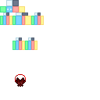 |
|  Liber Sanguinum | Guide book |
| **Field Notes** | Stack-local memo notebook. Captures fleeting dialogue/memo events into `DataComponents.CUSTOM_DATA` (`Memos`, `RemainingMemos`, `InkPath`). Fresh notes have no prepared pages until filled with field ink. Hematic Field Ink binds the notes to Harbinger memos and Liber Sanguinum dictation; Pale Field Ink binds them to Unstained memos and Liber Immaculatus dictation. Each refill prepares 15 memo captures. Field Notes do not become their own Liber chapter; dictation unlocks normal book pages in the player's `LiberKnowledge` attachment. |
| **Hematic Field Ink** | Harbinger Field Notes refill item crafted from Dicentra Sap, Hematic Iron Powder, a water bottle, and an ink sac. |
| **Pale Field Ink** | Unstained Field Notes refill item crafted from Tears of Silthmere, Pale Distillate, a water bottle, and an ink sac. |
|  Unsigned Ancestral Ledger | Creates/joins bloodlines |
|  Engram Stamp | Engram-related tool. Right-click on a solid surface (face-sturdy from above, empty block above) to place an engram block; right-click on an existing engram block to cycle its character. Consumes 1 durability per use. |
| **Scratch-Engraving (no stamp)** | Emergency / early-game method. Hold a sharp shard — `hemomancy:vivianite_cluster`, `minecraft:flint`, `minecraft:quartz`, or `hutoslib:obsidian_flakes` — in the main hand and right-click any solid surface (face-sturdy from above, empty block above). Places a random-character engram block at the cost of **1 heart (2 HP)** of generic damage. Creative players receive the engram without taking damage. Handled by `ScratchEngramHandler` (`@EventBusSubscriber` on `PlayerInteractEvent.RightClickBlock`). |
|  Vivianite Scalpel | Vivianite-based tool |
|  Fungal Spine | Fungal tool item (unstackable, Uncommon) |
| **Qliphoth Seed** | Dropped by the Sanguine Monolith when shattered by a Degree-7 Archon (two interactions). Custom entity `EntityQliphothSeedItem`. Used as a placed catalyst inside the **Bloom of the Qliphoth** rite. One-time per monolith. |
| **Qliphoth Pome** | Edible fruit dropped by the Qliphoth Bloom tree over time (9 total per bloom lifecycle). Each pome tagged with `hemomancy:bloom_origin` + `hemomancy:husk_index` (0–8). On consumption, emits a player-centered black pulse via `SpawnPomePulsePacket`, grants +300 blood, Regeneration II (12 s), Darkness (7 s), and 25% manip cost reduction (3 min). Consuming all nine from one bloom sets `hemomancy:qliphoth_communion = true` and fires the Communion whisper. See §3.9. |
|  Sanguine Salve | Heals 25 blood on use |
|  Cleansing Hemolymph | Blue vial from Hemolymphopoda mobs |
|  Structure Spawner | Debug/creative item for spawning structures |
|  Recycled Enzyme | Generic enzyme fallback |
|  Debug Showcase | Creative-mode debug item (`DebugShowcaseItem`) — right-click to spawn a complete showcase area containing every Hemomancy feature organized into 4 sections: (1) All items in labeled chests, (2) All blocks placed on platforms, (3) All mob entities in fenced pens, (4) All blood structures and cardinal rites as placed patterns. |

### 13.6 Unstained Materials (Our Lady of Still Waters)

| Item | Purpose |
|------|---------|
| Tears of Silthmere | Distilled from Lethean Dew — used at the Altar of Cleansing for a one-time purity boost (+25) |
|  Lethean Poppy Wreath | Woven from Lethean Poppies — repeatable altar offering (+5 purity) |
|  Silver Chalice | A ritual vessel of the Unstained — offered at the Altar of Cleansing for clarity (+5) |
| Pale Silver Bell | Handheld Unstained support equipment. Use grants short Silver Ward and weakens/slows nearby hostiles. |
| Lethean Chalice | Reusable still-water vessel. Use clears one harmful effect, extinguishes fire, grants brief regeneration, and adds Verdigris Aura after Clarity. |
| Verdigris Censer | Reusable oxidized-copper support tool. Use grants Verdigris Aura and marks nearby monsters or blood-active bodies with Glowing + Weakness. |
| Tome of the Unstained | A book of Unstained scripture describing Our Lady of Still Waters and the path of purification |
| Icon of Our Lady | A rare relic depicting Our Lady of Still Waters — carved from pale silver, grants her protection |
|  Pale Silver Ingot | A refined metal sacred to the Unstained, used in crafting Unstained equipment |
| The Pale Distillate | Concentrated essence from Lethean Poppies, a crafting ingredient for Unstained recipes |
|  Virid Salis | Verdigris-colored salt-ash used as the Unstained counterpart to ritual ash trails. **Harvested** by right-clicking any unwaxed oxidized/weathered/exposed copper block (plain, cut, stairs, or slab) with a vanilla brush — strips one oxidation step, drops 1 Virid Salis, costs 1 brush durability. Handled by `CopperBrushingHandler`. **Warding effect**: when placed as a trail (`hemomancy:virid_salis_trail`), any `Monster` mob that walks across it takes 1 magic damage per second (`ViridSalisTrailHandler`). Blood constructs and blood-type mobs (`IBloodConstruct`, `HematicConstructEntity`, `CruorFiendEntity`, `FrozenClotEntity`, `BloodDrunkPuppeteerEntity`, `ThirsterEntity`, `AbyssalSiphonEntity`, `LeechEntity`, `VenousStriderEntity`) take 2 magic damage per second and receive Slowness II for 3 seconds. **Player effect**: Harbinger players at Initiatory Degree 5 (Perfected) or higher take 1 magic damage per second and receive Slowness I for 3 seconds when crossing the trail. |

### 13.7 Food Items

| Item | Purpose |
|------|---------|
|  Gourd Slice | Edible gourd food item |
|  Gourd Stew | Stew crafted from gourd and other ingredients |
| Roasted Gourd Seeds | Smelted/smoked/campfire-cooked gourd seeds (3 cooking methods) |

### 13.8 Organ Echo Items

Produced by the **Visceral Mirror** ritual (requires Degree 3+). Spectral imprints of the player's organs — bound to the player (dissolve if placed in non-player inventory), only one per organ type can exist at a time. Organ "Tier" indicates risk level and degree requirement for extraction:

| Item | Organ | Tier | Notes |
|------|-------|------|-------|
| Echo of Spleen | `SPLEEN` | 3 | Governs blood volume and filtration |
| Echo of Liver | `LIVER` | 3 | Metabolizes toxins and purifies the blood |
| Echo of Lungs | `LUNGS` | 3 | Oxygenates blood and sustains vital rhythm |
| Echo of Kidneys | `KIDNEYS` | 3 | Filters impurities and maintains humoral balance |
| Echo of Heart | `HEART` | 4 | The seat of circulation and will — highest risk, requires Degree 4+ |

> **RESOLVED:** Organ extraction ritual (Visceral Mirror → cycle organs → confirm → produce Echo items) and all per-organ gameplay effects are fully implemented in `VisceralOrgansEvents` (player tick + capability check): **Spleen** +1000 max blood per organ level (announces expansion on first reach); **Liver** removes Poison (level 2+) and Wither (level 3+) on tick; **Lungs** grants Water Breathing (100×level ticks) while underwater; **Kidneys** grants Regeneration at (level-1) amplifier normally, **level amplifier** during a Blood Moon (overclocked filtration); **Heart** grants Damage Resistance (capped at Resistance II), **Wither immunity at level 3** (Cardiac Autonomy mastered), and drains 10÷level blood per 2 s tick. **Iron Brazier reagent system is organ-specific:** each organ requires its own reagent type — Heart=`blood_crystal_shard`, Spleen=`vivianite_cluster`, Lungs=`fervent_husk`, Kidneys=`consecrated_copper_ingot`, Liver=`dicentra_sap`. The three reagents must all be the same type; the brazier records the locked organ and validates the echo matches before consuming it. See §13.8 and `IronBrazierBlockEntity`.

### 13.9 Banner Patterns

-  **Heart Pattern** — Vascularium Crest
-  **Veins Pattern** — Vein Border

---

## 14. Tools & Weapons

### 14.1 Tool Tiers

| Tier | Enum |
|------|------|
| Hematic Iron | `HEMATIC_IRON` |
| Living | `LIVING` |

### 14.2 Living Tools (Blood-powered)

All are single-stack, use the `LIVING` tool tier:

| Weapon | Class | Notes |
|--------|-------|-------|
| Living Blade | `LivingBladeItem` | Blood-feeding sword (25 base dmg, +3 speed) |
| Living Axe | `LivingAxeItem` | Blood-feeding axe |
| Living Spear | `LivingSpearItem` | Blood-feeding polearm |
| Living Baghnakh | `LivingBaghnakhItem` | Blood-feeding claw weapon |
| Living Staff | `LivingStaffItem` | Channels morphlings and blood magic |
| Living Syringe | `LivingSyringeItem` | Extracts blood vials from mobs into a loaded Vial Rack (Shift to eject rack) |
| Living Crossbow | `LivingCrossbowItem` | Fires Blood Bolts |
| Sanguis Lancea | `SanguisLanceaItem` | Throwable blood lance (25 base dmg) |
|  Blood Absorption | `BloodAbsorptionItem` | Conjured blood-absorbing tool |
|  Blood Projection | `BloodProjectionItem` | Conjured blood projectile launcher |

> *Note: Living tools (blade, axe, spear, staff, syringe, crossbow, lancea, baghnakh) use 3D entity models rather than flat item textures — see `src/main/resources/assets/hemomancy/textures/entity/` for their model textures:*
>
>   

### 14.3 Hematic Iron Weapons

| Weapon | Notes |
|--------|-------|
|  Hematic Iron Sword | Standard sword tier |
|  Hematic Iron Knapper | Specialized knapping tool (42 dmg) |

### 14.4 Other Weapons

| Weapon | Notes |
|--------|-------|
| Barbed Blade | Sword-class, Living tier, +3 speed, +25 dmg |
| Chitinite Mace | Sword-class, Living tier |
|  Blood Bolt | Ammo for Living Crossbow |
|  Blood Thrall Effigy | Summons a Blood Thrall creature (stackable to 16) |

---

## 15. Armor Sets

### 15.1 Hematic Iron Armor

Standard blood-infused iron armor set (fire resistant):
-  Helm,  Chestplate,  Leggings,  Boots
- **Stats:** Defense 3/6/8/3 (20 total), Toughness 3.0, KB Resist 0.1, Durability ×37, Enchantability 15
- **Repair:** Hematic Iron Scrap
- **Set Bonus (4 pieces):** Passive blood regeneration — +2 blood/second while wearing full set

> Armor model:  

### 15.2 Blood Lust Armor

Special armor with mask variants:
-  Helm (no mask),  Helm (Tengu mask),  Helm (Horned mask)
-  Chestplate,  Leggings,  Boots
- Mask items:  Tengu Mask,  Horned Mask (crafting ingredients)
- **Stats:** Defense 3/6/8/3 (20 total), Toughness 3.0, KB Resist 0.1, Durability ×37, Enchantability 15
- **Repair:** Hematic Iron Scrap
- **Set Bonus (4 pieces):** Lifesteal — 10% of direct melee damage dealt heals the player

> Armor model:  

### 15.3 Barbed Armor

Defensive barbed armor set:
-  Helm,  Chestplate,  Leggings,  Boots
- Barbed Shield 
- **Stats:** Defense 3/6/8/3 (20 total), Toughness 3.0, KB Resist 0.1, Durability ×37, Enchantability 15
- **Repair:** Chitinous Husk
- **Set Bonus (4 pieces):** Thorns — attackers take 2 damage and receive Blood Loss effect (3 seconds)

> Armor model:  

### 15.4 Chitinite Armor

Insectoid/chitin-based armor:
-  Helm,  Chestplate,  Leggings,  Boots
- Chitinite Shield 
- Chitinite Arm Banner (dyeable, 16 colors)
- **Stats:** Defense 3/6/8/3 (20 total), Toughness 3.0, KB Resist 0.1, Durability ×37, Enchantability 15
- **Repair:** Chitinous Husk
- **Set Bonus (4 pieces):** +2.0 Armor Toughness (via attribute modifier) and 25% projectile damage reduction

> Armor model:  

### 15.5 Unstained Armor

Anti-blood zealot armor (for the Unstained path):
-  Helm,  Chestplate,  Leggings,  Boots
- **Stats:** Defense 3/6/8/3 (20 total), Toughness 3.0, KB Resist 0.1, Durability ×37, Enchantability 15
- **Repair:** Chitinous Husk (placeholder — should be Pale Silver Ingot or Consecrated Copper)
- **Set Bonus (4 pieces):** Immunity to Blood Loss and Hemolysis effects (auto-removed on tick)

> Armor model:  

### 15.6 Crown of Sacred Marrow

Special artifact helmet (`MarrowCrownArmorItem`), uses `MARROW_CROWN` tier.
- **Stats:** Same as Hematic Iron (Defense 3/6/8/3, Toughness 3.0, KB Resist 0.1)
- **Repair:** Hematic Iron Scrap
- **Artifact Bonus:** +10% melee damage (via attribute modifier) when blood volume is above 50%

> **Note:** All armor sets share identical base stat distributions (equivalent to Netherite-tier defense/toughness) but each has a unique set bonus implemented in `ArmorSetBonusHandler`. The Marrow Crown is an artifact helmet with its own standalone bonus that doesn't require a full set.

---

## 16. Functional Blocks & Tile Entities

| Block                                | Tile Entity                                | Purpose                                                                                                                                                                                                                                                                                                                                                                                                                                                                                                                                                                                                                                                              |
|--------------------------------------|--------------------------------------------|----------------------------------------------------------------------------------------------------------------------------------------------------------------------------------------------------------------------------------------------------------------------------------------------------------------------------------------------------------------------------------------------------------------------------------------------------------------------------------------------------------------------------------------------------------------------------------------------------------------------------------------------------------------------|
| **Mortal Display**                   | `MortalDisplayBlockEntity`                 | Activates blood magic when clicked in a Blood Temple                                                                                                                                                                                                                                                                                                                                                                                                                                                                                                                                |
| **Scrying Podium**                   | `ScryingPodiumBlockEntity`                 | Opens the Charm/Gourd slot screen for equipping the Charm of Vascularium and Blood Gourds                                                                                                                                                                                                                                                                                                                                                                                                                                                                                                                                                                            |
| **Somatic Loom**                     | `SomaticLoomBlockEntity`                   | Crafting station for creating Hematic Memories using enzymes, blank memories, and catalysts                  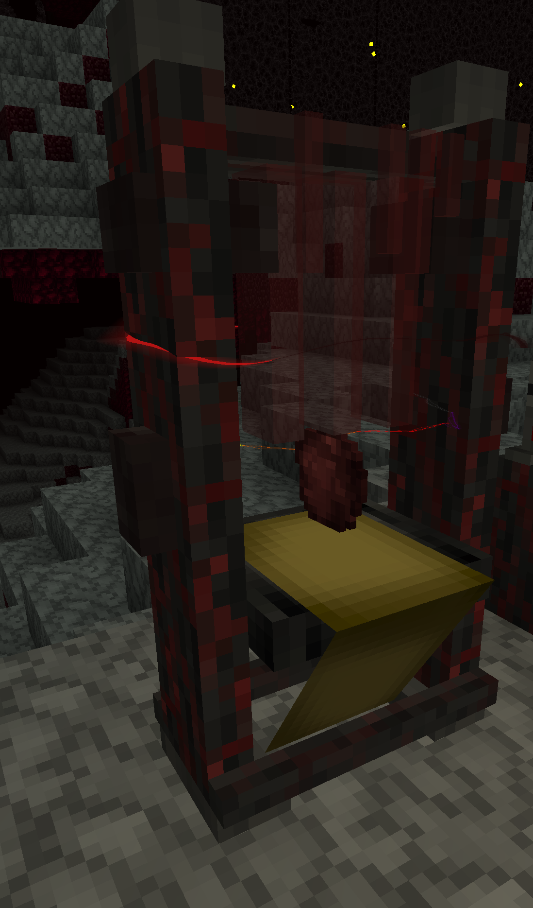                                                                                                                                                                                                                                                                                                                                                                                                                                                                       |
| **Vial Centrifuge**                  | `VialCentrifugeBlockEntity`                | Spins down Bloody Vials into enzymes and Hematic Iron Powder. Reworked with new 3D stand model (`CentrifugeStandModel`), custom block entity renderer (`VialCentrifugeRenderer`), and `VialCentrifugeBlockItem` with custom item renderer. Accepts **Vial Rack** right-click bulk inserts, and startup now requires at least one processable vial with valid output fit. 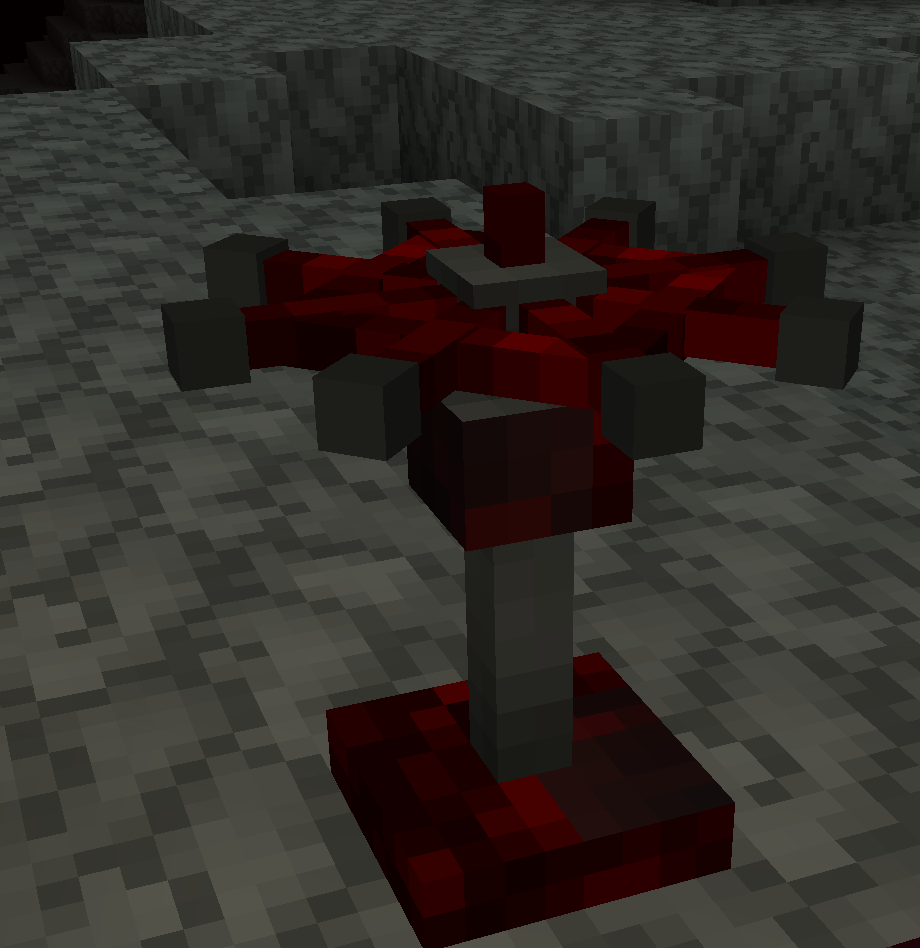                                                                                                                                                                                                                                   |
| **ghastly_alembic**                  | `GhastlyAlembicBlockEntity`                | Squeezes items to extract blood (requires fire below). Has 4 slots: Input (slot 0), Flask (slot 1, fills Cured Clay Flasks into Bloody Flasks), Result (slot 2), and **Catalyst (slot 3)** — an optional catalyst ingredient that modifies or enhances the recipe output. Hopper access: top → input, bottom → result, sides → flask + catalyst. Renders via custom `GhastlyAlembicRenderer` (3D entity model `GhastlyAlembicModel`, facing-aware)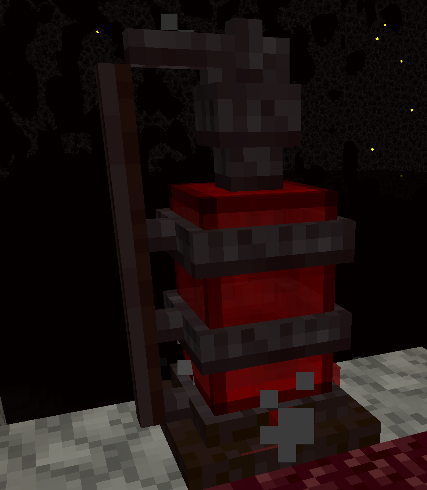   .                                                                                                                           |
> **Ghastly Alembic gourd filling:** The alembic's result/blood output slot also accepts Blood Gourds. When a gourd is placed there, the block entity drains stored blood from its internal tank into the gourd's stack-backed internal blood volume instead of producing bottled blood in that slot.
> **Ghastly Alembic blood seep:** On each configured leak interval, the alembic scans venous stone variants or bone blocks in the surrounding 3x3 floor below it, skipping the center tile occupied by the alembic itself. It first places a fresh Blood Crystal Bud in the first valid open space on top of a trigger tile; only if no placement is possible does it scan existing buds on those trigger tiles and grow the first immature one. If neither placement nor growth can occur, no blood is drained and the next interval starts a fresh search.

| **Cerebral Scarring Station**        | `ScarStationBlockEntity`                   | Crafts scars from patterns and blanks                    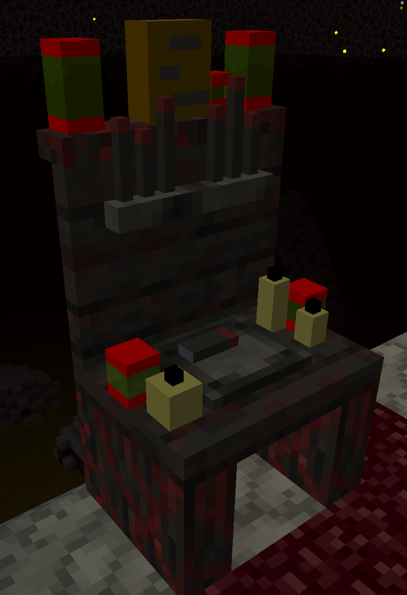                                                                                                                                                                                                                                                                                                                                                                                                                                                                                                                           |
| **Morphling Incubator**              | `MorphlingIncubatorBlockEntity`            | Grows Morphling Polyps into specific morphling types with enzymes. Has 8 slots: Center/polyp (slot 0), 4 enzyme/catalyst slots (1–4), Output (slot 5), Blood Flask/Gourd input (slot 6), and Empty Flask output (slot 7). Craft time: 200 ticks base; enzyme feeding: 100 + 60 per item. Blood cost: 0.5/tick. Bloody Flask transfer is clamped to available player blood capacity (prevents overfill blocking). Uses `IncubatorRecipe` system with 13 recipes (one per morphling type). JEI-integrated. Renders via custom `MorphlingIncubatorRenderer` (3D entity model). 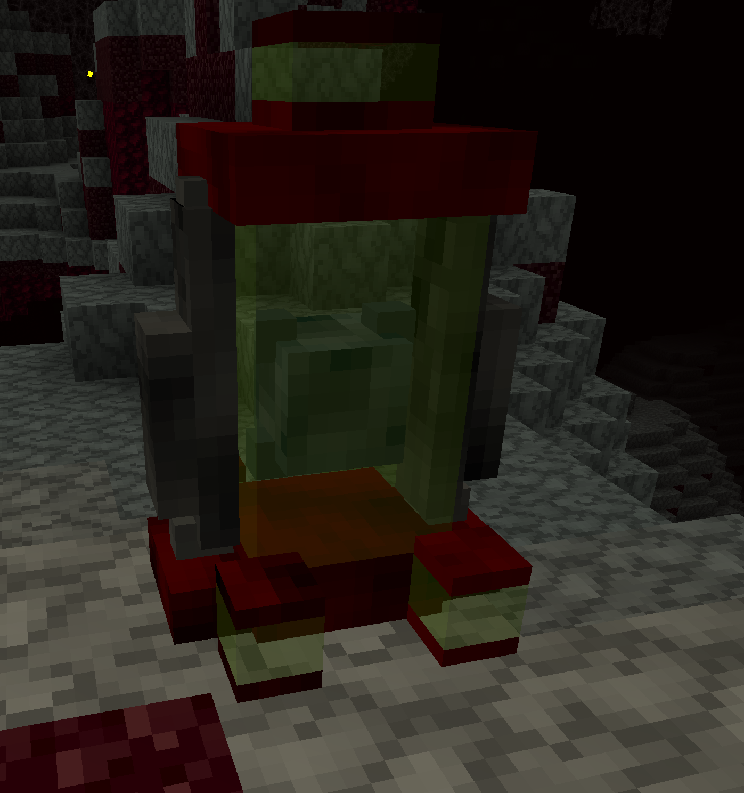 
| **Mycelial Crucible**                | `MycelialCrucibleBlockEntity`              | Cultivates fungal scars through `FungalScarCultivationRecipe`. Has 8 slots: center scar/immature culture, 4 aligned enzyme slots, output, blood flask/gourd input, and empty flask output. Phase 1 drains the recipe's flat blood cost plus 1.5/tick to produce the consolidated `immature_fungal_scar`; Phase 2 feeds aligned enzymes into the culture's custom-data progress until it matures into its stored target scar. See §12.4. |
| **Morphling Cradle**                 | `MorphlingCradleBlockEntity`               | Owner-bound morphling support cradle. Hosts one morphling, runs staged aura/leech logic, and can route blood through internal buffer / owner / bloodline fallback. Supports floor, wall, and ceiling placement. Rendered with custom block entity + item renderers (`MorphlingCradleRenderer`, `MorphlingCradleItemRenderer`). |
| **Specimen Jar**                     | `SpecimenJarBlockEntity`                   | Vivianite glass and Hematic Iron containment jar for Hemomancy arthropod specimens. Empty jars place normally and face the placer. Right-clicking a capturable Hemomancy arthropod with an empty jar stores that exact entity's NBT in the jar item and removes the live mob. Filled jars place with the specimen displayed inside by `SpecimenJarRenderer` / `SpecimenJarItemRenderer`, rotated with the jar's horizontal facing and animated via the renderer's client-only entity copy. Shift-right-clicking a placed jar picks it back up without releasing the specimen; breaking a filled jar releases the stored entity and drops an empty jar. Capturable scope is data-driven by `data/hemomancy/tags/entity_types/specimen_jar_capturable.json` and currently includes Chthonian, Chthonian Queen, Chitinite, Fervent Chitinite, Hemolymphopoda, Myelin Borer, Fargone, and Tooth Pecks. |
| **Fungal Podium**                    | `FungalPodiumBlockEntity`                  | Portal to the Fungal Gardens dimension. Degree 2+ (Votary) required; costs 500 blood. Stores overworld return coordinates in player persistent data. Degree-7 Archons on first exit attempt see the `coreWitnessDialogue()` choice fork instead of teleporting home; subsequent uses proceed directly. See §3.6, §3.9.                                                                                                                                                                                                                                                                                                                                               |
| **Sanguine Monolith** (*The Crimson Lodestone*) | `SanguineMonolithBlockEntity` | 1×2 multiblock (base + filler above) available to Degree 5+ players. Provides degree-gated guidance (degrees 4–7) via `SanguineMonolithDialogueTrees`. The dialogue speaker is displayed as **"The Crimson Lodestone"** (`hemomancy.monolith.lodestone_name`). Each degree includes a `what_are_you` branch that progressively discloses the Monolith's nature: a sealed incubation vessel containing a dormant mycelial fragment built by the Crimson Lodge. At Degree 7 the player can press further for the pre-shatter warning (`press_again` node). At Degree 7 an Archon may interact with it **twice** to shatter it — rendering black shards plus a black orb blast client-side, dropping a **Qliphoth Seed**, and firing `FungalWhisperDialogueTrees.postMonolithShatter()`. The first step of Qliphoth Communion. Custom animated model (`SanguineMonolithModel`). See §3.9 and LORE_REFERENCE §6.5a. |
| **Qliphoth Bloom**                   | `QliphothBloomBlockEntity`                 | 1×1×8 multiblock tree (base + 7 filler blocks) placed by the Bloom of the Qliphoth rite. Stores owner UUID and chunk radius. Effects (Regeneration I, +5 blood/tick) are tick-driven via `QliphothBloomEvents`. Slowly drops 9 Qliphoth Pomes over its lifetime — one per Qliphoth husk (Nahemoth → Ghagiel), with owner whisper alerts on each drop. Registered and synced via `QliphothBloomSavedData`. Player breaking is canceled for the bloom and its filler shell; intended removal is the Rite of Cult Pruning. See §3.9.                                                                                                                                                                                                                       |
| **Fungal Implantation Pylon**        | `FungalImplantationPylonBlockEntity`       | Sporic implantation station 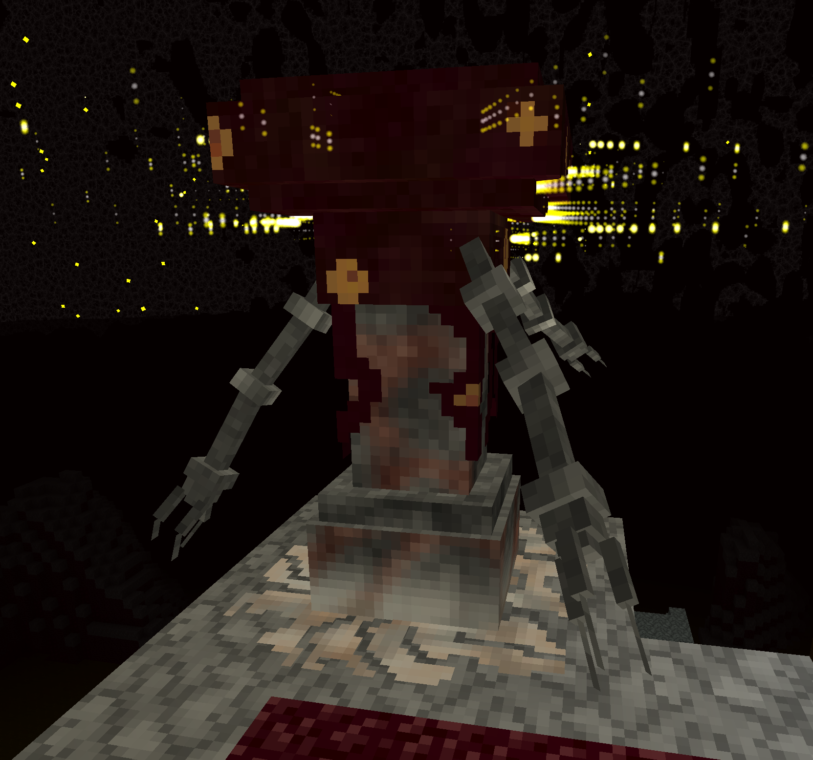                                                                                                                                                                                                                                                                                                                                                                                                                                                                                                                                                      |
| **Dendritic Distributor**            | `DendriticDistributorBlockEntity`          | Opens the Skill Tree / Manipulation Tree screen                                                                                                                                                                                                                                                                                                                                                                                                                                                                                                                                                                                                                      |
| **Unstained Podium**                 | `UnstainedPodiumBlockEntity`               | Where Hemolytic Solution / Consecrated Copper are used for the Unstained path                                                                                                                                                                                                                                                                                                                                                                                                                                                                                                                                                                                        |
| **Altar of Cleansing**               | `AltarOfCleansingBlockEntity`              | Sacred altar of Our Lady of Still Waters — grants one-time purity boost with Tears of Silthmere; accepts Lethean Poppy Wreaths and Silver Chalices for repeatable offerings                                                                                                                                                                                                                                                                                                                                                                                                                                                                                                     |
| **Semi-Sentient Construct**          | `SemiSentientConstructBlockEntity`         | Blood construct-related block                                                                                                                                                                                                                                                                                                                                                                                                                                                                                                                                                                                                                                        |
| **Earthen Vein**                     | `EarthenVeinBlockEntity`                   | Vein location marker for teleportation (Venous Travel)                                                                                                                                                                                                                                                                                                                                                                                                                                                                                                                   |
| **Iron Brazier**                     | `IronBrazierBlockEntity`                   | Decorative/functional brazier                                                                                                                                                                                                                                                                                                                                                                                                                                                                                                                                                                                                                                        |
| **Suspended Blood Crystal**          | `SuspendedBloodCrystalBlockEntity`         | Floating blood crystal display                                                                                                                                                                                                                                                                                                                                                                                                                                                                                                                                             |
| **Suspended Cleansed Blood Crystal** | `SuspendedCleansedBloodCrystalBlockEntity` | Floating cleansed blood crystal display (purified variant with random time offset animation)                                                                                                                                                                                                                                                                                                                                                                                                                                                                      |
| **Suspended Vivianite**              | `SuspendedVivianiteBlockEntity`            | Floating vivianite display                                                                                                                                                                                                                                                                                                                                                                                                                                                                                                                                                     |
| **Mnemonic Reliquary**               | `MnemonicReliquaryBlockEntity`             | Animated decorative/lore reliquary with opening/closing lid. Tracks open count, syncs lid angle (lerped). Has custom 3D block entity renderer and item renderer. Opened via `MnemonicReliquaryMenu`. Currently atmospheric/decorative — no inventory slots or crafting function yet. Planned: may serve as memory storage or manipulation bookmark container. 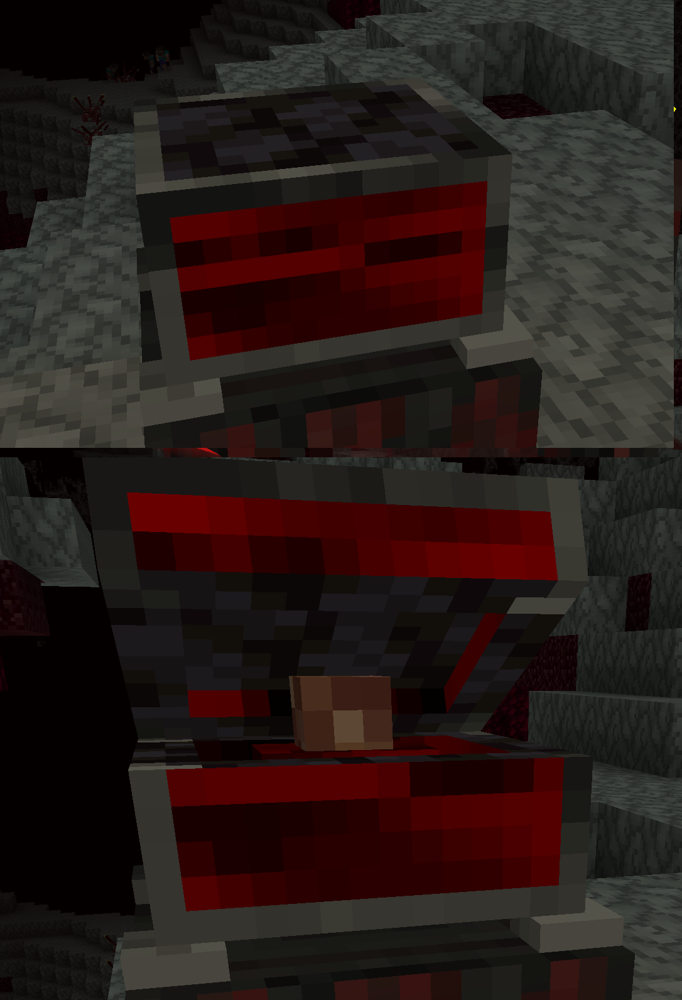                                                                                                                                                                                                                |
| **Dictation Table**                  | `DictationTableBlockEntity`                | First implementation slice of the memo loop. Holds one Liber Sanguinum or Liber Immaculatus stack and renders an open book while one is inserted. Right-click with Field Notes to dictate captured memo IDs into the player's `LiberKnowledge` attachment, draining player blood with a cost that scales by memo count. Hematic-ink notes can only be dictated into Liber Sanguinum; Pale-ink notes can only be dictated into Liber Immaculatus. Memo entries unlock pages inside the normal book chapters for that player; chapters with zero unlocked pages are hidden entirely. The table is only one discovery source; rites, degree gains, advancement grants, item pickups, and special dialogue events can also unlock Liber pages. |
| **Humane Idol**                      | `HumaneIdolBlockEntity`                    | Idol block                                                                                                                                                                                                                                                                                                                                                                                                                                                                                                                                                                                                                                                           |
| **Serpentine Idol**                  | `SerpentineIdolBlockEntity`                | Idol block                                                                                                                                                                                                                                                                                                                                                                                                                                                                                                                                                                                                                                                           |
| **Engram Block**                     | —                                          | Translucent engram. Emits redstone comparator signal 15 when lit (LIT=true), 0 when unlit. `hasAnalogOutputSignal()` returns true.                                                                                                                                                                                                                                                                                                                                                                                                                                                                                                                                   |
| **Filler Block**                     | `FillerBlockEntity`                        | Indestructible filler for multiblocks                                                                                                                                                                                                                                                                                                                                                                                                                                                                                                                                                                                                                                |
| **Bog Body**                         | —                                          | Decorative translucent body block                                                                                                                                                                                                                                                                                                                                                                                                                                                                                                                                                                                                                                    |
| **Visceral Mirror**                  | `VisceralMirrorBlockEntity`                | Ritualistic mirror for organ extraction — gaze into your reflection to extract and modify organs (Spleen, Liver, Lungs, Kidneys, Heart). Requires degree 3+. Cycle organs (right-click) → confirm extraction (sneak right-click). Produces Organ Echo items.    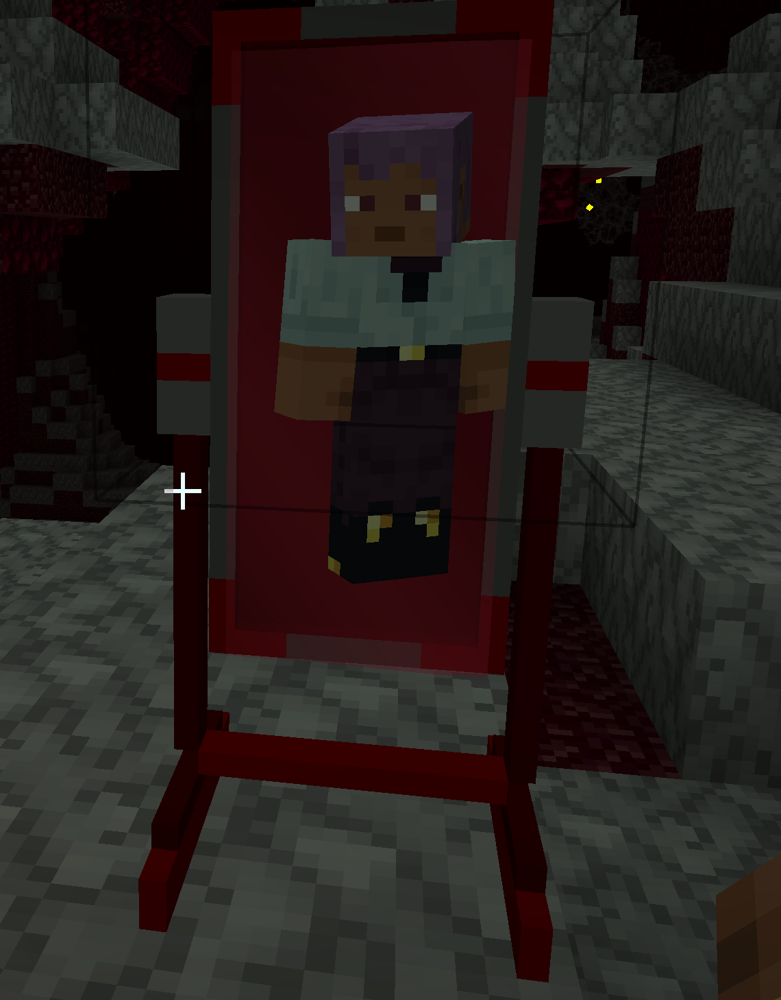                                                                                                                                                                                                                                                                                                                                                                                                        |

---

## 17. Decorative & Building Blocks

### 17.1 Venous Stone Family

A full block family with variants:

| | | |
|---|---|---|
|  Venous Stone |  Polished Venous Stone |  Polished Venous Stone Bricks |
|  Chiseled Polished |  Cracked Bricks |  Gilded Venous Stone |
|  Infested Venous Stone | | |

- Venous Stone, Slab, Stairs
- Polished Venous Stone, Slab, Stairs
- Polished Venous Stone Bricks, Slab, Stairs
- Chiseled Polished Venous Stone
- Cracked Polished Venous Stone Bricks
- Gilded Venous Stone
- Infested Venous Stone

### 17.2 Hematic Iron Family

| | | |
|---|---|---|
|  Hematic Iron Block |  Hematic Iron Pillar |  Chiseled Hematic Iron |

- Hematic Iron Block
- Hematic Iron Pillar (rotatable)
- Chiseled Hematic Iron Block

### 17.3 Anti-Blood / Unstained

-  Hemolytic Plating Block
- Cleansed Stone — pale, smooth stone found in Unstained temples
- Pallid Lantern — softly glowing lantern sacred to Our Lady of Still Waters
- Virid Salis Trail — green Unstained salt-ash trail block placed by `hemomancy:virid_salis` / `hemomancy:virid_salis_trail`

### 17.4 Glass & Panes

| | | | |
|---|---|---|---|
|  Sanguine Glass |  Sanguine Pane |  Vivianite Glass |  Vivianite Pane |
|  Cleansed Sanguine Glass |  Cleansed Sanguine Pane | | |

### 17.5 Wood & Organic

| | | |
|---|---|---|
|  Blood Wood Log |  Blood Wood Planks |  Conscious Mass |

- Blood Wood Log (rotatable pillar)
- Blood Wood Planks
- Conscious Mass (wart-block sound)

### 17.6 Fungal / Plant Blocks

| | | | |
|---|---|---|---|
|  Hyphae |  Hyphae Block |  Infected Stem |  Infected Cap |
|  Fruiting Infected Cap |  Erythrocytic Dirt |  Erythrocytic Mycelium |  Bleeding Heart |
|  Infected Fungus |  Stinkhorn Fungus |  Lethean Poppy | |

- Hyphae (cross-block, replaceable — crafts into Spore Sac)
- Hyphae Block
- Infected Stem
- Infected Cap / Fruiting Infected Cap
- Erythrocytic Dirt
- Erythrocytic Mycelium (spreads, random ticks)
- Bleeding Heart (flower, Absorption effect — crafts Dicentra Sap, brews Potion of Sanguine Siphon)
- Infected Fungus (flower, Confusion effect — ghastly_alembic → Foul Paste, brews Potion of Mycorrhizal Mending, incubator catalyst for Fungal Morphling)
- Stinkhorn Fungus (Confusion effect — ghastly_alembic → Foul Paste, brews Potion of Blood Binding)
- Puffball Fungus (Saturation effect, **Unstained** — ghastly_alembic → Spore Sac, incubator catalyst for Fungal Morphling)
- Lethean Poppy (Regeneration effect, random ticks, **Unstained** — ghastly_alembic → Lethean Dew, crafts Lethean Poppy Wreath)
- Ghost Pipe (myco-heterotrophic, Night Vision effect, **Unstained** — ghastly_alembic → The Pale Distillate)
- Sarcodes (myco-heterotrophic, Regeneration effect — ghastly_alembic → Dicentra Sap, brews Potion of Blood Rush)
- Rafflesia (parasitic, Confusion effect — ghastly_alembic → Spore Sac, brews Potion of Hemolysis)

All applicable flowers have **potted** variants.

### 17.7 Gourd

| | |
|---|---|
|  Gourd |  Gourd Stem |

- Gourd (pumpkin-like, grows from stem)
- Gourd Stem / Attached Gourd Stem

### 17.8 Ash Trails

| | | | | |
|---|---|---|---|---|
|  Smouldering Ash |  Active Smouldering |  Befouling Ash |  Active Befouling |  Virid Salis |

- Smouldering Ash Trail / Active Smouldering Ash Trail
- Befouling Ash Trail / Active Befouling Ash Trail
- Virid Salis Trail (Unstained-aligned; currently no active variant)

### 17.9 Misc

-  Crimson Flames (special fire block)
- Blood Crystal (modeled block)

---

## 18. Recipe Systems

| Recipe Type | Serializer | Station | Purpose |
|-------------|-----------|---------|---------|
| `scar_recipe` | `ScarRecipeSerializer` | Cerebral Scarring Station | Crafting scars |
| `distillation_recipe` | `DistillationRecipeSerializer` | Ghastly Alembic / Pallid Retort | Shared distillation recipes. `pallid: true` targets Pallid Retort; omitted/false targets Ghastly Alembic. |
| `recaller_recipe_type` | `RecallerRecipeSerializer` | Visceral Recaller | Creating Hematic Memories |
| `incubator_recipe_type` | `IncubatorRecipeSerializer` | Morphling Incubator | Growing Morphling Polyps into specific morphlings using enzyme catalysts (13 morphling recipes). JEI-integrated via `IncubatorRecipeCategory`. Fungal scar crafting has moved out to the Mycelial Crucible. |
| `fungal_scar_cultivation` | `FungalScarCultivationSerializer` | Mycelial Crucible | Two-phase fungal scar cultivation. Phase 1 produces `immature_fungal_scar`; Phase 2 matures the culture with aligned enzymes into one of 9 finished `ItemFungalScar` variants. |
| `blood_structure_recipe` | `BloodStructureRecipeSerializer` | In-world structure | Structure crafting (hit structure with catalyst + blood) |
| `cardinal_rite_recipe` | `CardinalRiteRecipeSerializer` | Multiblock | Cardinal Rites for degree advancement |
| Morphling Jar Upgrade | `CopyMorphlingJarRecipe.Serializer` | Crafting | Upgrading morphling jars |
| Blood Gourd Upgrade | `CopyBloodGourdRecipe.Serializer` | Crafting | Upgrading blood gourds |
| Blood Gourd Fill | `FillBloodGourdRecipe.Serializer` | Crafting | Filling gourds with blood |
| Vial Rack | Vanilla shaped recipe | Crafting | 8 Bloody Vials + Hematic Iron Scrap → Vial Rack |

### 18.1 Blood Structure Crafting

An in-world system: build a specific block structure, then hit a particular block with a catalyst item while spending blood. The structure transforms into the desired output.

Blood structure crafting is introduced through the Alchemist dialogue around Votary, but individual recipes are no longer inferred from blood-cost tiers. Each JSON carries `required_degree`; Harbinger recipes compare that value against the player's Initiatory Degree, while Unstained recipes compare it against the numbered Unstained progression stage. Blood cost is only the resource cost.

The Liber Sanguinum/Immaculatus crafting sidebar and the debug Structure Spawner now group recipes directly by required degree/stage (`No Degree`, `Degree 1`, ..., `Degree 8`) through `RecipeDegreeGates`.

| Recipe | Required Degree/Stage | Blood Cost | Held Item | Hit Block | Result |
|--------|-----------------------|-----------|-----------|-----------|--------|
| Liber Sanguinum | 0 | 100 | Sanguine Formation | Bookshelf | Liber Sanguinum |
| Hematic Iron Block | 0 | *(see JSON)* | *(see JSON)* | Iron Block | Hematic Iron Block |
| Ghastly Alembic / Iron Brazier / Living Staff | 1 | *(see JSON)* | *(see JSON)* | *(see JSON)* | Early Harbinger machinery/tools |
| Vial Centrifuge / Mnemonic Reliquary | 2 | *(see JSON)* | *(see JSON)* | *(see JSON)* | Votary machinery |
| Somatic Loom / Mind Spike / Semi-Sentient Construct | 3 | *(see JSON)* | *(see JSON)* | *(see JSON)* | Initiate machinery |
| Runic Chisel Station / Visceral Mirror | 4 | *(see JSON)* | *(see JSON)* | *(see JSON)* | Adept machinery |
| Dendritic Distributor / Consecrated Bloodwell / Morphling Incubator | 5 | *(see JSON)* | *(see JSON)* | *(see JSON)* | Crimson Lodge machinery |
| Covenant Throne / Vascular Effigy | 6 | *(see JSON)* | *(see JSON)* | *(see JSON)* | Bloodline Covenant machinery |
| Sanguine Monolith | 7 | *(see JSON)* | *(see JSON)* | *(see JSON)* | Archon machinery |
| Unstained Podium | Unstained stage 1 | 50 | Glowstone Dust | Hematic Iron Block | Unstained Podium |

> Recipes are in `data/hemomancy/recipe/blood_structure/`. Each recipe defines a multiblock `pattern` with `key` mapping characters to blocks, plus `heldItem`, `hitBlock`, `bloodCost`, `required_degree`, optional `unstained`, and `result`.

### 18.2 Cardinal Rite Recipes

Specific cardinal rite recipes include degree advancement rites (section 3.2) plus utility rites. Progression access now comes from each recipe JSON's explicit `required_degree`; the `minor`/`lesser`/`greater`/`grand` `CardinalRiteType` remains as a ritual form that controls size, cast time, and boundary behavior.

`RecipeDegreeGates` is the shared helper for Blood Structures and Cardinal Rites. Harbinger rites compare `required_degree` against `IInitiatoryDegree`. Unstained rites compare the same field against `getPlayerUnstainedLevel`. The Rites tab groups recipes by this required degree/stage rather than by rite form.

**Degree Advancement Rites:** These recipe JSONs set `"rankup": true`, which lets client UI and tooling distinguish degree rites from utility rites. The rank-up target is inferred from the rite ID so a player who already has that degree or higher cannot start a redundant rank-up rite.

| Rite | Blood Cost | Rite Form | Required Degree | Degree -> | Description |
|------|-----------|-----------|-----------------|----------|-------------|
| Sanguine Initiation | 100 | Minor | 0 | 0 -> 1 | Basic initiation awakening hematic potential |
| Rite of the Votary | 250 | Minor | 1 | 1 -> 2 | Binds the practitioner deeper into the Covenant |
| Rite of the Scarlet Sanctum | 500 | Lesser | 2 | 2 -> 3 | Grants formal entry into the Scarlet Sanctum |
| Adept Rite | *(see JSON)* | Lesser | 3 | 3 -> 4 | Fourth rite of the Hematic Order |
| Rite of the Crimson Lodge | 2000 | Greater | 4 | 4 -> 5 | Illuminates the inner secrets of the Crimson Lodge |
| Rite of the Bloodline Covenant | 3000 | Greater | 5 | 5 -> 6 | Consecrates the practitioner to the Bloodline Covenant |
| Rite of the Hematic Order | 5000 | Grand | 6 | 6 -> 7 | Crowns the practitioner as Archon |
| Rite of Apotheos | 7000 | Grand | 7 | 7 -> 8 | Final ascension beyond Archon; requires completed Qliphoth Communion |

**Utility Rites:**

Utility rite `required_degree` values are authored per recipe rather than inferred from their form. For example, Vascular Mending is Degree 1, the Bloodline/Beacon/Hungering Earth cluster is Degree 2, Scarlet Summons and Sanguine Eclipse are Degree 3, Crimson Vessel is Degree 4, Founding Sanctum/Pallid Shadow/Sanguine Dominion are Degree 5, Eternal Covenant is Degree 6, and Ancestral Communion/Bloom of the Qliphoth are Degree 7. Unstained utility rites use the same field for Unstained stages 0-8.

| Rite | Blood Cost | Rite Form | Description |
|------|-----------|-----------|-------------|
| **Bloodline Founding** | 500 | Lesser | Binds the caster's essence into a new bloodline, producing a presigned ancestral ledger |
| **Bloodline Recall** | 750 | Lesser | Reconjures a lost ancestral ledger from the caster's blood memory |
| **Vascular Mending** | 800 | Lesser | Floods the caster's vascular system with purified blood, fully healing all 7 vein sections |
| **Hematic Fortification** | 500 | Lesser | Strengthens the caster's connection to the blood arts |
| **Hematic Unbinding** | 1000 | Lesser | Dissolves the caster's bloodline, freeing all members and returning shared blood |
| **Crimson Beacon** | 600 | Lesser | Anchors the caster's dying essence to this location: respawn point on fatal blow |
| **Hungering Earth** | 750 | Lesser | Feeds blood into the earth, converting terrain into blood-touched stone and ash |
| **Exsanguination** | 500 | Lesser | Drains the lifeblood of a creature within the ritual circle, crystallizing their essence into Sanguine Quintessence |
| **Sanguine Attunement** | 300 | Minor | Purges and resets the caster's blood tendency alignments to a blank slate |
| **Scarlet Summons** | 2000 | Greater | Teleports all online bloodline members to the rite location (cost scales with members) |
| **Sanguine Dominion** | 3500 | Greater | Claims the surrounding land as a Blood Domain: reduced manip cost, bleeding curse on enemies, empowered blood blocks |
| **Eternal Covenant** | 4000 | Greater | Permanently expands the caster's maximum blood volume (one-time only) |
| **Pallid Shadow** | 5000 | Grand | Strips Unstained purification from a nearby player: a blasphemous assault on Our Lady's path |
| **Ancestral Communion** | 5000 | Grand | Opens a channel to the ancient fungal consciousness. Triggers `AncestralCommunionDialogueTrees`: 5 dialogue variants (Origin, The Schism, The Infection, The Harbingers, The True Name) that reveal the fungal origins of hemomancy. Fires `communion_lore_*` events on completion. |
| **Bloom of the Qliphoth** | 1200 | Grand | Degree 7. Plants a Qliphoth Seed (placed as catalyst within the rite pattern), summons a `QliphothBloomBlock` (1x1x8 tree, 3-chunk radius), and starts the Qliphoth Communion chain. See section 3.9. |

### 18.3 Plant & Fungi Recipes

Plants and fungi found in hemomancy biomes serve as ingredients across multiple crafting systems:

**ghastly_alembic Processing:**

| Input | Output | Count | Cook Time |
|-------|--------|-------|-----------|
| Infected Fungus | Foul Paste | 2 | 100 |
| Stinkhorn Fungus | Foul Paste | 2 | 100 |
| Ghost Pipe | The Pale Distillate | 1 | 150 |
| Sarcodes | Dicentra Sap | 2 | 120 |
| Rafflesia | Spore Sac | 2 | 120 |
| Puffball Fungus | Spore Sac | 2 | 120 |
| Lethean Poppy | Lethean Dew | 2 | 150 |

**Crafting Recipes:**

| Recipe | Type | Ingredients | Output |
|--------|------|-------------|--------|
| Lethean Poppy Wreath | Shapeless | 4× Lethean Poppy + String | 1 |
| The Pale Distillate | Shapeless | Lethean Dew + Consecrated Copper Ingot | 1 |
| Tears of Silthmere | Shapeless | The Pale Distillate + Silver Chalice | 1 |
| Pale Silver Ingot | Shapeless | Iron Ingot + The Pale Distillate | 1 |
| Spore Sac | Shapeless | Puffball Fungus + Hyphae | 2 |
| Foul Paste (fungi) | Shapeless | Infected Fungus + Stinkhorn Fungus + Bone Meal | 3 |
| Befouling Ash | Smelting | Foul Paste | 1 |
| Smouldering Ash | Shapeless | Hematic Iron Powder + Blaze Powder + Gunpowder | 3 |

**Brewing Recipes (Awkward Potion + Plant → Potion):**

Only blood-faction plants brew into hemomancy potions. Unstained plants (Puffball Fungus, Lethean Poppy, Ghost Pipe) deliberately do not brew blood-positive effects — their uses are in ghastly_alembic processing and Unstained crafting chains.

| Plant Ingredient | Result Potion |
|-----------------|---------------|
| Bleeding Heart | Potion of Sanguine Siphon |
| Infected Fungus | Potion of Mycorrhizal Mending |
| Stinkhorn Fungus | Potion of Blood Binding |
| Rafflesia | Potion of Hemolysis |
| Sarcodes | Potion of Blood Rush |

### 18.4 Food Recipes

| Recipe | Type | Notes |
|--------|------|-------|
| Gourd Slice | Crafting | Sliced from gourd block |
| Gourd Stew | Crafting | Stew from gourd + ingredients |
| Roasted Gourd Seeds | Smelting | Gourd seeds in furnace |
| Roasted Gourd Seeds | Smoking | Gourd seeds in smoker |
| Roasted Gourd Seeds | Campfire Cooking | Gourd seeds on campfire |

### 18.5 Faction-Associated Block Palettes (Planning Guardrail)

When drafting new ritual patterns and recipe structures, use faction palettes to avoid repeatedly reusing the same Hemomancy-only block combinations.

| Faction Theme | Vanilla Block Palette (Primary Picks) | Other-Mod / External Palette (When Available) | Pattern Guidance |
|---|---|---|---|
| **Harbinger** | Deepslate Bricks, Polished Basalt, Red Nether Bricks, Iron Bars, Red Stained Glass, Dark Oak | MnA arcane/rune-stone families, engraved occult stone variants | Keep Hematic Iron and Engram blocks as focal accents rather than the entire structure |
| **Fungal** | Mushroom Stem, Brown/Red Mushroom Blocks, Moss, Rooted Dirt, Mud Bricks, Nether Wart Block | MnA nature/verdant stone families, fungal/mycelial block sets from installed mods | Always pair infected blocks with at least two non-Hemomancy organic blocks |
| **Unstained** | Smooth Quartz, Quartz Bricks, Calcite, Diorite, Oxidized/Waxed Copper, White Stained Glass | MnA sanctified/light stone variants, chapel/shrine materials from installed mods | Favor clean, mineral, and water-adjacent palettes; blood-reactive blocks stay minimal |
| **Chitinite / Arthropod** | Dripstone, Pointed Dripstone, Tuff Bricks, Polished Blackstone Bricks, Packed Mud | Earthy/chitin-like carved stone sets, hive/amber/chitin sets from installed mods | Blend shell-like mineral textures with chitin cues; avoid all-blood-block patterns |
| **Neutral / Common Folk** | Stone Bricks, Cobblestone, Andesite, Oak Planks, Bricks, Lanterns | Non-occult builder sets from worldgen/structure mods | Use as baseline for transitional or non-faction ritual spaces |

**Recipe/Rite Planning Rules:**
- Include at least one Vanilla primary block and one non-Hemomancy block in every new ritual multiblock.
- Do not reuse the same core `hitBlock` family across multiple adjacent rite tiers unless intentionally signaling a direct progression upgrade.
- If a Hemomancy-exclusive block is mandatory for function, diversify the surrounding pattern with faction-appropriate Vanilla blocks.
### 18.6 Saint Canon Memory Recipes (Somatic Loom)

Each of the four saints yields a Canon Memory when the player places a Hallowed Residuum into the Somatic Loom's catalyst slot while the loom's tendency alignment matches the saint's paired tendencies (both must reach the TENDENCY_THRESHOLD of 3.0).

| Canon Memory | Ingredient (catalyst slot) | Loom Tendencies Required | Unlocks Manipulation |
|-------------|---------------------------|--------------------------|---------------------|
| `memory_crimson_tithe` | Hallowed Residuum of Hemorath | MORTEM + ANIMUS | Crimson Tithe (SUMMA, MORTEM) |
| `memory_unclosing_eye` | Hallowed Residuum of Seraphae | LUX + DUCTILIS | Unclosing Eye (SUMMA, LUX) |
| `memory_bloom_of_rot` | Hallowed Residuum of Putriciel | MORTEM + FLAMMEUS | Bloom of Rot (SUMMA, MORTEM) |
| `memory_endless_hour` | Hallowed Residuum of Velorum | CONGEATIO + TENEBRIS | Endless Hour (SUMMA, CONGEATIO) |

> These are SUMMA-rank manipulations — the most costly and powerful tier. They are imprinted rather than learned; no blood cost reduction from Dynamic Use applies.

### 18.6.1 Scar-Catalyst Memory Recipes (Somatic Loom)

Five scar items can serve as Somatic Loom catalysts, providing an alternative path to certain memories. These are distinct from the standard routes (different ingredient, and in most cases different tendency combination). They are intended as mid-game rewards for players who have invested in the scar system:

| Memory | Scar Catalyst | Loom Tendencies Required | Notes |
|--------|--------------|--------------------------|-------|
| `memory_blood_rush` | `scar_heart` | ANIMUS + LUX | Heart-scar resonance variant; pushes blood through willpower alone |
| `memory_umbral_step` | `scar_shade` | TENEBRIS | Shade-scar variant; same tendency as ender-eye route, different catalyst |
| `memory_hemorrhage` | `scar_thorn` | MORTEM + FERRIC | Thorn scar pierces — the wound follows the scar |
| `memory_blood_eclipse` | `scar_moon` | CONGEATIO + TENEBRIS | Moon scar harmonizes with the eclipse; overlapping tendency with fermented spider eye route |
| `memory_sanguine_ignition` | `scar_phoenix` | FLAMMEUS + ANIMUS | Phoenix scar kindles blood into flame; requires two tendencies vs the standard single-tendency fire_charge route |

> Recipes live in `data/hemomancy/recipe/memory_weaving/memory_*_scarred.json`. The loom's recipe matcher checks both tendencies AND ingredient, so scar-catalyst and standard-catalyst routes for the same memory coexist without conflict.

### 18.7 Hallowed Residuum Extraction (Vial Centrifuge)

Processing a **Consecrated Syringe** (tagged with a saint type) in the **Vial Centrifuge** yields the corresponding Hallowed Residuum. The syringe is obtained by using an empty Blood Vial on a consecrated Saint Sarcophagus.

| Consecrated Syringe Tag | Output |
|------------------------|--------|
| `HEMORATH` | Hallowed Residuum of Hemorath |
| `SERAPHAE` | Hallowed Residuum of Seraphae |
| `PUTRICIEL` | Hallowed Residuum of Putriciel |
| `VELORUM` | Hallowed Residuum of Velorum |

---

## 19. Mob Entities

> **Design Note — Arthropods as Natural Hemomancers:** In the Hemomancy worldbuilding, arthropods and crustaceans are treated as nature's own blood mages. They do not use blood magic consciously, but the same forces that let Hemomancers harden blood into iron or spin it into chitin are expressed instinctively across the insect and crustacean kingdoms (urchins growing blood spines, Chthonians growing iron mandibles, Chitinites growing hematic-iron shells, etc.). This informs the mod's use of these creatures as source material for crafting and the Morphling system.

### 19.1 Hostile / Monster Mobs

| Entity | Texture | Category | Notes |
|--------|---------|----------|-------|
| **Fargone** |  | Monster | Standard mosquito esk blood monster |
| **Thirster** |  | Monster | Blood-thirsting mob |
| **Abhorent Thought** | | Monster | Large (1.5×3.25), eldritch thought entity |
| **Erythromycelium Eruptus** |  | Monster | Large fungal eruption mob (1.5×3.0) |
| **Blood Drunk Puppeteer** |  | Monster | Human-sized, controls dolls |
| **Enthralled Doll** |  | Monster | Small (0.5×0.5), controlled by puppeteer |
| **Chthonian** |  | Monster | Iron-mandible termite creature — actively chews through wood blocks and wooden tools in the area. Spawns in Chthonian Termite Mounds (Savanna biome). Part of the "arthropods as natural hemomancers" theme (they produce hematic iron shells biologically). |
| **Chthonian Queen** |  | Monster | Boss variant of Chthonian; exactly 1 spawns per Termite Mound. Associated with gold (royal). The only gold-connected creature in the mod. |
| **Lump of Thought** |  | Monster | Sentient thought blob |
| **Morphling Polyp** (mob) |  | Monster | Wild morphling mob |
| **Dessicant** | | Monster | Desiccating creature (ON_GROUND spawn) |
| **Cruor Fiend** | | Monster | Blood-fueled fiend (ON_GROUND spawn) |
| **Void Drinker** | | Monster | Void-aligned blood drainer (ON_GROUND spawn) |
| **Frozen Clot** | | Monster | Ice-blood clot creature (ON_GROUND spawn) |
| **Abyssal Siphon** | | Monster | Large (1.2×0.6) deep-sea blood siphon (ON_GROUND spawn) |
| **Synapse Hound** | | Monster | Neural creature (ON_GROUND spawn) |
| **Myelin Borer** | | Monster | Burrowing neural parasite (ON_GROUND spawn) |

### 19.2 Creature / Ambient Mobs

| Entity | Texture | Category | Notes |
|--------|---------|----------|-------|
| **Leech** |  | Creature | Small (0.4×0.1) blood-sucking leech |
| **Fungling** |  | Creature | Friendly fungal creature |
| **Chitinite** |  | Creature | Iron-shelled Isopod insect (1.0×0.3) |
| **Fervent Chitinite** |  | Creature | Fire variant of Chitinite |
| **Hemolymphopoda** |  | Ambient | Small (0.9×0.3), Horseshoe crab drops Cleansing Hemolymph |
| **Barbed Urchin** |  | Water Ambient | Underwater iron-barbed urchin |
| **Crimson Doe** | | Creature | Blood-touched deer (ON_GROUND spawn) |
| **Hemojelly** | | Ambient | Blood jelly creature (ON_GROUND spawn) |
| **Venous Strider** | | Ambient | Vein-walking strider (ON_GROUND spawn) |

### 19.3 NPC / Summons / Player-controlled

| Entity | Texture | Category | Notes |
|--------|---------|----------|-------|
| **Blood Thrall** |  | Creature | Small (0.6×0.7), summoned blood transport creature |
| **Unstained Zealot** |  | Creature | NPC that guides Unstained path entry |
| **Unstained Guardian** | | Creature | NPC that guards Unstained sacred sites |
| **Unstained Acolyte** | | Creature | NPC acolyte of the Unstained faction |
| **Harbinger Hermit** | | Creature | NPC Harbinger recluse; full degree 0–7 dialogue (`HarbingerHermitDialogueTrees`). Drops Rite Hint item on farewell. Invulnerable until player chooses "Farewell" option. |
| **Harbinger Alchemist** | | Creature | NPC machine expert found at Harbinger Outposts; full degree 0–7 dialogue (`HarbingerAlchemistDialogueTrees`). Teaches crafting stations, dismisses purifying players. |
| **Harbinger Vicar** | | Creature | NPC doctrine keeper found at Harbinger Outposts; full degree 0–7 dialogue (`HarbingerVicarDialogueTrees`). Delivers faction history lore; reveals secret "8th degree" at Archon. |
| **Annetta Knowles (The Stained Priestess)** | | Boss | Separate Unstained boss arc, not part of the Saints. High-ranking Unstained cleric boss bitten by a Chthonian (which only seek the infected), causing her sanity to shatter and her long-suppressed blood power to erupt. **Phase 1** (100%→30% HP): silver aura pulses every 60 ticks dealing 3 magic damage + Weakness to blood-active (Harbinger) players within 6 blocks. **Phase 2** (≤30% HP): attack boost, blood spear drains 250 blood per hit from blood-active players. Drops Pale Silver Ingot ×2 + Hematic Iron Scrap ×3 on death. Boss bar: purple NOTCHED_10. `AnnettaKnowlesEntity` is registered in `EntityInit`; `AnnettaKnowlesRenderer` currently uses the vanilla humanoid model with `textures/entity/blank.png`. Encounter trigger, dedicated model/texture/animations, and her fuller teeth/nails/hair combat identity still WIP. |
| **Spectral Companion** | | Misc | Spectral ally entity |
| **Sanguilith** | | Misc (MnA, dormant) | Large (1.5×3.25), blood-themed summoned monster from the dormant MnA compat source. `ComponentSummonSanguilith` summons an ownable, duration-limited melee attacker with a max of 4 nearby. Authored in `MnAPluginEntityInit` with custom `SanguilithModel` and `SanguilithRenderer`, but not compiled/registered while MnA compat is excluded on the current NeoForge 1.21.1 branch. |

### 19.4 Entity Tags

Mobs are tagged by tendency: `FUNGAL_TAG`, `UMBRAL_TAG`, `INCANDESCENT_TAG`, `FERRIC_TAG`, `VIVACIOUS_TAG`, `RUINOUS_TAG`, `NEUROTIC_TAG`, `FERVENT_TAG`, `FRIGID_TAG`.

### 19.5 Spawn Placements

Registered in `EntityInit.commonSetup`:
- Barbed Urchin → `IN_WATER`
- Hemolymphopoda → `ON_GROUND`
- Fargone → `ON_GROUND` (monster rules)
- Abhorent Thought → `ON_GROUND` (monster rules)
- Dessicant → `ON_GROUND` (monster rules)
- Cruor Fiend → `ON_GROUND` (monster rules)
- Void Drinker → `ON_GROUND` (monster rules)
- Frozen Clot → `ON_GROUND` (monster rules)
- Abyssal Siphon → `ON_GROUND` (monster rules)
- Synapse Hound → `ON_GROUND` (monster rules)
- Myelin Borer → `ON_GROUND` (monster rules)
- Crimson Doe → `ON_GROUND`
- Hemojelly → `ON_GROUND`
- Venous Strider → `ON_GROUND`

### 19.6 Entity Loot Tables

> **Resolved in resources:** Entity drops are hand-authored JSON now. The disabled `HemoEntityLootProvider` generator remains stale/commented, but the live loot tables are the JSON files under `src/main/resources/data/hemomancy/loot_table/entities/` (1.21 singular `loot_table` path). Current count: **37 entity loot tables**.

Notable implemented drop families:

| Entity / Family | Drop Theme |
|-----------------|------------|
| Chitinite / Fervent Chitinite / Chthonian / Chthonian Queen | Chitinous Husk, with Chthonian Queen also rolling Ferric Enzyme |
| Leech / Blood aquatic or arthropod mobs | Blood/hemolymph materials such as Swollen Leech or Cleansing Hemolymph |
| Fargone / Thirster / Abhorent Thought / Lump of Thought / Morphling Polyp | Sanguine Formation / fungal ingredients depending on mob |
| Blood Drunk Puppeteer / Enthralled Doll | Puppeteering Thread / Bleeding Bulb |
| Saint and boss entities | Direct/special boss rewards are handled in entity code or matching loot JSON depending on encounter |

Do not re-enable `HemoEntityLootProvider` unless the current JSON values are first ported back into the provider.

---

## 20. Projectile & Blood Construct Entities

### 20.1 Blood Constructs

Extend `BloodConstructEntity` (a `PathfinderMob` implementing `IBloodConstruct`). They are summoned by the player and have a limited lifetime (`deathTicks`):

| Entity | Notes |
|--------|-------|
| Blood Cloud (`CloudEntityBlood`) | Area-of-effect blood cloud |
|  Iron Pillar (`EntityIronPillar`) | 0.75×2.8 iron construct |
|  Iron Wall (`EntityIronWall`) | 1.6×2.8 iron wall construct |
|  Iron Spike (`EntityIronSpike`) | 1.4×1.5 iron spike trap |
|  Wretched Will (`EntityWretchedWill`) | Will-based construct |

### 20.2 Projectiles

| Entity | Texture | Notes |
|--------|---------|-------|
| Directed Blood Orb | | High tracking range (150), main blood projectile |
| Tracking Blood Orb | | Homing blood orb |
| Blood Cloud Carrier | | Delivers blood clouds |
| Tracking Serpent |  | Homing snake projectile |
| Tracking Pests | | Homing pest swarm |
| Blood Bolt |  | Crossbow ammo entity |
| Blood Needle |  | Small fast projectile |
| Blood Bullet |  | Pistol-type projectile |
| Blood Shot |  | Shotgun-style spread |
| Sanguis Lancea |  | Thrown spear entity |
| Dark Arrow | | Dark-themed arrow |

### 20.3 Item Entities

| Entity | Notes |
|--------|-------|
| Flying Charm | The Charm of Vascularium flying to the player |
| Morphling Polyp Item | Dropped morphling polyp pickup |

---

## 21. Status Effects & Potions

Each effect has a corresponding potion, splash potion, lingering potion, and tipped arrow variant:

| Effect | Category | Color | Notable Mechanic |
|--------|----------|-------|-----------------|
|  **Blood Binding** | Harmful | Dark red | Immobilizes target |
|  **Blood Loss** | Harmful | Red | -15% movement speed |
|  **Blood Rush** | Beneficial | Red | +20% move speed, +10% attack speed |
|  **Hemolysis** | Neutral | Pink | Blood destruction effect |
|  **Noctifly Agaric** (Fungal Elytra) | Beneficial | — | Grants elytra flight  |
|  **Sanguine Fertility** | Beneficial | 0xCC3344 | Fertility/growth effect |
| **Arachnid Anastomosis** | Beneficial | 0x8B0000 | Spider-vein healing |
| **Mycorrhizal Mending** | Beneficial | 0x7B4F2A | Fungal regeneration |
| **Sanguine Siphon** | Beneficial | 0x8B0000 | Blood drain on hit |
| **Chitinous Bulwark** | Beneficial | 0x556B2F | +4 armor toughness |
| **Serpentine Guile** | Beneficial | 0x2E8B57 | +15% move speed, +10% attack speed |
| **Verminous Aura** | Beneficial | 0x4A3728 | Pest-based area effect |
| **Echoic Perception** | Beneficial | — | Bat morphling effect — nearby entities glow (radius scales with amplifier) |
| **Luminous Dissipation** | Beneficial | — | Moth morphling effect — knockback resistance |
| **Hemorrhagic Venom** | Beneficial | — | Tick morphling effect — AoE damage aura to nearby hostiles |
| **Spined Barricade** | Beneficial | — | Urchin morphling effect — passive thorns + armor bonus |
| **Venomous Resilience** | Beneficial | — | Centipede morphling effect — poison immunity + speed |
| **Burrower's Instinct** | Beneficial | — | Mole morphling effect — mining speed + underground regen/night vision |
| **Arcane Resonance** | Beneficial | 0x8800AA | MnA combo marker — next blood manipulation costs less blood (granted by blood-affinity MnA spells) |
| **Sanguine Clarity** | Beneficial | 0xAA0022 | MnA combo marker — next MnA spell costs less mana (granted by using blood manipulations) |

---

## 22. World Generation & Biomes

### 22.1 Custom Biomes (via TerraBlender)

| Biome | Key | Temperature | Precipitation | Notes |
|-------|-----|-------------|---------------|-------|
| **Fungal Gardens** | `fungal_gardens` | 2.0 | None (Nether) | Hyphae tendrils, huge fungi |
| **Fungal Isles** | `fungal_isles` | 2.0 | None (Nether) | Hyphae, huge fungi, small infected fungi |
| **Sporecrown Thicket** | `sporecrown_thicket` | 1.2 | None | Dense fungal overgrowth, hostile spawns (Eruptus, Chthonian, Fargone), crimson particles, dark red fog |
| **Hyphal Spires** | `hyphal_spires` | 0.9 | None | Extreme towering terrain with calcified hyphae, conscious mass patches; high-weirdness / low-erosion zones |
| **Drifting Mycelium** | `drifting_mycelium` | 0.7 | None | Anti-gravity floating islands of fungal terrain; high-continentalness zones with 3D noise creating disconnected landmasses |

The Fungal Gardens dimension uses a datapack `multi_noise` biome source in `data/hemomancy/dimension/fungal_gardens.json`. Its climate noise is intentionally tuned at a higher horizontal frequency so the dimension's fungal biomes appear as shorter, more varied patches rather than enormous single-biome regions. Its terrain density is intentionally high-relief: `continental_shape`, `erosion_shape`, and `fungal_noise_settings` amplify mid-scale rises, basins, and eroded ridges so the ground does not collapse into broad uniform shelves. Water is also meant to appear as real fungal seas and lowland basins: `fungal_noise_settings` uses sea level 32 and `continental_shape` avoids an excessive positive landmass bias. `morphic_pool` is a fungal dimension surface feature shared across the fungal dimension biomes; it gets two placement attempts per chunk in the same feature step as the other visible fungal terrain features, scans around the ocean-floor heightmap for actual fungal terrain, and carves shallow morphic nectar basins through the dimension's fungal surface palette, including `mycelium_erythrocytic_dirt`. The dimension is carved by datapack configured carvers (`fungal_cave`, `fungal_cave_large`, `fungal_canyon`); the two cave carvers use the registered `hemomancy:dry_fungal_cave` carver, which keeps vanilla-style cave branching but widens and densifies it into frequent spaghetti/Swiss-cheese tunnels while only applying strict fluid-adjacency protection near sea level, preventing exposed underwater air scars without overwhelming chunk generation. `fungal_canyon` is kept rare and deep. `#minecraft:overworld_carver_replaceables` is extended with the dimension's custom fungal stone/surface blocks. The dimension is visually dim: `dimension_type/fungal_gardens.json` uses low ambient light, the Fungal Gardens / Fungal Isles biome fog colors are darkened, and `FungalSkyBoxRenderer` tints the spore skybox down so the custom Earth, moon, and star field remain readable without washing out the realm. Its fungal biomes use End music (`minecraft:music.end`) with cave mood ambience rather than Nether ambient loops or additions. Sky-reaching hyphae tendrils are intentionally common; each tendril now chooses a varied endpoint height, with many stopping in the lower or middle sky and only rare strands approaching the ceiling, so the horizon reads as an uneven alien mycelial forest instead of a uniform set of build-limit cables. Open ground is broken up by `venous_ridge`, a sparse low surface feature that lays smoother organic ribs of infested stone, hyphae, conscious mass, and hemorrhagic crust across dry fungal terrain; some runs begin partially embedded and rise through the ground like exposed roots. Sparse canopy mushrooms are also shared into more fungal dimension biomes so big silhouettes appear outside only the dense thickets. Registered overworld biome hooks still live in the 3 TerraBlender regions (`TestRegion1/2/3`) with custom surface rules.

> **Custom environment textures:**
>
> | | | | |
> |---|---|---|---|
> |  Sun |  Moon |  Clouds |  Blood Moon Phases |

### 22.1.1 Blood Moons

Blood Moons are a world event distinct from normal nights, with their own moon texture phases (`blood_moon_phases.png`) and a client-side vein/tendril sky overlay.

**Frequency:** Natural trigger checks once per night at tick 12542 and currently has a **1-in-7 chance** to start a 11900-tick Blood Moon. A command can force one for testing; the **Rite of the Sanguine Eclipse** (Greater rite, Degree 3+) also manually triggers one — see §8 Cardinal Rites.

**Effects while active:**
- Harbingers / active Hemomancers: **Strength II and Night Vision**
- Non-blood-magic players: **Weakness I** + **passive blood drain** (50 blood per effect interval, ~every 2 s) while their blood is active — the tide pulls at the uninitiated
- Thirsters and Fargones spawn near players within the Blood Moon encounter cap via direct Blood Moon event spawns, not biome spawn lists; placement allows open night sky and non-colliding ground clutter, avoids bright block-lit areas, checks full mob clearance, and only counts successful world insertion
- **Somatic Loom** ritual blood cost reduced by **25%** during a Blood Moon (applied in `SomaticLoomBlockEntity.startRitual()`; parallel to the manipulation discount in `BloodManipulation`)
- **Founding Sanctum** barrier: hostile mobs (non-player `Monster`) that enter a consecrated sanctum boundary during a Blood Moon take 4 magic damage and are knocked outward every effect interval (handled in `FoundingSanctumEvents.onLevelTick()`)
- **Kidneys** organ (if extracted): regeneration amplifier increases by +1 during a Blood Moon (overclocked filtration under pressure) — see §24 Organ System
- Clients render the red Blood Moon phase texture and the `BloodMoonVeinSkyRenderer` tendril overlay when `PacketSyncBloodMoon` marks the event active; the RGB-only Blood Moon phase sheet is drawn additively so its black background texels do not appear as a visible square at dawn/dusk

**Lore significance:** Blood Moons represent the Pale Lady expending a burst of power to push back the fungal infection for another cycle. The moon appearing full and blood-red is her doing. After such a night, the moon may appear dim or new — she is recovering. See [LORE_REFERENCE.md](LORE_REFERENCE.md) §9 for the full cosmological explanation.

> **RESOLVED:** `BloodMoonEvents` handles natural trigger, commands, gameplay effects, mob spawning, and client sync. Blood drain for uninitiated, loom discount, and sanctum mob-sealing are all implemented. Ritual trigger via the **Rite of the Sanguine Eclipse** is implemented.

### 22.2 World Features

| Feature | Notes |
|---------|-------|
| Big Mushgloom | Large mushroom variant |
| Canopy Mushroom / Brown & Red Canopy | Tree-like mushroom features |
| Small Infected Mushroom | Small scattered fungi |
| Fungus Feature | Generic fungal feature |
| Hyphae Feature | Ground-level hyphae spread |
| Hyphae Tendril | Vertical tendril features |
| Bog Body Feature | Generates bog body blocks |

### 22.3 Configured/Placed Features

Managed via `ConfiguredFeatureInit` and `PlacedFeatureInit`:
- `HYPHAE_TENDRIL`, `VENOUS_RIDGE`, `HUGE_FUNGUS`, `SMALL_INFECTED_FUNGUS`
- `PLACED_INFESTED_VENOUS_STONE_BLOB`, `PLACED_MYCELIUM_BLOB`
- `PLACED_CANOPY_MUSHROOMS_DENSE`, `PLACED_CANOPY_MUSHROOMS_SPARSE`
- `PATCH_HYPHAE`, `BLEEDING_HEARTS`, `STINK_HORNS`

---

## 23. Structures

| Structure | Type | Notes |
|-----------|------|-------|
| **Blood Temple** | `BloodTempleStructure` | Contains the Mortal Display; gateway to hemomancy |
| **Unstained Church** | `UnstainedChurchStructure` | Contains the Unstained Podium; gateway to the Unstained path |
| **Qliphoth Sanctum** | NBT structure | Dark sanctum used for the Qliphoth-related endgame content; contains Engram Block |
| **Qliphoth Bloom** | NBT structure | Qliphoth Bloom block structure placement |
| **Blood Tower (Core)** | NBT structure | Core segment of the Blood Tower multi-piece structure |
| **Blood Tower (Top 1)** | NBT structure | Top segment of the Blood Tower multi-piece structure |
| **Saint Trial Chamber (Hemorath)** | NBT structure (WIP) | Locked dungeon for the First Saint — four blood-basin puzzle, blood-sapping room, inner sarcophagus chamber. Unlocks once all four basins are filled to the correct level. See §3.8. |
| **Chthonian Termite Mound** | Feature/Structure (WIP) | Savanna biome structure. Always spawns with exactly 1 Chthonian Queen and a variable population of Chthonians. Contains a small loot chest (iron, gold, minerals). Chthonians will chew nearby wood. Spawn rate should be tuned (currently slightly over-common). |
| **Plains Hemopothecary** | Village structure | Hemopothecary villager house for plains biome villages |
| **Desert Hemopothecary** | Village structure | Hemopothecary villager house for desert biome villages |
| **Taiga Hemopothecary** | Village structure | Hemopothecary villager house for taiga biome villages |
| **Snowy Hemopothecary** | Village structure | Hemopothecary villager house for snowy biome villages |
| **Savanna Hemopothecary** | Village structure | Hemopothecary villager house for savanna biome villages |

> Structure NBT files are in `data/hemomancy/structures/`. The Blood Temple and Unstained Church are registered as worldgen structures with template pools. The hemopothecary village variants are integrated via `HemopothecaryProcessor` and `VillageEvents`.

---

## 24. Villagers & Professions

| Profession | POI Block | Notes |
|-----------|-----------|-------|
|  **Hemopothecary** | Scrying Podium | Blood-themed villager trader |

**Hemopothecary Trade Listings:**

| Level | Sells | Price (Emeralds) |
|-------|-------|-----------------|
| 1 | Befouling Ash | 1 |
| 1 | Fungal Morphling | 1 |
| 1 | Recycled Enzyme | 1 |
| 1 | Bloody Flask | 1 |
| 2 | Fervent Husk | 2 |
| 3 | Barbed Helm | 3 |
| 4 | Foul Paste | 4 |
| 5 | Heart Pattern | 5 |

- Custom `HemopothecaryProcessor` for village structure integration
- `VillageEvents` for handling village spawning

---

## 25. Mod Compatibility

### 25.1 Mana and Artifice (MnA)

> **Current NeoForge 1.21.1 status:** MnA compat source is preserved as the design/implementation target, but it is **not compiled or registered** in the current branch. `build.gradle` excludes `src/main/java/com/vincenthuto/hemomancy/compat/mna/**`, the MnA dependency is commented because no NeoForge 1.21.1 build is available, and the `Hemomancy.java` MnA imports/registration block are commented behind TODOs. Treat this section as planned/dormant compat until MnA publishes a compatible build and the source exclusion is removed.

Designed integration as a faction + spell system:

**Faction: The Harbingers**
- `HarbingersFaction` — custom faction with blood-red manaweave (RGB 160,0,40) 
- Token item:  Mark of Blood
- Grimoire:  Tome of the Impending End
- Faction Horn:  Horn of the Impending End
- Custom mana resource (`HarbingersMana`) 

**Spell Components:**
-  `ComponentBloodBinding` — applies Blood Binding effect via spells
-  `ComponentManaToBlood` — converts MnA mana into Hemomancy blood volume (configurable magnitude, 50–200 mana per cast)
-  `ComponentSanguineFertility` — applies Sanguine Fertility via spells
- `ComponentBloodToMana` — "Sanguine Offering" — drains target's blood and converts to mana for caster (inverse of ManaToBlood). Magnitude 50–500, Blood affinity. Composable with any MnA shape.
-  `ComponentBloodLoss` — applies Blood Loss effect (movement speed debuff) via spells. Duration 60–300t, Magnitude 1–3, HARMFUL
-  `ComponentBloodRush` — applies Blood Rush effect (+move/attack speed) via spells. Duration 100–600t, Magnitude 1–3, FRIENDLY
-  `ComponentHemolysis` — applies Hemolysis effect (blood destruction DoT) via spells. Duration 40–200t, Magnitude 1–4, HARMFUL
-  `ComponentSummonSanguilith` — "Conjure Sanguilith" — summons a Sanguilith at target location. Duration 200–600t (summon lifetime), Magnitude scales damage. Requires Harbinger faction. HARMFUL

**Cross-System Mechanics (dormant until MnA compat is re-enabled):**
- **Blood Tithe** (`BloodTitheHandler`): Harbinger faction members casting blood-affinity spells have a configurable percentage of mana cost converted to blood cost instead (default 25%). Blood drained at 5 blood per 1 mana replaced. Hooks into `CalculatingManaCostEvent`.
- **Spell → Manipulation Combos** (`ManipComboHelper` + `BloodTitheHandler`): Casting blood-affinity MnA spells grants **Arcane Resonance** (reduces next manipulation's blood cost). Using Hemomancy manipulations grants **Sanguine Clarity** (reduces next spell's mana cost). Creates an alternating gameplay loop between both mod systems.

**Cross-Mod Config** (`HemoMnAConfig`):
- Blood ↔ Mana conversion ratios
- Blood Tithe enable/disable, mana reduction %, blood-per-mana ratio
- Living Thread armor set bonus values
- Trapezohedron effect radius
- Spell ↔ Manipulation combo enable/disable, durations, reduction percentages
- Sanguilith summon health scaling and max summon count

**Manipulations:**
- `SanguineTransfusionManip` — MnA-specific manipulation

**Runic Anvil Integration:**
- Living Infused Thread + Mage Armor → Living Thread armor set (Hood, Robes, Leggings, Boots)
- (3) Set Bonus: +500 Max Mana, +50% Mana Regen

**Additional MnA Items:**

| | | | |
|---|---|---|---|
|  Foul Vinteum Ingot |  Befouled Vinteum Dust |  Mana Infused Memory Blank |  Living Infused Thread |
|  Living Thread Hood |  Living Thread Robes |  Living Thread Leggings |  Living Thread Boots |
|  Blood Shot Occulus |  Mote of Blood |  Mana Memory: Sanguine Transfusion | |

> Living Thread Armor model:  

**MnA Ritual:**
- Ritual of The Weeping Wound

**MnA Block/Tile/Entity:**
- Custom blocks, tiles, and entities in `compat/mna/block`, `compat/mna/tile`, `compat/mna/entity`

**Planned / Brainstormed Features** (see `MNA_COMPATIBILITY_BRAINSTORM.md` for full details — each feature includes an "MnA Justification" explaining why it specifically requires Mana and Artifice):
- New spell shapes: Sanguine Pulse (dual mana+blood cost AoE), Hemomantic Tether (channeled tether draining blood per tick)
- New MnA rituals: Sanguine Convergence (permanently links mana regen to blood volume), Arcane Crucible (transmutes MnA materials with blood sacrifice), Mana Wound (zone that adds Hemomancy effects to MnA spells)
- Tendency ↔ Affinity mapping: Hemomancy tendencies boost corresponding MnA spell affinities
- Harbinger faction: Occulus tasks, sanctum structure, manaweaving recipes, raid mobs — all use MnA faction infrastructure
- Blood Construct: MnA Construct variant fueled by blood instead of mana, built at MnA's workbench
- Blood-Infused Construct Capabilities: runeforged modules for MnA Constructs
- Hemomantic Wand Core, Arcane Living Staff, Mote of Mana — crafted via MnA systems (manaweaving, runeforging)
- Hemomantic enchantments via MnA runeforging
- Cross-mod advancements, JEI integration for MnA crafting recipes
- Harbinger Mana HUD texture (`textures/mna/harbingers_resource_bars.png`) and resource hook (`HarbingersMana` implementing `ICastingResourceGuiProvider`) are authored in dormant compat source and should be treated as port targets until MnA is re-enabled

### 25.2 Curios

Curios integration for the Charm of Vascularium and other equippable items is preserved in `compat/curios`, but the current NeoForge 1.21.1 branch does not compile/register it. `build.gradle` comments the Curios dependency and `Hemomancy.java` has the Curios registration block commented behind a TODO pending a compatible Curios NeoForge build.

### 25.3 JEI

JEI is currently supplied by a local `libs/jei-1.21.1-neoforge-19.27.0.340.jar` while the old Maven dependency lines remain commented. Recipe category support exists/planned for:
- Chisel Station recipes
- Visceral Recaller recipes
- Blood Structure Crafting recipes
- Morphling Incubator recipes (`IncubatorRecipeCategory`)

### 25.4 HutosLib

HutosLib is still the required shared runtime library (`com.vincenthuto.hutoslib:hutoslib`, currently `7.3.5`), but local development now uses a Gradle composite build. `settings.gradle` includes `../HutosLib` and substitutes the Maven module with the local project, so Hemomancy builds directly against the workspace HutosLib source when that sibling checkout is present.

---

## 26. GUIs & Overlays

### 26.1 HUD Overlays

| Overlay | Location | Shows |
|---------|----------|-------|
| `BloodVolumeOverlay` | Left side | Current/max blood volume bar plus a small two-lobed equipped blood gourd indicator that reads only the Charm/Gourd slot and tints white/red/black by gourd variant  |
| `UnstainedGaugeOverlay` | Top-right | Purity + Clarity bars  |
| `EquippedMorphlingOverlay` | — | Currently equipped morphling icon |
| `ManipCooldownOverlay` | — | Active manipulation cooldown timer |

> **Gauge fills:**  Blood fill &nbsp;  Purity fill &nbsp;  Clarity fill

### 26.2 Screens

**Key GUI Textures:**

|                                                                                                             | |                                                                                                          |
|-------------------------------------------------------------------------------------------------------------|---|----------------------------------------------------------------------------------------------------------|
| 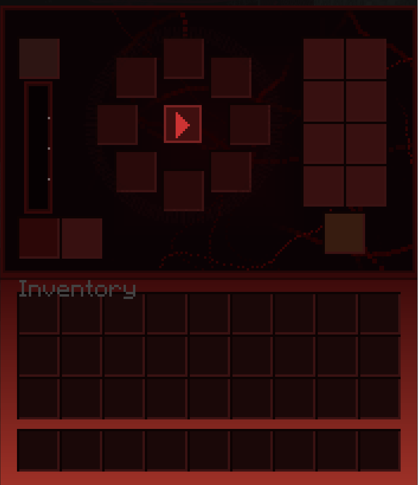Vial Centrifuge   | 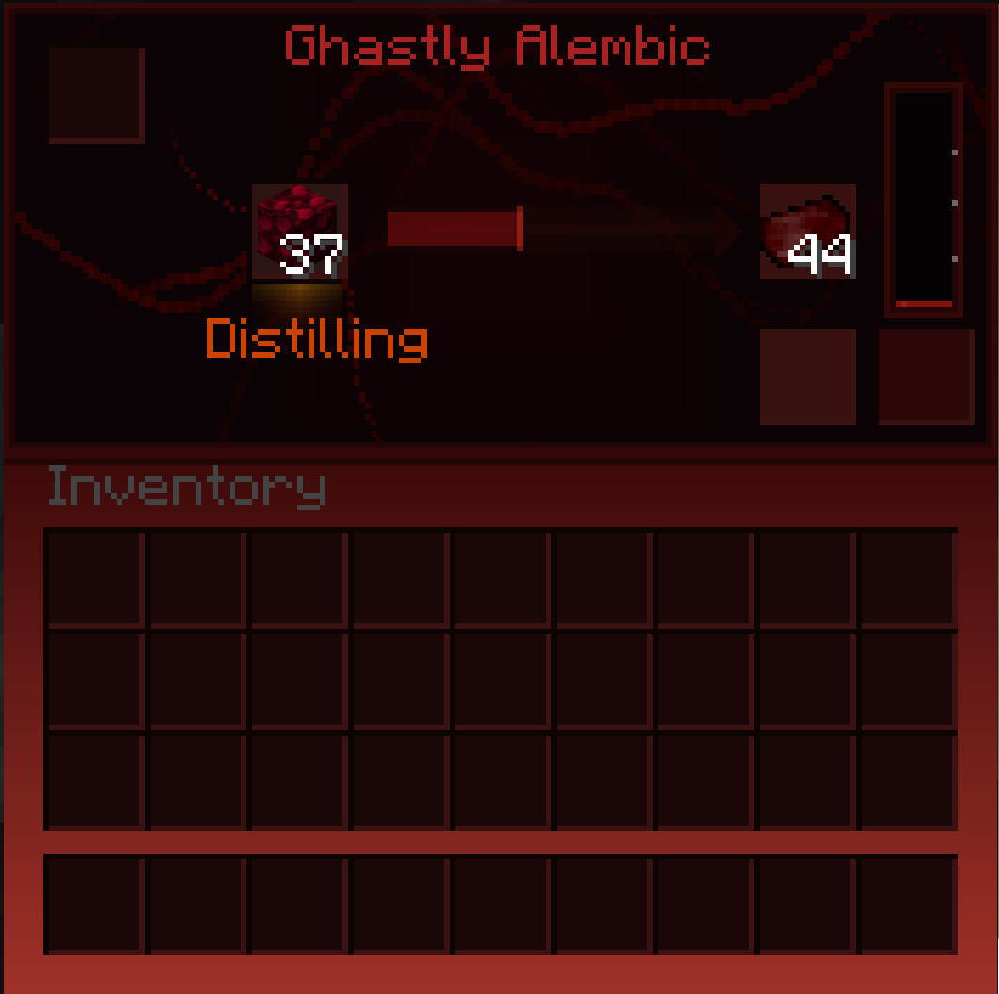 ghastly_alembic | Recaller                           |
| 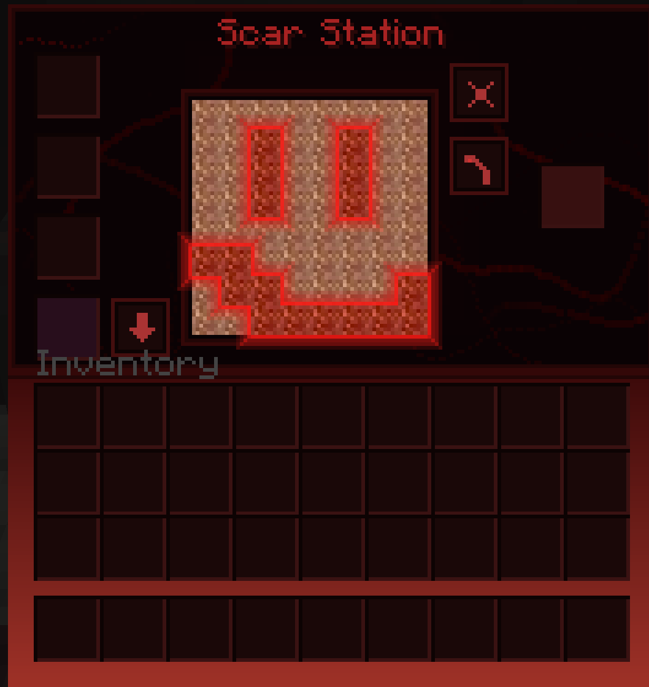 Scarring Station | 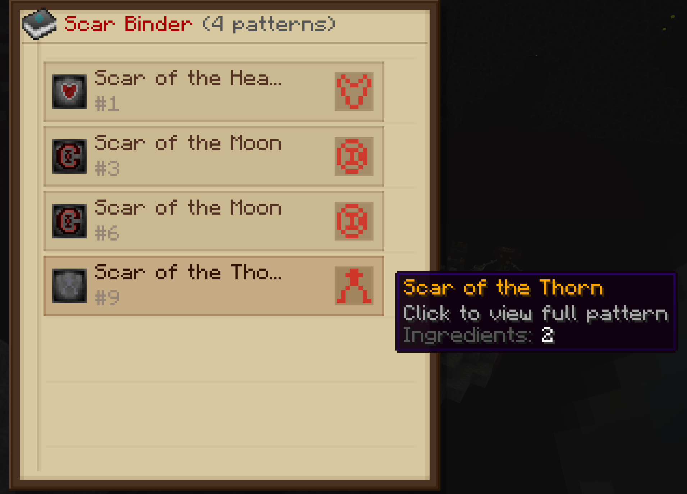Scar Binder | 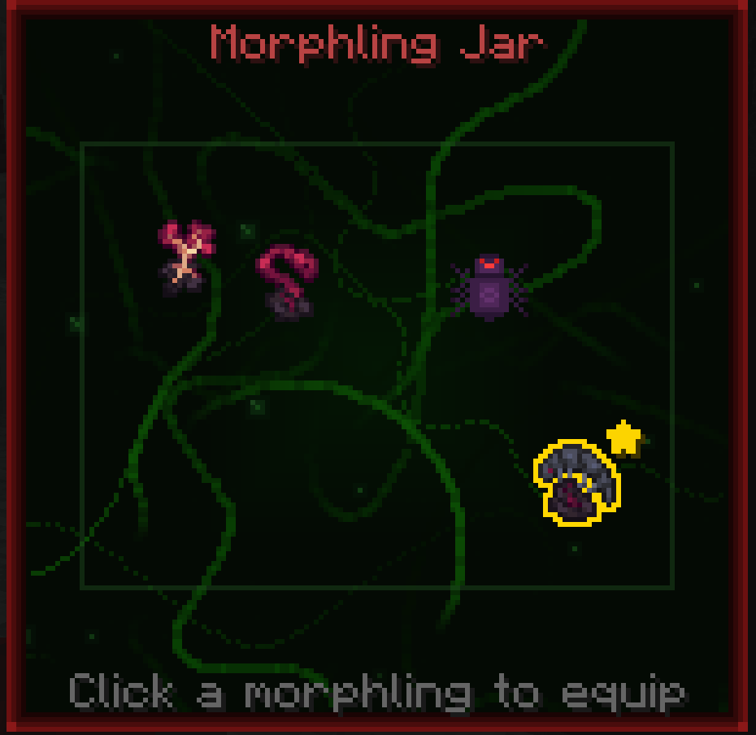 Morphling Jar              |
| 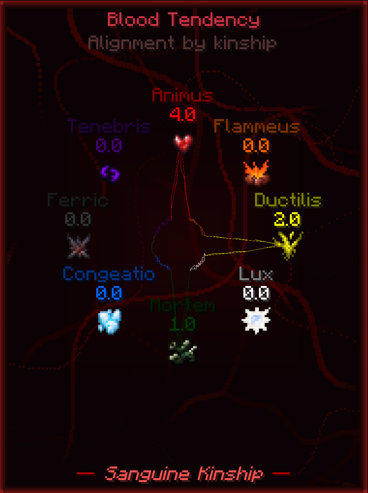Tendency View     |  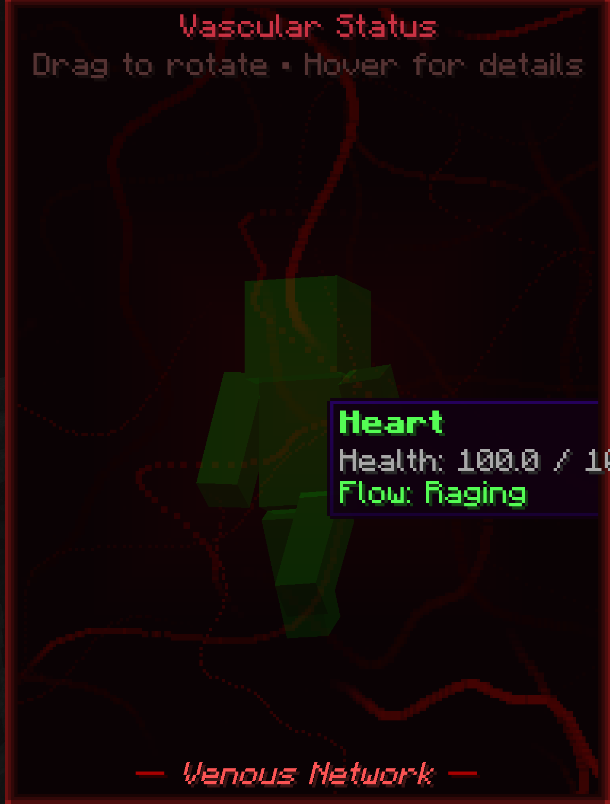Vascular View | 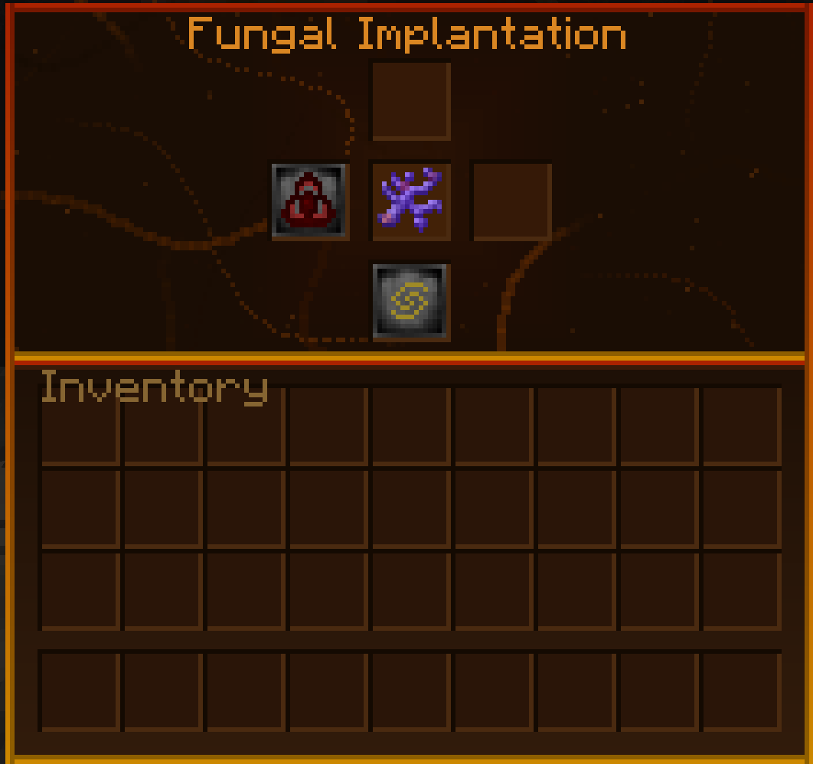 Spore Implant |

| Screen | Opened From | Purpose |
|--------|------------|---------|
| `CharmGourdScreen` | Scrying Podium | Equip Charm of Vascularium + Blood Gourds |
| `HarbingerProgressScreen` | Dendritic Distributor | Harbinger progress suite (Skills/Manipulations/Crafting/Scars/Rites/Materials), now tab-controller modularized; Skills overlay includes rank title text |
| `TendencyViewScreen` | Blood Tendency Gauge | View blood tendency alignments |
| `VascularViewScreen` | Vascular Status Gauge | View vein section health |
| `VascularStatusScreen` | — | Detailed vascular status |
| `BloodlinePoolScreen` | Bloodline Pool Monitor | View/manage bloodline shared pool |
| `GhastlyAlembicScreen` | ghastly_alembic block | ghastly_alembic crafting GUI |
| `VialCentrifugeScreen` | Vial Centrifuge | Centrifuge crafting GUI (reworked with new 3D stand model) |
| `MorphlingIncubatorScreen` | Morphling Incubator | Incubation crafting GUI |
| `UnstainedProgressScreen` | Self Reflection Mirror | Unstained progress + shared Rites/Crafting/Materials tab controller stack |
| `MnemonicReliquaryScreen` | Mnemonic Reliquary block | Reliquary viewing GUI — opens animated lid on interaction |
| `SporeImplantScreen` | Fungal Implantation Pylon | Spore implantation GUI |
| `StructureSpawnerScreen` | Structure Spawner item | Debug structure spawning |
| Various radial menus | Living Staff / keybinds | Morphling/manipulation selection |
| Guide/Codex screens | Liber Sanguinum | ~~NON-FUNCTIONAL~~ **Partially functional** — `HemoProgressionScreen.setupEntries()` is still commented out in Java (renderer), but the HutosLib JSON book framework is wired and the Liber Sanguinum's data folder (`data/hemomancy/books/sanctumsanguinium/`) now has a `manipulations/` chapter (ordinality 7) with 10 pages covering all 8 tendencies + overview + Canon Memories. |
| Guide/Codex screens | Liber Immaculatus (Unstained book) | **Populated** — `data/hemomancy/books/liberimmaculatus/` now has 4 chapters (intro, sacred_tools, our_lady, the_path), 3 pages each. Covers Hemolytic Solution mechanics, Our Lady of Still Waters lore, purity/clarity stage descriptions. |

---

## 27. Advancements

### 27.1 Shared / Early Game

| Advancement | Trigger |
|-------------|---------|
| **Strange Seeds** | Find Gourd Seeds from grass |
| **The First Awakening** | Activate a Blood Temple's Mortal Display (programmatic) |
| **Ashen Beginnings** | Craft Befouling Ash |
| **Sanctum Sanguinium** | Obtain the Liber Sanguinum |
| **Iron in the Blood** | Create first Hematic Iron Block via blood structure recipe |
| **Bottled Vitality** | Obtain a Blood Gourd |
| **An Extension of Oneself** | Craft a Living Staff |
| **Inherited Memory** | Obtain any Hematic Memory |
| **Scarlet Tradition** | Obtain the Charm of Vascularium |
| **Armed to the Veins** | Equip full Hematic Iron armor |
| **Cultivator** | Obtain a Morphling Jar |
| **The Blood Remembers** | Obtain a Living Blade |
| **Old Habits** | Obtain any enzyme |
| **Bleeding a Stone** | Craft a Ghastly Alembic |

### 27.2 Harbinger Path (programmatic + item triggers)

All degree advancements are granted via `HarbingerAdvancementGranter.grantDegree()` inside the `DEGREE_RITE_PATHS` completion block of `CardinalRiteEvents`. They chain from `the_first_awakening`.

| Advancement | JSON key | Frame | Trigger |
|-------------|----------|-------|---------|
| **Neophyte of the Crimson Veil** | `degree_1_neophyte` | task | Degree 1 rite (programmatic) |
| **Votary of the Hematic Covenant** | `degree_2_votary` | task | Degree 2 rite (programmatic) |
| **Initiate of the Scarlet Sanctum** | `degree_3_initiate` | task | Degree 3 rite (programmatic) |
| **Adept of the Sanguine Brotherhood** | `degree_4_adept` | goal | Degree 4 rite (programmatic) |
| **Illuminatus of the Crimson Lodge** | `degree_5_illuminatus` | goal | Degree 5 rite (programmatic) |
| **Sanctified of the Bloodline Covenant** | `degree_6_sanctified` | goal | Degree 6 rite (programmatic) |
| **Archon of the Hematic Order** | `degree_7_archon` | challenge | Degree 7 rite (programmatic) |
| **Apotheos of the Hematic Order** | `degree_8_apotheos` | challenge | Degree 8 rite (programmatic) |

**Order function milestones** — branches off the degree chain:

| Advancement | JSON key | Parent | Trigger |
|-------------|----------|--------|---------|
| **Blood Is Bound** | `blood_is_bound` | `degree_3_initiate` | Bloodline founding rite succeeds (programmatic) |
| **A Lodge of Crimson** | `crimson_lodge_consecrated` | `degree_5_illuminatus` | Crimson Lodge rite completes (programmatic) |
| **This Ground Is Ours** | `founding_sanctum_established` | `degree_5_illuminatus` | Founding Sanctum first consecration (programmatic) |
| **The Covenant Cannot Be Unmade** | `eternal_covenant_sealed` | `degree_6_sanctified` | Eternal Covenant rite completes (programmatic) |

**Endgame / revelation milestones:**

| Advancement | JSON key | Parent | Trigger |
|-------------|----------|--------|---------|
| **Voices in the Vein** | `voices_in_the_vein` | `degree_7_archon` | Ancestral Communion rite (programmatic) |
| **The Blood Beneath the Blood** | `the_blood_beneath_the_blood` | `degree_7_archon` | Obtain Fungal Spine (inventory_changed) |

**Mastery side branches:**

| Advancement | JSON key | Parent | Trigger |
|-------------|----------|--------|---------|
| **Scars of the Mind** | `scars_of_the_mind` | `degree_4_adept` | Obtain Scar Binder or Scar Binder Upgraded (inventory_changed) |
| **The Land Bleeds for You** | `sanguine_domain` | `degree_5_illuminatus` | Sanguine Dominion rite (programmatic) |

### 27.3 Unstained Path (programmatic)

All granted via `UnstainedAdvancementGranter.grantIfNotDone()` from `UnstainedMilestoneHandler` (tick-based threshold checks) and `CardinalRiteEvents` (clarity ascension rite, altar of cleansing).

| Advancement | JSON key | Frame | Condition |
|-------------|----------|-------|-----------|
| **Unstained** | `unstained` | task | Obtain Hemolytic Solution |
| **Lady of the Forgotten Waters** | `lady_of_forgotten_waters` | goal | Obtain Tears of Silthmere |
| **Path of Purity** | `path_of_purity` | task | Obtain Tome of the Unstained |
| **Our Lady of Still Waters** | `our_lady_of_still_waters` | challenge | Obtain Icon of Our Lady |
| **Blessed by the Altar** | `blessed_by_the_altar` | goal | Use Altar of Cleansing (programmatic) |
| **Tainted** | `tainted` | task | Purity ≥ 25 (programmatic) |
| **Cleansing** | `cleansing` | task | Purity ≥ 50 (programmatic) |
| **Absolved** | `absolved` | goal | Purity ≥ 75 (programmatic) |
| **Purified** | `purified` | challenge | Purity = 100 (programmatic) |
| **Clarity Awakened** | `clarity_awakened` | challenge | Clarity unlocked (programmatic) |
| **Discerning** | `discerning` | task | Clarity ≥ 25 (programmatic) |
| **Vigilant** | `vigilant` | goal | Clarity ≥ 50 (programmatic) |
| **Resolute** | `resolute_stage` | goal | Clarity ≥ 75 (programmatic) |
| **Enlightened** | `enlightened_seeker` | challenge | Clarity = 100 (programmatic) |

---

## 28. Keybindings

All under the "Hemomancy" category:

| Key | Action |
|-----|--------|
| Use Manipulation | Cast the selected quick manipulation |
| Use Quick Manipulation | Alternative quick-cast |
| Use Continuous Manipulation | Toggle continuous manipulation |
| Cycle Known Manipulations | Cycle through unlocked manipulations |
| Activate Blood Construct | Activate blood construct ability |
| Blood Formation | Trigger blood formation |
| Blood Draw | Draw blood |
| Open Morphling Jar | Open jar viewer |
| Open Morphling Jar Viewer | Open detailed jar viewer |
| Toggle Gourd Open/Closed | Toggle blood gourd state |
| Toggle Scar Binder Pickup | Toggle scar pickup mode |

---

## 29. Commands

The `/hemo` command tree (via `HemoCommand`, permission level 2) provides:

**Blood Volume:**
- `blood get` — show current blood
- `blood set <amount>` — set blood volume
- `blood setmax <amount>` — set maximum blood volume
- `blood fill` — fill to max
- `blood activate` — toggle blood capability active state

**Initiatory Degree:**
- `degree get` — show current degree
- `degree set <number>` — set degree (0–8)
- `qliphoth pome reset` — reset pome progress and reseal the Qliphoth Communion gate

**Unstained Progress:**
- `unstained get` — full overview (purity, clarity, stages)
- `unstained begin` — toggle begun purification
- `unstained purity get` / `unstained purity set <value>` — read or set purity (0–100)
- `unstained clarity unlock` — toggle clarity unlock
- `unstained clarity get` / `unstained clarity set <value>` — read or set clarity (0–100)
- `unstained reset` — reset all unstained progress to zero
- `unstained max` — max out all unstained progress

**Other Debug/Admin:**
- `skills get` / `skills setpoints <amount>` / `skills reset`
- `organs get` / `organs set <organ> <level>` / `organs reset`
- `bloodmoon summon` / `bloodmoon cancel`
- `slots get` / `slots equip <manip>` / `slots unequip <manip>`

---

## 30. Known WIP / Incomplete Systems

- **Entity Loot Tables** — ~~All entity loot tables in `HemoEntityLootProvider` are entirely commented out.~~ **RESOLVED:** 37 entity loot table JSON files exist in `data/hemomancy/loot_table/entities/` (1.21 singular path) and are loaded automatically by vanilla/NeoForge datapack convention. The `HemoEntityLootProvider` data generator remains disabled but is not needed — loot tables work via the JSON files.
- **Progression Codex / Liber Sanguinum / Liber Immaculatus** — `HemoProgressionScreen.setupEntries()` is still commented out (Java renderer WIP). However, the HutosLib JSON book framework is wired: the `sanctumsanguinium` book folder now has normal lore/mechanics chapters, and the `liberimmaculatus` book folder has 4 chapters (intro, sacred_tools, our_lady, the_path) with 12 pages covering the full Unstained path. The Field Notes / memo slice is implemented: `memo_capture:<id>` dialogue events write memo IDs into Field Notes, and the Dictation Table dictates those IDs into the player's `LiberKnowledge` attachment rather than into the Liber item stack. Field Notes are now ink-bound: Hematic Field Ink captures Harbinger memos for Liber Sanguinum, while Pale Field Ink captures Unstained memos for Liber Immaculatus. `LiberKnowledge` stores `KnownMemos`, `UnlockedLiberEntries`, and per-entry discovery sources, syncs to clients with `PacketSyncLiberKnowledge`, and can be granted through `LiberKnowledgeHelper` by memos, advancements, rites, item pickups, degree changes, dialogue, or other future triggers. `LiberEntryDefinitions` is the central code-side page map: it lists visible book entries and maps initial rites, Harbinger degree advancements, Unstained milestones, selected item pickups, and `liber_unlock:<entry_id>` dialogue events to normal book page IDs. The Liber items now behave like personal viewers/keys: borrowed books show the reader's own unlocked pages, not the owner's. Legacy stack data is migrated into the player attachment when an old Liber is used or placed for dictation. `MemoBookFilter` treats `LiberEntryDefinitions` as the source of visible pages for both Liber books; pages not mapped by a definition remain hidden, and chapters with zero unlocked pages are omitted. Current memos include `first_rite_notes`, `pale_lady_notes`, and Harbinger fungal whisper memos (`fungal_whisper_adept`, `fungal_whisper_illuminatus`, `fungal_whisper_sanctified`, `fungal_whisper_archon`, `fungal_whisper_truth`, `qliphoth_communion`) that unlock the Hyphae, Entity, Truth, and Qliphoth Liber Sanguinum pages through Hematic Field Ink. Remaining WIP: re-enable `setupEntries()` if that older renderer is revived, move entry definitions to data-driven JSON if desired, and author more entry definitions across existing chapters.
- **Blood Fluid** (`FluidInit`) — Blood as a placeable fluid is entirely commented out / WIP
- **Manipulation Rank Advancement** — Ritual-based forced rank upgrades described as WIP in lore
- **Unstained Zealot Capability Check** — Uses reflection to check for `UnstainedProgressProvider` (suggests it was added incrementally)
- **Skill Effect Wiring** — ~~7 of 13 skills are not wired.~~ **RESOLVED:** All 18 skills in `SkillPointHelper` have helper methods and are fully wired into event handlers. Iron Will wired in `BloodVolumeEvents.onPlayerDamaged`; Scar Affinity/Resonance/Mastery wired in `ScarEntityEventHandler` and `ItemScar`.
- **Loot Modifiers** (`AddItemModifier`) — framework exists, specific loot tables TBD
- **~~Visceral Organs System~~** — **RESOLVED:** All 5 organ effects are fully implemented in `VisceralOrgansEvents`: **Spleen** (+1000 max blood per level, announces capacity expansion on first reach); **Liver** (removes Poison at level 2+, Wither at level 3+); **Lungs** (Water Breathing while underwater); **Kidneys** (Regeneration at level-1 amplifier; amplifier +1 during a Blood Moon); **Heart** (Damage Resistance capped at Resistance II; Wither immunity at level 3 — Cardiac Autonomy fully mastered; blood drain 10÷level per 2 s). **Iron Brazier** reagent system is now organ-specific: Heart=`blood_crystal_shard`, Spleen=`vivianite_cluster`, Lungs=`fervent_husk`, Kidneys=`consecrated_copper_ingot`, Liver=`dicentra_sap`. First reagent locks the organ; all three must match; echo must match the locked organ. See §13.8.
- **Armor Set Bonuses** — ~~No set bonus logic exists.~~ **RESOLVED:** All 5 armor sets now have unique set bonuses implemented in `ArmorSetBonusHandler`: Hematic Iron (blood regen), Blood Lust (lifesteal), Barbed (thorns + Blood Loss), Chitinite (toughness + projectile reduction), Unstained (Blood Loss/Hemolysis immunity). The Marrow Crown artifact has a standalone +10% damage bonus when blood > 50%. See §15 for details.
- **~~Old Morphling Maturity~~** — All 12 morphlings now have named maturity-tier reactive abilities (Developing → Mature → Apex) and secondary tendencies defined. See §11.1.
- **~~Scar Gameplay Effects~~** — All standard scars now have full triggered effect implementations: MORTEM (T2 Poison/T3 Wither on attack, T1 self-poison on kill), CONGEATIO (Slowness on attack, nearby-monster slow at T2+, Slow Falling at T3), FLAMMEUS (ignite attackers at T2+), FERRIC (thorns damage at T1+), LUX (Blindness on defend, Glowing at T2+, Resistance in bright sky light at T3), TENEBRIS (darkness invisibility on tick for all tiers, defend invisibility in darkness at T2 and unconditional at T3), ANIMUS (heal on kill at T2+, regeneration when wounded at T3), and DUCTILIS (Haste on kill at T2+, Speed + Strength at T3). Effect durations respect `getScarMasteryDurationMultiplier()`.
- **Vial Centrifuge Rework** — New 3D stand model (`CentrifugeStandModel`) and custom item renderer implemented; UI and menu updated. `VialCentrifugeBlockItem` has custom `BlockEntityWithoutLevelRenderer`.
- **Memory Overlay Textures** — All manipulations now have unique overlay textures (`textures/item/memories/memory_*_overlay.png`) for the layered memory item model system. The `HemoItemModelProvider` generates 2-layer models (base `memory_blank` + per-manipulation overlay) for all `BloodMemoryItem` instances.
- **Incubator Recipe System** — Full `IncubatorRecipe` + `IncubatorRecipeSerializer` added with 13 JSON recipes for all morphling types. JEI integration via `IncubatorRecipeCategory`. Recipes stored in `data/hemomancy/recipe/incubator/`.
- **~~Fungal Scar Cultivation~~** — **IMPLEMENTED:** `MycelialCrucibleBlockEntity`, `FungalScarCultivationRecipe`, and `FungalScarCultivationSerializer` now support the two-phase fungal scar flow. Nine recipes live in `data/hemomancy/recipe/fungal_scar/`; all use the consolidated `immature_fungal_scar` culture item with target metadata and aligned-enzyme maturation.
- **Mnemonic Reliquary** — New functional block with animated lid (open/close), custom 3D block entity renderer (`MnemonicReliquaryRenderer`), item renderer (`MnemonicReliquaryItemRenderer`), block model (`MnemonicReliquaryModel`), menu (`MnemonicReliquaryMenu`), and screen (`MnemonicReliquaryScreen`). Tracks open count and syncs lid angle via block events.
- **Suspended Cleansed Blood Crystal** — Purified variant of the Suspended Blood Crystal with custom block, block entity (random time offset for desynchronized animations), block item with custom renderer, 3D model, and blockstate.
- **Cleansed Sanguine Glass & Pane** — New glass/pane variants added to the block system with blockstates, models, textures, and loot tables.
- **Debug Showcase Item** — Creative-mode testing tool (`DebugShowcaseItem`) that generates an organized showcase of all mod content in 4 sections: items in chests, blocks on platforms, mobs in fenced pens, and multiblock structures placed as patterns.
- **Cardinal Rite Boundary Renderer** — Client-side visual renderer (`CardinalRiteBoundaryRenderer`) for cardinal rite boundaries during active rites.
- **Morphling Item Textures** — All morphling types now have individual item textures and item models (bat, centipede, chitinite, fungal, leeches, mole, moth, pests, serpent, spider, tick, urchin).
- **MnA Compatibility Expansion** — Extensive brainstorming and dormant compat source are documented in `MNA_COMPATIBILITY_BRAINSTORM.md` and `compat/mna/**`. Current NeoForge 1.21.1 branch excludes MnA compat from compilation because no compatible MnA build is available; `Hemomancy.java` registration is commented. Treat spell components, Blood Tithe, Spell ↔ Manipulation combo, and `HemoMnAConfig` as preserved design/port targets rather than active runtime features until compat is re-enabled.
- **GhastlyAlembic Custom Renderer** — `GhastlyAlembicRenderer` now renders the block as a full 3D entity model (`GhastlyAlembicModel`) with facing-aware rotation. Previously was a static block.
- **MorphlingIncubator Custom Renderer** — `MorphlingIncubatorRenderer` now renders the incubator as a full 3D entity model with custom animation.
- **Morphling Incubator Blood Flask Transfer Fix** — Bloody Flask absorption now clamps to available player blood capacity instead of requiring full flask fit. Empty flasks are routed to the dedicated incubator flask output slot.
- **~~New Monster Mobs (WIP)~~** — **RESOLVED:** All 10 monster types (Dessicant, Cruor Fiend, Void Drinker, Frozen Clot, Abyssal Siphon, Synapse Hound, Myelin Borer, and the 3 creature types Crimson Doe, Hemojelly, Venous Strider) have AI goals, spawn placements, biome modifier JSONs, and loot table JSONs implemented. Spawn rules, drops, and biome assignments are all present. GeckoLib animation state machines are stubs awaiting final model work.
- **New NPC Entities Dialogue** — ~~Dialogue still being developed.~~ **RESOLVED:** Full dialogue trees are now implemented for all 5 NPC types: **Unstained Zealot**, **Unstained Acolyte**, **Harbinger Hermit**, **Harbinger Alchemist**, and **Harbinger Vicar**. All trees are degree/purity-stage gated. `DialogueEventHandler` handles gameplay consequences (rite hint drops, death of Hermit, chat messages). AI/animation/drops for Unstained Guardian and Spectral Companion remain WIP.
- **Fungal Whisper System** — `FungalWhisperDialogueTrees` and `FungalWhisperEvents` deliver degree-gated (4–7, with degree 8 using the Archon-tier whisper set) intrusive fungal consciousness whispers. 12 variants across 4 tiers progressively reveal that hemomancy is a fungal infection masquerading as blood magic. High-degree players receive whispers on random intervals. Additional one-shot event dialogues: `postMonolithShatter()` (Entity comments on the seed hiding inside), `postBloom()` (acknowledgment of first fruiting), `pomeDropped(index, offerMemo)` (per-husk drop announcement; always delivered to the online bloom owner, with memo capture only when still relevant), `qliphothCommunion()` (nine-shell completion), `coreWitnessDialogue()` (Archon dimension choice fork). Whisper nodes now include Hematic Field Notes memo capture options where appropriate; ordinary high-tier whispers unlock Entity/Hyphae knowledge, while truth, communion, and core-witness moments unlock Truth or Qliphoth pages.
- **Ancestral Communion Dialogue** — `AncestralCommunionDialogueTrees` provides 5 unique lore-revelation dialogues for the Grand Rite of Ancestral Communion (degree 7). Variants: The Origin, The Schism, The Infection, The Harbingers, The True Name.
- **Harbinger Alchemist and Vicar NPCs** — Two new Harbinger Outpost NPCs fully implemented with degree 0–7 dialogue trees covering machine lore (Alchemist) and faction history/doctrine (Vicar). Both entities have entities registered, textures, lang keys, and dialogue handlers. Congeatio (Cryogenic Pulse, Glacial Bastion), Flammeus (Sanguine Ignition, Vitric Combustion), Tenebris (Void Shroud, Blood Eclipse), Mortem (Hemorrhage, Exsanguinate). Memory items and overlay textures for these manipulations may still need to be generated.
- **Scar Tier System** — All three standard tiers are registered through `ItemInit` with active gameplay effects. Current active set is Mind Spike + 24 standard scars (8 tendencies × 3 tiers) + 9 fungal scars. Resource cleanup still needed: `scar_ichor` recipe/lang/model data exists but the item is not registered in `ItemInit`.
- **HemoItemModelProvider Enhancements** — Data generator now handles `BloodMemoryItem` 2-layer models, `ItemScarPattern` 2-layer models, and properly excludes special blocks (sanguine panes, cleansed sanguine panes, ash trails, engram, filler, crimson flames) from automatic block model generation.
- **Saints System (Partially Implemented)** — Four canon Saints: Hemorath, Seraphae the Chain Saint, Putriciel, and Velorum. The shared sarcophagus spine now persists saint/sample state, supports aligned peaceful extraction, rejects unaligned extraction into saint-specific awakening, and lets Foul Paste force the matching boss after extraction. Hemorath's blood-debt + absorbed-blood overload fight is implemented; `SeraphaeEntity`, `PutricielEntity`, and `VelorumEntity` are implemented and registered in `EntityInit`. Hemorath's basin/altar/gate trial is the first complete trial flow; bespoke Trial Chamber rooms/world placement for Seraphae, Putriciel, and Velorum remain WIP. Boss models/textures/GeckoLib animations are stub/placeholder. See §3.8.
- **Founding Sanctum (Partially Implemented)** — Degree 5 Illuminatus ability to consecrate a 5×5 chunk area as a Harbinger Sanctum. Buff application logic (`FoundingSanctumEvents`), Sanguine Quintessence item, catalyst requirement, and sanctum persistence (`FoundingSanctumSavedData`) are implemented. **Blood Moon sealing**: during a Blood Moon, hostile mobs that cross the boundary take 4 magic damage and are knocked outward every effect interval. Sanctum boundary detection and full gameplay tuning remain WIP. See §3.7.
- **~~Blood Moon Mechanics (WIP)~~** — **RESOLVED:** `BloodMoonEvents` is fully implemented. Natural trigger fires 1-in-7 chance per night at tick 12542; duration 11900 ticks. Spawns Thirsters and Fargones within 24 blocks (up to 6). Harbingers receive Strength II + Night Vision; non-Harbingers receive Weakness I + 50-blood passive drain per effect interval. **Somatic Loom** memory weaving costs −25% during Blood Moon. **Founding Sanctum** seals against monster mobs during Blood Moon (magic damage + knockback). **Kidneys** organ regeneration amplifier +1 during Blood Moon. Ritual trigger via the **Rite of the Sanguine Eclipse** (Greater rite, Degree 3+) is implemented. Synced to clients via `PacketSyncBloodMoon`; `BloodMoonVeinSkyRenderer` renders the red moon texture and vein/tendril overlay during the sky render stage. See §22.1.1.
- **Fungal Dimension (WIP)** — The dimension (consciousness projection) accessible via Fungal Spine at Archon rank. Terrain generation, alien creature spawning, and exit mechanics are in early development. ~~Player choice branching mechanics are WIP.~~ **RESOLVED (choice fork + morphic pool):** `FungalPodiumBlock.use()` now gates Degree-7 Archons on first exit — fires `coreWitnessDialogue()` fork ("silence" vs "Eighth Degree"). `DialogueEventHandler` stamps `hemomancy:archon_choice_made` and calls `performReturnTravel()`. See §3.6.
- **Annetta Knowles / Stained Priestess** — ~~WIP~~ **AI implemented.** `AnnettaKnowlesEntity` in `entity/boss/annetta/` is registered in `EntityInit`. Phase 1 silver aura harms blood-active players; Phase 2 blood-spear drains blood on hit. She is a separate Unstained boss arc, not part of the Saints. Encounter trigger, model, texture, GeckoLib animations, and the fuller teeth/nails/hair combat identity still need work. See §19.3.
- **~~Chthonian Termite Mound~~** — Savanna structure with guaranteed queen spawn and loot chest. Wood-chewing behavior implemented for both logs and planks. Wooden tool degradation (5 damage per hit for Chthonian, 8 for Chthonian Queen) implemented. Spawn rate fixed (rarity_filter.chance increased from 32 to 200). Spawn placements now registered for Chthonian, Chthonian Queen, Thirster, Lump of Thought, Erythromycelium Eruptus, and Fungling. See §23.
- **Deep-Sea Iron Snail (WIP)** — Planned creature for deep ocean biomes, inspired by real-world Chrysomallon squamiferum (iron-sulfide shell snail from hydrothermal vents). Part of the arthropods-as-natural-hemomancers theme.
- **Ghost Pipes as Unstained Material (WIP)** — Ghost Pipe plant (real-world Monotropa uniflora, white parasitic plant with no chlorophyll) registered in the mod. Planned role: Unstained crafting ingredient for alchemical and purification recipes. Acolyte gives "gather Ghost Pipe" as early task.
- **Cleansed Stone and Pallid Lantern (WIP)** — Planned Unstained building materials: Cleansed Stone (Stone + Hemolytic Solution) and Pallid Lantern (Pale Silver + Pale Distillate + Glowstone). Neither recipe is yet implemented.

### 30.1 Unstained Expansion — Planned Features

The Unstained faction is being expanded with deeper lore around **Our Lady of Still Waters** as their patron. Planned and in-progress features:

- **Altar of Cleansing** — functional block that grants a one-time +25 purity boost when Tears of Silthmere are offered. Also accepts Lethean Poppy Wreaths (repeatable +5 purity) and Silver Chalices (+5 clarity). Will eventually be placed in every Unstained temple structure.
- **Unstained Temple Structure Expansion** — the Unstained temple structure should be expanded to include an Altar of Cleansing, Pallid Lanterns, Cleansed Stone blocks, and more atmospheric elements befitting a shrine to Our Lady.
- **Our Lady of Lethe NPC / Apparition** — a potential future entity: a spectral manifestation of Our Lady that appears briefly at the altar during the blessing, or as a rare encounter near Lethean Poppy fields. Description: tall woman, white hair, white robes, silver eyes, pale blue skin.
- **Unstained Dialogue Expansion** — ~~Zealot dialogues should reference Our Lady of Still Waters more directly.~~ **RESOLVED:** Both Unstained Zealot and Unstained Acolyte have full purity-stage-aware dialogue trees. The Acolyte provides Our Lady of Still Waters lore, Silver Veil lore, and Clarity guidance at appropriate stages.
- **Lethean Crafting Recipes** — implemented recipes:
  - ✅ Tears of Silthmere = The Pale Distillate + Silver Chalice (crafting)
  - ✅ Lethean Poppy Wreath = 4× Lethean Poppy + String (crafting)
  - ✅ The Pale Distillate = Lethean Dew + Consecrated Copper Ingot (crafting)
  - ✅ Pale Silver Ingot = Iron Ingot + The Pale Distillate (crafting)
  - Pallid Lantern = Pale Silver Ingot + The Pale Distillate + Glowstone (crafting) — planned
  - Cleansed Stone = Stone + Hemolytic Solution (crafting) — planned
- **Unstained Advancement/Achievement Tree** — a dedicated Unstained branch of the advancement tree tracking:
  - Begin the Unstained path
  - Receive the Altar's blessing
  - Reach each purity stage (Tainted → Cleansing → Absolved → Purified)
  - Unlock clarity
  - Reach each clarity stage (Awakened → Discerning → Vigilant → Resolute → Enlightened)
  - Collect all Unstained materials
- **Silver Ward / Verdigris Aura Visual Indicators** — particle effects and visual indicators for active Unstained bonuses, potentially with Our Lady's motifs (silver droplets, pale blue mist).

---

## 31. Configuration

Hemomancy has three active config files. `HemoMnAConfig` remains in source as the conditional MnA config target, but it is not registered in the current NeoForge 1.21.1 branch while MnA compat is disabled.

### 31.1 Server Config (`HemoServerConfig`)

**Blood Volume** (`blood_volume`):

| Key | Type | Default | Range | Description |
|-----|------|---------|-------|-------------|
| `bloodRegenEnabled` | Boolean | `true` | — | Whether passive blood regeneration is enabled |
| `bloodRegenRate` | Double | `1.0` | 0.1–100.0 | Blood restored per regen tick |
| `bloodRegenInterval` | Int | `20` | 1–1200 | Ticks between each regen tick (20 = 1 second) |
| `bloodDrainOnDamageEnabled` | Boolean | `true` | — | Whether taking damage drains blood |
| `bloodDrainPerDamage` | Double | `5.0` | 0.1–500.0 | Blood drained per point of damage |
| `bloodGainOnKillEnabled` | Boolean | `true` | — | Whether kills grant blood |
| `bloodGainPerKill` | Double | `25.0` | 1.0–1000.0 | Base blood gained per kill |
| `bloodGainBossMultiplier` | Double | `5.0` | 1.0–50.0 | Multiplier for boss entity kills |

**Blood Tendency** (`blood_tendency`):

| Key | Type | Default | Range | Description |
|-----|------|---------|-------|-------------|
| `tendencyShiftOnKillEnabled` | Boolean | `true` | — | Whether kills shift tendency alignment |
| `tendencyShiftAmount` | Double | `1.0` | 0.1–100.0 | Tendency gained per relevant kill |
| `tendencyShiftOnManipUse` | Double | `0.5` | 0.0–50.0 | Tendency gained when using a manipulation of that tendency |

**Vascular System** (`vascular_system`):

| Key | Type | Default | Range | Description |
|-----|------|---------|-------|-------------|
| `vascularDegradationOnDamageEnabled` | Boolean | `true` | — | Whether damage degrades vascular sections |
| `vascularDamagePerHit` | Double | `0.5` | 0.01–50.0 | Vascular health lost per damage point |
| `vascularDegradationOnManipEnabled` | Boolean | `true` | — | Whether manipulations strain vein sections |
| `vascularManipStrain` | Double | `1.0` | 0.01–50.0 | Vascular health lost per manipulation use |
| `vascularPassiveHealEnabled` | Boolean | `true` | — | Whether vascular sections heal over time |
| `vascularHealRate` | Double | `0.1` | 0.01–10.0 | Vascular health restored per heal tick |
| `vascularHealInterval` | Int | `100` | 1–6000 | Ticks between heal ticks |
| `vascularDebuffsEnabled` | Boolean | `true` | — | Whether damaged sections apply debuffs |

**Bloodline** (`bloodline`):

| Key | Type | Default | Range | Description |
|-----|------|---------|-------|-------------|
| `bloodlinePoolEnabled` | Boolean | `true` | — | Whether members contribute to shared pool |
| `bloodlinePoolContributionRate` | Double | *(see code)* | — | Blood per tick donated to pool |
| `bloodlinePoolContributionInterval` | Int | *(see code)* | — | Ticks between pool contributions |
| `bloodlinePoolMinBloodThreshold` | Double | *(see code)* | — | Minimum blood before donating stops |
| `bloodlineAutoDrawMaxRate` | Double | `2.0` | 0.1–100.0 | Max blood/tick auto-drawn from pool |
| `bloodlineHealEnabled` | Boolean | `true` | — | Whether nearby members heal each other |
| `bloodlineHealAmount` | Double | `1.0` | 0.1–20.0 | Health restored per heal tick |
| `bloodlineHealInterval` | Int | `40` | 1–6000 | Ticks between bloodline heal ticks |
| `bloodlineHealHealthThreshold` | Double | `0.5` | 0.05–1.0 | Health % below which healing activates |
| `bloodlineHealRange` | Double | `32.0` | 1.0–256.0 | Max distance for bloodline healing |

**Morphling** (`morphling`):

| Key | Type | Default | Range | Description |
|-----|------|---------|-------|-------------|
| `morphlingPassiveDrainEnabled` | Boolean | `true` | — | Whether equipped morphlings drain blood |
| `morphlingDrainRate` | Double | `0.5` | 0.01–100.0 | Blood drained per drain tick |
| `morphlingDrainInterval` | Int | `60` | 1–6000 | Ticks between drain ticks |

### 31.2 Client Config (`HemoClientConfig`)

| Key | Type | Default | Range | Description |
|-----|------|---------|-------|-------------|
| `location` | Int | `0` | 0–3 | Blood Volume HUD position: 0=Top Left, 1=Top Right, 2=Bottom Left, 3=Bottom Right |

| `render_layers.renderBloodGourdLayer` | Boolean | `true` | true/false | Renders blood gourds and curved horns equipped in the gourd slot |
| `render_layers.renderVasculariumCharmLayer` | Boolean | `true` | true/false | Renders the Charm of Vascularium on the player model |
| `render_layers.renderMorphlingJarLayer` | Boolean | `true` | true/false | Renders equipped morphling jars on the player model |
| `render_layers.renderEquippedMorphlingLayer` | Boolean | `true` | true/false | Renders the equipped morphling on the player arm in third person |
| `render_layers.renderEquippedMorphlingHandLayer` | Boolean | `true` | true/false | Renders the equipped morphling on the player hand in first person |
| `render_layers.renderMorphlingMutationLayer` | Boolean | `true` | true/false | Renders morphling mutation overlays and model attachments |

### 31.3 MnA Cross-Mod Config (`HemoMnAConfig`)

Preserved for MnA compat, but **not currently registered** because the MnA dependency and `Hemomancy.java` registration block are commented out on the NeoForge 1.21.1 branch. See §25.1 for the dormant compat status.

**Conversion** (`conversion`):

| Key | Default | Description |
|-----|---------|-------------|
| `manaToBloodRatio` | `5.0` | Blood per 1 mana consumed (Sanguine Transmutation) |
| `bloodToManaRatio` | `0.2` | Mana per 1 blood consumed (Sanguine Offering) |

**Blood Tithe** (`blood_tithe`):

| Key | Default | Description |
|-----|---------|-------------|
| `bloodTitheEnabled` | `true` | Enable Blood Tithe for Harbinger faction |
| `bloodTitheManaReduction` | `0.25` | % of mana cost converted to blood (0.0–1.0) |
| `bloodTitheBloodPerMana` | `5.0` | Blood drained per 1 mana replaced |

**Living Thread Armor** (`living_thread_armor`):

| Key | Default | Description |
|-----|---------|-------------|
| `setBonus3pcMaxMana` | `500.0` | Bonus max mana from 3-piece set |
| `setBonus3pcManaRegen` | `0.5` | Mana regen multiplier (+50%) from 3-piece set |

**Trapezohedron** (`trapezohedron`):

| Key | Default | Description |
|-----|---------|-------------|
| `effectRadius` | `8` | Broken Mana Trapezohedron aura radius (blocks) |

**Spell ↔ Manipulation Combos** (`spell_manip_combos`):

| Key | Default | Description |
|-----|---------|-------------|
| `comboSystemEnabled` | `true` | Enable the alternating combo system |
| `arcaneResonanceDuration` | `100` | Ticks of blood cost reduction after casting MnA blood spell |
| `arcaneResonanceBloodReduction` | `0.25` | % blood cost reduction during Arcane Resonance |
| `sanguineClarityDuration` | `100` | Ticks of mana cost reduction after using manipulation |
| `sanguineClarityManaReduction` | `0.20` | % mana cost reduction during Sanguine Clarity |

**Sanguilith** (`sanguilith`):

| Key | Default | Description |
|-----|---------|-------------|
| `healthPerMagnitude` | `10.0` | Bonus HP per magnitude above 1 |
| `maxSummons` | `2` | Max active Sanguliliths per player |

---

## 32. Networking & Packets

All packets are registered in `PacketHandler.registerChannels()` across 8 `SimpleChannel` instances:

| Channel | ID | Purpose | Packet Count |
|---------|----|---------|-------------|
| `CHANNELBLOODTENDENCY` | `bloodtendencychannel` | Blood tendency sync (client ↔ server) + tendency view GUI | 3 |
| `CHANNELVASCULARSYSTEM` | `vascularsystemchannel` | Vascular system sync (client ↔ server) + vascular view GUI | 3 |
| `CHANNELBLOODVOLUME` | `bloodvolumechannel` | Blood volume sync, blood draw, skill tree, bloodline pool, cardinal rites, degree sync, unstained progress, structure spawner, dialogue | 16 |
| `CHANNELKNOWNMANIPS` | `knownmanipulationchannel` | Manipulation sync, use/cast packets, cooldowns, vein teleport, avatar tracking, centrifuge start, equip manipulation | 14 |
| `CHANNELPARTICLES` | `particlechannel` | Blood flask, avatar hit, blood claw, and living tool break particle spawning | 4 |
| `CHANNELSCARS` | `scarchannel` | Elytra flight, spore/scar/normal inventory open, scar sync, gourd sync, horn animation, gourd toggle, scar station packets | 11 |
| `CHANNELMORPHLINGJAR` | `morphlingjarchannel` | Jar toggle pickup, open jar, toggle jar message, living staff open, staff morph update, morph key change, equipped morphling sync | 7 |
| `CHANNELSCARBINDER` | `scarbinderchannel` | Open scar binder, toggle binder message | 2 |

**Total:** ~60 registered packets across 8 channels.

Notable packets:
- `PacketUnlockSkill` / `PacketSyncSkills` — Skill tree progression (via `CHANNELBLOODVOLUME`)
- `PacketSyncActiveRites` — Cardinal rite boundary sync for client-side rendering
- `PacketSyncDegree` / `PacketSyncUnstainedProgress` — Path progression sync
- `SyncTrackingAvatarPacket` — Blood Avatar visual state sync to all nearby players
- `TeleportToVeinPacket` — Venous Travel teleportation
- `OpenDialoguePacket` / `DialogueOptionPacket` — Full NPC dialogue system (Harbinger Hermit, Alchemist, Vicar, Unstained Zealot, Acolyte, Fungal Whisper, Ancestral Communion)
- `PlaceStructurePacket` — Debug structure spawner

---

## 33. Sound Events

Registered in `SoundInit`:

| Sample Sound Event | Registry Key | Notes |
|-------------|-------------|-------|
| Abhorent Thought Ambient | `entity.abhorent_thought.ambient` | Idle sound for the Abhorent Thought mob |
| Crimson Doe Ambient | `entity.crimson_doe.ambient` | Ambient sound for the Crimson Doe creature |
| Chthonian Queen Death | `entity.chthonian_queen.death` | Death sound for the Chthonian Queen |
| Synapse Hound Hurt | `entity.synapse_hound.hurt` | Damage sound for the Synapse Hound monster |

> **Status:** `SoundInit` currently registers **78 custom sound events** spanning multiple creature categories (animals, aquatic, arthropods, and monsters). Vanilla sounds are still used in many interactions where dedicated custom audio has not yet been authored.

---

## 34. Particle Types

Registered in `ParticleInit`:

| Particle | Registry Key | Data Class | Factory | Visual Purpose |
|----------|-------------|------------|---------|---------------|
| Serpent | `serpent` | `SerpentParticleData` | `SerpentParticleFactory` | Tracking Serpent projectile trail effect |
| Hit Glow | `hit_glow` | `HitColorParticleData` | `HitGlowParticleFactory` | Colored glow effect on entity hits and manipulation impacts |
| Blood Avatar Hit | `blood_avatar_hit` | `BloodAvatarHitParticleData` | `BloodAvatarHitParticleFactory` | Blood Avatar melee hit splash effect |
| Blood Cell | `blood_cell` | `BloodCellData` | `BloodCellParticleFactory` | Blood cell floating effect (used in blood volume visuals, gourds, rituals) |
| Blood Claw | `blood_claw` | `BloodClawData` | `BloodClawParticleFactory` | Claw-slash blood effect (Deadly Gaze, melee manipulation hits) |
| Absorbed Blood Cell | `absorbed_blood_cell` | `AbsorbedBloodCellData` | `AbsrobedBloodCellParticleFactory` | Blood being absorbed/drawn into the player (blood draw, gourd filling) |

> The mod also makes heavy use of HutosLib particles (`GlowParticleFactory` with `ParticleColor`) for manipulation-specific effects (crimson glows, ice crystals, flame sparks, etc.). These are not registered in Hemomancy's `ParticleInit` but are spawned via `ServerLevel.sendParticles()` in each manipulation's `getAction()` method.

---

*This document should be kept up to date as development continues. Each section maps directly to the codebase structure under `com.vincenthuto.hemomancy`.*

*For world lore, faction backstories, character narratives, cosmological themes, and design philosophy, see [LORE_REFERENCE.md](LORE_REFERENCE.md).*

---

## 35. Drudge System

*Last Updated: 2026-04-29*

The Drudge is a persistent, player-owned semi-organic construct that holds a single **Blood Memory** (`BloodManipulation`) and executes it autonomously within a leash radius anchored to a **Semi-Sentient Construct (SSC)** block. Unlike the Blood Thrall (a transient courier), the Drudge is a long-term servant that "learns a job" and keeps doing it.

### Entity: `DrudgeEntity`
**Class:** `common/entity/npc/DrudgeEntity`  
**Registry ID:** `hemomancy:drudge`  
**Extends:** `PathfinderMob implements OwnableEntity`

**Synched data (server→client):**
| Field | Type | Purpose |
|-------|------|---------|
| `DATA_OWNER_UUID` | `Optional<UUID>` | UUID of the Harbinger who birthed this Drudge |
| `DATA_HOME_POS` | `Optional<BlockPos>` | World position of the bound SSC |
| `DATA_BLOOD_CHARGE` | `float` | Current internal blood reserve (0–3 000 mL) |
| `DATA_IS_ROGUE` | `boolean` | Whether the Drudge has turned hostile |
| `DATA_PASSIVE_MODE` | `boolean` | Passive = auto-fires; Commanded = electrode-only |

**Attributes:**
- Health: 20 HP, Speed: 0.22, Armor: 4, Attack: 3, Follow Range: 32

**Blood economy:** The Drudge has an internal blood pool (`bloodCharge`, max 3 000 mL). The SSC refills it at 50 mL/tick when the Drudge is within 3 blocks of the SSC. The Drudge does **not** draw from the player's `IBloodVolume` cap in real time.

**Action cost:** Each manipulation fires at `cost × DRUDGE_ACTION_COST_MULTIPLIER` (default 1.5×) and a cooldown of `cooldown × DRUDGE_COOLDOWN_MULTIPLIER` (default 2×).

### AI Goal Stack

| Priority | Goal | Condition |
|----------|------|-----------|
| 1 | `DrudgeReturnToSSCGoal` | Blood charge below threshold OR outside leash range |
| 2 | `DrudgeExecuteMemoryGoal` | Has memory + sufficient charge + (Passive or electrode signal) |
| 3 | `MeleeAttackGoal` | Rogue mode only |
| 4 | `WaterAvoidingRandomStrollGoal` | Not rogue, within leash range |
| 5 | `RandomLookAroundGoal` | Always |

### Tendency-Based Execute Behavior

The `DrudgeExecuteMemoryGoal` uses the memory's `EnumBloodTendency` to pick a target and apply a simplified effect (no `Player` reference required):

| Tendency | Behavior |
|----------|----------|
| MORTEM, FLAMMEUS, CONGEATIO | Attacks nearest hostile mob within work radius (Melee damage × 2) |
| DUCTILIS, ANIMUS | Heals nearest damaged player (4 HP), or self if below 60% HP |
| LUX | Places a torch at the darkest air block within work radius |
| FERRIC | Applies Haste I (20 s) to all players in work radius |
| TENEBRIS | Applies Invisibility (30 s) to self |

### Rogue State

A Drudge goes Rogue when:
1. Blood charge reaches 0 and it cannot reach its SSC within `DRUDGE_ROGUE_TIMEOUT_TICKS` (default 200 ticks = 10 s).
2. It drifts more than `leashRadius + 6` blocks from its SSC home.

In Rogue state: targets players (priority) then monsters; the equipped memory is **dropped on death** so it is not lost.

### Interaction Summary

| Action | Result |
|--------|--------|
| Right-click Drudge (empty hand) | Toggle Passive/Commanded mode + status readout |
| Right-click Drudge (with Blood Memory) | Install the memory |
| Shift+right-click Drudge (empty hand) | Retrieve installed memory |
| DSD shift+right-click on Drudge | Dissolve the Drudge, refund 1 500 mL to player |
| Drudge Electrode (ON mode) + attack swing | Send "fire now" signal to all owned Drudges within 16 blocks |
| Drudge Electrode (ON mode) + right-click SSC | Birth a new Drudge (degree gate + 3 000 mL cost) |

### Acquisition: Birthing via SSC + Electrode

1. Place an SSC with blood available.
2. Hold the Drudge Electrode in ON mode and right-click the SSC.
3. Degree gate: player must be Illuminatus (Degree ≥ 3, configurable).
4. Blood cost: 3 000 mL drained from player.
5. SSC cap: max 3 Drudges per SSC (configurable). Attempt beyond cap returns a flavour message.
6. Spawns a Drudge at the SSC position, bound to it, at half charge.

### SSC as Hub: `SemiSentientConstructBlockEntity`

The SSC now implements `IBloodTile` so it can hold its own blood volume (max 30 000 mL, refillable by Dendritic Distributors or other sources). Every 10 ticks it scans for nearby Drudges whose `homePos` matches its position and refills their `bloodCharge` at 50 mL per tick-scan (= 500 mL per second at 20 TPS).

Right-clicking the SSC with an empty hand now displays the status of all bound Drudges and the SSC's own blood level.

### Config Keys (`HemoServerConfig`, section `drudge`)

| Key | Default | Description |
|-----|---------|-------------|
| `drudgeLeashRadius` | 24 | Max blocks from SSC before Drudge returns |
| `drudgeMaxPerSSC` | 3 | Max Drudges per SSC |
| `drudgeBirthCost` | 3000.0 | mL cost to birth a Drudge |
| `drudgeRogueTimeoutTicks` | 200 | Ticks stuck before going Rogue |
| `drudgeActionCostMultiplier` | 1.5 | Blood cost multiplier for Drudge actions |
| `drudgeCooldownMultiplier` | 2 | Cooldown multiplier for Drudge actions |
| `drudgeRequiredDegree` | 3 | Minimum degree to birth a Drudge |
| `drudgeWorkRadius` | 12 | Radius (blocks) for target scanning |

### Textures

Located in `assets/hemomancy/textures/entity/drudge/`:
- `model_drudge_grey.png` — Default (tame) texture
- `model_drudge_red.png` — Rogue texture (applied when `isRogue() == true`)
- Additional palette variants: purple, green, yellow, blue, brown (available for future use)

### Items Involved

| Item | Role |
|------|------|
| `drudge_electrode` (`DrudgeElectrodeItem`) | ON mode + SSC click = birth; ON mode + swing = signal |
| `dsd` (`DSDItem`) | Shift+right-click Drudge = dissolve + 1 500 mL refund |
| Blood Memory items (`BloodMemoryItem`) | Install into Drudge to assign its task |

