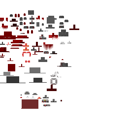
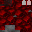
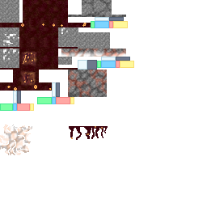
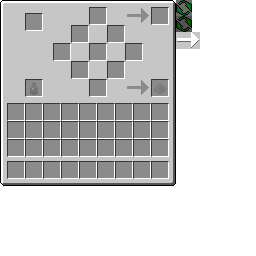
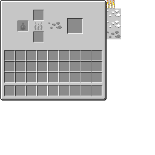
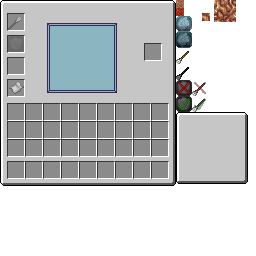
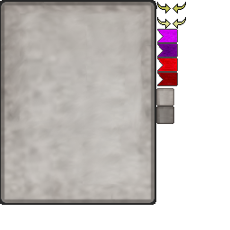
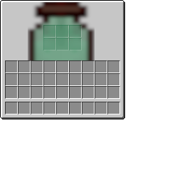
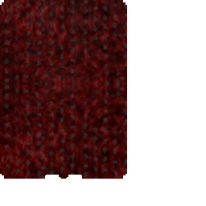
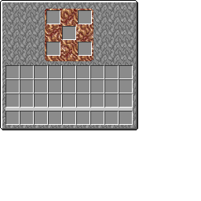

# Hemomancy — Complete Mod Reference

> **Minecraft Version:** 1.20.1 (Forge)
> **Last Updated:** 2026-04-08

<!-- Texture base paths (relative from project root) -->
<!-- Items:  src/main/resources/assets/hemomancy/textures/item/ -->
<!-- Blocks: src/main/resources/assets/hemomancy/textures/block/ -->
<!-- Entity: src/main/resources/assets/hemomancy/textures/entity/ -->
<!-- GUI:    src/main/resources/assets/hemomancy/textures/gui/ -->
<!-- Effects:src/main/resources/assets/hemomancy/textures/mob_effect/ -->
<!-- Armor:  src/main/resources/assets/hemomancy/textures/models/armor/ -->
<!-- MnA:    src/main/resources/assets/hemomancy/textures/mna/ -->

Hemomancy is a blood magic mod built around the *quality* of blood manipulation rather than just quantity. It covers topics of gore, magic, exaggerated biology, fungi, secret societies, and cosmic horror. The power to control blood is the result of a **special fungal infection** — a sentient extraterrestrial fungus that deliberately broke off from a larger hive-mind organism (itself the physical manifestation of an outer-god-type entity) and landed on the Minecraft world, slowly taking hold.

---

## Table of Contents

1. [Getting Started](#1-getting-started)
2. [Core Player Capabilities](#2-core-player-capabilities)
3. [The Harbinger Path (Hematic Order)](#3-the-harbinger-path-hematic-order)
4. [The Unstained Path (Anti-Hemomancy)](#4-the-unstained-path-anti-hemomancy)
5. [Mutual Exclusion of Paths](#5-mutual-exclusion-of-paths)
6. [Blood Manipulations](#6-blood-manipulations)
7. [Blood Tendency (Kinship) System](#7-blood-tendency-kinship-system)
8. [Vascular System](#8-vascular-system)
9. [Skill Tree](#9-skill-tree)
10. [Bloodlines](#10-bloodlines)
11. [Morphlings](#11-morphlings)
12. [Runes & Spores](#12-runes--spores)
13. [Items & Materials](#13-items--materials)
14. [Tools & Weapons](#14-tools--weapons)
15. [Armor Sets](#15-armor-sets)
16. [Functional Blocks & Tile Entities](#16-functional-blocks--tile-entities)
17. [Decorative & Building Blocks](#17-decorative--building-blocks)
18. [Recipe Systems](#18-recipe-systems)
19. [Mob Entities](#19-mob-entities)
20. [Projectile & Blood Construct Entities](#20-projectile--blood-construct-entities)
21. [Status Effects & Potions](#21-status-effects--potions)
22. [World Generation & Biomes](#22-world-generation--biomes)
23. [Structures](#23-structures)
24. [Villagers & Professions](#24-villagers--professions)
25. [Mod Compatibility (MnA / Curios / JEI)](#25-mod-compatibility)
26. [GUIs & Overlays](#26-guis--overlays)
27. [Advancements](#27-advancements)
28. [Keybindings](#28-keybindings)
29. [Commands](#29-commands)
30. [Known WIP / Incomplete Systems](#30-known-wip--incomplete-systems)

---

## 1. Getting Started

1. **Find Gourd Seeds**  — obtained from breaking grass (advancement: *Strange Seeds*).
2. **Discover a Blood Temple** — a naturally generating structure containing a **Mortal Display** pedestal.
3. **Activate the Blood Temple** — click the Mortal Display to awaken your blood, enabling the mod's features (advancement: *The First Awakening*). This activates your `IBloodVolume` capability (`active = true`).
4. **Obtain the Liber Sanguinum**  — the mod's guide book (entity model: ), crafted using a structure recipe (bookshelf + Sanguine Formation ). (advancement: *Sanctum Sanguinium*).
5. **Craft Befouling Ash**  — a key ingredient for blood structure recipes (advancement: *Ashen Beginnings*).

From here the player can pursue the **Harbinger Path** (blood magic) or eventually diverge to the **Unstained Path** (anti-blood purification).

---

## 2. Core Player Capabilities

All player-attached Forge capabilities, registered in `CapabilityInit`:

| Capability | Interface | Purpose |
|---|---|---|
| Blood Volume | `IBloodVolume` | Current/max blood, active state, bloodline link, trickle/auto-draw settings |
| Blood Tendency | `IBloodTendency` | 8-axis alignment scores (kinship with blood tendencies) |
| Vascular System | `IVascularSystem` | Health state of 7 vein sections |
| Known Manipulations | `IKnownManipulations` | Unlocked blood manipulations, selected manip, vein locations |
| Equipped Morphling | `IEquippedMorphling` | Currently equipped morphling for the Living Staff |
| Rune | `IRune` | Rune slot / rune binder state |
| Rune Item Handler | `IRunesItemHandler` | Inventory for rune binder contents |
| Initiatory Degree | `IInitiatoryDegree` | Harbinger rank (0–7) |
| Unstained Progress | `IUnstainedProgress` | Purification path state (purity, clarity, flags) |
| Earthen Vein Location | `IEarthenVeinLoc` | Block capability for earthen vein blocks |
| Visceral Organs | `IVisceralOrgans` | Tracks extracted/modified organs (Spleen, Liver, Lungs, Kidneys, Heart) for the Visceral Mirror ritual system |

---

## 3. The Harbinger Path (Hematic Order)

The default/primary progression. The player embraces hemomancy and rises through the ranks of a secret society called **The Hematic Order** (a.k.a. "The Harbingers").

### 3.1 Blood Volume

- **Interface:** `IBloodVolume`
- **Default:** 0 current / 5,000 max, `active = false`
- Activated by clicking a Blood Temple's Mortal Display
- Blood is spent to cast manipulations and power rituals
- Can be expanded via the Capacity skill (+500 per level)
- Stored in Blood Gourds for portable use
- Has **trickle donation** and **auto-draw** settings for Bloodline pool interaction

### 3.2 Initiatory Degrees

Progression through **Cardinal Rites** — multiblock blood rituals. Each rite advances the player to the next degree:

| Degree | Title | Cardinal Rite |
|--------|-------|---------------|
| 0 | Uninitiated | *(starting state)* |
| 1 | Neophyte of the Crimson Veil | `sanguine_initiation` |
| 2 | Votary of the Hematic Covenant | `votary_rite` |
| 3 | Initiate of the Scarlet Sanctum | `initiate_rite` |
| 4 | Adept of the Sanguine Brotherhood | `adept_rite` |
| 5 | Illuminatus of the Crimson Lodge | `illuminatus_rite` |
| 6 | Sanctified of the Bloodline Covenant | `sanctified_rite` |
| 7 | Archon of the Hematic Order | `archon_rite` |

Cardinal Rites have:
- A blood cost
- A rite type (`CardinalRiteType`)
- A multiblock pattern
- An item result
- A casting duration (tick-based, tracked via `ActiveCardinalRite`)
- Boundary enforcement (player must stay in range)
- Unwilling sacrifice processing

### 3.3 Cardinal Rite Casting Flow

Managed by `CardinalRiteEvents`:
1. Player initiates the rite at the correct multiblock
2. An `ActiveCardinalRite` is created, tracking the caster UUID, center position, recipe, duration, and rite size
3. Each tick: particles spawn, boundary checked, sacrifices processed
4. On completion: degree awarded, Unstained progress reset (if any), chat message sent

---

## 4. The Unstained Path (Anti-Hemomancy)

The divergent/opposing path. The player abandons blood magic in pursuit of purification and enlightenment, guided by **Unstained Zealot** NPCs.

### 4.1 Entry Requirements

- Player must have reached at least **Degree 2 (Votary)** before an Unstained Zealot will offer the choice
- The Zealot directs the player to bring **Hemolytic Solution**  to an **Unstained Podium** block

### 4.2 Phase 1: Purity (0–100)

Initiated by using Hemolytic Solution at the Unstained Podium:
- Sets `begunPurification = true`, grants 5.0 starting purity
- **Resets Harbinger degree to 0**

As purity rises, blood magic becomes increasingly penalized:

| Stage | Purity ≥ | Blood Magic Penalty |
|-------|----------|---------------------|
| Corrupted | 0 | None (1.0× cost) |
| Tainted | 25 | +10% cost (1.10×) |
| Cleansing | 50 | +25% cost (1.25×) |
| Absolved | 75 | +50% cost (1.50×) |
| Purified | 100 | **Completely blocked** |

- **Silver Ward** resistance scales linearly: `purity / 100`

#### Purity Sources

**Combat:**

| Source | Purity Gained | Condition |
|--------|---------------|-----------|
| **Killing a Hemomancy mob** | +2.0 | Any entity tagged `hemomancy_mob` |
| **Killing an Undead mob** | +0.5 | Any MobType.UNDEAD (zombies, skeletons, phantoms, etc.) |
| **Killing a Hostile mob** | +0.25 | Any other MobCategory.MONSTER |
| **Flawless kill bonus** | +0.5 extra | Added to any kill reward if player hasn't taken damage in last 5 seconds |

**Survival & Exploration:**

| Source | Purity Gained | Condition |
|--------|---------------|-----------|
| **Hemolytic Solution on Podium** | +10.0 | Each use (first use grants +5.0 and begins path) |
| **Completing an Advancement** | +1.5 | Any advancement (boss kills, exploration, progression) |
| **Picking up XP orbs** | +0.1 | Requires active **Hemolysis** effect |
| **Sleeping through the night** | +3.0 | Requires active **Hemolysis** effect; natural wake only |
| **Hemolysis effect tick** | +0.01/tick | Passive gain while Hemolysis is active (very slow) |

**Farming & Mercy:**

| Source | Purity Gained | Condition |
|--------|---------------|-----------|
| **Breeding animals** | +0.3 | Creating life — any successful breeding |
| **Planting crops/saplings/flowers** | +0.05 | Placing a block tagged as crop, sapling, or flower |
| **Healing a tamed animal** | +0.2 | When a tamed pet heals (feeding a wolf, etc.) |
| **Natural self-healing (no blood)** | +0.1 | Healing 2+ hearts with blood volume empty or inactive |

**Restraint & Discipline:**

| Source | Purity Gained | Condition |
|--------|---------------|-----------|
| **Blood magic abstinence** | +0.5 | Every 5 minutes without using any blood manipulation |
| **Empty blood renunciation** | +0.15/min | Blood volume is zero or inactive (abandoned hemomancy) |

*Kill rewards are not gated by Hemolysis — any player on the Unstained path earns purity from kills. XP and sleep rewards require the Hemolysis effect. Abstinence timer resets whenever a blood manipulation is used.*

### 4.3 Phase 2: Clarity (0–100)

Unlocked after reaching Purified (purity = 100) and using **Consecrated Copper** at the Unstained Podium:
- Sets `clarityUnlocked = true`
- **Permanently disables blood magic** (`BloodVolume.active = false`)

| Stage | Clarity ≥ |
|-------|-----------|
| Awakened | 0 |
| Discerning | 25 |
| Vigilant | 50 |
| Resolute | 75 |
| Enlightened | 100 |

- **Verdigris Aura** (anti-blood field) scales linearly: `clarity / 100`
- Reaching 100 clarity = **Enlightenment**, the final state

### 4.4 HUD

Unstained players see a dedicated gauge overlay (top-right corner) with:
- Silver **Purity** bar
- Teal **Clarity** bar (only after clarity unlocked)
- Stage labels for each

---

## 5. Mutual Exclusion of Paths

The two paths are **mutually exclusive**:
- **Starting Unstained** → resets Harbinger degree to 0
- **Completing a Harbinger degree rite** → resets all Unstained progress (purity → 0, clarity → 0, clarityUnlocked → false, begunPurification → false)
- Message: *"Your purification has been undone by the blood rite."*

---

## 6. Blood Manipulations

Blood manipulations are abilities fueled by blood. Lore-wise, they are dormant memories everyone has access to — unlocked via **Hematic Memory** items.

### 6.1 Manipulation Properties

Each manipulation has:
- **Name** — registry ID
- **Blood cost** — drained from the player's blood volume (modified by Efficiency skill and purity penalty)
- **XP cost** — additional experience cost
- **Alignment level** — required tendency alignment
- **Type** — `QUICK`, `CHARGED`, `PASSIVE`, or `CONTINUOUS`
- **Rank** — `HUMILIS`, `MEDIOCRITAS`, `SUMMA`, `MAGISTER`, `PERFECTUS`
- **Tendency** — which of the 8 blood tendencies it belongs to
- **Vein Section** — which vein section takes strain when cast
- **Cooldown** — tick-based cooldown between uses
- **ManipLevel** — manipulations level up with use

### 6.2 Registered Manipulations

| Name | Cost | Type | Rank | Tendency | Vein Section | Cooldown |
|------|------|------|------|----------|-------------|----------|
| `venous_travel` | 1000 | Continuous | Mediocritas | Ferric | Right Arm | 20t |
| `blood_shot` | 100 | Quick | Humilis | Animus | Head | 10t |
| `deadly_gaze` | 100 | Quick | Humilis | Animus | Head | 20t |
| `blood_needle` | 100 | Quick | Humilis | Animus | Head | 10t |
| `blood_rush` | 100 | Passive | Humilis | Animus | Body | 60t |
| `blood_cloud` | 300 | Quick | Summa | Animus | Head | 40t |
| `blood_aneurysm` | 400 | Quick | Summa | Animus | Body | 40t |
| `activation_potential` | 200 | Quick | Mediocritas | Ductilis | Body | 30t |
| `sanguine_ward` | 10 | Continuous | Mediocritas | Ductilis | Body | 20t |
| `ferric_transmutation` | 1000 | Quick | Summa | Ferric | Body | 20t |
| `conjure_blade` | 1000 | Quick (Conjuration) | Mediocritas | Ferric | Right Arm | 40t |
| `blood_absorption` | 1000 | Quick (Conjuration) | Mediocritas | Ferric | Right Arm | 40t |
| `blood_projection` | 1000 | Quick (Conjuration) | Mediocritas | Ferric | Right Arm | 40t |
| `summon_avatar` | 500 | Quick | Summa | Animus | Body | 100t |
| `summon_thrall` | 500 | Quick | Mediocritas | Animus | Body | 60t |
| `crimson_flame_conjuration` | 150 | Quick | Humilis | Animus | Right Arm | 15t |
| `blood_lamp` | 75 | Quick | Humilis | Lux | Head | 10t |
| `crimson_sight` | 200 | Quick | Mediocritas | Lux | Head | 40t |
| `crimson_harvest` | 100 | Quick | Humilis | Animus | Body | 20t |
| `hemosynthesis` | 150 | Quick | Humilis | Animus | Body | 30t |
| `pyretic_forge` | 300 | Quick | Mediocritas | Flammeus | Right Arm | 20t |
| `glacial_grasp` | 100 | Quick | Humilis | Congeatio | Body | 15t |
| `sanguine_mending` | 200 | Quick | Humilis | Ferric | Right Arm | 20t |
| `vital_reservoir` | 500 | Quick | Mediocritas | Animus | Heart | 60t |
| `sanguine_excavation` | 400 | Quick | Mediocritas | Ferric | Right Arm | 30t |
| `umbral_step` | 300 | Quick | Mediocritas | Tenebris | Body | 40t |

### 6.3 Manipulation Tree

Manipulations are organized in a visual **Manipulation Tree** (displayed on the Skill Tree screen alongside the skill tree). Entries are defined in `ManipulationTreeInit` with parent-child relationships. Each node shows whether the player has learned it.

---

## 7. Blood Tendency (Kinship) System

The player has alignment scores across **8 blood tendencies**. These represent the player's affinity with different aspects of blood magic and determine which manipulations they can effectively use.

| Tendency | Concepts | Particle Color | Enzyme Item |
|----------|----------|---------------|-------------|
| **Animus** | Life, Regen, Living tools | Red (255,0,0) |  Vivacious Enzyme |
| **Flammeus** | Fire, Heat, The Nether | Orange (255,100,0) |  Fervent Enzyme |
| **Ductilis** | Lightning, Speed, Nervous Energy | Yellow (255,255,0) |  Neurotic Enzyme |
| **Lux** | Light, Flight, AOEs, Flashiness | White (255,255,255) |  Incandescent Enzyme |
| **Mortem** | Death, Decay, Withering | Dark Green (0,58,0) |  Ruinous Enzyme |
| **Congeatio** | Cold, Ice, Water | Blue (0,100,255) |  Frigid Enzyme |
| **Ferric** | Iron, Barbs, Solidity, Unchanging | Gray (53,53,53) |  Ferric Enzyme |
| **Tenebris** | Darkness, Stealth, The End | Purple (70,0,110) |  Umbral Enzyme |

Enzymes are obtained using a **Living Syringe** on mobs (primed with blood vials), then processed in a **Vial Centrifuge** to extract enzymes and Hematic Iron Powder.

---

## 8. Vascular System

The player's vascular system has **7 sections** that take strain from manipulation use and damage:

| Section | Enum Value |
|---------|-----------|
| Head | `HEAD` |
| Left Arm | `LEFTARM` |
| Heart | `HEART` |
| Body | `BODY` |
| Right Arm | `RIGHTARM` |
| Left Leg | `LEFTLEG` |
| Right Leg | `RIGHTLEG` |

- Sections degrade through health states when strained (healthy → stressed → clotted → dead)
- Degraded sections apply debuffs
- Sections heal passively when the player is well-fed
- The **Vascular Status Gauge** item and **VascularViewScreen** let the player inspect their vein health

---

## 9. Skill Tree

Opened from the **Dendritic Distributor** block. Has two tabs: **Skills** and **Manipulations**.

Skills cost **skill points** (earned from using manipulations) and many require a **minimum initiatory degree**:

| Skill | ID | Max Lvl | SP Cost | Req. Degree | Effect | Parent |
|-------|----|---------|---------|-------------|--------|--------|
| Base | 0 | 1 | — | — | Root node, unlocked by default | — |
| Capacity | 1 | 5 | 1 | — | +500 max blood volume per level | Base |
| Efficiency | 2 | 5 | 1 | — | -8% manipulation cost per level (multiplicative, ~34% at max) | Base |
| Last Wind | 3 | 3 | 2 | 2 | +2 blood regen/tick when below 10% blood | Capacity |
| Dynamic Use | 4 | 3 | 2 | 2 | +10% manipulation power when tendency matches | Efficiency |
| Feeding Frenzy | 5 | 3 | 3 | 3 | +25% blood gained from kills | Last Wind |
| Hemostasis | 6 | 3 | — | — | -10% blood lost when taking damage per level | Efficiency |
| Sanguine Surge | 7 | 3 | — | — | +1 passive blood regen/tick per level | Hemostasis |
| Crimson Mastery | 8 | 3 | — | — | +15% manipulation damage/effectiveness per level | Sanguine Surge |
| Vital Link | 9 | 3 | 4 | 5 | +10% chance to heal on dealing manipulation damage | Feeding Frenzy |
| Iron Will | 10 | 3 | 3 | 3 | 10% damage reduction per level when blood < 15% | Last Wind |
| Blood Flow | 11 | 5 | 2 | 3 | -5% manipulation cooldowns per level | Hemostasis |
| Coagulation | 12 | 3 | 3 | 4 | +15% chance to block incoming bleed effects | Hemostasis |
| Sanguine Reach | 13 | 3 | 3 | 5 | +15% range for ranged blood manipulations | Crimson Mastery |

Skill bonuses are computed in `SkillPointHelper`.

---

## 10. Bloodlines

A multiplayer social system where players form blood-bound groups.

- **Creation:** Use an **Unsigned Ancestral Ledger** — first use signs and creates a bloodline named after the leader
- **Joining:** Another player uses the same signed ledger to join
- **Shared Pool:** Each member contributes 5,000 blood to a communal pool
- **Trickle Donation:** Optionally auto-donate blood to the shared pool at a configurable rate
- **Auto-Draw:** Optionally auto-draw from the shared pool when personal blood falls below a threshold
- **Persistence:** Bloodline data is stored in world-level `BloodlineSavedData`
- **Monitoring:** The **Bloodline Pool Monitor** item shows pool status; the **BloodlinePoolScreen** provides a GUI

---

## 11. Morphlings

Symbiotic parasites derived from the fungal infection. They provide the Living Staff with different attack/ability modes.

### 11.1 Types

| Morphling | Item Class | Preferred Tendency | Effect / Notes |
|-----------|-----------|-------------------|----------------|
|  Fungal | `FungalMorphlingItem` | Animus | Base fungal morphling |
|  Leeches | `LeechesMorphlingItem` | Animus | Summons leeches to fight and drain blood |
|  Chitinite | `ChitiniteMorphlingItem` | Ferric | Chitin shield / defense |
|  Serpent | `SerpentMorphlingItem` | Mortem | Paralyzing serpent projectile |
|  Pests | `PestsMorphlingItem` | Mortem | Swarm of pest projectiles |
|  Spider | `SpiderMorphlingItem` | Tenebris | Arachnid-themed attacks |
|  Bat | `BatMorphlingItem` | Tenebris | Echoic Perception (nearby entities glow). Maturity: Sonar Shriek → Membrane Glide → Nightwing Frenzy |
|  Moth | `MothMorphlingItem` | Lux | Luminous Dissipation (knockback resistance). Maturity: Dustwing Trail → Phototaxis Pulse → Cocoon Rebirth |
|  Tick | `TickMorphlingItem` | Mortem | Hemorrhagic Venom (AoE damage aura). Maturity: Engorge → Blood Fever → Pandemic Burst |
|  Urchin | `UrchinMorphlingItem` | Ferric | Spined Barricade (thorns + armor). Maturity: Spine Lash → Tidal Anchor → Calcareous Shell |
|  Centipede | `CentipedeMorphlingItem` | Congeatio | Venomous Resilience (poison immunity + speed). Maturity: Burrowing Strike → Segmented Defense → Myriapod Swarm |
| Mole | `MoleMorphlingItem` | Ferric | Burrower's Instinct (mining speed + underground regen). Maturity: Burrow Sense → Earthen Bulwark → Seismic Slam |

### 11.2 Cultivation

- Start with a **Morphling Polyp**  (base form)
- Incubate in a **Morphling Incubator** block with enzymes to grow into specific morphling types
- Store morphlings in a **Morphling Jar**  (6 slots, Uncommon rarity) — they bounce around inside
- The **Living Staff** cycles through equipped morphlings and changes its topper model accordingly

### 11.3 Maturity System

Each morphling has a **maturity level** (1–4) that determines its power and which reactive abilities it has:

| Maturity | Name | Description |
|----------|------|-------------|
| 1 | Nascent | Base form — passive effect only (the morphling's signature status effect) |
| 2 | Developing | First reactive ability unlocked (typically a triggered defensive response) |
| 3 | Mature | Second reactive ability unlocked (more powerful utility/combat mechanic) |
| 4 | Apex | Third reactive ability unlocked (powerful signature ability with longer cooldown) |

Each morphling type has a **preferred tendency** and **secondary tendency** — feeding the corresponding enzymes during incubation accelerates maturity. The passive effect's amplifier scales with maturity level.

---

## 12. Runes & Spores

### 12.1 Runes

Runes are equippable items stored in a **Rune Binder**  (18 slots) or **Upgraded Rune Binder**  (27 slots). They are crafted at the **Runic Chisel Station**.

| Rune | Tendency |
|------|----------|
|  Rune Transcendence | Lux |
|  Rune Sol | Flammeus |
|  Rune Heart | Animus |
|  Rune Descendence | Mortem |
|  Rune Moon | Congeatio |
|  Rune Eye | Ductilis |
|  Rune Feral | Ductilis |
|  Mind Spike | Ductilis |

Each rune has a corresponding **Rune Pattern** item used in crafting.

### 12.2 Functional Spores (Rune-type items)

Special fungal rune items with active effects:

| Item | Tendency | Effect |
|------|----------|--------|
|  Respergillus | Animus | Functional spore |
|  Talaromyces Minus | Ferric | Functional spore |
|  Lumina Devorans | Tenebris | Functional spore |
|  Noctifly Agaric | Animus | Grants the Noctifly Agaric (Elytra) effect |

### 12.3 Spores (Passive rune items)

One for each tendency:
 Vivacious,
 Ferric,
 Fervent,
 Incandescent,
 Neurotic,
 Ruinous,
 Umbral,
 Frigid.

---

## 13. Items & Materials

### 13.1 Key Materials

| Item | Purpose |
|------|---------|
|  Sanguine Formation | Catalyst for blood structure recipes |
|  Befouling Ash /  Smouldering Ash | Ash trails for rituals and recipes |
|  Active Befouling /  Active Smouldering Ash | Active versions of ash trails |
|  Hematic Iron Scrap | Blood-infused iron alloy ingredient |
|  Hematic Iron Powder | Extracted from blood via centrifuge |
|  Consecrated Copper Ingot | Anti-blood copper, used in Unstained path |
|  Hemolytic Solution | Anti-blood enzyme solution, starts the Unstained path |
|  Hemolytic Plating | Silver-based anti-blood plating |
|  Neutralizing Gasket | Anti-blood component |
|  Foul Paste | Crafting ingredient |
|  Blood Rock | Crafting ingredient |
|  Sanguine Conduit | Crafting ingredient |
|  Serpent Scale | Mob drop |
|  Swollen /  Dried Leech | Mob drops |
|  Chitinous Husk | Mob drop |
|  Puppeteering Thread | Mob drop |
|  Bleeding Bulb | Plant-based ingredient |
|  Dicentra Sap | Plant-based ingredient |
|  Spore Sac | Fungal ingredient |
|  Blood Crystal Shard /  Cleansed Blood Crystal Shard | Crystal materials |
|  Vivianite Cluster | Mineral material |
|  Gourd Seeds | Plantable, grows gourds |
|  Dried Gourd | Gourd processing product |

### 13.2 Blood Storage Items

| Item | Capacity |
|------|----------|
|  Bloody Flask | 250 |
|  Bloody Jug | 2,500 |
|  Stabilized Sanguine Formation | 5,000 |
|  Blood Gourd White | Simple tier |
|  Blood Gourd Red | Crimson tier |
|  Blood Gourd Black | Ashen tier |
|  Curved Horn | Horn tier |
|  Bloody Vial | Holds extracted blood for centrifuging |

> **Blood Gourd 3D models (open/closed):**
>
> | White | Red | Black | Curved Horn |
> |---|---|---|---|
> |   |   |   |   |

### 13.3 Memory Items

| Item | Purpose |
|------|---------|
|  Hematic Memory | Base blank memory item |
|  Lethian Dew | Memory processing ingredient |
|  Lethian Brew | Cursed clay jar from the River Lethe — enables forgetting memories |
|  Fervent Husk | Memory processing ingredient |
|  Blood Stained Stone | Memory-related item |
| Blood Memory (per manipulation) | One for each registered manipulation — using it teaches the player |

**Memory Textures Gallery:**

| | | | |
|---|---|---|---|
|  Blood Shot |  Deadly Gaze |  Blood Needle |  Blood Rush |
|  Blood Cloud |  Blood Aneurysm |  Activation Potential |  Sanguine Ward |
|  Venous Travel |  Ferric Transmutation |  Living Blade |  Blood Absorption |
|  Blood Projection |  Summon Avatar | Crimson Flame Conjuration | Blood Lamp |
| Crimson Sight | Crimson Harvest | Hemosynthesis | Pyretic Forge |
| Glacial Grasp | Sanguine Mending | Vital Reservoir | Sanguine Excavation |
| Umbral Step | Summon Thrall | | |

> **Memory Overlay System:** All memory items now use a layered model system — each memory has a unique overlay texture (`textures/item/memories/memory_*_overlay.png`) composited on top of the base Hematic Memory texture. This provides visual distinction for each manipulation's memory item without requiring fully separate textures.

### 13.4 Diagnostic Items

| Item | Purpose |
|------|---------|
|  Blood Tendency Gauge | Inspect current blood tendency alignment |
|  Vascular Status Gauge | Inspect vein section health |
|  Bloodline Pool Monitor | View bloodline shared pool status |
|  Self Reflection Mirror | Rune-related inspection |

### 13.5 Miscellaneous

| Item | Purpose |
|------|---------|
|  Charm of Vascularium | Enables blood manipulations; equippable accessory (Curios)  |
|  Liber Sanguinum | Guide book |
|  Unsigned Ancestral Ledger | Creates/joins bloodlines |
|  Engram Stamp | Engram-related tool |
|  Vivianite Scalpel | Vivianite-based tool |
|  Fungal Spine | Fungal tool item (unstackable, Uncommon) |
|  Sanguine Salve | Heals 25 blood on use |
|  Cleansing Hemolymph | Blue vial from Hemolymphopoda mobs |
|  Structure Spawner | Debug/creative item for spawning structures |
|  Recycled Enzyme | Generic enzyme fallback |

### 13.6 Food Items

| Item | Purpose |
|------|---------|
|  Gourd Slice | Edible gourd food item |
|  Gourd Stew | Stew crafted from gourd and other ingredients |
| Roasted Gourd Seeds | Smelted/smoked/campfire-cooked gourd seeds (3 cooking methods) |

### 13.7 Organ Echo Items

Produced by the **Visceral Mirror** ritual. Spectral imprints of the player's organs — bound to the player (dissolve if placed in non-player inventory), only one per organ type can exist at a time:

| Item | Organ | Notes |
|------|-------|-------|
| Echo of Spleen | `SPLEEN` (Tier 3) | Governs blood volume and filtration |
| Echo of Liver | `LIVER` (Tier 3) | Metabolizes toxins and purifies the blood |
| Echo of Lungs | `LUNGS` (Tier 3) | Oxygenates blood and sustains vital rhythm |
| Echo of Kidneys | `KIDNEYS` (Tier 3) | Filters impurities and maintains humoral balance |
| Echo of Heart | `HEART` (Tier 4) | The seat of circulation and will — highest risk |

### 13.8 Banner Patterns

-  **Heart Pattern** — Vascularium Crest
-  **Veins Pattern** — Vein Border

---

## 14. Tools & Weapons

### 14.1 Tool Tiers

| Tier | Enum |
|------|------|
| Hematic Iron | `HEMATIC_IRON` |
| Living | `LIVING` |

### 14.2 Living Tools (Blood-powered)

All are single-stack, use the `LIVING` tool tier:

| Weapon | Class | Notes |
|--------|-------|-------|
| Living Blade | `LivingBladeItem` | Blood-feeding sword (25 base dmg, +3 speed) |
| Living Axe | `LivingAxeItem` | Blood-feeding axe |
| Living Spear | `LivingSpearItem` | Blood-feeding polearm |
| Living Baghnakh | `LivingBaghnakhItem` | Blood-feeding claw weapon |
| Living Staff | `LivingStaffItem` | Channels morphlings and blood magic |
| Living Syringe | `LivingSyringeItem` | Extracts blood vials from mobs |
| Living Crossbow | `LivingCrossbowItem` | Fires Blood Bolts |
| Sanguis Lancea | `SanguisLanceaItem` | Throwable blood lance (25 base dmg) |
|  Blood Absorption | `BloodAbsorptionItem` | Conjured blood-absorbing tool |
|  Blood Projection | `BloodProjectionItem` | Conjured blood projectile launcher |

> *Note: Living tools (blade, axe, spear, staff, syringe, crossbow, lancea, baghnakh) use 3D entity models rather than flat item textures — see `src/main/resources/assets/hemomancy/textures/entity/` for their model textures:*
>
>   

### 14.3 Hematic Iron Weapons

| Weapon | Notes |
|--------|-------|
|  Hematic Iron Sword | Standard sword tier |
|  Hematic Iron Knapper | Specialized knapping tool (42 dmg) |

### 14.4 Other Weapons

| Weapon | Notes |
|--------|-------|
| Barbed Blade | Sword-class, Living tier, +3 speed, +25 dmg |
| Chitinite Mace | Sword-class, Living tier |
|  Blood Bolt | Ammo for Living Crossbow |
|  Blood Thrall Effigy | Summons a Blood Thrall creature (stackable to 16) |
|  Drudge Electrode | Tool item |

---

## 15. Armor Sets

### 15.1 Hematic Iron Armor

Standard blood-infused iron armor set (fire resistant):
-  Helm,  Chestplate,  Leggings,  Boots

> Armor model:  

### 15.2 Blood Lust Armor

Special armor with mask variants:
-  Helm (no mask),  Helm (Tengu mask),  Helm (Horned mask)
-  Chestplate,  Leggings,  Boots
- Mask items:  Tengu Mask,  Horned Mask (crafting ingredients)

> Armor model:  

### 15.3 Barbed Armor

Defensive barbed armor set:
-  Helm,  Chestplate,  Leggings,  Boots
- Barbed Shield 

> Armor model:  

### 15.4 Chitinite Armor

Insectoid/chitin-based armor:
-  Helm,  Chestplate,  Leggings,  Boots
- Chitinite Shield 
- Chitinite Arm Banner (dyeable, 16 colors)

> Armor model:  

### 15.5 Unstained Armor

Anti-blood zealot armor (for the Unstained path):
-  Helm,  Chestplate,  Leggings,  Boots

> Armor model:  

### 15.6 Crown of Sacred Marrow

Special artifact helmet (`MarrowCrownArmorItem`), uses `MARROW_CROWN` tier.

> Armor model: 

---

## 16. Functional Blocks & Tile Entities

| Block | Tile Entity | Purpose |
|-------|-------------|---------|
| **Mortal Display** | `MortalDisplayBlockEntity` | Activates blood magic when clicked in a Blood Temple  |
| **Scrying Podium** | `ScryingPodiumBlockEntity` | Opens the Charm/Gourd slot screen for equipping the Charm of Vascularium and Blood Gourds |
| **Visceral Artificial Recaller** | `VisceralRecallerBlockEntity` | Crafting station for creating Hematic Memories using enzymes, blank memories, and catalysts |
| **Vial Centrifuge** | `VialCentrifugeBlockEntity` | Spins down Bloody Vials into enzymes and Hematic Iron Powder  |
| **Juiceinator** | `JuicinatorBlockEntity` | Squeezes items to extract blood (requires fire below) |
| **Runic Chisel Station** | `ChiselStationBlockEntity` | Crafts runes from patterns and blanks |
| **Morphling Incubator** | `MorphlingIncubatorBlockEntity` | Grows Morphling Polyps into specific morphling types with enzymes |
| **Fungal Podium** | `FungalPodiumBlockEntity` | Fungal-related interaction station |
| **Fungal Implantation Pylon** | `FungalImplantationPylonBlockEntity` | Sporic implantation station  |
| **Dendritic Distributor** | `DendriticDistributorBlockEntity` | Opens the Skill Tree / Manipulation Tree screen |
| **Unstained Podium** | `UnstainedPodiumBlockEntity` | Where Hemolytic Solution / Consecrated Copper are used for the Unstained path |
| **Semi-Sentient Construct** | `SemiSentientConstructBlockEntity` | Blood construct-related block |
| **Earthen Vein** | `EarthenVeinBlockEntity` | Vein location marker for teleportation (Venous Travel)  |
| **Iron Brazier** | `IronBrazierBlockEntity` | Decorative/functional brazier |
| **Suspended Blood Crystal** | `SuspendedBloodCrystalBlockEntity` | Floating blood crystal display  |
| **Suspended Vivianite** | `SuspendedVivianiteBlockEntity` | Floating vivianite display  |
| **Humane Idol** | `HumaneIdolBlockEntity` | Idol block |
| **Serpentine Idol** | `SerpentineIdolBlockEntity` | Idol block |
| **Engram Block** | — | Translucent engram |
| **Filler Block** | `FillerBlockEntity` | Indestructible filler for multiblocks |
| **Bog Body** | — | Decorative translucent body block |
| **Visceral Mirror** | `VisceralMirrorBlockEntity` | Ritualistic mirror for organ extraction — gaze into your reflection to extract and modify organs (Spleen, Liver, Lungs, Kidneys, Heart). Requires degree 3+. Cycle organs (right-click) → confirm extraction (sneak right-click). Produces Organ Echo items. |

---

## 17. Decorative & Building Blocks

### 17.1 Venous Stone Family

A full block family with variants:

| | | |
|---|---|---|
|  Venous Stone |  Polished Venous Stone |  Polished Venous Stone Bricks |
|  Chiseled Polished |  Cracked Bricks |  Gilded Venous Stone |
|  Infested Venous Stone | | |

- Venous Stone, Slab, Stairs
- Polished Venous Stone, Slab, Stairs
- Polished Venous Stone Bricks, Slab, Stairs
- Chiseled Polished Venous Stone
- Cracked Polished Venous Stone Bricks
- Gilded Venous Stone
- Infested Venous Stone

### 17.2 Hematic Iron Family

| | | |
|---|---|---|
|  Hematic Iron Block |  Hematic Iron Pillar |  Chiseled Hematic Iron |

- Hematic Iron Block
- Hematic Iron Pillar (rotatable)
- Chiseled Hematic Iron Block

### 17.3 Anti-Blood

-  Hemolytic Plating Block

### 17.4 Glass & Panes

| | | | |
|---|---|---|---|
|  Sanguine Glass |  Sanguine Pane |  Vivianite Glass |  Vivianite Pane |

### 17.5 Wood & Organic

| | | |
|---|---|---|
|  Blood Wood Log |  Blood Wood Planks |  Conscious Mass |

- Blood Wood Log (rotatable pillar)
- Blood Wood Planks
- Conscious Mass (wart-block sound)

### 17.6 Fungal / Plant Blocks

| | | | |
|---|---|---|---|
|  Hyphae |  Hyphae Block |  Infected Stem |  Infected Cap |
|  Fruiting Infected Cap |  Erythrocytic Dirt |  Erythrocytic Mycelium |  Bleeding Heart |
|  Infected Fungus |  Stinkhorn Fungus |  Lethean Poppy | |

- Hyphae (cross-block, replaceable)
- Hyphae Block
- Infected Stem
- Infected Cap / Fruiting Infected Cap
- Erythrocytic Dirt
- Erythrocytic Mycelium (spreads, random ticks)
- Bleeding Heart (flower, Absorption effect)
- Infected Fungus (flower, Confusion effect)
- Stinkhorn Fungus (Confusion effect)
- Puffball Fungus (Saturation effect)
- Lethean Poppy (Regeneration effect, random ticks)

All applicable flowers have **potted** variants.

### 17.7 Gourd

| | |
|---|---|
|  Gourd |  Gourd Stem |

- Gourd (pumpkin-like, grows from stem)
- Gourd Stem / Attached Gourd Stem

### 17.8 Ash Trails

| | | | |
|---|---|---|---|
|  Smouldering Ash |  Active Smouldering |  Befouling Ash |  Active Befouling |

- Smouldering Ash Trail / Active Smouldering Ash Trail
- Befouling Ash Trail / Active Befouling Ash Trail

### 17.9 Misc

-  Crimson Flames (special fire block)
- Blood Crystal (modeled block)

---

## 18. Recipe Systems

| Recipe Type | Serializer | Station | Purpose |
|-------------|-----------|---------|---------|
| `chisel_recipe` | `ChiselRecipeSerializer` | Runic Chisel Station | Crafting runes |
| `juiceinator_recipe_type` | `JuiceinatorSerializer` | Juiceinator | Squeezing items for blood |
| `recaller_recipe_type` | `RecallerRecipeSerializer` | Visceral Recaller | Creating Hematic Memories |
| `blood_structure_recipe` | `BloodStructureRecipeSerializer` | In-world structure | Structure crafting (hit structure with catalyst + blood) |
| `cardinal_rite_recipe` | `CardinalRiteRecipeSerializer` | Multiblock | Cardinal Rites for degree advancement |
| Morphling Jar Upgrade | `CopyMorphlingJarRecipe.Serializer` | Crafting | Upgrading morphling jars |
| Blood Gourd Upgrade | `CopyBloodGourdRecipe.Serializer` | Crafting | Upgrading blood gourds |
| Blood Gourd Fill | `FillBloodGourdRecipe.Serializer` | Crafting | Filling gourds with blood |

### 18.1 Blood Structure Crafting

An in-world system: build a specific block structure, then hit a particular block with a catalyst item while spending blood. The structure transforms into the desired output.

### 18.2 Cardinal Rite Recipes

Specific cardinal rite recipes include degree advancement rites (section 3.2) plus utility rites:
- **Bloodline Founding** — ritual to create a new bloodline
- **Bloodline Recall** — ritual to recall/teleport bloodline members

### 18.3 Food Recipes

| Recipe | Type | Notes |
|--------|------|-------|
| Gourd Slice | Crafting | Sliced from gourd block |
| Gourd Stew | Crafting | Stew from gourd + ingredients |
| Roasted Gourd Seeds | Smelting | Gourd seeds in furnace |
| Roasted Gourd Seeds | Smoking | Gourd seeds in smoker |
| Roasted Gourd Seeds | Campfire Cooking | Gourd seeds on campfire |

---

## 19. Mob Entities

### 19.1 Hostile / Monster Mobs

| Entity | Texture | Category | Notes |
|--------|---------|----------|-------|
| **Fargone** |  | Monster | Standard blood monster |
| **Thirster** |  | Monster | Blood-thirsting mob |
| **Abhorent Thought** | | Monster | Large (1.5×3.25), eldritch thought entity |
| **Erythromycelium Eruptus** |  | Monster | Large fungal eruption mob (1.5×3.0) |
| **Blood Drunk Puppeteer** |  | Monster | Human-sized, controls dolls |
| **Enthralled Doll** |  | Monster | Small (0.5×0.5), controlled by puppeteer |
| **Chthonian** |  | Monster | Underground worm creature |
| **Chthonian Queen** |  | Monster | Boss variant of Chthonian |
| **Lump of Thought** |  | Monster | Sentient thought blob |
| **Morphling Polyp** (mob) |  | Monster | Wild morphling mob |

### 19.2 Creature / Ambient Mobs

| Entity | Texture | Category | Notes |
|--------|---------|----------|-------|
| **Leech** |  | Creature | Small (0.4×0.1) blood-sucking leech |
| **Fungling** |  | Creature | Friendly fungal creature |
| **Chitinite** |  | Creature | Iron-shelled insect (1.0×0.3) |
| **Fervent Chitinite** |  | Creature | Fire variant of Chitinite |
| **Hemolymphopoda** |  | Ambient | Small (0.9×0.3), drops Cleansing Hemolymph |
| **Barbed Urchin** |  | Water Ambient | Underwater iron-barbed urchin |

### 19.3 Summons / Player-controlled

| Entity | Texture | Category | Notes |
|--------|---------|----------|-------|
| **Blood Thrall** |  | Creature | Small (0.6×0.7), summoned blood transport creature |
| **Unstained Zealot** |  | Creature | NPC that guides Unstained path entry |

### 19.4 Entity Tags

Mobs are tagged by tendency: `FUNGAL_TAG`, `UMBRAL_TAG`, `INCANDESCENT_TAG`, `FERRIC_TAG`, `VIVACIOUS_TAG`, `RUINOUS_TAG`, `NEUROTIC_TAG`, `FERVENT_TAG`, `FRIGID_TAG`.

### 19.5 Spawn Placements

Registered in `EntityInit.commonSetup`:
- Barbed Urchin → `IN_WATER`
- Hemolymphopoda → `ON_GROUND`
- Fargone → `ON_GROUND` (monster rules)
- Abhorent Thought → `ON_GROUND` (monster rules)

---

## 20. Projectile & Blood Construct Entities

### 20.1 Blood Constructs

Extend `BloodConstructEntity` (a `PathfinderMob` implementing `IBloodConstruct`). They are summoned by the player and have a limited lifetime (`deathTicks`):

| Entity | Notes |
|--------|-------|
| Blood Cloud (`CloudEntityBlood`) | Area-of-effect blood cloud |
|  Iron Pillar (`EntityIronPillar`) | 0.75×2.8 iron construct |
|  Iron Wall (`EntityIronWall`) | 1.6×2.8 iron wall construct |
|  Iron Spike (`EntityIronSpike`) | 1.4×1.5 iron spike trap |
|  Wretched Will (`EntityWretchedWill`) | Will-based construct |

### 20.2 Projectiles

| Entity | Texture | Notes |
|--------|---------|-------|
| Directed Blood Orb | | High tracking range (150), main blood projectile |
| Tracking Blood Orb | | Homing blood orb |
| Blood Cloud Carrier | | Delivers blood clouds |
| Tracking Serpent |  | Homing snake projectile |
| Tracking Pests | | Homing pest swarm |
| Blood Bolt |  | Crossbow ammo entity |
| Blood Needle |  | Small fast projectile |
| Blood Bullet |  | Pistol-type projectile |
| Blood Shot |  | Shotgun-style spread |
| Sanguis Lancea |  | Thrown spear entity |
| Dark Arrow | | Dark-themed arrow |

### 20.3 Item Entities

| Entity | Notes |
|--------|-------|
| Flying Charm | The Charm of Vascularium flying to the player |
| Morphling Polyp Item | Dropped morphling polyp pickup |

---

## 21. Status Effects & Potions

Each effect has a corresponding potion, splash potion, lingering potion, and tipped arrow variant:

| Effect | Category | Color | Notable Mechanic |
|--------|----------|-------|-----------------|
|  **Blood Binding** | Harmful | Dark red | Immobilizes target |
|  **Blood Loss** | Harmful | Red | -15% movement speed |
|  **Blood Rush** | Beneficial | Red | +20% move speed, +10% attack speed |
|  **Hemolysis** | Neutral | Pink | Blood destruction effect |
|  **Noctifly Agaric** (Fungal Elytra) | Beneficial | — | Grants elytra flight  |
|  **Sanguine Fertility** | Beneficial | 0xCC3344 | Fertility/growth effect |
| **Arachnid Anastomosis** | Beneficial | 0x8B0000 | Spider-vein healing |
| **Mycorrhizal Mending** | Beneficial | 0x7B4F2A | Fungal regeneration |
| **Sanguine Siphon** | Beneficial | 0x8B0000 | Blood drain on hit |
| **Chitinous Bulwark** | Beneficial | 0x556B2F | +4 armor toughness |
| **Serpentine Guile** | Beneficial | 0x2E8B57 | +15% move speed, +10% attack speed |
| **Verminous Aura** | Beneficial | 0x4A3728 | Pest-based area effect |
| **Echoic Perception** | Beneficial | — | Bat morphling effect — nearby entities glow (radius scales with amplifier) |
| **Luminous Dissipation** | Beneficial | — | Moth morphling effect — knockback resistance |
| **Hemorrhagic Venom** | Beneficial | — | Tick morphling effect — AoE damage aura to nearby hostiles |
| **Spined Barricade** | Beneficial | — | Urchin morphling effect — passive thorns + armor bonus |
| **Venomous Resilience** | Beneficial | — | Centipede morphling effect — poison immunity + speed |
| **Burrower's Instinct** | Beneficial | — | Mole morphling effect — mining speed + underground regen/night vision |
| **Arcane Resonance** | Beneficial | 0x8800AA | MnA combo marker — next blood manipulation costs less blood (granted by blood-affinity MnA spells) |
| **Sanguine Clarity** | Beneficial | 0xAA0022 | MnA combo marker — next MnA spell costs less mana (granted by using blood manipulations) |

---

## 22. World Generation & Biomes

### 22.1 Custom Biomes (via TerraBlender)

| Biome | Key | Temperature | Precipitation | Notes |
|-------|-----|-------------|---------------|-------|
| **Fungal Gardens** | `fungal_gardens` | 2.0 | None (Nether) | Hyphae tendrils, huge fungi |
| **Fungal Isles** | `fungal_isles` | 2.0 | None (Nether) | Hyphae, huge fungi, small infected fungi |
| **Sporecrown Thicket** | `sporecrown_thicket` | 1.2 | None | Dense fungal overgrowth, hostile spawns (Eruptus, Chthonian, Fargone), crimson particles, dark red fog |

Registered via 3 TerraBlender regions (`TestRegion1/2/3`) with custom surface rules.

> **Custom environment textures:**
>
> | | | | |
> |---|---|---|---|
> |  Sun |  Moon |  Clouds |  Blood Moon Phases |

### 22.2 World Features

| Feature | Notes |
|---------|-------|
| Big Mushgloom | Large mushroom variant |
| Canopy Mushroom / Brown & Red Canopy | Tree-like mushroom features |
| Small Infected Mushroom | Small scattered fungi |
| Fungus Feature | Generic fungal feature |
| Hyphae Feature | Ground-level hyphae spread |
| Hyphae Tendril | Vertical tendril features |
| Bog Body Feature | Generates bog body blocks |

### 22.3 Configured/Placed Features

Managed via `ConfiguredFeatureInit` and `PlacedFeatureInit`:
- `HYPHAE_TENDRIL`, `HUGE_FUNGUS`, `SMALL_INFECTED_FUNGUS`
- `PLACED_INFESTED_VENOUS_STONE_BLOB`, `PLACED_MYCELIUM_BLOB`
- `PLACED_CANOPY_MUSHROOMS_DENSE`
- `PATCH_HYPHAE`, `BLEEDING_HEARTS`, `STINK_HORNS`

---

## 23. Structures

| Structure | Type | Notes |
|-----------|------|-------|
| **Blood Temple** | `BloodTempleStructure` | Contains the Mortal Display; gateway to hemomancy |
| **Unstained Church** | `UnstainedChurchStructure` | Contains the Unstained Podium; gateway to the Unstained path |

---

## 24. Villagers & Professions

| Profession | POI Block | Notes |
|-----------|-----------|-------|
|  **Hemopothecary** | Scrying Podium | Blood-themed villager trader |

- Custom `HemopothecaryProcessor` for village structure integration
- `VillageEvents` for handling village spawning

---

## 25. Mod Compatibility

### 25.1 Mana and Artifice (MnA)

Full integration as a faction + spell system:

**Faction: The Harbingers**
- `HarbingersFaction` — custom faction with blood-red manaweave (RGB 160,0,40) 
- Token item:  Mark of Blood
- Grimoire:  Tome of the Impending End
- Faction Horn:  Horn of the Impending End
- Custom mana resource (`HarbingersMana`) 

**Spell Components:**
-  `ComponentBloodBinding` — applies Blood Binding effect via spells
-  `ComponentManaToBlood` — converts MnA mana into Hemomancy blood volume (configurable magnitude, 50–200 mana per cast)
-  `ComponentSanguineFertility` — applies Sanguine Fertility via spells
- `ComponentBloodToMana` — "Sanguine Offering" — drains target's blood and converts to mana for caster (inverse of ManaToBlood). Magnitude 50–500, Blood affinity. Composable with any MnA shape.
-  `ComponentBloodLoss` — applies Blood Loss effect (movement speed debuff) via spells. Duration 60–300t, Magnitude 1–3, HARMFUL
-  `ComponentBloodRush` — applies Blood Rush effect (+move/attack speed) via spells. Duration 100–600t, Magnitude 1–3, FRIENDLY
-  `ComponentHemolysis` — applies Hemolysis effect (blood destruction DoT) via spells. Duration 40–200t, Magnitude 1–4, HARMFUL
-  `ComponentSummonSanguilith` — "Conjure Sanguilith" — summons a Sanguilith at target location. Duration 200–600t (summon lifetime), Magnitude scales damage. Requires Harbinger faction. HARMFUL

**Cross-System Mechanics (Implemented):**
- **Blood Tithe** (`BloodTitheHandler`): Harbinger faction members casting blood-affinity spells have a configurable percentage of mana cost converted to blood cost instead (default 25%). Blood drained at 5 blood per 1 mana replaced. Hooks into `CalculatingManaCostEvent`.
- **Spell → Manipulation Combos** (`ManipComboHelper` + `BloodTitheHandler`): Casting blood-affinity MnA spells grants **Arcane Resonance** (reduces next manipulation's blood cost). Using Hemomancy manipulations grants **Sanguine Clarity** (reduces next spell's mana cost). Creates an alternating gameplay loop between both mod systems.

**Cross-Mod Config** (`HemoMnAConfig`):
- Blood ↔ Mana conversion ratios
- Blood Tithe enable/disable, mana reduction %, blood-per-mana ratio
- Living Thread armor set bonus values
- Trapezohedron effect radius
- Spell ↔ Manipulation combo enable/disable, durations, reduction percentages
- Sanguilith summon health scaling and max summon count

**Manipulations:**
- `SanguineTransfusionManip` — MnA-specific manipulation

**Runic Anvil Integration:**
- Living Infused Thread + Mage Armor → Living Thread armor set (Hood, Robes, Leggings, Boots)
- (3) Set Bonus: +500 Max Mana, +50% Mana Regen

**Additional MnA Items:**

| | | | |
|---|---|---|---|
|  Foul Vinteum Ingot |  Befouled Vinteum Dust |  Mana Infused Memory Blank |  Living Infused Thread |
|  Living Thread Hood |  Living Thread Robes |  Living Thread Leggings |  Living Thread Boots |
|  Blood Shot Occulus |  Mote of Blood |  Mana Memory: Sanguine Transfusion | |

> Living Thread Armor model:  

**MnA Ritual:**
- Ritual of The Weeping Wound

**MnA Block/Tile/Entity:**
- Custom blocks, tiles, and entities in `compat/mna/block`, `compat/mna/tile`, `compat/mna/entity`

**Planned / Brainstormed Features** (see `MNA_COMPATIBILITY_BRAINSTORM.md` for full details — each feature includes an "MnA Justification" explaining why it specifically requires Mana and Artifice):
- New spell shapes: Sanguine Pulse (dual mana+blood cost AoE), Hemomantic Tether (channeled tether draining blood per tick)
- New MnA rituals: Sanguine Convergence (permanently links mana regen to blood volume), Arcane Crucible (transmutes MnA materials with blood sacrifice), Mana Wound (zone that adds Hemomancy effects to MnA spells)
- Tendency ↔ Affinity mapping: Hemomancy tendencies boost corresponding MnA spell affinities
- Harbinger faction: Occulus tasks, sanctum structure, manaweaving recipes, raid mobs — all use MnA faction infrastructure
- Blood Construct: MnA Construct variant fueled by blood instead of mana, built at MnA's workbench
- Blood-Infused Construct Capabilities: runeforged modules for MnA Constructs
- Hemomantic Wand Core, Arcane Living Staff, Mote of Mana — crafted via MnA systems (manaweaving, runeforging)
- Hemomantic enchantments via MnA runeforging
- Cross-mod advancements, JEI integration for MnA crafting recipes
- Harbinger Mana HUD texture fix (current TODO)

### 25.2 Curios

Curios integration for the Charm of Vascularium and other equippable items (handled in `compat/curios`).

### 25.3 JEI

JEI recipe category support for:
- Chisel Station recipes
- Visceral Recaller recipes
- Blood Structure Crafting recipes
- Morphling Incubator recipes

---

## 26. GUIs & Overlays

### 26.1 HUD Overlays

| Overlay | Location | Shows |
|---------|----------|-------|
| `BloodVolumeOverlay` | Left side | Current/max blood volume bar  |
| `UnstainedGaugeOverlay` | Top-right | Purity + Clarity bars  |
| `EquippedMorphlingOverlay` | — | Currently equipped morphling icon |
| `ManipCooldownOverlay` | — | Active manipulation cooldown timer |

> **Gauge fills:**  Blood fill &nbsp;  Purity fill &nbsp;  Clarity fill

### 26.2 Screens

**Key GUI Textures:**

| | | |
|---|---|---|
|  Centrifuge |  Juiceinator |  Recaller |
|  Chisel Station |  Rune Binder |  Morphling Jar |
|  Tendency View |  Vascular View |  Spore Implant |

| Screen | Opened From | Purpose |
|--------|------------|---------|
| `CharmGourdScreen` | Scrying Podium | Equip Charm of Vascularium + Blood Gourds |
| `SkillTreeScreen` | Dendritic Distributor | Skill tree + manipulation tree (pan/zoom, animated vein BG) |
| `TendencyViewScreen` | Blood Tendency Gauge | View blood tendency alignments |
| `VascularViewScreen` | Vascular Status Gauge | View vein section health |
| `VascularStatusScreen` | — | Detailed vascular status |
| `BloodlinePoolScreen` | Bloodline Pool Monitor | View/manage bloodline shared pool |
| `JuiceinatorScreen` | Juiceinator block | Juiceinator crafting GUI |
| `VialCentrifugeScreen` | Vial Centrifuge | Centrifuge crafting GUI |
| `MorphlingIncubatorScreen` | Morphling Incubator | Incubation crafting GUI |
| `SporeImplantScreen` | Fungal Implantation Pylon | Spore implantation GUI |
| `StructureSpawnerScreen` | Structure Spawner item | Debug structure spawning |
| Various radial menus | Living Staff / keybinds | Morphling/manipulation selection |
| Guide/Codex screens | Liber Sanguinum | In-game guidebook |

---

## 27. Advancements

| Advancement | Trigger |
|-------------|---------|
| **Strange Seeds** | Find Gourd Seeds from grass |
| **The First Awakening** | Activate a Blood Temple's Mortal Display |
| **Ashen Beginnings** | Craft Befouling Ash |
| **Sanctum Sanguinium** | Obtain the Liber Sanguinum |
| **Iron in the Blood** | Create first Hematic Iron Block via blood structure recipe |
| **Bottled Vitality** | Obtain a Blood Gourd |
| **An Extension of Oneself** | Craft a Living Staff |
| **Inherited Memory** | Obtain any Hematic Memory |
| **Scarlet Tradition** | Obtain the Charm of Vascularium |
| **Armed to the Veins** | Equip full Hematic Iron armor |
| **Cultivator** | Obtain a Morphling Jar |
| **The Blood Remembers** | Obtain a Living Blade |
| **Old Habits** | Obtain any enzyme |
| **Unstained** | Obtain Hemolytic Solution |
| **Bleeding a Stone** | Craft a Juiceinator |

---

## 28. Keybindings

All under the "Hemomancy" category:

| Key | Action |
|-----|--------|
| Use Manipulation | Cast the selected quick manipulation |
| Use Quick Manipulation | Alternative quick-cast |
| Use Continuous Manipulation | Toggle continuous manipulation |
| Cycle Known Manipulations | Cycle through unlocked manipulations |
| Activate Blood Construct | Activate blood construct ability |
| Blood Formation | Trigger blood formation |
| Blood Draw | Draw blood |
| Open Morphling Jar | Open jar viewer |
| Open Morphling Jar Viewer | Open detailed jar viewer |
| Toggle Gourd Open/Closed | Toggle blood gourd state |
| Toggle Rune Binder Pickup | Toggle rune pickup mode |

---

## 29. Commands

The `/hemomancy` command tree (via `HemoCommand`) provides:

**Blood Volume:**
- `get blood` — show current blood
- `set blood <amount>` — set blood volume
- `fill blood` — fill to max

**Initiatory Degree:**
- `get degree` — show current degree
- `set degree <number>` — set degree (0–7)

**Unstained Progress:**
- `get unstained` — full overview (purity, clarity, stages)
- `get purity` — show purity value + stage
- `set purity <value>` — set purity (0–100)
- `get clarity` — show clarity value + stage
- `set clarity <value>` — set clarity (0–100)
- `toggle clarity` — toggle clarity unlock
- `reset unstained` — reset all unstained progress to zero
- `max unstained` — max out all unstained progress

---

## 30. Known WIP / Incomplete Systems

- **Blood Fluid** (`FluidInit`) — Blood as a placeable fluid is entirely commented out / WIP
- **Progression Codex** (`HemoProgressionScreen`) — Book entry system exists but entries are commented out
- **Manipulation Rank Advancement** — Ritual-based forced rank upgrades described as WIP in lore
- **Unstained Zealot Capability Check** — Uses reflection to check for `UnstainedProgressProvider` (suggests it was added incrementally)
- **Some skill descriptions** exist in lang but the full implementation of effects like `skill_sanguine_surge`, `skill_crimson_mastery`, `skill_vital_link`, `skill_iron_will`, `skill_blood_flow` need verification for complete gameplay wiring
- **Loot Modifiers** (`AddItemModifier`) — framework exists, specific loot tables TBD
- **Visceral Organs System** — Core capability and Visceral Mirror block added; organ extraction ritual flow implemented. Organ modification tiers and gameplay effects for each organ still being fleshed out
- **Cardinal Rite Recipes** — Bloodline Founding and Bloodline Recall rite recipes added; additional rite recipes may follow
- **Vial Centrifuge Rework** — New 3D stand model (`CentrifugeStandModel`) and custom item renderer implemented; UI and menu updated
- **Memory Overlay Textures** — All manipulations now have overlay textures (`textures/item/memories/`) for the new memory item model system
- **MnA Compatibility Expansion** — Extensive brainstorming for new cross-mod features documented in `MNA_COMPATIBILITY_BRAINSTORM.md`. Recently implemented: 5 new spell components (Blood Loss, Blood Rush, Hemolysis, Summon Sanguilith, Blood-to-Mana), Blood Tithe handler, Spell ↔ Manipulation combo system, full cross-mod config. Still planned: spell shapes, rituals, faction enhancements, construct system, wand core, manaweaving recipes, runeforging enchantments.

---

*This document should be kept up to date as development continues. Each section maps directly to the codebase structure under `com.vincenthuto.hemomancy`.*
