# Hemomancy - Developer Reference

> **Last audited:** 2026-06-18
> **Mod ID / package:** `hemomancy` / `com.vincenthuto.hemomancy`
> **Target:** Minecraft `1.21.1`, NeoForge `21.1.219`, Java `21`
> **Version:** `6.0.1-neoforge.1.21.1.0`

This is the canonical developer reference for Hemomancy. Current code and data are authoritative when older prose, design notes, or screenshots disagree. Use [LORE_REFERENCE.md](LORE_REFERENCE.md) for tone, faction beliefs, cosmology, and character/narrative context.

Hemomancy is a NeoForge blood magic mod built around the *quality* of blood manipulation rather than just quantity. Its public fiction frames blood magic as a sacred inheritance of the Hematic Order, while the deeper biological truth is fungal blood-memory/infection tied to a slow cosmic reproductive cycle. Keep that moral grayness intact: Harbingers are taboo and dangerous but not simple villains, and the Unstained are not simple heroes.

**Status legend:** `Implemented` means present in the current NeoForge 1.21.1 runtime path. `Partial` means a playable or compiled spine exists with explicit remaining work. `Dormant` means source/design is preserved but excluded or unregistered. `Planned` means design/lore intent without active runtime behavior.

**Release readiness:** Public-alpha readiness, known limitations, and tester-path expectations are tracked in [PUBLIC_ALPHA_READINESS.md](PUBLIC_ALPHA_READINESS.md).

**Recently audited systems:** attachments/capabilities, registry-backed scars, Mason's Effigy/Anastomotic Brazier scar loadout rituals, dynamic Scar Pattern rendering, NeoForge payload networking, Blood Structure/Cardinal Rite degree gates, Chamber of Will Degree 6 refuge/dynamic sky themes, Qliphoth Communion and Apotheos gating, endgame Vesper/Mycophant boss entity wiring, direct blood routing, hematic memory tools, puppeteer summon trials, morphling mutation rendering/sync, Flexible Founding Fane heart/stake footprints, bloodwell/stake permissions and cleanup, boundary preview tooling, Mycelial Crucible/Lantern, Sporitic Thurible, White Humor Purification, Blood Moon sync, machine access gating, Field Notes/Liber discovery, Base Items material/drop documentation, Hematic Armature armor upgrades/JEI, Somatic Loom memory-weaving recipe/event rewrite, Harbinger armor models and item textures, Blood Lust mask/lineage variants, Silent Archon vestments, Annetta's Sanguis Lancea item renderer, alpha building/decorative blocks and recipes, Mnemonic Whispers/Screams brewing effects and mob-effect icons, Harbinger outpost NPC recruitment and item-inquiry dialogue rules, HutosLib effect renderer/tester/template tooling, Hemomancy tendril manipulation visuals, Qliphoth Seed 3D/drop renderer, Harbinger manipulation detail wrapping, MnA/Curios dormant compat, and focused test coverage.

<!-- Texture base paths from this docs/ file -->
<!-- Items:   ../src/main/resources/assets/hemomancy/textures/item/ -->
<!-- Blocks:  ../src/main/resources/assets/hemomancy/textures/block/ -->
<!-- Entity:  ../src/main/resources/assets/hemomancy/textures/entity/ -->
<!-- GUI:     ../src/main/resources/assets/hemomancy/textures/gui/ -->
<!-- Effects: ../src/main/resources/assets/hemomancy/textures/mob_effect/ -->
<!-- Armor:   ../src/main/resources/assets/hemomancy/textures/models/armor/ -->
<!-- MnA:     ../src/main/resources/assets/hemomancy/textures/mna/ -->


---

## Table of Contents

**Foundation**
1. [Getting Started](#1-getting-started)
2. [Core Architecture & Player Capabilities](#2-core-architecture--player-capabilities)
3. [Configuration](#3-configuration)
4. [Networking & Packets](#4-networking--packets)

**Paths & Progression**
5. [The Harbinger Path (Hematic Order)](#5-the-harbinger-path-hematic-order)
6. [The Unstained Path (Anti-Hemomancy)](#6-the-unstained-path-anti-hemomancy)
7. [Mutual Exclusion of Paths](#7-mutual-exclusion-of-paths)

**Hematic Body & Blood Systems**
8. [Blood Manipulations](#8-blood-manipulations)
9. [Blood Tendency (Kinship) System](#9-blood-tendency-kinship-system)
10. [Vascular System](#10-vascular-system)
11. [Skill Tree](#11-skill-tree)
12. [Bloodlines](#12-bloodlines)
13. [Scars & Spores](#13-scars--spores)
14. [Status Effects & Potions](#14-status-effects--potions)

**Unstained Systems**
15. [Unstained Systems](#15-unstained-systems)

**Companions, Summons & Automation**
16. [Morphlings](#16-morphlings)
17. [Puppeteering & Summons](#17-puppeteering--summons)
18. [Drudge System](#18-drudge-system)
19. [Direct Blood Routing & Servitors](#19-direct-blood-routing--servitors)

**Content Catalogs**
20. [Items & Materials](#20-items--materials)
21. [Tools & Weapons](#21-tools--weapons)
22. [Armor Sets](#22-armor-sets)
23. [Functional Blocks & Block Entities](#23-functional-blocks--block-entities)
24. [Decorative & Building Blocks](#24-decorative--building-blocks)
25. [Recipe Systems](#25-recipe-systems)
26. [Mob Entities](#26-mob-entities)
27. [Projectile & Blood Construct Entities](#27-projectile--blood-construct-entities)

**World, Client & Appendices**
28. [World Generation & Biomes](#28-world-generation--biomes)
29. [Structures](#29-structures)
30. [Villagers & Professions](#30-villagers--professions)
31. [GUIs & Overlays](#31-guis--overlays)
32. [Advancements](#32-advancements)
33. [Keybindings](#33-keybindings)
34. [Commands](#34-commands)
35. [Sound Events](#35-sound-events)
36. [Particle Types](#36-particle-types)
37. [Mod Compatibility](#37-mod-compatibility)
38. [Known WIP / Incomplete Systems](#38-known-wip--incomplete-systems)

---
## 1. Getting Started

1. **Find Gourd Seeds**  — obtained from breaking grass (advancement: *Strange Seeds*).
2. **Discover a Blood Temple** — a naturally generating structure containing a **Mortal Display** pedestal.
3. **Activate the Blood Temple** — click the Mortal Display to awaken your blood, enabling the mod's features (advancement: *The First Awakening*). This activates your `IBloodVolume` capability (`active = true`).
4. **Obtain the Liber Sanguinum**  — the mod's guide book (entity model: ), crafted using a structure recipe (bookshelf + Sanguine Formation ). (advancement: *Liber Sanguinum*).
5. **Craft Befouling Ash**  — a key ingredient for blood structure recipes (advancement: *Ashen Beginnings*).

From here the player can pursue the **Harbinger Path** (blood magic) or eventually diverge to the **Unstained Path** (anti-blood purification).

After reaching Degree 1, the Harbinger Vicar introduces a main Neophyte assignment plus a side route. The Main D1 assignment, **First Bloodcraft**, teaches Blood Crafting fundamentals: Blood Absorption fills the player's vessel, while Blood Projection spends that stored blood into blood-structure recipes. The D1 main ledger tracks three prerequisites: fill the vessel to 5000 ml (`vessel_filled`), project a **Liber Sanguinum** (`fane_sanguinium`), and project a **Hematic Iron Block** (`iron_in_the_blood`). Once all three are complete, the Degree-1 Vicar offers a one-time hand-in that grants exactly **4 Hematic Iron Scraps**, **8 Befouling Ash Trails**, and **2 Sanguine Formations**. The handler re-checks all prerequisites when the option is selected, so forged or repeated dialogue events grant nothing; a successful hand-in is recorded by the hidden `hemomancy:hemomancy/first_bloodcraft_reward_claimed` advancement.

Blood Projection can also condense Sanguine Formation directly: hold projection on a solid block to invest blood until one `sanguine_formation` pops from the targeted face. Generic solid blocks require 150 blood and have a 25% collapse chance, reduced by the D1 `skill_sanguine_crystallization` skill by 5% per level. Blocks tagged `hemomancy:sanguine_formation_projectors`, including the venous stone family and placed Blood Stained Stone, require 100 blood, feed twice as fast, and never collapse. Existing Blood Projection endpoints, blood-structure recipes, loom/effigy charging, and blood reservoirs take priority before this fallback condensation.

The D1 side assignment, **The Hermit Road**, tells the player to seek abandoned hermitage remnants and blood-stained stones in a similar state to their own first invitation. Natural Hermitage Remnants now generate as sparse surface rubble with venous stone, blackstone bricks, crimson flame accents, a placed Blood Stained Stone, and the `hermitage_remnant/first_invitation_stone` blood echo. Reading that echo grants the hidden `hermit_road_first_remnant` milestone; the player's first report to a Vicar grants a **Harbinger Assignment Ledger** plus `hermit_road_ledger_granted`. After the ledger is granted, the Vicar acknowledges subsequent remnant reports as evidence to keep recording rather than granting another ledger. The ledger is a separate guidebook-rendered item, not the dormant Field Notes item, and opens its own assignment/progress GUI. Top-level ledger assignment cards can be clicked to collapse into title/progress rows with the assigning NPC's portrait for faster scanning, and the header includes Collapse All / Expand All controls for the full journal.

At Degree 2, the Harbinger Alchemist introduces one main Votary assignment, two optional side assignments, and the background **Living Bestiary** catalogue. The Main D2 assignment, **The First Separation**, focuses on the Vial Centrifuge loop: obtain a Vial Centrifuge, carry a sampled Blood Vial, successfully start a valid centrifuge separation (`first_separation_started`), and recover any enzyme. Recovering any enzyme after the valid start grants the visible return-ready `first_separation_complete` prompt so the player knows to go back to the Alchemist for the assignment reward. This teaches blood sampling and separation without requiring full enzyme completion.

Completing the First Separation return grants a one-time sampling kit: a **Living Syringe** and a **Vial Rack** initialized with eight empty Blood Vials. The reward is claim-recorded, so repeated Alchemist dialogue cannot duplicate it.

The D2 side assignment **The Red Taxonomy** is a field-assay assignment for cataloguing hemomantic fungal and near-fungal flora. Bringing distinct samples such as Infected Fungus, Stinkhorn Fungus, Sarcodes, Bleeding Heart, Rafflesia, Devil's Tooth, or Puffball Fungus to the Alchemist grants hidden specimen records; four distinct records complete `red_taxonomy_complete`. Each sample has a unique diagnostic response, while reward handling is intentionally placeholder-only until final assignment rewards are designed.

The **Living Bestiary** is the creature-facing companion to Red Taxonomy rather than a replacement for it. Capturing Hemomancy ecology mobs in a **Specimen Jar** and bringing the filled jar to the Alchemist at Degree 2+ exposes two choices: record the specimen and keep the jar intact, or surrender the specimen for study. Bestiary progress persists on the player through `SpecimenBestiaryProgress` and currently records distinct ecology specimen ids plus any wild Morphling Polyp layer families discovered in captured polyps. Degree 2+ Harbingers can review the catalogue from the bottom-right Bestiary tab in the Harbinger Progress screen. Non-polyp surrendered ecology specimens grant an `enzyme_primer`; surrendered wild polyps are converted into matching wild-bound morphlings when the player chooses one of the polyp's stored layer families.

The second D2 side assignment, **The Eightfold Centrifuge**, proves mastery of the Living Syringe, blood sampling, and Vial Centrifuge loop. Once the player is an active Degree 2+ Harbinger, carrying any enzyme records that enzyme permanently without consuming it. Recording `vivacious_enzyme`, `fervent_enzyme`, `neurotic_enzyme`, `incandescent_enzyme`, `ruinous_enzyme`, `frigid_enzyme`, `ferric_enzyme`, and `umbral_enzyme` grants the hidden `enzyme_mastery_complete` milestone. The Harbinger Assignment Ledger displays Red Taxonomy progress as `x/4` and Eightfold Centrifuge progress as `x/8`.

At Degree 3, the Alchemist points the player to the Harbinger Mnemonist for **The Woven Vessel**. This assignment introduces deliberate blank-memory preparation without requiring prior optional D2 field assignments: a blank `hematic_memory` is crafted from a piece of yourself (`sanguine_formation`), a piece of history (`blood_stained_stone`), and a piece of living nervous tissue (`neurotic_enzyme`). Bringing the blank memory to the Mnemonist with a book, an ink sac, and three paper lets the Mnemonist index the vessel, grants hidden `mnemonist_woven_vessel_complete`, and currently rewards a Blood Shot Loom starter kit (`bleeding_bulb` plus `vivacious_enzyme`). Completing any Somatic Loom memory weave afterward grants hidden `mnemonist_first_weave_complete`. The Harbinger Assignment Ledger displays this D3 assignment as three steps: hold a blank Hematic Memory, have the Mnemonist index it, then complete the first deliberate Loom weave.

Puppeteering is foreshadowed before this point through Blood Drunk Puppeteers, Enthralled Dolls, and Puppeteering Thread, but practical summon binding now begins at Degree 3 after the Mnemonist has introduced deliberate memory preparation. This places puppeteering as the first field art where a shaped memory is given an external body rather than as a Degree 2 alchemical side system.

At Degree 4, the Vicar introduces **Masons Respite** and gives the player a `masons_respite_map` pointing toward the remote Cicatrix Hermitage. The **Cicatrix Anchorite**, commonly called the **Vein-Mason**, is not part of normal Harbinger outposts; they are an ascetic teacher for sympathetic scarring. The Harbinger Assignment Ledger displays this D4 assignment as four visible parts: find the Vein-Mason and receive a dynamic Scar Pattern stack tagged with the first tier-1 template for the player's strongest tendency, carve and burn the first Scar item, prepare a Mason's Effigy loadout pattern, then burn that prepared pattern in the Anastomotic Brazier to change the active scar loadout. Returning to the Anchorite after the fourth part grants a continuation kit: a second dynamic Scar Pattern stack keyed to the player's second-strongest tendency, one blank scar, its catalyst, and four Runic Motif Paper.

The Hematic Artificer / Redwright now owns a living-equipment assignment spine that records rites rather than fetch tasks. The Main D2 Artificer assignment, **The Worn Vow**, asks the player to place a Hematic Armature, complete the first iron-to-Hematic-Iron armor upgrade, then return to the Artificer wearing a full Hematic Iron set for the Worn Vow Fitting. The Main D3 Artificer assignment, **The Three Answers**, asks the player to upgrade one Hematic Iron piece into Barbed, Chitinite, or Prismatic armor, then complete and wear one matching fork set for that branch's fitting; mixed fork families do not satisfy the fitting claim. The Main D5 Artificer assignment, **Crimson Vestment**, records the Vicar's Consecration Kit being applied to the Armature, the first Blood Lust upgrade, and a full worn Blood Lust set for the Crimson Vestment Fitting. The Main D7 Artificer assignment, **Weight of the Frame**, records the Monolithic Cornerstone, one valid Archon-grade Armature upgrade such as Silent Archon or final lineage armor, and a full matching D7 set for the Monolithic Frame Fitting. The Side Artificer assignment, **The Assumed Limb**, records the first completed Living Weapon Graft rite and lets the player claim the Assumed Limb Fitting only after all seven base `conjure_*` living weapon forms are known.

The visible return-ready advancement prompts now sit beside the hidden ledger milestones for NPC-handled Harbinger assignments: `first_separation_complete` for the Alchemist, `mnemonist_woven_vessel_finished` for the Mnemonist, `vein_mason_continuation_ready` for the Vein-Mason, Artificer lesson prompts for the one-time material rewards, and full-set Artificer fitting prompts for the cosmetic fitting rewards. These prompts use visible toasts but remain hidden in the advancement tree, giving the player a clear "return to the NPC" signal without changing the ledger's hidden-progress structure.

The Artificer grants small one-time lesson rewards only after the relevant rite has already happened: Hematic Iron Scrap after the first Hematic Iron armor upgrade, one fork reagent after the first fork upgrade, Crimson Lacquer after the first Blood Lust upgrade, and a blank Hematic Memory after the first Living Weapon Graft. Full-set and full-arsenal rewards are physical Living Staff fittings: inert HarbingerEquipment vanity items equipped through Scarlet Vanity's fitting slot. Fittings override only the base Living Staff model/texture through `hemomancy:staff_visual`; they do not change staff abilities, damage, blood costs, morphling behavior, skill scaling, transformed living weapon forms, or armor stats. If a fitting was already earned, the Artificer reissues it only when the player lacks that fitting in inventory or HarbingerEquipment. The hidden milestones are awarded from Hematic Armature placement/success, Armature tier application, Living Weapon Graft rite success, and Artificer return dialogue; the Armature recipe JSONs remain mechanically authoritative, including the currently documented D7 recipe-gate discrepancy.

---

## 2. Core Architecture & Player Capabilities

### 2.1 Source-of-Truth Files

| Area | Current source of truth |
|---|---|
| Mod metadata, Minecraft/NeoForge/Java versions | `gradle.properties`, `build.gradle`, `src/main/resources/META-INF/neoforge.mods.toml` |
| Entrypoint and event-bus wiring | `src/main/java/com/vincenthuto/hemomancy/Hemomancy.java` |
| Registries | `src/main/java/com/vincenthuto/hemomancy/common/init/*Init.java` |
| Player/block/item state | `HemoAttachmentTypes`, `HemoCapabilityKeys`, `HemoCapabilityRegistrar`, `HemoCapabilityAccess` |
| Networking | `common/network/PacketHandler.java` and packet classes implementing `CustomPacketPayload` |
| Generated client assets | `common/data/gen/DataGeneration.java` plus `src/generated/resources` |
| Runtime datapack content | `src/main/resources/data/hemomancy/**` |
| Optional integrations | `compat/**`, with MnA and Curios excluded from compilation until compatible NeoForge 1.21.1 deps exist |

### 2.2 Runtime Wiring

`Hemomancy.java` registers the main DeferredRegisters, config specs, capability registration, payload registration, creative-tab population, item-inquiry reload listener, and HutosLib book serializer setup. Keep NeoForge 1.21 APIs in new work: `net.neoforged.*`, `DeferredHolder`, attachments/capabilities, and payload-based networking.

`build.gradle` includes `../HutosLib` as a composite build through `settings.gradle`, uses local jars for TerraBlender, GeckoLib, and JEI, and excludes `compat/mna/**` and `compat/curios/**` from main compilation. `runData` currently enables blockstates, item models, and language generation; server recipes/tags/loot providers are intentionally commented out.

### 2.3 Player & Block State

All player-attached NeoForge attachments and exposed capabilities are registered through `HemoAttachmentTypes`, `HemoCapabilityKeys`, and `HemoCapabilityRegistrar`. The old provider-style capability-init pattern is not used on the current NeoForge 1.21.1 branch.

| Capability | Interface | Purpose |
|---|---|---|
| Blood Volume | `IBloodVolume` | Current/max blood, active state, bloodline link, trickle/auto-draw settings, direct-routing bloodline opt-in, blood debt tracking (Hemorath encounter) |
| Power Guardrails | `PowerGuardrailState` attachment | Internal player attachment for circulation window use, borrowed-blood reserve, and Last Rite armed source/shared cooldown. Access through `HemoCapabilityAccess.getPowerGuardrails`; no public capability key is exposed. |
| Will Ambush State | `WillAmbushState` attachment | Internal player attachment for Rogue Hemomancer Will ambush cooldowns, Fungal Whisper herald windows, and hidden hive-attention/ripeness pressure. Access through `HemoCapabilityAccess.getWillAmbushState`; no public capability key is exposed. |
| Known Still Arts | `IKnownStillArts` | Set of Still Arts granted by Our Lady / Unstained rites; selected art; synced via `KnownStillArtsServerPacket` |
| Known Summons | `IKnownSummons` | Permanently unlocked puppeteer summon shapes; synced via `KnownSummonsServerPacket` and refreshed on progress-screen open |
| Liber Knowledge | `IBookKnowledge` | Player-owned Liber Sanguinum / Liber Immaculatus unlock state, memo discovery, and entry visibility |
| Skill Progress | `SkillProgress` | Per-player Harbinger skill points and unlocked skill ids |
| Blood Tendency | `IBloodTendency` | 8-axis alignment scores (kinship with blood tendencies) |
| Vascular System | `IVascularSystem` | Health state of 7 vein sections |
| Known Manipulations | `IKnownManipulations` | Unlocked blood manipulations, selected manip, vein locations |
| Equipped Morphling | `IEquippedMorphling` | Currently equipped morphling for the Living Staff |
| Scars | `IScars` | Registry ids for known/active cerebral scars plus the single fungal scar `ItemStack` slot |
| Harbinger Equipment | `IHarbingerEquipmentItemHandler` | Inventory for gourd, charm, jar, and other non-scar Harbinger equipment |
| Initiatory Degree | `IInitiatoryDegree` | Harbinger rank (0–8) |
| Unstained Progress | `IUnstainedProgress` | Purification path state (purity, clarity, flags) |
| White Humor Volume | `IWhiteHumorVolume` | Unstained/pallid reservoir for purified lymph. Used by Pale Humor Flasks and Pallid Retort white humor storage. |
| Earthen Vein Location | `IEarthenVeinLoc` | Block capability for earthen vein blocks |
| Visceral Organs | `IVisceralOrgans` | Tracks extracted/modified organs (Spleen, Liver, Lungs, Kidneys, Heart) for the Visceral Mirror ritual system |

Block and item storage use the same attachment/capability style. Current block attachments cover blood volume, blood tendency, and white humor volume; item capabilities cover portable blood volume, registry-backed scar metadata, and non-scar Harbinger equipment metadata.

### 2.3a Power-System Guardrail Helpers (Audit Phase 1)

Shared governors from [POWER_SYSTEMS_AUDIT.md](POWER_SYSTEMS_AUDIT.md) §3.2, implemented as pure rules classes (`common/event/CirculationIncomeRules`, `LastRiteRules`, `BorrowedBloodRules`, `TriadAttributeCaps` — each with a main()-style test) plus thin adapters using the `PowerGuardrailState` player attachment:

| Helper | Adapter | Behavior |
|---|---|---|
| Unified blood-flow ledger | `BloodFlowLedger` / `BloodFlowSnapshot` | Server-authoritative mL/t accounting for recurring player blood flow. Entries record source id, label, category, requested rate, applied rate, circulation-limit state, and optional condition text; snapshots sync to the Scrying Diagnostics screen. |
| Circulation income cap | `BloodFlowLedger.applyCirculationIncome(...)` / `CirculationIncomeHelper.grant(...)` | External passive income such as Hematic Iron set regen, Sanguine Siphon, fungal scar income, Qliphoth Bloom, and cradle redistribution shares one bandwidth window scaled by degree + Capacity bonus. Player/body sources such as base regen, Sanguine Surge, Last Wind, and Mnemonic Candle stack directly. Active costs, kill rewards, weapon hits, manual draws, and structure feeding stay outside the passive mL/t ledger. |
| Unified max-blood ledger | `MaxBloodLedger` / `MaxBloodSnapshot` | Server-authoritative maximum blood capacity accounting for players. The current formula is `5000 + Capacity + Spleen + Eternal Covenant - scars`, clamped to at least 1 mL. Capacity, Spleen, and Eternal Covenant stack additively, while scar max-blood penalties subtract after bonuses; the snapshot syncs to Scrying Diagnostics for exact positive/negative capacity modifiers. |
| Unified manipulation cost ledger | `ManipulationCostLedger` / `ManipulationCostSnapshot` | Server-authoritative per-cast blood-cost accounting for the selected manipulation. Entries record source id, label, category, multiplier, and optional condition text; snapshots sync to Scrying Diagnostics so the player can see base cost, effective cost, discounts, surcharges, and blocking conditions. |
| Unified manipulation slot ledger | `ManipulationSlotLedger` / `ManipulationSlotSnapshot` | Server-authoritative active manipulation-slot capacity accounting. The current formula is `min(9, 3 + degree / 2 + Manip Slots skill)`, with base, degree, and skill contributions shown separately in Scrying Diagnostics; capped skill levels still feed the existing refund helper. |
| Last Rite group | `LastRiteHelper.arm / clearIfArmed / armForMorphling / canFire / consume` | One death-save per shared cooldown across Ink Mantle Reprieve, Last-Light Mantle, and Silent Archon refusal (ids `hemomancy:ink_mantle`, `hemomancy:last_light`, `hemomancy:silent_refusal`). Requests fire only when the requested id matches the most-recent eligible armed source and the shared cooldown has expired. |
| Borrowed-blood reserve | `BorrowedBloodReserve.deposit / drainToCover / get` | Blood Lust overkill lifesteal banks into a capped reserve on `PowerGuardrailState`; manipulation casts drain it only after non-blood gates such as alignment pass and only when the cast would otherwise fail for lack of blood. |
| Triad attribute caps | `TriadAttributeCaps.clampToughness / clampMoveSpeed` | Budget clamps for stacked toughness/speed across armor/morphling/scar layers; currently wired at the Chitinite toughness grant, other sites join per the guardrails plan. |

Config lives in the `guardrails` section of `HemoServerConfig` (`circulationEnabled`, `circulationBaseBandwidth`, `lastRiteEnabled`, `lastRiteSharedCooldownTicks`, `borrowedBloodEnabled`, `borrowedBloodCap`, ...). Single external sources are normally tuned to fit; stacked external sources reveal requested vs applied flow in diagnostics instead of silently hiding the cap.

The Scrying Diagnostics screen now displays synced blood-flow, max-blood, manipulation-cost, and manipulation-slot snapshots through three clickable tabs: **Blood**, **Manipulations**, and **Tendency**. The Blood tab groups Blood Volume, Blood Flow, and Vascular Health; Blood Flow shows positive mL/t, negative mL/t, net mL/t, circulation bandwidth used/cap/available, and per-source rows. Capped rows show requested/applied rates so stacking limits are visible instead of inferred from blood movement, and hovering the Blood Flow modifier area shows the full source breakdown. Blood Volume shows current reserve, computed maximum, net max modifier, and exact positive/negative max-blood modifier totals; hovering `Mods` lists the sources behind those modifiers. The Manipulations tab shows equipped manipulations against the server-computed slot cap and the selected manipulation's base -> effective blood cost; hovering those modifier rows lists the exact slot and cost sources. The Tendency tab shows dominant/latent tendencies, the full tendency profile, and rite readiness.

### 2.4 Data Generation & Focused Tests

`runData` writes into `src/generated/resources`, with `src/main/resources` taking precedence on duplicates. The active providers are `HemoBlockStateProvider`, `HemoItemModelProvider`, and `HemoLanguageProvider`; server recipe/tag/loot providers remain commented in `DataGeneration.java`.

Focused unit-style tests now exist under `src/test/java` for newer gameplay rules and serialization seams, including direct blood routing, blood container transfer, Mycelial Lantern automation, puppeteer summon trials, morphic nectar/primal morphlings, blood gourd tier stats, crude-memory model data, manipulation rank gates, known-manipulation grants, dialogue starter memory choice, loot data, building-block resource coverage, gourd presentation resources, Unstained weapon renderer resources, and overlay rendering rules. Use `./gradlew.bat build` for docs-adjacent safety checks only if code or generated data changes.

---

## 3. Configuration

Hemomancy registers active server, client, and common config specs through `HemoConfig`. `HemoServerConfig` and `HemoClientConfig` contain the active gameplay/client options; `HemoCommonConfig` is currently an empty reserved common spec. `HemoMnAConfig` remains in source as the conditional MnA config target, but it is dormant and not registered while MnA compat is excluded from compilation.

### 3.1 Server Config (`HemoServerConfig`)

**Blood Volume** (`blood_volume`):

| Key | Type | Default | Range | Description |
|-----|------|---------|-------|-------------|
| `bloodRegenEnabled` | Boolean | `true` | — | Whether passive blood regeneration is enabled |
| `bloodRegenRate` | Double | `1.0` | 0.1–100.0 | Blood restored per regen tick |
| `bloodRegenInterval` | Int | `20` | 1–1200 | Ticks between each regen tick (20 = 1 second) |
| `bloodDrainOnDamageEnabled` | Boolean | `true` | — | Whether taking damage drains blood |
| `bloodDrainPerDamage` | Double | `5.0` | 0.1–500.0 | Blood drained per point of damage |
| `bloodGainOnKillEnabled` | Boolean | `true` | — | Whether kills grant blood |
| `bloodGainPerKill` | Double | `25.0` | 1.0–1000.0 | Base blood gained per kill |
| `bloodGainBossMultiplier` | Double | `5.0` | 1.0–50.0 | Multiplier for boss entity kills |

**Blood Tendency** (`blood_tendency`):

| Key | Type | Default | Range | Description |
|-----|------|---------|-------|-------------|
| `tendencyShiftOnKillEnabled` | Boolean | `true` | — | Whether kills shift tendency alignment |
| `tendencyShiftAmount` | Double | `1.0` | 0.1–100.0 | Tendency gained per relevant kill |
| `tendencyShiftOnManipUse` | Double | `0.5` | 0.0–50.0 | Tendency gained when using a manipulation of that tendency |

**Vascular System** (`vascular_system`):

| Key | Type | Default | Range | Description |
|-----|------|---------|-------|-------------|
| `vascularDegradationOnDamageEnabled` | Boolean | `true` | — | Whether damage degrades vascular sections |
| `vascularDamagePerHit` | Double | `0.5` | 0.01–50.0 | Vascular health lost per damage point |
| `vascularDegradationOnManipEnabled` | Boolean | `true` | — | Whether manipulations strain vein sections |
| `vascularManipStrain` | Double | `1.0` | 0.01–50.0 | Vascular health lost per manipulation use |
| `vascularPassiveHealEnabled` | Boolean | `true` | — | Whether vascular sections heal over time |
| `vascularHealRate` | Double | `0.1` | 0.01–10.0 | Vascular health restored per heal tick |
| `vascularHealInterval` | Int | `100` | 1–6000 | Ticks between heal ticks |
| `vascularDebuffsEnabled` | Boolean | `true` | — | Whether damaged sections apply debuffs |

**Bloodline** (`bloodline`):

| Key | Type | Default | Range | Description |
|-----|------|---------|-------|-------------|
| `bloodlinePoolEnabled` | Boolean | `true` | — | Whether members contribute to shared pool |
| `bloodlinePoolContributionRate` | Double | *(see code)* | — | Blood per tick donated to pool |
| `bloodlinePoolContributionInterval` | Int | *(see code)* | — | Ticks between pool contributions |
| `bloodlinePoolMinBloodThreshold` | Double | *(see code)* | — | Minimum blood before donating stops |
| `bloodlineAutoDrawMaxRate` | Double | `2.0` | 0.1–100.0 | Max blood/tick auto-drawn from pool |
| `bloodlineHealEnabled` | Boolean | `true` | — | Whether nearby members heal each other |
| `bloodlineHealAmount` | Double | `1.0` | 0.1–20.0 | Health restored per heal tick |
| `bloodlineHealInterval` | Int | `40` | 1–6000 | Ticks between bloodline heal ticks |
| `bloodlineHealHealthThreshold` | Double | `0.5` | 0.05–1.0 | Health % below which healing activates |
| `bloodlineHealRange` | Double | `32.0` | 1.0–256.0 | Max distance for bloodline healing |

| `faneMaxStakeBudget` | Int | `12` | 3-64 | Maximum Hematic Stake anchors a Founding Fane can use after the base/member/NPC budget calculation |

**Morphling** (`morphling`):

| Key | Type | Default | Range | Description |
|-----|------|---------|-------|-------------|
| `morphlingPassiveDrainEnabled` | Boolean | `true` | — | Whether equipped morphlings drain blood |
| `morphlingDrainRate` | Double | `0.5` | 0.01–100.0 | Blood drained per drain tick |
| `morphlingDrainInterval` | Int | `60` | 1–6000 | Ticks between drain ticks |

**Rogue Hemomancer Wills** (`wills`):

| Key | Type | Default | Range | Description |
|-----|------|---------|-------|-------------|
| `willsEnabled` | Boolean | `true` | - | Enables ambient Rogue Will ambushes, anchors, rewards, and bend interactions |
| `ambushCheckIntervalTicks` | Int | `200` | 20-72000 | Per-player server tick cadence for ambush rolls |
| `baseChancePerCheck` | Double | `0.02` | 0.0-1.0 | Base chance before terrain, Blood Moon, Blood Drunkenness, herald, bloom, and hive-attention multipliers |
| `ambushCooldownTicks` | Int | `24000` | 0-240000 | Minimum ticks between successful ambushes per player |
| `maxActivePerPlayer` | Int | `3` | 1-32 | Nearby unclaimed Rogue Will cap around a target player |
| `maxActivePerDimension` | Int | `8` | 1-128 | Dimension-wide unclaimed Rogue Will cap |
| `terrainMultiplier` | Double | `3.0` | 0.0-16.0 | Chance multiplier for ripe terrain, darkness, or fungal pressure |
| `bloodMoonMultiplier` | Double | `2.0` | 0.0-16.0 | Chance multiplier while Blood Moon is active |
| `bloodDrunkennessMultiplierPerAmplifier` | Double | `0.5` | 0.0-8.0 | Additive chance multiplier per Blood Drunkenness amplifier level |
| `heraldMultiplier` | Double | `4.0` | 0.0-16.0 | Chance multiplier while a natural Fungal Whisper herald window is active |
| `anchorLifetimeTicks` | Int | `80` | 20-600 | Delay between anchor spawn and Will materialization |
| `falterBurstFraction` | Double | `0.25` | 0.05-1.0 | Fraction of max health one player must deal inside the burst window to make a Broken Will falter |
| `falterBurstWindowTicks` | Int | `80` | 20-400 | Burst-damage tracking window before pressure expires |
| `falterWindowTicks` | Int | `100` | 20-1200 | Broken Will bindable duration after a burst-triggered falter |
| `willAbsorptionProgressRequired` | Double | `100.0` | 1.0-10000.0 | Progress required to consume a faltering Broken Will after Blood Absorption latches |
| `willAbsorptionGraceTicks` | Int | `20` | 1-200 | Ticks an absorbing Will waits without an active absorption channel before escaping angry |
| `willAbsorptionEscapeHealthFraction` | Double | `0.4` | 0.0-1.0 | Minimum max-health fraction restored when an absorbing Will escapes |
| `willAbsorptionRageTicks` | Int | `160` | 1-2400 | Ticks an escaped Will resists immediate refaltering |
| `bendEnabled` | Boolean | `true` | - | Enables faltering-Will blood utility interactions, Commandeer, and backfire interactions |
| `commandeerEnabled` | Boolean | `true` | - | Enables Marionette Crossbar commandeering specifically |
| `claimedWillBonusCapSilentArchon` | Int | `1` | 0-8 | Extra claimed-Will cap for the Silent Archon edge |
| `puppeteerSpawnChance` | Double | `0.2` | 0.0-1.0 | Chance to replace the first Broken Will slot with a Blood Drunk Puppeteer archetype |
| `minDegree` | Int | `4` | 0-8 | Minimum Harbinger degree for ambient Will ambushes |

### 3.2 Client Config (`HemoClientConfig`)

| Key | Type | Default | Range | Description |
|-----|------|---------|-------|-------------|
| `location` | Int | `0` | 0–3 | Blood Volume HUD position: 0=Top Left, 1=Top Right, 2=Bottom Left, 3=Bottom Right |

| `render_layers.renderBloodGourdLayer` | Boolean | `true` | true/false | Renders blood gourds and curved horns equipped in the gourd slot |
| `render_layers.renderVasculariumCharmLayer` | Boolean | `true` | true/false | Renders the Charm of Vascularium on the player model |
| `render_layers.renderMorphlingJarLayer` | Boolean | `true` | true/false | Renders equipped morphling jars on the player model |
| `render_layers.renderEquippedMorphlingLayer` | Boolean | `true` | true/false | Renders the equipped morphling on the player arm in third person |
| `render_layers.renderEquippedMorphlingHandLayer` | Boolean | `true` | true/false | Renders the equipped morphling on the player hand in first person |
| `render_layers.renderMorphlingMutationLayer` | Boolean | `true` | true/false | Renders morphling mutation overlays and model attachments |
| `world_rendering.renderBloodOrbRenderer` | Boolean | `true` | true/false | Renders the floating blood orb effect while holding a Sanguine Conduit; Sanguine Blob always renders its orb |
| `world_rendering.lowtideRuinStructureQuality` | Enum | `HIGH` | HIGH/LOW/OFF | Controls Mnemonic Lowtide Chamber ruin structure density. HIGH keeps the full OBJ ruin field, LOW uses fewer cached OBJ ruin clusters, and OFF hides the ruin structures while keeping the Lowtide sky, lake, and fog |

### 3.3 MnA Cross-Mod Config (`HemoMnAConfig`)

Preserved for MnA compat, but **not currently registered** because the MnA dependency and `Hemomancy.java` registration block are commented out on the NeoForge 1.21.1 branch. See §37.1 for the dormant compat status.

**Conversion** (`conversion`):

| Key | Default | Description |
|-----|---------|-------------|
| `manaToBloodRatio` | `5.0` | Blood per 1 mana consumed (Sanguine Transmutation) |
| `bloodToManaRatio` | `0.2` | Mana per 1 blood consumed (Sanguine Offering) |

**Blood Tithe** (`blood_tithe`):

| Key | Default | Description |
|-----|---------|-------------|
| `bloodTitheEnabled` | `true` | Enable Blood Tithe for Harbinger faction |
| `bloodTitheManaReduction` | `0.25` | % of mana cost converted to blood (0.0–1.0) |
| `bloodTitheBloodPerMana` | `5.0` | Blood drained per 1 mana replaced |

**Living Thread Armor** (`living_thread_armor`):

| Key | Default | Description |
|-----|---------|-------------|
| `setBonus3pcMaxMana` | `500.0` | Bonus max mana from 3-piece set |
| `setBonus3pcManaRegen` | `0.5` | Mana regen multiplier (+50%) from 3-piece set |

**Trapezohedron** (`trapezohedron`):

| Key | Default | Description |
|-----|---------|-------------|
| `effectRadius` | `8` | Broken Mana Trapezohedron aura radius (blocks) |

**Spell ↔ Manipulation Combos** (`spell_manip_combos`):

| Key | Default | Description |
|-----|---------|-------------|
| `comboSystemEnabled` | `true` | Enable the alternating combo system |
| `arcaneResonanceDuration` | `100` | Ticks of blood cost reduction after casting MnA blood spell |
| `arcaneResonanceBloodReduction` | `0.25` | % blood cost reduction during Arcane Resonance |
| `sanguineClarityDuration` | `100` | Ticks of mana cost reduction after using manipulation |
| `sanguineClarityManaReduction` | `0.20` | % mana cost reduction during Sanguine Clarity |

**Sanguilith** (`sanguilith`):

| Key | Default | Description |
|-----|---------|-------------|
| `healthPerMagnitude` | `10.0` | Bonus HP per magnitude above 1 |
| `maxSummons` | `2` | Max active Sanguliliths per player |

---

## 4. Networking & Packets

All packets are registered in `PacketHandler.registerChannels()` using the NeoForge 1.21 payload API. Each packet implements `CustomPacketPayload` with a static `TYPE` and `STREAM_CODEC`, then registers through `playToClient`, `playToServer`, or `playBidirectional`. Old channel constants are not used.

| Payload Area | Examples | Direction Pattern |
|--------------|----------|-------------------|
| Player state sync | Blood volume, blood tendency, vascular system, degree, Unstained progress, Liber knowledge | Mostly server → client |
| Manipulations and Still Arts | Selected manip/art, use key packets, cooldowns, vein teleport, avatar tracking | Client → server plus sync responses |
| Scars, binders, morphlings, summons | Scar inventories, gourd sync, morphling jar/staff actions, equipped morphling sync, known-summon sync | Bidirectional / mixed |
| Rites and machines | Cardinal rite activation/sync, crafting rings, centrifuge/loom buttons, SSC screen | Mixed |
| Dialogue and world events | NPC dialogue, Qliphoth blooms, Blood Moon, particles, structure placement | Mixed |

Notable packets:
- `PacketUnlockSkill` / `PacketSyncSkills` — Skill tree progression through payload registration in `PacketHandler`
- `PacketSyncActiveRites` — Cardinal rite boundary sync for client-side rendering
- `PacketSyncDegree` / `PacketSyncUnstainedProgress` — Path progression sync
- `KnownSummonsRequestPacket` / `KnownSummonsServerPacket` — Puppeteer summon unlock sync, refreshed on login/respawn/dimension change/screen open/unlock
- `PacketPuppeteersSpindleAction` — Server-side spindle screen action packet. Selects summons, binds slotted crossbars, and calls/recalls using the crossbar currently inside the open spindle container.
- `SyncTrackingAvatarPacket` — Blood Avatar visual state sync to all nearby players
- `SyncEquippedMorphlingPacket` — Living Staff equipped-morphling sync. The server refreshes the owning client and tracking players, including on `PlayerEvent.StartTracking`, so remote players see the correct morphling hand layer and mutation render layer in multiplayer.
- `TeleportToVeinPacket` — Venous Travel teleportation
- `OpenDialoguePacket` / `DialogueOptionPacket` — Full NPC dialogue system (Harbinger Hermit, Alchemist, Vicar, Mnemonist, Unstained Zealot, Acolyte, Fungal Whisper, Ancestral Communion)
- `PlaceStructurePacket` — Debug structure spawner

- `PacketSyncFaneBoundaries` - Founding Fane boundary sync. Each entry carries the fane heart bloodwell position, Hematic Stake anchor list, lobe radius, owner UUID, and viewer relation (`MEMBER`, `MUNDANE_OUTSIDER`, `OUTSIDER`, `RIVAL_ELDER`) for client-side Soft Envelope rendering.

Direct Blood Routing adds no dedicated payload. Link state persists in `BloodRoutingSavedData`, node visuals are server-tick/particle driven, and source drains reuse existing player volume sync (`BloodVolumeServerPacket`) after transfer.

---

## 5. The Harbinger Path (Hematic Order)

The default/primary progression. The player embraces hemomancy and rises through the ranks of a secret society called **The Hematic Order** (a.k.a. "The Harbingers").

### 5.1 Blood Volume

- **Interface:** `IBloodVolume`
- **Default:** 0 current / 5,000 max, `active = false`
- Activated by clicking a Blood Temple's Mortal Display
- Blood is spent to cast manipulations and power rituals
- Maximum blood is resolved by `MaxBloodLedger`: `5000 + Capacity + Spleen + Eternal Covenant - scars`, clamped to at least 1 mL. Capacity adds +500 per level, Spleen adds +1000 per organ level, Eternal Covenant adds +500 once, and scar max-blood modifiers subtract after bonuses.
- Stored in Blood Gourds for portable use; equipped gourds receive overflow blood from valid blooded kills after the player is topped off
- Direct emergency restores (`blood_rock`, `bloody_flask`, `vitality_chalice`) apply **Blood Drunkenness** for 3 minutes, stacking to amplifier 3 and adding +15%/+30%/+45%/+60% manipulation blood cost; amplifier 3 also increases manipulation cooldowns by 25%
- Has **trickle donation** and **auto-draw** settings for Bloodline pool interaction
- Has a **blood routing opt-in** flag used by fane-only direct routing when a bloodline member allows their membership to authorize shared-pool machine links
- Has **Blood Debt Tracking** for the Hemorath saint encounter: `addDamage(amount)`, `addBloodSpend(amount)`, `consumeDebt()`, `getBloodDebt()`, `resetBloodDebt()` — debt accumulates from manipulation casts and direct damage during the Hemorath fight, then is collected on fight resolution

### 5.2 Initiatory Degrees

Progression through **Cardinal Rites** — multiblock blood rituals. Each rite advances the player to the next degree:

| Degree | Title | Cardinal Rite |
|--------|-------|---------------|
| 0 | Uninitiated | *(starting state)* |
| 1 | Neophyte of the Crimson Veil | `sanguine_initiation` |
| 2 | Votary of the Hematic Covenant | `votary_rite` |
| 3 | Initiate of the Incarnadine Fane | `initiate_rite` |
| 4 | Adept of the Sanguine Brotherhood | `sanguine_brotherhood` |
| 5 | Illuminatus of the Crimson Lodge | `illuminatus_rite` |
| 6 | Sanctified of the Bloodline Covenant | `sanctified_rite` |
| 7 | Archon of the Hematic Order | `archon_rite` |
| 8 | Apotheos of the Hematic Order | `apotheos_rite` *(requires Qliphoth Communion — gate enforced in `BloodCraftingKeyPressPacket` before rite start and re-checked in `CardinalRiteEvents` before completion, using the player's `IInitiatoryDegree` capability)* |

Cardinal Rites have:
- A blood cost
- A rite form (`CardinalRiteType`), which controls structure size, cast duration, and boundary behavior
- An explicit `required_degree` JSON field, interpreted as Initiatory Degree for Harbinger rites or Unstained stage for Unstained rites
- A multiblock pattern
- A `rankup` boolean on Harbinger degree-advancement rites, used by the Rites tab to highlight degree rites with a slow red/gold name glow
- An item result
- A casting duration (tick-based, tracked via `ActiveCardinalRite`)
- Boundary enforcement (player must stay in range)
- Unwilling sacrifice processing

### 5.3 Cardinal Rite Casting Flow

Managed by `CardinalRiteEvents`:
1. Player initiates the rite at the correct multiblock
2. An `ActiveCardinalRite` is created, tracking the caster UUID, center position, recipe, duration, and rite size
3. Each tick: particles spawn, boundary checked, sacrifices processed
4. On completion: degree awarded, Unstained progress reset (if any), chat message sent

`BloodCraftingKeyPressPacket` validates the explicit `required_degree` before activation through `RecipeDegreeGates`, then performs the rank-up redundancy check. If a rite's `rankup` flag is true and the caster is already at or above the rank it grants, the server refuses to start the rite so players do not spend materials or time on redundant degree-up rituals. `CardinalRiteEvents` re-checks the same gate before completion so saved/active rites cannot finish after a player loses access. The same packet also accepts structure-spawner-placed rite structures by scanning the matched multiblock pattern rather than assuming the clicked block is the rite origin.

### 5.4 Harbinger NPC Dialogue System

Harbinger NPC types provide lore and gameplay hints through the `DialogueTree` framework. All dialogue trees are fully implemented and degree-gated.

**Harbinger Hermit** (`HarbingerHermitDialogueTrees`) — one-of-a-kind NPC found at the starting Blood Temple. Acts as the player's first guide.

| Degree State | Content |
|---|---|
| No blood (pre-initiation) | Offers lore about the Mortal Display, explains his duty as eternal keeper, presents the option to claim the heart and begin hemomancy |
| Degree 0 (uninitiated) | Congratulates the player, offers guidance about the Rite of Sanguine Initiation, drops the Rite Hint item on farewell (triggering `hermit_farewell_die` -> starts the Hermit's ritual farewell death animation with crimson chest flares, shader-cut dissolve holes, and a slow dust crumble) |
| Degree 1 Neophyte | Acknowledges first step; hints toward Votary Rite and manipulation lore |
| Degree 2 Votary | Guidance on blood tendencies and the Somatic Loom; hints toward Incarnadine Fane |
| Degree 3 Initiate | Points toward Sanguine Brotherhood rite |
| Degree 4 Adept | **Scar lore branch** — explains scars as literal mind-maps of new venous/neural pathways, Cerebral Scarring Station usage; hints toward Crimson Lodge |
| Degree 5 Illuminatus | Reveals Bloodline Covenant system; hints toward Bloodline Covenant rite |
| Degree 6 Sanctified | Final hint — points toward the Rite of the Hematic Order |
| Degree 7 Archon | Kneels before the player: "Archon of the Hematic Order. You are the blood incarnate." |
| Degree 8 Apotheos | Speechless reverence; final words from the keeper who was never given instructions beyond the seventh degree |

**Harbinger Alchemist** (`HarbingerAlchemistDialogueTrees`) — found at Harbinger Outposts. Focuses on machines and crafting systems; dismisses purifying players coldly.

| Degree | Content |
|---|---|
| Uninitiated | Politely refuses: machines require initiation |
| Neophyte | Introduces the Vial Centrifuge and blood tendency separation; overview of the Outpost machine chain |
| Votary | Explains the Ghastly Alembic and alchemical processing; **introduces Blood Structure crafting** (recipes unlock by explicit degree/stage gates) |
| Initiate | Reveals the Somatic Loom and explains memory weaving |
| Adept | Introduces the Cerebral Scarring Station (surgical instrument) and Chisel Station (rune encoding) |
| Illuminatus | Reveals higher-degree Blood Structure patterns, including conduit-scale machinery and Morphling Incubator lore |
| Sanctified | Describes the "final synthesis" — all machines as one unified process |
| Archon | Defers to the player's mastery; "I have nothing left to teach" |
| Apotheos | Awe and vertigo: "I built machines to process blood. The machines were always pointing at something. I understand now." Reflects that the player was the product the machines were building toward |
| Purifying | Cold dismissal: "I have no time to teach someone who won't make use of my knowledge" |
| Clarity | Ignores the player entirely |

**Harbinger Vicar** (`HarbingerVicarDialogueTrees`) — found at Harbinger Outposts. Keeper of faction history and doctrine; delivers gravitas and hidden truths at high degrees.

| Degree | Lore Branch |
|---|---|
| Uninitiated | Who the Harbingers are; purpose of the Outpost |
| Neophyte | The Hematic Covenant as a body of rites/wisdom; Votary degree hints |
| Votary | Seven blood tendencies (Fungal, Umbral, Incandescent, Ferric, Vivacious, Ruinous, Neurotic) and their role |
| Initiate | History of the **Incarnadine Fane**, founded by Archon Erythravane in the Second Age; **Saints lore branch** — directs player toward Trial Chambers and Hallowed Residuum extraction |
| Adept | History of the **Sanguine Brotherhood** — shared blood pools born from war necessity |
| Illuminatus | The **Crimson Lodge**: documented the link between hemomancy and the mycelial network; kept secret to be "arrived at independently"; **Founding Fane branch** — explains Sanguine Quintessence as the founding catalyst and clarifies that fane consecration is a separate rite performed at a chosen site; degree hint toward Bloodline Covenant rite |
| Sanctified | The **Hematic Order** as a state of being, not a rank; the blood "becomes indistinguishable from the blood of the world"; degree hint toward Archon rite |
| Archon | Hidden lore: *"The Hematic Order never had seven degrees. There have always been eight. The eighth degree is silence."* |
| Apotheos | Speechless reverence; the Covenant was "always meant to be outlived — it is a ladder; what you have become is what was always at the top of it" |
| Purifying | Stern warning; grieves the loss of blood power; urges return before path completes |

**Cicatrix Anchorite / Vein-Mason** (`HarbingerCicatrixAnchoriteDialogueTrees`) - found at the remote `masons_respite` hermitage rather than normal Harbinger Outposts. This NPC is an ascetic teacher for Degree 4+ scar practice. The Vicar's Adept branch grants a Masons Respite map, and the Anchorite's first lesson provides a dynamic Scar Pattern stack tagged with a tier-1 template based on the player's highest blood tendency, plus the blank scar/catalyst/knapper materials needed to carve the first scar at the Cerebral Scarring Station. Follow-up branches guide the player to burn that scar item in the Anastomotic Brazier, then use known scars with the Mason's Effigy and prepared Scar Pattern loadout burning.

**Harbinger Mnemonist** (`HarbingerMnemonistDialogueTrees`) - found at Harbinger Outposts. Patient, quietly unsettling mentor for blood-memory practice; focuses on crude memories, active manipulation slots, the Mnemonic Reliquary, and Somatic Loom memory weaving.

| Degree / State | Content |
|---|---|
| Degree 0 / uninitiated | Explains blood-memory as inheritance, but refuses practical manipulation teaching before Sanguine Initiation |
| Degree 1 Neophyte | Explains crude memories, auto-equipped starter practices, and active manipulation slots; offers a one-time starter crude memory choice if eligible |
| Degree 2 Votary | Introduces the Mnemonic Reliquary as deliberate loadout management |
| Degree 3+ Initiate and above | Explains the Somatic Loom as a move from scraped echoes to deliberate weaving, and clarifies rank-gated full memories |
| Degree 5+ Illuminatus and above | Includes normal Harbinger recruit/expel options when the player has a valid bloodline |
| Purifying / Clarity | Will answer questions, but does not offer the starter crude-memory reward |

The one-time Mnemonist starter reward is tracked in persistent player data as `hemomancy.mnemonist_starter_memory_claimed`. Eligible Degree 1+ Harbingers choose exactly one item from `crude_memory_blood_shot`, `crude_memory_blood_rush`, or `crude_memory_deadly_gaze`. The reward is an item, not direct learning; using the crude memory shard performs the actual teach/auto-equip flow. If the player already knows the chosen manipulation or the grant fails, the claimed flag is not set. Dialogue event IDs are `mnemonist_grant_crude_blood_shot`, `mnemonist_grant_crude_blood_rush`, and `mnemonist_grant_crude_deadly_gaze`.

**Hematic Artificer / Redwright** (`HarbingerArtificerDialogueTrees`) - found at Harbinger Outposts as a practical living-gear specialist. He is deliberately separate from the Alchemist and Mnemonist: the Alchemist teaches processing and machines, the Mnemonist teaches memories and manipulation practice, while the Artificer teaches armor and staff-forms as living equipment. He refuses purifying/Clarity players, refuses practical teaching before active blood, hints at Armature work at Degree 1, teaches Hematic Armature steps at Degree 2, explains Barbed/Chitinite/Prismatic armor forks at Degree 3, explains Vicar's Consecration Kit and Blood Lust work at Degree 5, and explains Monolithic Cornerstone / Monolith Imbued Cloth / Silent Archon frame work at Degree 7. If the player has a Living Staff bond, he also explains Living Weapon Grafts and the Rite of the Assumed Limb. His assignment branch now records the Worn Vow, Three Answers, Crimson Vestment, Weight of the Frame, and Assumed Limb milestones, granting only small one-time lesson nudges and cosmetic Living Staff fittings. No trades, recruitment option, new graft menu, or repeatable Armature quests are attached to this NPC.

**Harbinger Voyager** (`HarbingerVoyagerDialogueTrees`) - captain-scholar research NPC for active Harbinger voyager vessels. Always spawned by `ActiveHarbingerVoyagerNpcSpawner.spawnForActiveVessel(...)` when `ActiveHarbingerVoyagerVesselStructure` places a Survey Cog. Dialogue frames active expeditions as field laboratories and covenant survey craft, not raiders; branches cover uninitiated players, Harbingers, high-degree Lodge players, purifying players, and Clarity players. Item inquiry currently covers `salt_stained_voyager_log`, `erythrocoral_fragment`, `chalybeate_sclerite`, `mnemonic_ambergris`, and `spawn_egg_mnemonic_whale`.

**Harbinger Votary Wayfarer** (`HarbingerVotaryWayfarerDialogueTrees`) - junior Votary NPC for active vessels. `ActiveHarbingerVoyagerNpcSpawner` rolls `ActiveHarbingerVoyagerNpcRules.VOTARY_WAYFARER_CHANCE` for a 1-in-5 companion spawn beside the Voyager. Dialogue is deliberately less authoritative than the captain-scholar: curious, uneasy, observant, and present to deepen their knowledge of reefs, vents, and failed wreck covenants. No trade, quest, reward, or ordinary biome spawning exists in this slice.

**Item inquiry dialogue:** Detailed "ask about held item" responses are now data-driven through `ItemInquiryLoader`. Files live under `data/hemomancy/dialogue_inquiry/<npc_id>/<item_namespace>/<item_path>.json`; supported NPC IDs currently include `alchemist`, `vicar`, `mnemonist`, `artificer`, `zealot`, `guardian`, `voyager`, `votary_wayfarer`, and `monolith`. Entries may be simple line lists or ordered conditional branches using `min_degree`, `max_degree`, `min_purity`, and `max_purity`. Current authored count: 317 inquiry entries, including expanded Mnemonist coverage for full memories/scar patterns plus vanilla archive items, expanded Unstained role split between Zealot and Guardian inquiry tables, an Artificer living-gear table for Armature materials, Living Staff grafts, masks, and vanilla iron armor, and a Monolith late-game inquiry table now covering both Hemomancy and select vanilla relic blocks/items. The dialogue UI also uses dedicated 48x48 portrait textures for Harbinger and Unstained NPCs (`*_portrait.png`) instead of deriving portraits from the full entity texture.

### 5.5 Fungal Whisper Events

At higher degrees (4–7), the ancient fungal consciousness begins intruding into the player's mind. These are delivered via the `FungalWhisperDialogueTrees` + `FungalWhisperEvents` system — pop-up dialogues from the anonymous `???` speaker with the FUNGAL dialogue theme.

| Degree | Tone | Key Revelations |
|---|---|---|
| 4 Adept | Subliminal / barely perceptible | Itching blood, earthy smell, world-filaments flashing briefly — seeds of doubt only |
| 5 Illuminatus | Clearer intrusions | *"The blood you command... it was not always blood."* Hints of spores, hyphae beneath the surface; the crimson tide was a forest once |
| 6 Sanctified | Direct fungal revelations | *"The first Archons did not discover hemomancy. They were infected by it."* Erythromycelium as original organism; hemomancers as fruiting bodies of one mycelial web |
| 7 Archon | Full truth | *"You have reached the apex of what the infection permits."* The Hematic Order as a reproductive strategy; each degree a stage of sporulation; *"There is no Hematic Order. There never was."* |

Each degree has 3 variant whispers (indices 0–2) for variety. Some variants include branching "What was that?" / "Who are you?" follow-up nodes. A `whisper_truth_acknowledged` event fires when the Archon-tier truth is accepted.

At Archon (Degree 7), **3–5 Fungal Whispers** fire before the Fungal Spine event triggers. The whispers are somewhat disabled during development to allow testing.

### 5.6 The Fungal Spine and The Realm Beyond

After completing Qliphoth Communion by eating all nine pomes from a single bloom and then completing the Rite of Apotheos, a **Fungal Spine** item tears free from the player's back and drops into the world. Using it transports the player's consciousness to the Fungal Dimension.

**The Fungal Dimension:**
- A vast sphere of flesh, meat, and pulsing biology — the local "surface" of the fourth-dimensional Fungal Entity
- Enormous hyphae tendrils arc into the sky; bulb-nodes at their tips eventually break off like spores falling back toward the world
- The world and moon are visible in the sky, suggesting the space exists just above Earth
- The player has no physical body here — they are an astral/consciousness projection
- Everything here is hostile, even to an Archon
- Fungal Whispers occur almost constantly, nearly harassing in frequency
- The player keeps their Fungal Spine and can use it to return to the overworld
- Digging to the bottom of the space and "puncturing" the core severs the connection temporarily (ejecting the player)
- May contain **morphic pools** or podiums as place-based anchors, but the portable **Fungal Spine** is the primary player-owned travel key. See §5.9 for the Archon choice fork behaviour.

**Player Choice at the End:**
- Stay silent and simply return; remain an Archon and tell no one — choice stamped as `hemomancy:archon_choice_made = "silent"` in persistent data
- Continue deeper into the eldritch truth toward the true 8th Degree (transcendence) — choice stamped as `hemomancy:archon_choice_made = "apotheos"`; `apotheos_rite` is now unblocked in combination with the Qliphoth Communion flag
- The Archon may draw a Fungal Spine at any time to return or revisit; the podium delegates to the same helper but is no longer the core dependency

> **Status: Partial.** Spawn placement, dimension-exclusive mob population, safe return placement, and the Archon first-exit choice fork are implemented. `FungalPodiumBlock.use()` fires `FungalWhisperDialogueTrees.coreWitnessDialogue()` on the first Degree-7 exit attempt, stamps `hemomancy:archon_choice_made`, and then delegates to `performReturnTravel()`. Remaining WIP is terrain feature population depth and broader dimension content.

### 5.7 The Founding Fane (Degree 5)

At **Degree 5 (Illuminatus)**, a Harbinger becomes eligible to perform the **Founding Fane ritual** - a distinct consecration ceremony separate from the `illuminatus_rite` rank-up. The rank-up rite admits the practitioner to the Crimson Lodge; the Founding Fane ritual anchors a chosen base as a bloodline-owned **Harbinger Fane**.

The fane is now modeled as a **Soft Envelope** instead of one fixed circular territory. Runtime checks go through `FaneFootprint`, which tracks the bloodline owner, one heart bloodwell position, Hematic Stake anchor positions, and any migrated legacy center data. Old center-only fanes load safely as heart-pending/migrated entries rather than crashing.

**Heart bloodwell:**
- The fane heart is the existing `consecrated_bloodwell`.
- Founding the fane requires performing the rite at a Consecrated Bloodwell and binds the founder's bloodline to that block position. The rite validates up front that the caster already belongs to a valid bloodline, so unaffiliated players cannot even begin the 40-second activation.
- Only one Consecrated Bloodwell may exist inside an active fane boundary. Extra placement is blocked when the footprint already has a heart.
- The bloodwell is a non-occluding modeled block so its narrow pedestal shape does not cull supporting block faces underneath its empty corners.
- The bloodwell no longer owns a private 25,000 mL tank. It is a physical conduit to the bound bloodline's shared pool.
- Right-clicking the bloodwell opens the Bloodline Pool Monitor screen. Blood transfer is done through manipulations: Blood Projection contributes player blood directly into the shared bloodline pool, while Blood Absorption draws directly from that pool into the player.
- Bloodwell absorption/projection requires the player to be a member of the bloodline bound to that heart, so outsiders cannot use the heart as a generic blood bank.
- Breaking the heart bloodwell collapses the active fane state until the leader places and reattunes a new bloodwell. The collapse also removes all saved Hematic Stake blocks associated with that bloodline.

**Hematic Stake anchors:**
- `hematic_stake` is a jagged hematic-metal spike block used as a visible anchor marker.
- Stakes are not craftable normal construction blocks. A bloodline progenitor manifests them at will by crouch-right-clicking a valid block face with an empty hand while in/adjacent to their own fane envelope.
- The block is passable, non-solid, light-friendly, and instant-mined; only the bloodline owner/progenitor authority may remove it.
- Stakes extend the Soft Envelope by adding overlapping/chained footprint lobes around the heart and existing anchors; disconnected placement fails.
- The default anchor budget is 3 stakes plus 1 per player member and recruited NPC type, capped by server config `bloodline.faneMaxStakeBudget` (default 12).
- Removing a stake unregisters it from the saved footprint. Breaking the heart bloodwell, reconsecrating the fane heart, or disbanding the bloodline removes all associated stakes.

**Fane-aware behavior:**
- Bloodline ledger actions, direct blood routing, recall/summon logic, Blood Moon sealing, and Consecrated Bloodwell use now check the shared footprint rather than the old center/radius test.
- Benefits taper by distance from the heart through `FaneFootprint.effectStrength(...)`: strongest near the bloodwell centerpiece and weaker toward outer stake lobes.
- Qualifying Harbingers inside the footprint receive fane buffs from `FoundingFaneEvents`; Blood Moon hostile knockback/damage also uses the footprint.
- Client visuals for fane boundaries and screen distortion are controlled by `world_rendering.renderFaneBoundary`, defaulting to `true`. The Bloodline Pool screen also has a per-player Fane Sight cycle: Veiled follows the config/relation rules, Mundane forces the muted mundane-outsider dome, Hidden suppresses dome and distortion rendering, and Revealed forces the intense outsider-red view for visible fanes.

**Boundary rendering and relations:**
- `PacketSyncFaneBoundaries` sends heart/stake envelope data to clients. The renderer draws full translucent sphere lobes for the heart and stakes, avoiding the earlier hemisphere silhouette.
- The full-sphere boundary pass is intentionally clearer and more visually present than the original subtle hemisphere veil. Earlier banding/segment artifacts were removed by avoiding overlapping sphere/spray strips where possible.
- Member view is a subtle warm-red shimmer.
- Mundane outsiders - players who are not Harbingers and have not begun the Unstained path - see a deeper red boundary than members, without the full hostile omen treatment.
- Initiated non-member Harbingers and Unstained players who have begun purity/clarity see the stronger hostile red/black outsider treatment.
- Degree-above-5 rival elders use the rival relation treatment.
- Op-only preview commands allow single-player testing of each relation: `/hemo fane preview member|mundane|outsider|rival|clear`.

**Bloodwell rendering:**
- `ConsecratedBloodwellRenderer` draws a blood fountain on the heart when linked bloodline pool blood is present. The bloodwell block entity mirrors the bound pool's current/max values to clients for rendering only; it is not an independent storage container.
- The jet height, arc count, arc width, and particle density scale with linked pool fullness through the same pressure curve.
- The main fountain streams are translucent ribbon geometry on `HemoRenderTypes.BLOODWELL_FOUNTAIN`; the small glow/blood flecks are real particle-engine effects using `AbsorbedBloodCellParticleFactory` and HutosLib `GlowParticleFactory`, not renderer-built crossed quads.
- The fountain renderer throttles particle spawning per bloodwell position and no longer pads stream segments into each other with overlap.

**Block blood endpoints:**
- `BlockBloodEndpoint` and `BlockBloodInteractions` provide the reusable hook for Blood Absorption / Blood Projection against blocks. Blood Projection first checks the looked-at block for direct world reactions such as feeding a vanilla Dead Bush into a Bloodwood tree, then asks endpoint blocks whether they can absorb/project blood before falling back to living-entity, blood-structure, or blood-reservoir behavior.
- Blood Absorption also works against blood reservoir block entities that Blood Projection can fill. When aimed at a reservoir, it removes blood from that reservoir, fills the player up to their personal capacity, sends reservoir updates, and syncs the player's blood volume.
- `ConsecratedBloodwellBlock` is the first endpoint implementation: absorption draws from the bound bloodline pool and projection contributes to it. Future blocks can implement the same contract for other "drawing blood out of a block" interactions without becoming blood tanks.

> **Status: Partial.** The heart/stake footprint model, duplicate bloodwell prevention, heart collapse/reconsecration/disband stake cleanup, stake placement validation, progenitor stake manifestation, bloodline-gated bloodwell conduit use, dynamic block blood absorption/projection endpoints, footprint-based gameplay checks, packet sync, relation-aware full-sphere boundary rendering, bloodwell fountain rendering, and preview commands are implemented. Remaining WIP is final balance/art polish and broader in-game tuning.

### 5.7a The Chamber of Will (Degree 6)

At **Degree 6 (Sanctified)**, a Harbinger can perform the **Rite of the Chamber of Will** (`hemomancy:cardinal_rite/chamber_of_will`). This is a Grand, non-destructive cardinal rite with `required_degree: 6`, no result item, and a completion effect that sends the caster into their own chamber or returns them home if they are already inside it.

The Chamber of Will is not the Fungal Dimension. It is a stable psychic/vascular refuge grown inside the Harbinger's blood-memory: private, caster-only in V1, and intentionally positioned as the inward counterpart to the Degree 5 Founding Fane. The fane makes bloodline territory real in the world; the chamber gives the Sanctified a place to recover, prepare, and watch their own will become less private as late progression disturbs it.

**Runtime IDs and files:**
- Dimension key: `hemomancy:chamber_of_will`
- Dimension JSON: `data/hemomancy/dimension/chamber_of_will.json`
- Dimension type JSON: `data/hemomancy/dimension_type/chamber_of_will_type.json`
- Client effects key: `hemomancy:chamber_of_will`
- SavedData name: `chamber_of_will_data`
- Localized name: `The Chamber of Will`

**Room growth and bounds:**
- `ChamberOfWillManager` stores per-player chamber ids, return points, tier, and sky theme in overworld SavedData.
- Tier 0 starts at a 9x9 floor (`BASE_ROOM_RADIUS = 4`).
- Each later tier adds 2 blocks of radius, currently capped at tier 3.
- Room generation, placement bounds, movement clamping, void rescue, dropped-item recovery, and border aura sizing read the owner's current radius rather than a hardcoded room size.
- V1 is caster-only. Future rites that pull nearby players or mobs into the caster's chamber should build on an explicit owner/guest model instead of reusing the caster-only assumptions.

**Dynamic sky themes:**
The sky renderer now reads a `ChamberSkyTheme` through `ChamberSkyThemeRegistry`, so new themes can be added as data-shaped Java definitions without rewriting renderer logic. Each registered Chamber sky theme also owns a `ChamberThemeEffects` strategy, keeping theme-specific passes such as Qliphoth black holes or Silent Archon storm strata out of the dimension wrapper. Theme fields cover sky/cloud/noise textures, skybox/cloud/nebula colors, vascular/neural tints, pulse and motion multipliers, layer counts, and layer toggles.

| Progression State | Theme ID | Room Tier |
|---|---:|---:|
| Degree 6 | `hemomancy:will_default` | 0 |
| First cerebral scar, major Mnemonist quest, or Degree 7 approach | `hemomancy:mnemonic_lowtide` | 1 |
| Degree 7 before Qliphoth Communion | `hemomancy:archon_revelation` | 1 |
| Active owned Qliphoth Bloom, Qliphoth pome progress, or Communion complete | `hemomancy:qliphoth_communion` | 2 |
| Silent Archon path | `hemomancy:silent_archon` | 2 |
| Degree 8 / Apotheos | `hemomancy:apotheos` | 3 |

The active state syncs to the client through `PacketSyncChamberOfWill`; missing or invalid theme ids fall back to `will_default`.

The Degree 8 / Apotheos slot now has its dedicated Chamber treatment with an **APOTHEOS floor funnel**, **APOTHEOS wall membrane**, and **APOTHEOS ceiling mass**. It still selects `hemomancy:apotheos` and keeps tier 3 room growth/debug override support, but the theme uses a dedicated `ApotheosChamberEffects` strategy instead of the previous empty renderer. The floor pass is renderer-only: a black/red procedural aperture below the refuge, built from a skybox-space annular funnel mesh and shader-driven concentric bands that expand outward from a dark center, suggesting the player has ascended through the Qliphoth black-hole endpoint. The wall pass is also renderer-only: a cylindrical dark blue-black fibrous membrane just outside the portal rim, with prominent rib/tendril side framing, thin connecting web ribbons, subtle pale pink-blue scratch traces, and a low red glow near the floor transition that fades upward into the ceiling handoff. The ceiling mass is renderer-only too: a rotating red/purple organic dome-bowl above the refuge, with procedural black/white tendril traces, deterministic hanging ribbon tendrils, yellow light-bloom treatment, yellow/green orb billboards, and a continuous glowing red rim anchored to the rendered wall-top handoff rather than physical blocks. The Apotheos treatment intentionally adds no collision, hazard, real dynamic light, packets, block placement, terrain, or reachable chamber structure, and the theme still disables the shared vascular/neural overlay layers, clouds, nebula, and membrane pulse.

The Mnemonic Lowtide progression slot is the first transitional disturbance between the default refuge state and later Archon/Qliphoth branches. It keeps the sky restrained, but now encloses the Chamber in translucent skybox-space curling membrane tunnels and thin memory-bubble hollows bordered by red and parchment-beige tendrils, with legible ambient hanging fibrous ceiling roots descending from the upper membrane and a darker red bulbous nodule and black-vein base layer behind those membranes. The same theme still renders a nearby but unreachable glossy black, red, and parchment-beige horizon tide below the blood-wood refuge, now broken by an OBJ-only flooded ruin field: smaller, darker far and distant beige/tan church-library model clusters, short towers, broken arches, domes, spires, muted stains, and softened reflections that sit back inside the lake view before the watery fog passes over them. Sparse floating torn parchment now moves through that background field as renderer-only ambience: textured, fibrous full sheets, strips, scraps, and water-worn folded pages drift closer than the flooded ruin silhouettes while others recede into the horizon tide, most water sheets skim or half-sink before the lake sheen passes over them, and fewer airborne sheets drift above the water with dark red-brown spell-script rows and a subtle wind-rippling vertex shader that suggest memory-script without becoming readable text. Individual ruin pieces vary their sink depth, pitch, and roll, with a tweakable red dimming gradient baked into their lower OBJ vertices and normal-based top and face lighting, so they read as crooked, drowned structures rather than upright buildings resting on the lake surface. The client config option `world_rendering.lowtideRuinStructureQuality` defaults to HIGH for the full ruin field, can be set to LOW for fewer cached OBJ clusters, or OFF to hide only the ruin structures. The nodule base, tunnel skybox, hanging ceiling-root layer, lower lake, floating torn parchment, and flooded ruin layer are renderer-only: they add no fluid, collision, hazard, movement rule, block structure, reachable island, item pickup, particle packet, or entity, ignore world-distance fog so the black/red/parchment forms remain legible at Chamber heights, and move with the Chamber sky rather than existing beneath the platform, so Lowtide reads as endless blood-memory pressing up around the player's private room rather than a fallable ocean.

The Qliphoth Communion sky uses dedicated dark red-purple-blue sky and mist textures with root-script/star-glyph overlays. While the owner consumes Qliphoth Pomes, the chamber sync also carries the pome count: pomes 1-8 each add a small red-black shader vortex in the sky, and the ninth collapses those into residual rings plus a massive zenith black hole. These black holes are shader quads that lens the theme sky texture rather than static black-hole PNGs.

The Silent Archon sky theme is visually distinct from the vascular/neural Chamber baseline: it uses cold gray noise/cloud textures, disables the biological overlay layers, and renders scattered black monolith pillars from the void toward the sky using the fog-aware Monolith surface shader family so distance still softens their depth. A Silent Archon-only depth pass now adds broad tilted storm-cloud strata, simpler distant monolith silhouettes behind the foreground pillars, and a lower stacked cloud deck. The Chamber dimension effects also tint Silent Archon fog toward pale blue-green, while visible pillar-base occlusion is handled by a dedicated procedural foreground storm-cloud bank built from many small layered cells, so nearby monolith bases are swallowed by thick storm masses rather than merely darkened by haze or crossed by flat wisps.

For visual testing, op/debug commands can override a player's chamber sky without changing their progression tier: `/hemo chamber theme cycle [player]`, `/hemo chamber theme next [player]`, `/hemo chamber theme previous [player]`, `/hemo chamber theme set <theme> [player]`, and `/hemo chamber theme reset [player]`. `reset` clears the override and returns the player to the progression-selected theme.

> **Status: Implemented.** Core rename, dimension ids, SavedData, Degree 6 rite, caster-only enter/return travel, tier-radius room growth, radius-based safety checks, client sync, and dynamic sky-theme registry are implemented. Future work is the owner/guest rite that pulls nearby players and mobs into the caster's chamber, plus deeper chamber-specific recovery, memory, scar, or bloodline features.

### 5.8 The Saints System (Degree 3–4)

At around **Degree 3–4**, the Harbinger Vicar and/or the player's own research direct them to seek out **ancient Saints** — Hemomancers from the world's deep past whose power grew so extraordinary that they were entombed rather than buried.

**Structure:** Each saint has a **Trial Chamber** structure containing:
1. An entrance with a locking mechanism that seals the player inside upon entry
2. The trial itself — a unique puzzle/survival challenge (blood slowly sapped throughout)
3. A gateway that opens only upon trial completion
4. An inner sarcophagus chamber with the saint's corpse

**Extraction vs. Combat:**
- Saint Sarcophagi persist their saint type, corpus state, extraction attempts, and whether a peaceful sample was already yielded.
- If the player's **dominant blood tendency** matches the saint's thematic affinity → peaceful Consecrated Syringe extraction.
- If tendencies do not align → the saint rejects the player and awakens, beginning the saint-specific boss fight.
- Smearing **Foul Paste** on a sarcophagus deliberately triggers that saint's boss fight even after peaceful extraction.
- Boss victories yield the matching Hallowed Residuum directly; peaceful samples become Hallowed Residuum through the Vial Centrifuge.

**Reward (two output types):** Each saint yields two things from their blood:
1. **Hallowed Residuum** (`hallowed_residuum_<saint>`) — extracted by processing a Consecrated Syringe in the Vial Centrifuge. Serves as the catalyst currency for the Somatic Loom's Canon Memory recipes.
2. **Canon Memory** (via Somatic Loom) — placing a blank Hematic Memory plus the saint's Hallowed Residuum catalyst, storing the paired enzyme requirements in the loom, projecting the recipe blood cost, and drawing the scattered memory-orbs home unlocks that saint's unique SUMMA-rank blood manipulation.

**Saint → Canon Memory → Fungal Scar Family (at-a-glance):**

| Saint | Tendencies | Somatic Loom Pattern | Canon Memory | Related Fungal Scar |
|-------|-----------|----------------------|--------------|----------------------|
| **Hemorath** | MORTEM + ANIMUS | `hallowed_residuum_hemorath` + `animus: 1`, `mortem: 1`, `blood: 100` | Crimson Tithe | Talaromyces Minus |
| **Seraphae** | LUX + DUCTILIS | `hallowed_residuum_seraphae` + `ductilis: 1`, `lux: 1`, `blood: 100` | Unclosing Eye | Noctifly Agaric / Antiphonomyces resonans / Oculiflora reticularis |
| **Putriciel** | MORTEM + FLAMMEUS | `hallowed_residuum_putriciel` + `flammeus: 1`, `mortem: 1`, `blood: 100` | Bloom of Rot | Putrivora resolvens / Saprovitta vestigium |
| **Velorum** | CONGEATIO + TENEBRIS | `hallowed_residuum_velorum` + `congeatio: 1`, `tenebris: 1`, `blood: 100` | Endless Hour | Cryostroma perdurans |

> The older saint-residuum + vanilla-catalyst incubator recipes for fungal scars have been replaced by Mycelial Crucible cultivation recipes. Hallowed Residuum still matters for Canon Memories and Saint rewards; scar growth now keys off the recipe tendency, blood cost, and aligned enzymes. The active fungal roster now has eight crucible-grown scars and no Incubator holdovers.

There are **four Saints** in total; which one a player encounters first is partially randomized.

#### Known Saints

| Saint | Trial Type | Boss Mechanic | Thematic Tendency |
|-------|-----------|---------------|------------------|
| **Hemorath** | Four-basin blood-filling puzzle (fill each basin to correct level, monsters spawn throughout; wrong levels set you back) | Hybrid blood-debt/overload fight. Blood magic spent near the active fight increases the player's debt while also feeding Hemorath's absorbed-blood meter; enough absorbed blood triggers an exsanguination collapse and awards Hallowed Residuum. | MORTEM + ANIMUS (iron permanence, death/life) |
| **Seraphae, the Chain Saint** | Light/containment trial room (WIP) | `SeraphaeEntity`: containment integrity mechanic. Fragments, anchors, and CONDENSING hits increase integrity until Seraphae's bound radiance is chained again; the fight is containment, not execution. | LUX + DUCTILIS (witness, light, neural) |
| **Putriciel** | Absolution-window victory condition — players must deal damage during brief periodic absolution cycles (opens every 300 ticks, lasts 80 ticks); requires 5 successful absolution hits. Rot nova pulses Wither+fire to the whole arena. | `PutricielEntity`: `DATA_ABSOLVED` synched flag; `openAbsolutionWindow()` / `endAbsolutionWindow()` cycle; `hurt()` increments absolution counter during window; ordinary lethal damage outside the intended condition is clamped so the reward cannot be bypassed. | MORTEM + FLAMMEUS (absolution, rot-fire) |
| **Velorum** | Martyrdom resistance — gains brief Resistance I on every hit, creating attack-rhythm windows. Frost nova roots players. Veil of darkness blinds (Nausea for blood-active players). Silence drain strips blood from nearby Harbingers at low HP (≤25%). | `VelorumEntity`: `DATA_MARTYRDOM` synched flag; `fireFrostNova()`, `fireVeilOfDarkness()`, `fireSilenceDrain()` per-tick methods; martyrdom Resistance in `hurt()`, with the synced martyrdom visual/state cleared after the resistance window expires. | CONGEATIO + TENEBRIS (martyrdom, silence, frozen dark) |

> **Status: Partial.** The shared sarcophagus encounter spine is implemented for all four saints: peaceful aligned extraction, unaligned rejection/awakening, Foul Paste forced awakening, saint-specific boss dispatch, Consecrated Syringe tagging, and direct boss residuum rewards. Hemorath's basin/altar/gate trial remains the first complete trial flow. Seraphae, Putriciel, and Velorum have boss AI implemented and registered, but bespoke Trial Chamber rooms, world placement tuning, models/textures/GeckoLib animations, and final balance are still WIP.

### 5.9 Qliphoth Communion (Degree 7 → 8 Prerequisites)

Qliphoth Communion is the multi-step prerequisite chain that unlocks the Rite of Apotheos. It is **fully implemented**. The five stages are:

**Stage 1 — Monolith Shatter**
An Archon (Degree 7) interacts with their **Sanguine Monolith** twice (`SHATTER_INTERACTION_THRESHOLD = 2`). On the second interaction the monolith explodes, drops a **Qliphoth Seed** (`hemomancy:qliphoth_seed`) and 5-8 **Monolith Fragments** (`hemomancy:monolith_fragment`), and fires `FungalWhisperDialogueTrees.postMonolithShatter()` — the Entity comments on what was hidden inside. Clients receive `SpawnMonolithShatterBurstPacket`; `SanguineMonolithShatterRenderer` renders black triangular shards plus a fast black core/shell orb blast from the monolith center.

The Qliphoth Seed item is now rendered as a small horizontal 3D ovoid through `QliphothSeedItemRenderer` instead of a flat sprite. Dropped seed stacks use the custom `EntityQliphothSeedItem` / `QliphothSeedItemEntityRenderer` path and pulse short radial HutosLib tendrils from entity-following anchors, so the item looks like it is testing the soil for purchase without changing its pickup or rite-catalyst behavior.

**Stage 2 — Bloom of the Qliphoth Rite**
The player places the Qliphoth Seed as a catalyst item within the multiblock pattern of the **Bloom of the Qliphoth** cardinal rite (Degree 7 Grand rite, blood cost 1200, uses `nether_wart_block`, `soul_soil`, `blood_wood_log`, `polished_venous_stone`, and `engram_block` as pattern blocks). The rite consumes the seed. On completion `CardinalRiteEvents.completeBloomOfQliphoth()`:
- Places a `QliphothBloomBlock` (1×1×8 multiblock) at the rite center
- Registers the bloom in `QliphothBloomSavedData` (overworld SavedData) with owner UUID, center position, dimension, and 3-chunk radius
- Fires `FungalWhisperDialogueTrees.postBloom()`

The bloom and its invisible filler shell are protected from ordinary player breaking. `QliphothBloomEvents` cancels break attempts against the bloom or any filler attached to it, and `FillerBlock` does not forward filler removal into destroying a Qliphoth Bloom. Intentional cleanup is via the Rite of Cult Pruning.

**Stage 3 — Qliphoth Pome Drops (and Tree Growth)**
`QliphothBloomEvents.onLevelTick()` runs every 40 ticks. Each tick it may attempt `trySpawnPome()` for each bloom (1-in-80 chance). Each pome is tagged:
- `hemomancy:bloom_origin` (Long) — bloom center as `BlockPos.asLong()`
- `hemomancy:husk_index` (Int, 0–8) — ordinal index of the nine Qliphoth husks

The nine husks in order: *Nahemoth, Samael, Gamaliel, Harab Serapel, Golachab, Thagirion, A'arab Zaraq, Satariel, Ghagiel*. Each drop fires `FungalWhisperDialogueTrees.pomeDropped(huskIndex, offerMemo)` to the online bloom owner even if the Qliphoth Communion memo is already known; the memo capture option is only offered when appropriate. Pomes are invulnerable (fire/lava/void) and never despawn (`lifespan = Integer.MAX_VALUE`). A bloom produces exactly 9 pomes then ceases (`MAX_POMES_PER_BLOOM = 9` in `QliphothBloomSavedData`).

After each `incrementPomesDropped()` call, `CardinalRiteEvents.syncQliphothBlooms()` is called so the client receives the updated `pomesDropped` count and can advance the tree's visual growth stage. The tree progresses through 9 visual stages tied to the pome count (see rendering below).

**Tree Visual Growth Stages**

The `QliphothBloomRenderer` reads `bloom.getPomesDropped()` and passes it as a `stage` integer into each draw method. Stage helpers compute per-component fractions:

| Pomes Dropped (stage) | Trunk height | Root length | Branches | Sub-branches | Canopy floaters | Apex black-hole orb |
|---|---|---|---|---|---|---|
| 0 | 25% | 15% | — | — | — | — |
| 1 | 40% | 36% | — | — | — | — |
| 2 | 55% | 57% | — | — | — | — |
| 3 | 70% | 79% | — | — | — | — |
| 4 | 85% | 100% | — | — | — | — |
| 5 | 100% | 100% | — | — | — | — |
| 6 | 100% | 100% | 40% length | — | — | — |
| 7 | 100% | 100% | 70% length | ✓ | — | — |
| 8 | 100% | 100% | 100% | ✓ | ✓ | — |
| 9 | 100% | 100% | 100% | ✓ | ✓ | ✓ |

Implementation: `trunkHeightFrac(stage)`, `rootLengthFrac(stage)`, `branchLengthFrac(stage)` in `QliphothBloomRenderer`. The `pomesDropped` count is stored in `QliphothBloomClientData.BloomEntry` and synced via `PacketSyncQliphothBlooms`.

Renderer scope note: `QliphothBloomRenderer` remains the staged custom bloom/tree renderer. HutosLib tendrils are used for the Qliphoth Seed item/entity flourish and selected spell visuals, not as a wholesale replacement for the bloom's persistent trunk, root, branch, pome, or apex geometry.

**Stage 4 — Qliphoth Communion Achieved**
`QliphothPomeItem.trackCommunionProgress()` tracks per-bloom consumption in the player's `IInitiatoryDegree` capability (`pome_communion_progress`, keyed by bloom origin Long). When the ninth pome from a single bloom is consumed:
- `IInitiatoryDegree#setQliphothCommunionDone(true)` is set on the player
- `FungalWhisperDialogueTrees.qliphothCommunion()` fires the nine-shell completion whisper
- HUD pome progress is immediately synced with `PacketSyncPomeProgress`

Creative-spawned / untagged pomes do not have a real bloom origin, so they use a synthetic test origin and still advance the same capability path. Their husk message is inferred from the player's current total pome count before consumption, so creative testing still displays the correct `[huskname]` message for the next pome in order.

**Stage 5 — Rite of Apotheos Unlocked**
`BloodCraftingKeyPressPacket` (server-side rite activation) checks `IInitiatoryDegree#isQliphothCommunionDone()` before allowing the `apotheos_rite` to begin. `CardinalRiteEvents.completeRite()` repeats the same check before granting Degree 8, so old active rites or alternate completion paths cannot bypass the gate. If absent, the player receives: *"The Eighth Degree remains sealed. Consume all nine Qliphoth husks from a single bloom."* If present (and degree ≥ 7), the rite proceeds normally.

When degree rites actually advance the player to Degrees 5, 6, and 7, `FungalWhisperDialogueTrees.spineGrowth(degree)` fires one-shot bodily hints that the Fungal Spine is growing. On successful Degree 8 advancement, `CardinalRiteEvents` plays wet flesh sounds, drops `fungal_spine` behind the player, and opens `FungalWhisperDialogueTrees.fungalSpineEmerged()` with usage guidance.

**Key fields serialized inside the player's `IInitiatoryDegree` capability:**

| Key | Type | Meaning |
|-----|------|---------|
| `pome_communion_done` | Boolean | Communion completed; Apotheos rite now accessible |
| `pome_communion_progress` | CompoundTag | Per-bloom pome consumption counters (keys = bloom origin Long as String) |
| `pome_empowerment_expiry` | Long | Game-time tick when pome manipulation discount expires (0 = none) |
| `pome_total_consumed` | Int | Total pome counter for HUD display, capped at 9 |
| `hemomancy:archon_choice_made` | String | `"silent"` or `"apotheos"` — set when Archon resolves the Fungal Dimension choice fork |

---

### 5.10 Endgame Bosses: Vesper and The Mycophant

The two new endgame bosses represent the fork after Archon revelation:

| Route | Boss | Entity IDs | Current status |
|---|---|---|---|
| Silent / Refusal Archon | **Vesper** | `hemomancy:vesper_crowned_refusal` -> `hemomancy:vesper_evening_star` | `Partial`: registered, attributed, rendered, sounded, combat-wired, and reward-wired. Summoning ritual still needs the next pass. |
| Apotheos / fungal ascension | **The Mycophant** | `hemomancy:mycophant` | `Partial`: registered, attributed, rendered, sounded, combat-wired, and reward-wired. Summoning ritual still needs the next pass. |

**Vesper, The Crowned Refusal -> Vesper, The Evening Star**
- Represents the Archon who reaches the threshold and refuses to dissolve into the fungal reproductive cycle.
- Phase 1 (`VesperTheCrownedRefusalEntity`) is mapped from the old `XanthousKing` reference. It has no final loot and transitions on defeat into phase 2.
- Phase 2 (`VesperTheEveningStarEntity`) is mapped from the old `TrueXanthousKing` reference. It is the final kill and has a guaranteed entity loot-table drop for Memory of Vesper.
- Current fight behavior includes boss bars, hostile targeting, low-health cadence/regen scaling, homing blood-orb missiles, grip/spike hazards, Morphling Polyp add pressure, shield-disabling melee hits, delayed phase transition/death spectacle, copied Vesper reference sounds, and looping client boss music.
- Current render path: `VesperTheCrownedRefusalRenderer`, `VesperTheEveningStarRenderer`, model layers in `LayerEvents`, red/black textures in `textures/entity/boss/endgame/`, and `VesperEveningStarLinesLayer` for the phase-2 emissive line texture that appears only at half health or lower.
- Implemented reward: `memory_of_vesper`, a rare fire-resistant material rendered as a pome-like memory with the Monolith Fragment shader. It is placed directly in an Iron Brazier and absorbed through Living Staff Blood Absorption; rite completion awakens Vesper's memory in the player's staff progress, making every conjured or held Living Staff use the Vesper-upgraded focus.

**The Mycophant**
- Represents the fungal endpoint for an ascended/Apotheos Harbinger: not a devil or punishment figure, but a fully mycelialized capstone being.
- Mapped from the old `Uzouthrhix` reference. The legacy `UzouthrhixAnimations` class and animation-state behavior were intentionally not ported.
- Current fight behavior includes boss bar, hostile targeting, low-health cadence/regen scaling, crimson flame placement around the target, blindness/confusion/slowness pulses, repel/claw pressure, Fungling summons, fire immunity, delayed death spectacle, copied Mycophant/Uzouthrhix-style sounds, `hurtother` lash sound, and looping client boss music.
- Current render path: `MycophantRenderer`, `MycophantModel`, model layer registration in `LayerEvents`, mushroom red/orange/yellow base and awoken textures in `textures/entity/boss/endgame/`, and `MycophantAwokenMaskLayer` for the half-health emissive mask overlay.
- Implemented reward: `mycophant_tendril`, a `VasculariumCharmItem` subclass that fits the Charm of Vascularium slot. It is guaranteed by `data/hemomancy/loot_table/entities/mycophant.json`; while equipped it renders as the equipped charm stack and adds a full-body red/orange/yellow fungalization layer with the fungal Morphling head replacement.

**Implementation anchors:** `EntityInit` registers all three entity types and attributes; `ClientEvents.renderEntities` registers renderers; `EndgameBossActions` contains the shared combat helpers; `EndgameBossCombatRules` contains the tested cadence/threshold rules; `EndgameBossMusicHandler` handles client-side looping music.

---

## 6. The Unstained Path (Anti-Hemomancy)

The divergent/opposing path. The player abandons blood magic in pursuit of purification and enlightenment, guided by **Unstained Zealot** NPCs and the silent patronage of **Our Lady of Still Waters**.

### 6.1 Our Lady of Still Waters — Patron of the Unstained

The Unstained revere a mysterious figure known only as **Our Lady of Still Waters** (sometimes whispered as *"The Lady of the Forgotten Waters"* or *"She Who Absolves"*). She is described in Unstained scripture as:

- A **tall woman** with **white hair** that cascades like flowing water
- Clad in **white robes** that shimmer faintly with silver thread
- Eyes of **liquid silver** that see through all deception and corruption
- Skin of **pale blue**, as though touched by the still waters

Her origins are unknown — some Unstained texts suggest she is a being from before the fungal infection that birthed hemomancy, a guardian spirit of purity who was driven into hiding when blood magic first took root. Others believe she is a manifestation of the world's immune response to the alien fungus, a living antibody in humanoid form.

**Connection to the Lethean Poppies:**
The **Lethean Poppies** that grow across the world are said to bloom wherever Our Lady once walked. The dew they produce — **Lethean Dew** — carries her essence: the power of forgetting. Just as the mythological River Lethe washed away memories, the lethean poppies help players *forget* their blood manipulations, severing the ties that bind them to hemomancy. The Unstained believe that harvesting and refining these poppies is a sacred act of devotion to their patron.

**Tears of Silthmere** are distilled from Lethean Dew at an Altar of Cleansing, concentrating Our Lady's blessing into a single potent draught. When offered at her altar, these tears trigger a powerful purification — a one-time gift from the Lady herself.

**The Pallid Icon** is an exceedingly rare relic depicting Our Lady, said to have been carved by the first Unstained from pale silver found at the bottom of a forgotten river. Those who possess it are considered to be under her direct protection.

### 6.2 Unstained NPC Dialogue System

Two Unstained NPC types guide the player through the purification journey. All dialogue trees are fully implemented.

**Unstained Zealot** (`ZealotDialogueTrees`) — recruiter; the NPC who first offers the path.

| Player State | Dialogue Branch |
|---|---|
| No blood at all | Dismisses gently: "You bear no mark of the crimson arts." |
| Active blood, Degree 0-1 | Full plea with concerned sadness: the Church treats early infection as something that can still be healed |
| Active blood, Degree 2-4 | Full plea with increasing caution: the Zealot still offers help, but questions the player's motives and attachment to the Covenant |
| Active blood, Degree 5 (Illuminatus) | Full plea with hesitant disdain: aid is still offered, but the Church assumes the request may be manipulation or regret arriving late |
| Active blood, Degree 6+ | Refuses recruitment; the Church believes the stain has rooted too deeply for ordinary hemolytic cure |
| Active blood, Degree 0-5 (plea) | Explains the hemolytic rites, offers craft-hemolytic info branch, `zealot_accept_purification` / `zealot_accept_church` / `zealot_reject_help` outcomes |
| Already on purification path — Corrupted | "Continue your work at the podium, and the stain shall lift." |
| Purity 25–49 (Tainted) | Silver Ward info branch |
| Purity 50–74 (Cleansing) | Altar of Cleansing info branch |
| Purity 75–99 (Absolved) | Clarity Rite info branch |
| Clarity unlocked | Verdigris info branch |
| Enlightened | Final reverence: the journey complete |

**Unstained Acolyte** (`AcolyteDialogueTrees`) — found at Unstained temples; provides stage-aware guidance and tasks.

| Stage | Dialogue Content |
|---|---|
| Not on path | Gentle introduction to the Unstained way; "Who are you?" branch |
| Corrupted (0–24) | Explains how to purify; gives task: gather Ghost Pipe (`acolyte_task_gather_ghost_pipe`) |
| Tainted (25–49) | **Our Lady of Still Waters lore** (3 lines about the Lady's nature); tasks: wreath offering / hemolytic offering |
| Cleansing (50–74) | **Silver Veil lore** (inner layer of purity shielding the soul); task: consecration |
| Absolved (75–99) | Explains the Clarity path (3-line clarity branch) |
| Purified (100, pre-Clarity) | Explains how to unlock Clarity |
| Clarity phase | Verdigris lore; task: chalice offering (`acolyte_task_chalice`) |
| Enlightened | Ultimate reverence: "The Lady weeps for joy." |

### 6.3 Entry Requirements

- Standard path: the player finds a Blood Temple, activates blood control, then later finds an Unstained Church seeking cure or healing
- Unstained Zealots offer purification to blood-active players from **Degree 0 through Degree 5 (Illuminatus)**, with tone shifting from concerned sadness to wary disdain as degree rises
- **Degree 6+** Harbingers are not accepted by the normal Church route; the Church treats them as too deeply rooted in the blood-memory infection for ordinary cure
- The Zealot directs the player to bring **Hemolytic Solution**  to an **Unstained Podium** block

### 6.4 Phase 1: Purity (0–100)

Initiated by using Hemolytic Solution at the Unstained Podium:
- Sets `begunPurification = true`, grants 5.0 starting purity
- **Resets Harbinger degree to 0**

As purity rises, blood magic becomes increasingly penalized:

| Stage | Purity ≥ | Blood Magic Penalty |
|-------|----------|---------------------|
| Corrupted | 0 | None (1.0× cost) |
| Tainted | 25 | +10% cost (1.10×) |
| Cleansing | 50 | +25% cost (1.25×) |
| Absolved | 75 | +50% cost (1.50×) |
| Purified | 100 | **Completely blocked** |

- **Silver Ward** resistance scales linearly: `purity / 100`

#### Purity Sources

**Combat:**

| Source | Purity Gained | Condition |
|--------|---------------|-----------|
| **Killing a Hemomancy mob** | +2.0 | Any entity tagged `hemomancy_mob` |
| **Killing an Undead mob** | +0.5 | Any MobType.UNDEAD (zombies, skeletons, phantoms, etc.) |
| **Killing a Hostile mob** | +0.25 | Any other MobCategory.MONSTER |
| **Flawless kill bonus** | +0.5 extra | Added to any kill reward if player hasn't taken damage in last 5 seconds |

**Survival & Exploration:**

| Source | Purity Gained | Condition |
|--------|---------------|-----------|
| **Hemolytic Solution on Podium** | +10.0 | Each use (first use grants +5.0 and begins path) |
| **Tears of Silthmere on Altar of Cleansing** | +25.0 | One-time blessing from Our Lady of Still Waters |
| **Lethean Poppy Wreath on Altar** | +5.0 | Repeatable offering at the Altar of Cleansing |
| **Completing an Advancement** | +1.5 | Any advancement (boss kills, exploration, progression) |
| **Picking up XP orbs** | +0.1 | Requires active **Hemolysis** effect |
| **Sleeping through the night** | +3.0 | Requires active **Hemolysis** effect; natural wake only |
| **Hemolysis effect tick** | +0.01/tick | Passive gain while Hemolysis is active (very slow) |

**Farming & Mercy:**

| Source | Purity Gained | Condition |
|--------|---------------|-----------|
| **Breeding animals** | +0.3 | Creating life — any successful breeding |
| **Planting crops/saplings/flowers** | +0.05 | Placing a block tagged as crop, sapling, or flower |
| **Healing a tamed animal** | +0.2 | When a tamed pet heals (feeding a wolf, etc.) |
| **Natural self-healing (no blood)** | +0.1 | Healing 2+ hearts with blood volume empty or inactive |

**Restraint & Discipline:**

| Source | Purity Gained | Condition |
|--------|---------------|-----------|
| **Blood magic abstinence** | +0.5 | Every 5 minutes without using any blood manipulation |
| **Empty blood renunciation** | +0.15/min | Blood volume is zero or inactive (abandoned hemomancy) |

*Kill rewards are not gated by Hemolysis — any player on the Unstained path earns purity from kills. XP and sleep rewards require the Hemolysis effect. Abstinence timer resets whenever a blood manipulation is used.*

### 6.5 Phase 2: Clarity (0–100)

Unlocked after reaching Purified (purity = 100) and using **Consecrated Copper** at the Unstained Podium:
- Sets `clarityUnlocked = true`
- **Permanently disables blood magic** (`BloodVolume.active = false`)

| Stage | Clarity ≥ |
|-------|-----------|
| Awakened | 0 |
| Discerning | 25 |
| Vigilant | 50 |
| Resolute | 75 |
| Enlightened | 100 |

- **Verdigris Aura** (anti-blood field) scales linearly: `clarity / 100`
- Reaching 100 clarity = **Enlightenment**, the final state

### 6.6 Unstained Progression Level (`getPlayerUnstainedLevel`)

To gate Unstained cardinal rites the same way Harbinger degree gates Harbinger rites, the full purity → clarity path is divided into **8 numbered levels** by `HemoCapabilityAccess.getPlayerUnstainedLevel(Player)`:

| Level | Milestone | Condition |
|-------|-----------|-----------|
| 0 | Not begun | `!hasBegunPurification()` |
| 1 | Begun | `hasBegunPurification()`, purity < 25 |
| 2 | Tainted | purity ≥ 25 |
| 3 | Cleansing | purity ≥ 50 |
| 4 | Absolved | purity ≥ 75 |
| 5 | Purified | `isPurified()` (purity ≥ 100) |
| 6 | Discerning | clarity ≥ 25 |
| 7 | Vigilant | clarity ≥ 50 |
| 8 | Enlightened | `isEnlightened()` (clarity ≥ 100) |

These levels are compared against each Unstained recipe's explicit `required_degree` value through `RecipeDegreeGates`. The field intentionally mirrors Harbinger degree gates for shared tooling, but Unstained recipes are cataloged separately from Harbinger Blood Structure and Cardinal Rite recipes in §15.

---

## 7. Mutual Exclusion of Paths

The two paths are **mutually exclusive**. Resets are handled by `PathMutualExclusionHelper`:
- **Starting Unstained** (Hemolytic Solution at podium) → resets Harbinger degree to 0, resets Pome Communion
- **Completing a Harbinger degree rite** → resets all Unstained progress (purity → 0, clarity → 0, clarityUnlocked → false, begunPurification → false, **all KnownStillArts cleared**)
- **Unlocking Clarity** (Consecrated Copper at podium) → `enforceHarbingerResetOnClarity()` is called; if any Harbinger degree was held, it is stripped at the moment clarity is confirmed
- Message: *"Your purification has been undone by the blood rite."* / *"The Hematic Order falls silent within you."*

---

## 8. Blood Manipulations

Blood manipulations are abilities fueled by blood. Lore-wise, they are dormant memories everyone has access to. They can now be learned through two paths: crude memory shards for early, weak starter echoes, and full **Blood Memory** items for the refined midgame-and-later memory-weaving path.

### 8.1 Manipulation Properties

Each manipulation has:
- **Name** — registry ID
- **Blood cost** — drained from the player's blood volume (modified by Efficiency skill, purity penalty, and Blood Drunkenness)
- **XP cost** — additional experience cost
- **Alignment level** — required tendency alignment
- **Type** — `QUICK`, `CHARGED`, `PASSIVE`, or `CONTINUOUS`
- **Rank** — `HUMILIS`, `MEDIOCRITAS`, `SUMMA`, `MAGISTER`, `PERFECTUS`
- **Tendency** — the primary blood tendency used for unlocks, tree placement, rendering color, and organization
- **Secondary tendency** — optional mixed affinity used for tendency gain, detail-panel display, and combat damage composition
- **Vein Section** — which vein section takes strain when cast
- **Cooldown** — tick-based cooldown between uses
- **ManipLevel** — manipulations level up with use

Shared degree gates for manipulation ranks are centralized in `ManipulationRankGates` and used by full Blood Memory items, crude memory shards, and the manipulation progress UI:

| Rank | Required Initiatory Degree |
|------|----------------------------|
| `HUMILIS` | 0 |
| `MEDIOCRITAS` | 1 |
| `SUMMA` | 3 |
| `MAGISTER` | 5 |
| `PERFECTUS` | 6 |

Secondary tendencies do not change a manipulation's required alignment, tree cluster, primary color, Dynamic Use match, or Sporitic Thurible cost/cooldown affinity. On cast, the primary tendency gains the configured manipulation-use amount and the secondary tendency, when present, gains half that amount. For direct manipulation damage and Living Staff weapon-form combat, mixed-tendency damage is composition-based rather than additive: pure manipulations use the full primary affinity multiplier, while mixed manipulations use 75% primary affinity plus 25% secondary affinity.

### 8.2 Registered Manipulations

`ManipulationInit` currently registers 66 blood manipulations. The catalog below tracks active registry entries and their developer-facing gameplay role. The Tendency column lists the primary tendency; secondary tendencies are assigned in code and surfaced in the Manipulations tab detail panel.

| Name | Cost | Type | Rank | Tendency | Vein Section | Cooldown | Description |
|------|------|------|------|----------|-------------|----------|-------------|
| `venous_travel` | 1000 | Continuous | Mediocritas | Ferric | Right Arm | 20t | Teleport to saved Earthen Vein locations (vein network fast travel) |
| `blood_shot` | 100 | Quick | Humilis | Animus | Head | 10t | Fires a single tracking blood shot projectile in the look direction |
| `deadly_gaze` | 100 | Quick | Humilis | Animus | Head | 20t | Raycasts 100 blocks; launches the targeted entity upward with blood claw FX |
| `blood_needle` | 100 | Quick | Humilis | Animus | Head | 10t | Fires a spread of 10–20 blood needle projectiles with random scatter |
| `blood_rush` | 100 | Passive | Humilis | Animus | Body | 60t | Summons a Wretched Will and grants Blood Rush effect (+20% move/attack speed) |
| `blood_cloud` | 300 | Quick | Summa | Animus | Head | 40t | Launches a Blood Cloud Carrier projectile that deploys an AoE blood cloud |
| `blood_aneurysm` | 400 | Quick | Summa | Animus | Body | 40t | Targets nearest enemy in 10 blocks: deals 8 magic damage + launches target upward, then bursts for 3 splash damage to all entities within 4 blocks of the target. Both values scale with Crimson Mastery. |
| `vital_effusion` | 350 | Quick | Humilis | Animus | Body | 20t | Bonemeal-accelerates growable blocks near the targeted surface in a small area |
| `activation_potential` | 200 | Quick | Mediocritas | Ductilis | Body | 30t | AoE lightning bolt to all entities within 5 blocks, dealing 5 damage each |
| `sanguine_ward` | 10 | Continuous | Mediocritas | Ductilis | Body | 20t | Passive damage reduction shield (logic handled in ManipEvents on hurt) |
| `hemolymphal_pulse` | 400 | Quick | Humilis | Ductilis | Head | 20t | Blood-sense pulse that applies Glowing to nearby living entities for 15 seconds |
| `synaptic_jolt` | 150 | Quick | Humilis | Ductilis | Head | 25t | Short-range lightning nerve shock: small magic damage, movement/navigation stagger, Slowness, Weakness, and HutosLib lightning visuals |
| `conductive_mark` | 225 | Quick | Mediocritas | Ductilis | Head | 50t | Marks a target for 160t; later Ductilis, Lux, Ferric, or living-weapon hits from any player arc to up to 3 nearby enemies with a short per-target throttle |
| `ferric_transmutation` | 1000 | Quick | Summa | Ferric | Body | 20t | **Sanguine Alloy** — saturates the caster's blood with ferrous compounds for 90s: grants Strength II (iron-enriched blood hits harder) + Sanguine Siphon II (accelerated blood regeneration). Memory item display name: "Memory Sanguine Alloy". |
| `conjure_blade` | 250 hot-swap | Quick (Living Staff Form) | Mediocritas | Animus | Right Arm | — | Reshapes a held Living Staff into a Living Blade; cost reduced by Weapons Master |
| `conjure_axe` | 250 hot-swap | Quick (Living Staff Form) | Mediocritas | Mortem | Right Arm | — | Reshapes a held Living Staff into a Living Axe; cost reduced by Weapons Master |
| `conjure_spear` | 250 hot-swap | Quick (Living Staff Form) | Mediocritas | Lux | Right Arm | — | Reshapes a held Living Staff into a Living Spear; cost reduced by Weapons Master |
| `conjure_claws` | 250 hot-swap | Quick (Living Staff Form) | Mediocritas | Tenebris | Right Arm | — | Reshapes a held Living Staff into Living Baghnakh claws; cost reduced by Weapons Master |
| `conjure_crossbow` | 250 hot-swap | Quick (Living Staff Form) | Mediocritas | Ductilis | Right Arm | — | Reshapes a held Living Staff into a Living Crossbow; cost reduced by Weapons Master |
| `conjure_torch` | 250 hot-swap | Quick (Living Staff Form) | Mediocritas | Flammeus | Right Arm | — | Reshapes a held Living Staff into a Living Torch; ignites struck targets; cost reduced by Weapons Master |
| `conjure_flail` | 250 hot-swap | Quick (Living Staff Form) | Mediocritas | Congeatio | Right Arm | — | Reshapes a held Living Staff into a Living Flail; slows struck targets and uses a physics-rendered chain model; cost reduced by Weapons Master |
| `conjure_staff` | 1000 | Quick (Conjuration) | Mediocritas | Ferric | Right Arm | 40t | Conjures a Living Staff into empty main hand after the first Living Staff blood-structure craft unlocks the staff bond |
| `blood_absorption` | 1000 | Quick (Conjuration) | Mediocritas | Ferric | Right Arm | 40t | Conjures a Blood Absorption tool into empty main hand |
| `blood_projection` | 1000 | Quick (Conjuration) | Mediocritas | Ferric | Right Arm | 40t | Conjures a Blood Projection launcher into empty main hand |
| `summon_avatar` | 500 | Quick | Summa | Animus | Body | 100t | Toggles the Blood Avatar form (visual transformation synced to all players) |
| `summon_thrall` | 500 | Quick | Mediocritas | Animus | Body | 60t | Two-step: (1) raycast to spawn a Blood Thrall at source block, (2) raycast again to set its destination — thrall then works autonomously |
| `crimson_flame_conjuration` | 150 | Quick | Humilis | Animus | Right Arm | 15t | Places Crimson Flames on the targeted block face (range 16, scales with Sanguine Reach) |
| `hematic_flare` | 125 | Quick | Humilis | Lux | Head | 30t | Short Lux ray: deals 3 magic damage, applies Glowing, strips Invisibility, and deals +2 damage to concealed targets |
| `crimson_sight` | 250 | Quick | Mediocritas | Lux | Head | 60t | Grants Night Vision (60s) and applies Glowing to all mobs within 32 blocks (30s) |
| `prismatic_reproof` | 325 | Quick | Mediocritas | Lux | Head | 80t | Cone of refracted Lux: blinds and weakens targets; deals 2 magic damage, or 4 against marked/glowing targets |
| `hematic_beacon` | 350 | Quick | Mediocritas | Lux | Body | 160t | Aimed blood-light rally point: grants brief Regeneration/Resistance to players and Glowing to mobs in an 8-block radius |
| `lumen_suture` | 250 | Quick | Mediocritas | Lux | Right Arm | 120t | Supports the nearest wounded player: heals 1 heart, grants Absorption II, clears Blindness and Wither |
| `pyretic_forge` | 350 | Quick | Mediocritas | Flammeus | Body | 30t | Smelts held items in-hand using blood heat (base 8 items, scales with Crimson Mastery) |
| `sanguine_ignition` | 125 | Quick | Humilis | Flammeus | Body | 25t | AoE fire pulse in 5-block radius: sets targets alight for 4s and deals 1 heart ignition damage |
| `scalding_updraft` | 225 | Quick | Humilis | Flammeus | Left Leg | 80t | Superheats air underfoot to launch the caster upward/forward, grants brief Slow Falling, and scorches nearby enemies |
| `cauterizing_rebuke` | 275 | Quick | Mediocritas | Flammeus | Body | 90t | Clears Poison and Wither from the caster, then burns and damages nearby living enemies |
| `vitric_combustion` | 500 | Quick | Summa | Flammeus | Body | 60t | Long-range (22 blocks) targeted blood explosion (8 hearts damage, 8s fire, knockback) — range scales with Sanguine Reach |
| `glacial_grasp` | 125 | Quick | Humilis | Congeatio | Left Arm | 20t | Freezes water in a 7×7 area into Frosted Ice (on-demand Frost Walker) |
| `cryogenic_pulse` | 150 | Quick | Humilis | Congeatio | Body | 30t | AoE cryo burst in 5-block radius: 1.5 hearts damage + Slowness III (3s) + Mining Fatigue I (4s) |
| `glacial_bastion` | 350 | Quick | Mediocritas | Congeatio | Left Arm | 50t | Raises a compact temporary iceberg shell around the caster while leaving the caster's own space open |
| `glacial_rampart` | 350 | Quick | Mediocritas | Congeatio | Left Arm | 50t | Projects a temporary 3-wide x 3-high ice wall at the targeted location (range 20, scales with Sanguine Reach) |
| `glacial_circulation` | 175 | Quick | Humilis | Congeatio | Body | 100t | Chills blood for 90s: grants Fire Resistance + Slowness I. Works everywhere (unlike GlacialGrasp's water dependency). The tradeoff: fire immunity at the cost of movement speed. |
| `osseous_bloom` | 600 | Quick | Summa | Congeatio | Body | 60t | Crystallisation burst in 6-block radius: deals 25% of each target's **current** HP as freeze damage (punishes full-health targets hardest) + Slowness IV for 4s. Scales with Crimson Mastery. Best as an opener, not a finisher. |
| `sanguine_mending` | 150 | Quick | Humilis | Ferric | Right Arm | 30t | Repairs the held item by 50 durability using blood |
| `hemorrhage` | 100 | Quick | Humilis | Mortem | Right Arm | 20t | Targets the closest living entity within 8 blocks and applies Wither II (6s) |
| `insatiable_hunger` | 225 | Quick | Mediocritas | Mortem | Body | 70t | Debuffs a target for 220t: healing is reduced to 25%, and affected players who finish food gain Hunger II plus exhaustion |
| `grave_debt` | 325 | Quick | Mediocritas | Mortem | Heart | 75t | Marks a target for 180t; crossing 25% health causes one damaging burst, while death refunds blood to the original caster |
| `exsanguinate` | 300 | Quick | Mediocritas | Mortem | Right Arm | 50t | Executes a weakened target (≤30% HP) within 10 blocks: deals 1.5× their current HP as damage and restores 600 blood to the caster |
| `void_shroud` | 100 | Quick | Humilis | Tenebris | Body | 20t | **Dash-stealth** — grants Invisibility + Speed II + Night Vision for 5 seconds. Designed as a repositioning tool; pairs with `umbral_step` (shroud first, then teleport through shadow). |
| `gloam_laceration` | 175 | Quick | Humilis | Tenebris | Right Arm | 35t | Short ambush slash: deals 3.5 magic damage, applies Blood Loss + Weakness, deals +2.5 from Invisibility or darkness, and renders a three-stroke claw ribbon rather than generic glow motes |
| `blood_eclipse` | 300 | Quick | Mediocritas | Tenebris | Head | 45t | Forward cone attack (18 blocks, 30° half-angle): applies Blindness II (5s) + Weakness I (6s) + 1.5 hearts shadow damage |
| `black_veil_covenant` | 425 | Quick | Mediocritas | Tenebris | Body | 220t | Raises a temporary black-veined sphere around the caster; the zone counts as synthetic darkness for `umbral_step` and other darkness checks |
| `umbral_reversal` | 375 | Quick | Mediocritas | Tenebris | Left Leg | 100t | Slips backward into a nearby safe dark space (natural or Black Veil darkness) and blinds pursuers left near the origin |
| `blood_eclipse_mantle` | 325 | Quick | Mediocritas | Tenebris | Body | 180t | Defensive eclipse stance: Resistance II + Fire Resistance with Weakness as the tradeoff |
| `vascular_dowsing` | 500 | Quick | Humilis | Ferric | Right Arm | 20t | Scans nearby ore blocks and reveals them to the caster with ore-colored dust particles |
| `ferric_resonance` | 600 | Quick | Mediocritas | Ferric | Right Arm | 200t | Ferric self-buff for 30s: grants Haste II, Strength I, and Resistance I |
| `iron_retort` | 250 | Quick | Mediocritas | Ferric | Body | 80t | Brief 60t guard: the first direct living attacker has damage halved and takes thorns-style metal retaliation |
| `sanguine_magnetism` | 450 | Quick | Summa | Ferric | Body | 140t | Summons a magnetic iron pillar for 120t; hostile mobs in range are pulled inward and pinned near the pillar |
| `umbral_step` | 300 | Quick | Mediocritas | Tenebris | Left Leg | 40t | Teleports to the targeted block (range 24, scales with Sanguine Reach) — destination must be dark (light ≤ 7) |
| `crimson_tithe` | 400 | Quick | Summa | Mortem | Heart | 100t | **Canon Memory (Hemorath)** — stores 500 blood as a debt; if not repaid within 30s, the caster is charged double and takes 6 magic damage. Gambling mechanic: high-risk short-term power. |
| `unclosing_eye` | 350 | Quick | Summa | Lux | Head | 120t | **Canon Memory (Seraphae)** — applies Glowing to ALL living entities in 32 blocks (including the caster), strips Invisibility from any target that has it, grants Night Vision 30s. Anti-stealth weapon; total mutual exposure. Feedback reports concealments dissolved. |
| `bloom_of_rot` | 500 | Quick | Summa | Mortem | Body | 80t | **Canon Memory (Putriciel)** — 8-block AoE: applies Wither II (10s) + Poison I (10s) + Slowness III (10s) to all entities; caster also receives Poison I (5s). |
| `endless_hour` | 600 | Quick | Summa | Congeatio | Body | 200t | **Canon Memory (Velorum)** — absorbs all incoming damage for 10s (Absorption V + Resistance IV), then repays the full accumulated damage when the effect expires. |

The current combat-gap additions are **Synaptic Jolt**, **Conductive Mark**, **Insatiable Hunger**, **Grave Debt**, **Iron Retort**, and **Sanguine Magnetism**. `ManipulationStatusEvents` owns their cross-cutting status behavior: Conductive Mark arcs can be triggered by any player's valid Ductilis/Lux/Ferric manipulation or living-weapon hit, Insatiable Hunger modifies healing and food completion, Grave Debt tracks low-health burst and death refund state, Iron Retort consumes itself on the first direct living attacker, and Sanguine Magnetism reuses the existing iron pillar entity with hostile-only pull logic.

#### Retired Manipulations

These registry IDs remain for old save compatibility, but their memories are hidden, inert, non-lootable, non-recipeable, absent from the manipulation tree, and scrubbed out of equipped slots/loadouts during sync. `blood_lamp` is covered by the Lantern Tick helmet, `vital_reservoir` is a future rite candidate, and `hemosynthesis` plus `sanguine_excavation` are future morphling ability candidates.

| Retired ID | Previous role | Replacement direction |
|------------|---------------|-----------------------|
| `blood_lamp` | Blood-made cave light | Lantern Tick helmet |
| `crimson_harvest` | Area crop bonemeal | Removed from player manipulations; `vital_effusion` remains the growth spell |
| `hemosynthesis` | Blood-to-food conversion | Future morphling ability |
| `vital_reservoir` | XP-to-blood conversion | Future rite candidate |
| `sanguine_excavation` | Flood-fill mining | Future morphling ability |

#### 8.2.1 Living Staff Rework Summary

The Living Staff is now the central living-weapon platform rather than a parallel conjured tool. `conjure_blade`, `conjure_axe`, `conjure_spear`, `conjure_claws`, `conjure_crossbow`, `conjure_torch`, and `conjure_flail` are `StaffWeaponFormManip` entries: selecting or using one while holding a Living Staff reshapes the staff into that weapon form and stores the original staff stack in custom item data. Switching to another staff weapon form restores the stored staff first, then applies the new form.

Each living weapon form now has its own primary gameplay tendency, giving tendency-specialized players a reason to favor a matching form: blade is Animus, axe is Mortem, spear is Lux, claws are Tenebris, crossbow is Ductilis, torch is Flammeus, and flail is Congeatio. Staff forms also carry the selected form manipulation's secondary tendency in item custom data, so transformed-staff combat can use the same 75/25 mixed-affinity damage rule as direct manipulation damage. The Manipulations tab treats `conjure_staff` as a soft parent for these forms: each weapon appears in its own tendency tree, while a soft staff connection still communicates that the form can only be used through the Living Staff.

Base form acquisition now uses Living Weapon Grafts instead of normal visible Living Weapon Memory recipes. A form-aligned behavior unlocks the matching graft recipe; the player crafts one `living_weapon_graft` stack with form component data, places it in an Iron Brazier, then channels Living Staff Blood Absorption through the brazier for the Rite of the Assumed Limb. Completion consumes the graft and grants the existing `conjure_*` manipulation through the same memory grant helper used by legacy memory items. Equip, loadout, radial selection, hot-swap, and revert behavior remain unchanged. The Hematic Artificer / Redwright explains this loop once the player has a Living Staff bond; the brazier and graft code still own the actual rite.

Hot-swapping into a staff weapon form costs 250mL by default. `Weapons Master` has 4 levels and reduces that cost by 50mL per level, down to a 50mL minimum. Running out of blood while using a transformed staff weapon causes it to recoil back into the stored Living Staff instead of breaking into a separate living weapon.

Use-manipulation key behavior is a toggle when the selected manipulation still matches the active transformed weapon. Example: selected `conjure_spear` + held Living Spear form -> tap use-manipulation key to restore the Living Staff; tap again with `conjure_spear` still selected to reshape back into the spear.

Inventory guardrails are intentional. A player may carry only one Living Staff/living weapon family item at a time (`living_staff`, `living_blade`, `living_axe`, `living_spear`, `living_baghnakh`, `living_crossbow`, `living_torch`, `living_flail`). Living arsenal items cannot be placed into container items, and server-side inventory/menu hooks remove duplicates and pull living arsenal items back out of non-player inventories. Casting `conjure_staff` with an empty hand recovers an existing staff/transformed staff from the player's inventory when possible, purging duplicate living arsenal items in the process.

#### 8.2.2 HutosLib Tendril Visual Layer

`HemomancyTendrilEffects` is the Hemomancy-side helper for reusable HutosLib tendril visuals. It mirrors the older Ductilis lightning helper pattern: gameplay remains inside the manipulation classes, while the helper supplies short-lived themed `TendrilEffectConfig` presets and calls `TendrilEffectSpawner.spawn(...)` server-side. Seeds are derived from caster UUID, world time, target/entity ids, block positions, and local indices so spell visuals are deterministic enough to repeat cleanly without every cast looking identical.

Current presets and integrations:

| Preset / Call | Used By | Visual Contract |
|---------------|---------|-----------------|
| `sutureConfig(...)` / `lumenSuture(...)` | `LumenSutureManip` | Soft blended golden-white suture from caster center to target center |
| `voidConfig(...)` / `bloodEclipse(...)` | `BloodEclipseManip` | High-contrast black/violet snap tendrils from caster to cone-hit targets |
| `voidSurfaceConfig(...)` / `blackVeil(...)` | `BlackVeilCovenantManip` | Surface-mode void tendrils crawling outward from the veil center toward the boundary |
| `bloodDrainConfig(...)` / `hemorrhage(...)` | `HemorrhageManip` | Red-black drain tendril from caster to afflicted target |
| `bloodDrainConfig(...)` / `exsanguinate(...)` | `ExsanguinateManip` | Red-black drain tendril from target back into caster on execution |
| `boneConfig(...)` / `osseousBloom(...)` | `OsseousBloomManip` | Pale bone tendrils erupting from the caster toward affected feet anchors |
| `iceConfig(...)` / `glacialGrasp(...)` | `GlacialGraspManip` | Pale ice tendrils from the frozen center point to affected block positions |

High-contrast effects such as void, blood drain, and seed roots use `blendColors(false)` so the outer glow/sheath draws first and the dark core draws last. Softer healing, bone, and ice looks keep blended colors. Avoid adding tendril spawning to `BlockEntityRenderer.render(...)`; server-side manipulation actions should spawn once per cast, while client-only entity flourishes must be explicitly throttled.

### 8.3 Memory Learning and Early Starter Flow

Full Blood Memory items (`BloodMemoryItem`) teach a manipulation only when the player meets that manipulation rank's shared degree gate. They remain the deliberate, refined path for advanced `HUMILIS`, remaining `MEDIOCRITAS`, `SUMMA`, saint canon memories, scar-catalyst alternatives, and later ranks.

Crude memory shards (`CrudeMemoryShardItem`) are the early "scraped echo" path. They do not require the Mnemonic Reliquary: using one teaches the manipulation, auto-equips it into the first empty equipped-manipulation slot, and syncs `KnownManipulationServerPacket`. If all active slots are full, the crude memory still teaches the manipulation but never replaces the player's existing loadout.

Sanguine Initiation now grants the two core utility manipulations at Degree 1 and auto-equips them if slots are open:

| Manipulation | Role |
|--------------|------|
| `blood_absorption` | Utility tool conjuration for early blood collection |
| `blood_projection` | Utility launcher/projection practice |

Existing Degree 1+ Harbinger saves are backfilled on login if they lack either utility manipulation.

Current crude memory shard items:

| Item | Manipulation | Lane |
|------|--------------|------|
| `crude_memory_blood_shot` | `blood_shot` | Starter Animus |
| `crude_memory_blood_rush` | `blood_rush` | Starter Animus |
| `crude_memory_deadly_gaze` | `deadly_gaze` | Starter Animus |
| `crude_memory_sanguine_mending` | `sanguine_mending` | Ferric starter |
| `crude_memory_hemorrhage` | `hemorrhage` | Mortem starter |
| `crude_memory_glacial_grasp` | `glacial_grasp` | Congeatio starter |
| `crude_memory_sanguine_ignition` | `sanguine_ignition` | Flammeus starter |
| `crude_memory_void_shroud` | `void_shroud` | Tenebris starter |

Harbinger outpost loot now favors these crude starter memories in early danger/exploration rewards instead of over-granting full memory items. The Mnemonic Reliquary remains the Degree 2 deliberate loadout-management tool, and the Somatic Loom remains the Degree 3 refined memory-weaving station.

Somatic Loom memory weaving is now an in-world ritual rather than a passive slot check. A valid recipe begins with one blank `hematic_memory`, one or more catalyst candidates, stored enzyme reservoirs inside the loom, and a recipe-specific `blood` cost. Blank Hematic Memories are prepared from `sanguine_formation`, `blood_stained_stone`, and `neurotic_enzyme`: a piece of the practitioner, a piece of recorded history, and a piece of living nervous tissue. Once the exact recipe is ready, the loom glows in its awaiting-blood phase; the player projects blood into it, then uses a Living Staff to drag scattered tendency-colored memory-orbs back into the block. Only the orb-weaving phase locks the inputs. See §25.7 for the recipe schema and ritual flow.

### 8.4 Manipulation Tree

Manipulations are organized in a visual **Manipulation Tree** (displayed on the Skill Tree screen alongside the skill tree). Entries are defined in `ManipulationTreeInit` with parent-child relationships. Each node shows whether the player has learned it.

### 8.5 Synaptic Memory Loadouts

The **Dendritic Distributor** is now the Degree 5 Synaptic Loadout station rather than the Harbinger progress-screen entry point. A blood-active Degree 5+ player within interaction range can save the currently equipped normal manipulations as a named neural pattern, apply a saved pattern, rename it, or overwrite it. Saving and overwriting cost **100 blood + 25 raw XP** after validation; applying and renaming are free.

Loadouts persist on `IKnownManipulations` as `ManipulationLoadout` records containing a display name, ordered normal manipulation IDs, and a preferred selected manipulation. Fixed mechanical manipulations (`blood_absorption`, `blood_projection`) are intentionally excluded from saved lists and restored by the existing equip normalization path. Players start with **3** remembered patterns. The Degree 5 `skill_synaptic_memory` skill has 4 levels and adds one remembered slot per level, for a maximum of **7**.

Active equipped manipulation capacity is separate from saved loadout storage and is resolved by `ManipulationSlotLedger`: `min(9, 3 + degree / 2 + skill_manip_slots.currentLevel)`. The Scrying Podium's Known Memories diagnostics show the current equipped count against this cap, and hovering the slot modifier row lists the base, degree, and skill contributions plus any capped-off requested slots.

---

## 9. Blood Tendency (Kinship) System

The player has alignment scores across **8 blood tendencies**. These represent the player's affinity with different aspects of blood magic and determine which manipulations they can effectively use.

| Tendency | Concepts | Particle Color | Enzyme Item |
|----------|----------|---------------|-------------|
| **Animus** | Life, Regen, Living tools | Red (255,0,0) |  Vivacious Enzyme |
| **Flammeus** | Fire, Heat, The Nether | Orange (255,100,0) |  Fervent Enzyme |
| **Ductilis** | Lightning, Speed, Nervous Energy | Yellow (255,255,0) |  Neurotic Enzyme |
| **Lux** | Light, Flight, AOEs, Flashiness | White (255,255,255) |  Incandescent Enzyme |
| **Mortem** | Death, Decay, Withering | Dark Green (0,58,0) | 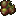 Ruinous Enzyme |
| **Congeatio** | Cold, Ice, Water | Blue (0,100,255) |  Frigid Enzyme |
| **Ferric** | Iron, Barbs, Solidity, Unchanging | Gray (53,53,53) |  Ferric Enzyme |
| **Tenebris** | Darkness, Stealth, The End | Purple (70,0,110) |  Umbral Enzyme |

Enzymes are obtained using a **Living Syringe** on mobs (now rack-fed via **Vial Rack** storage), then processed in a **Vial Centrifuge** to extract enzymes and Hematic Iron Powder.

The Somatic Loom stores enzymes internally as dye-like tendency reservoirs. Each tendency can hold up to 64 enzyme units; inserted enzymes are converted into integer storage and cannot be recovered. Memory weaving recipes draw from these stored values during the physical orb-dragging step rather than checking whether a tendency was merely present.

---

## 10. Vascular System

The player's vascular system has **7 sections** that take strain from manipulation use and damage:

| Section | Enum Value |
|---------|-----------|
| Head | `HEAD` |
| Left Arm | `LEFTARM` |
| Heart | `HEART` |
| Body | `BODY` |
| Right Arm | `RIGHTARM` |
| Left Leg | `LEFTLEG` |
| Right Leg | `RIGHTLEG` |

- Sections degrade through health states when strained (healthy → stressed → clotted → dead)
- Degraded sections apply debuffs
- Sections heal passively when the player is well-fed
- The **Vascular Status Gauge** item and **VascularViewScreen** let the player inspect their vein health

---

## 11. Skill Tree

Opened from the **Sanguine Conduit** item/block. Has six tabs:
- **Skills** — panning/zoomable blood skill tree with skill nodes
- **Manipulations** — panning/zoomable manipulation tree with manipulation nodes
- **Crafting** — sidebar listing blood structure recipes grouped by tier (Basic/Advanced/Expert) with degree gating (0/2/4)
- **Scars** — sidebar listing scar station recipes grouped by tier (1/2/3) with degree gating (4/4/5)
- **Rites** — sidebar listing cardinal rite recipes
- **Materials** — panning/zoomable atlas catalogue of progression-relevant mod items and blocks. Harbinger and Unstained share the atlas controller, but use path-specific cosmetic buckets for category labels, color, and local grouping. Vein traces follow explicit material parent links rather than bucket membership. The atlas now covers expanded feature families such as gourds/vessels, spores/cultures, myco-realm blocks, masks/vestments, idols/fixtures, qliphoth reagents, Unstained fixtures, and vestment/tool variants, while deliberately excluding memory items, spawn eggs, debug/test objects, field-note/map/book support entries, and other systems owned by separate tabs. Locked future materials stay hidden; only the immediate next tier appears as next-tier veiled material nodes with requirement text and without revealing names, icons, recipes, or descriptions.

Skills cost **skill points** (earned from using manipulations) and many require a **minimum initiatory degree**:

Skill definitions are Java-owned. `SkillPointInit` keeps the public static fields and branch registration order, while editable declarations live in `common/init/skills/*SkillBranch.java` between `// <skill-editor branch="...">` markers. The browser tool in `tools/skill_tree_editor` reads those Java branch files directly, ignores the old `data/hemomancy/skilltrees` JSON folder, and previews Java/lang diffs before applying changes.

| Skill | ID | Max Lvl | SP Cost | Req. Degree | Effect | Parent |
|-------|----|---------|---------|-------------|--------|--------|
| Base | 0 | 1 | — | — | Root node, unlocked by default | — |
| Deep Base | 38 | 1 | 1 | 5 | Late-path anchor used by deep Harbinger branches | — |
| Capacity | 1 | 5 | 1 | — | +500 max blood volume per level | Base |
| Efficiency | 2 | 5 | 1 | — | -8% manipulation cost per level (multiplicative, ~34% at max) | Base |
| Manip Slots | 14 | 5 | 2 | 1 | +1 active manipulation slot per level | Base |
| Synaptic Memory | 40 | 4 | 3 | 5 | +1 remembered Synaptic Loadout slot per level; raises Dendritic Distributor loadout storage from 3 to 7 | Manip Slots + Deep Base |
| Living Conduit | 21 | 3 | 2 | 1 | Living Staff absorption target cap and absorption range increase per level | Manip Slots |
| Last Wind | 3 | 3 | 2 | 2 | +2 blood regen/tick when below 10% blood | Capacity |
| Sanguine Surge | 7 | 3 | 2 | 2 | +1 passive blood regen/tick per level | Capacity |
| Dynamic Use | 4 | 3 | 2 | 2 | +10% manipulation power when tendency matches | Efficiency |
| Hemostasis | 6 | 3 | 2 | 2 | -10% blood lost when taking damage per level | Efficiency |
| Vascular Draw | 22 | 3 | 2 | 2 | Living Staff absorption amount and block/reservoir draw rate increase per level | Living Conduit |
| Dragging Siphon | 41 | 1 | 2 | 2 | Allows slow movement while channeling Blood Absorption | Vascular Draw |
| Mobile Conduit | 42 | 3 | 2 | 3 | Reduces Blood Absorption movement slowdown per level | Dragging Siphon |
| Blood Tolerance | 43 | 5 | 2 | 3 | Delays living-target absorption strain thresholds per level | Dragging Siphon |
| Quickened Draw | 45 | 1 | 2 | 3 | First Blood Absorption living-target pulse frequency upgrade | Vascular Draw |
| Hungry Pulse | 46 | 1 | 3 | 4 | Second Blood Absorption living-target pulse frequency upgrade | Quickened Draw |
| Feeding Frenzy | 5 | 3 | 3 | 3 | +25% blood gained from kills | Last Wind |
| Iron Will | 10 | 3 | 3 | 3 | 10% damage reduction per level when blood < 15% | Last Wind |
| Crimson Projection | 23 | 3 | 3 | 3 | Living Staff structure feed and blood vessel feed rates increase per level | Living Conduit |
| Weapons Master | 39 | 4 | 2 | 4 | -50mL Living Staff weapon hot-swap cost per level (250mL -> 50mL) | Crimson Projection + Vascular Draw |
| Unbound Siphon | 44 | 1 | 4 | 5 | Removes Blood Absorption movement penalties | Mobile Conduit + Deep Base |
| Arterial Cadence | 47 | 1 | 4 | 5 | Final Blood Absorption living-target pulse frequency upgrade | Hungry Pulse + Deep Base |
| Hematic Focus | 24 | 3 | 3 | 5 | Broad Living Staff focus: absorption cap/range/amount and projection rates improve per level | Crimson Projection + Vascular Draw + Deep Base |
| Vesper's Refusal | 25 | 3 | 4 | 7 | Amplifies awakened Vesper memory on the Living Staff; inert until Vesper's memory is awakened | Hematic Focus |
| Blood Flow | 11 | 5 | 2 | 3 | -5% manipulation cooldowns per level | Hemostasis |
| Coagulation | 12 | 3 | 3 | 4 | +15% chance to block incoming bleed effects | Hemostasis |
| Crimson Mastery | 8 | 3 | 3 | 4 | +15% manipulation damage/effectiveness per level | Dynamic Use |
| Vital Link | 9 | 3 | 4 | 5 | +10% chance to heal on dealing manipulation damage | Feeding Frenzy |
| Sanguine Reach | 13 | 3 | 3 | 5 | +15% range for ranged blood manipulations | Crimson Mastery |
| Scar Affinity | 15 | 3 | 3 | 4 | Opens the mind to cerebral scarring; +10% scar effect potency per level | Crimson Mastery |
| Scar Resonance | 16 | 3 | 3 | 4 | The bond between scar and blood deepens; +1 equippable scar slot per level | Scar Affinity |
| Scar Mastery | 17 | 3 | 4 | 5 | Scarred pathways fully colonised; scar effects last 20% longer per level | Scar Resonance |

Skill bonuses are computed in `SkillPointHelper`.

`skill_synaptic_memory` is wired through `SynapticLoadoutSlotHelper` and `SynapticLoadoutActionPacket`: it expands remembered Dendritic Distributor loadout slots from the base 3 to the maximum 7.

**Skill Wiring Status** (which skills are actually hooked into gameplay events):

Capacity is now resolved by `MaxBloodLedger` through `BloodVolumeEvents`: each level contributes +500 max blood to the additive formula `5000 + Capacity + Spleen + Eternal Covenant - scars`.

| Skill | Wired? | Where Called |
|-------|--------|-------------|
| Capacity | Yes | `MaxBloodLedger` via `BloodVolumeEvents` -- contributes +500 max blood per level to the additive player capacity formula |
| Efficiency | ✅ Yes | `ManipulationCostLedger` via `BloodManipulation.performAction()` -- multiplies manipulation blood cost |
| Deep Base | ✅ Yes | `SkillPointInit` / branch definitions — degree-gated anchor for deeper progression paths |
| Manip Slots | ✅ Yes | `ManipulationSlotLedger` via `ManipSlotHelper` -- expands active manipulation slot count |
| Living Conduit | ✅ Yes | `LivingStaffFocusProfile` / `LivingStaffFocusRules` — increases Living Staff absorption target cap and range |
| Last Wind | ✅ Yes | `BloodVolumeEvents` — passive blood regen when below 10% threshold |
| Dynamic Use | ✅ Yes | `ManipulationCostLedger` via `BloodManipulation.performAction()` -- divides effective blood cost by multiplier when tendency matches |
| Feeding Frenzy | ✅ Yes | `BloodVolumeEvents` — multiplies blood gained from kills |
| Hemostasis | ✅ Yes | `BloodVolumeEvents` — multiplies blood drained when taking damage |
| Vascular Draw | ✅ Yes | `LivingStaffFocusProfile` / `LivingStaffFocusRules` — increases Living Staff absorption amount and block/reservoir draw rate |
| Dragging Siphon | ✅ Yes | `BloodAbsorptionChannelRules` / Blood Absorption item paths — unlocks slow movement while channeling |
| Mobile Conduit | ✅ Yes | `BloodAbsorptionChannelRules` / Blood Absorption item paths — reduces channel movement slowdown |
| Blood Tolerance | ✅ Yes | `BloodAbsorptionChannelRules` / Blood Absorption item paths — delays weakness, nausea, and blood poisoning strain tiers |
| Quickened Draw | ✅ Yes | `BloodAbsorptionChannelRules` / Blood Absorption item paths — improves living-target pulse interval |
| Hungry Pulse | ✅ Yes | `BloodAbsorptionChannelRules` / Blood Absorption item paths — improves living-target pulse interval |
| Crimson Projection | ✅ Yes | `LivingStaffFocusProfile` / `LivingStaffFocusRules` — increases Living Staff projection/feed rates |
| Weapons Master | ✅ Yes | `LivingStaffWeaponFormHelper` / `LivingStaffWeaponFormRules` — reduces Living Staff weapon hot-swap cost by 50mL per level |
| Unbound Siphon | ✅ Yes | `BloodAbsorptionChannelRules` / Blood Absorption item paths — removes channel movement penalties |
| Arterial Cadence | ✅ Yes | `BloodAbsorptionChannelRules` / Blood Absorption item paths — reaches the mature living-target pulse interval |
| Hematic Focus | ✅ Yes | `LivingStaffFocusProfile` / `LivingStaffFocusRules` — improves staff focus channels: absorption cap/range/amount and projection rates |
| Vesper's Refusal | ✅ Yes | `LivingStaffFocusProfile` / `LivingStaffFocusRules` — only applies when Vesper memory is awakened; improves staff target cap, range, absorption amount, and projection rates |
| Sanguine Surge | ✅ Yes | `BloodVolumeEvents` — adds passive blood regen per tick |
| Crimson Mastery | ✅ Yes | `PyreticForgeManip` — scales items smelted per cast |
| Vital Link | ✅ Yes | `KnownManipulationEvents` — chance to heal player on dealing manipulation damage |
| Iron Will | ✅ Yes | `BloodVolumeEvents.onPlayerDamaged` — reduces incoming damage by `getIronWillMultiplier()` when blood is below `getIronWillThreshold()` (default 15% of max blood) |
| Blood Flow | ✅ Yes | `BloodManipulation` — multiplies effective cooldown of manipulations |
| Coagulation | ✅ Yes | `BloodLossEffect` — chance to block incoming bleed effect ticks |
| Sanguine Reach | ✅ Yes | `BloodLampManip`, `CrimsonFlameConjurationManip`, `UmbralStepManip`, `SanguineExcavationManip` — scales range |
| Scar Affinity | ✅ Yes | `HarbingerEquipmentEntityEventHandler.checkScarSynergy` multiplies scar synergy attribute modifiers by `getScarAffinityMultiplier()`; modifiers are removed and re-added every 20 ticks so level changes take effect immediately |
| Scar Resonance | Refactor follow-up | Legacy slot-count helper still exists, but registry-backed active cerebral scars now iterate the `SCARS` capability's active id set instead of binder slot bounds |
| Scar Mastery | ✅ Yes | `ScarDefinition.onPlayerAttack`, `onPlayerDefend`, `onPlayerKill`, `applyTierThreeTickEffect` multiply triggered effect durations by `getScarMasteryDurationMultiplier()` |

---

## 12. Bloodlines

A multiplayer social system where players form blood-bound groups.

- **Creation:** Use an **Unsigned Ancestral Ledger** — first use signs and creates a bloodline named after the leader
- **Joining:** Another player uses the same signed ledger to join
- **Shared Pool:** Each member contributes 5,000 blood to a communal pool
- **Trickle Donation:** Optionally auto-donate blood to the shared pool at a configurable rate
- **Auto-Draw:** Optionally auto-draw from the shared pool when personal blood falls below a threshold
- **Direct Routing Contribution:** Fane-only routing can draw from the shared pool when the linked player enables bloodline mode. The current implementation requires the linked player to be the bloodline leader or to have their routing opt-in enabled before the pool is used.
- **Member Expulsion:** Bloodline progenitors can expel member players through `BloodlinePoolScreen` (server-validated via `PacketKickBloodlinePlayer`)
- **Harbinger NPC Recruitment:** Degree 5+ players with a valid bloodline can recruit outpost Harbingers through dialogue. Current recruitable NPCs are Vicar, Alchemist, and Mnemonist. Recruited NPCs are phantom bloodline members: they do not appear as online players but add 1,000 maximum shared blood each.
- **Recruitment Limits:** A bloodline may contain only one recruited NPC of each entity type and only one recruited NPC from each Harbinger Outpost. `Bloodline` persists NPC UUIDs, entity type ids, and outpost keys; `DialogueEventHandler` enforces both limits when `recruit_harbinger` fires.
- **Outpost Identity:** `HarbingerOutpostStructure.afterPlace()` stamps spawned Vicar/Alchemist/Mnemonist entities with a persistent outpost key through `HarbingerRecruitmentRules`. Older or manually unstamped NPCs fall back to a `StructureManager#getStructureWithPieceAt` lookup for `hemomancy:harbinger_outpost` when interacted with on the server.
- **NPC Expulsion:** Expelling a recruited NPC removes that NPC's UUID, type, and outpost key from the bloodline, freeing both the type slot and the outpost slot. The entity's own persistent outpost tag remains, so the same outpost identity can be rediscovered if the NPC is recruited again later.
- **Persistence:** Bloodline data is stored in world-level `BloodlineSavedData`
- **Monitoring:** The **Bloodline Pool Monitor** item shows pool status; the **BloodlinePoolScreen** provides a player-facing ritual GUI with shared/personal blood renderers, bloodline pool controls, and the client-side Fane Sight visibility cycle

Recruitment dialogue uses mutually exclusive pledge/release options: an NPC already in the player's bloodline shows the release line, while an unrecruited NPC shows the pledge line only if both the type and outpost recruitment limits allow it. Holding an item no longer replaces the whole NPC dialogue tree; `DialogueItemInquiryNodes` rewrites each NPC's existing `item_hint` node so the item inquiry option can coexist with normal conversation and recruitment. The Alchemist's Degree 5+ menus expose the root item inquiry option directly.

Implementation anchors: `Bloodline`, `BloodlineSavedData`, `HarbingerRecruitmentRules`, `DialogueEventHandler`, `DialogueItemInquiryNodes`, `HarbingerOutpostStructure`, `HarbingerVicarEntity`, `HarbingerAlchemistEntity`, `HarbingerMnemonistEntity`, and `HarbingerRecruitmentDialogueSourceTest`.

---

## 13. Scars & Spores

### 13.1 Scars

Scars are now registry-backed player state. Cerebral scar items crafted at the **Cerebral Scarring Station** point at registered `ScarDefinition` entries; the player `SCARS` capability stores known and active cerebral scar registry ids. Scar crafting requires **Initiatory Degree 4 (Adept)** minimum.

The Degree 4 Vein-Mason assignment now provides the first guided scar lesson. After the Vicar sends the player to **Masons Respite**, the Cicatrix Anchorite gives one dynamic Scar Pattern tagged with the tier-1 template for the player's strongest blood tendency, plus a blank scar, the matching catalyst, and a Hematic Iron Knapper if needed. Hidden internal milestones still record the finer events, but the ledger presents four player-facing parts: finding the Vein-Mason, carving and burning the first Scar item, preparing the first Mason's Effigy loadout pattern, and burning that prepared pattern to commit the active scar loadout. The post-completion Anchorite reward is a continuation kit containing a dynamic Scar Pattern tagged for the player's second-strongest tendency, one blank scar, the matching catalyst, and four Runic Motif Paper.

Scars are organized in **three tiers** by `deepenAmount`, which describes how strongly they shift tendency alignment. The current NeoForge branch gives standard scars real passive/combat effects through `ScarDefinition`: attribute modifiers, persistent effects, blood upkeep, max-blood modifiers, and event hooks for attack/defense/kill/tick behavior. `ItemScar` is a carrier/pointer item, similar to `BloodMemoryItem`; the definition owns the behavior.

The **Anastomotic Brazier** has three scar burning paths. Burning a cerebral **Scar item** from the Cerebral Scarring Station unlocks that scar by adding its registry id to the player's known cerebral scar list. Burning an Effigy-prepared **Scar Pattern** does not teach new scars; it commits a loadout by replacing the player's active cerebral scar ids with the prepared pattern's selected known scar ids. Burning a blank **Runic Motif Paper** clears all active cerebral scars without removing known scars or touching the fungal scar item slot.

The **Mason's Effigy** attunes selected scars the player already knows. Opening the menu receives a server-authored snapshot of the player's known and currently active cerebral scars, so the active sockets immediately mirror the player's current loadout even before later capability sync packets arrive. Right-clicking the Effigy with **Runic Motif Paper** places the blank motif above the block as a pending ritual. The player feeds that motif with Blood Projection from hand or staff; when it has received **500 ml per selected scar**, the Effigy bursts with red omen particles and ejects the completed dynamic Scar Pattern item into the world. Current active capacity is gated by degree: Degree 4 = 1 active scar, Degree 5 = 2, Degree 6+ = 4.

Fungal scars remain a separate physical `ItemStack` slot in the same `SCARS` capability and are not changed by cerebral loadout burning. `ScarType` and `HarbingerEquipmentType` remain separate systems: scars are not Harbinger equipment slots, and Harbinger equipment is not stored as cerebral scar ids.

**Tier 1 Scars (deepenAmount = 1) — Basic, available at Degree 4:**

| Scar | Tendency | Effect |
|------|----------|--------|
|  Mind Spike | Ductilis | Legacy override scar / mind spike slot behavior |
|  Scar of the Heart | Animus | +2 Max Health |
|  Scar of the Pyre | Flammeus | +1 Attack Damage, -1 Armor |
|  Scar of the Feral | Ductilis | +5% Attack Speed, -1 Armor |
|  Scar of the Halo | Lux | +1 Armor Toughness, -5% Movement Speed; blinds attackers |
|  Scar of Blight | Mortem | +1 Attack Damage; poison backtracks onto wearer after kills |
|  Scar of Rime | Congeatio | +5% Movement Speed, -5% Attack Speed; slows struck foes |
|  Scar of the Thorn | Ferric | +1 Armor, -5% Movement Speed; reflects 1 thorns damage |
|  Scar of the Shade | Tenebris | +5% Movement Speed, -1 Attack Damage; invisibility in darkness |

**Tier 2 Scars (deepenAmount = 2) — Advanced, available at Degree 4:**

| Scar | Tendency | Effect |
|------|----------|--------|
| Scar of Marrow | Animus | +4 Max Health, -5% Movement Speed; heals wearer on kill |
| Scar of Sol | Flammeus | +2 Attack Damage, -2 Armor; briefly ignites attackers |
| Scar of Flux | Ductilis | +10% Attack Speed, -2 Armor; grants Haste on kill |
| Scar of the Veil | Lux | +2 Armor Toughness, -10% Movement Speed; blinds + marks attackers with Glowing |
| Scar of Withering | Mortem | +2 Attack Damage, -2 Max Health; poisons struck foes |
| Scar of the Glacier | Congeatio | +10% Movement Speed, -10% Attack Speed; slows struck and nearby foes |
| Scar of the Anvil | Ferric | +2 Armor, +1 Armor Toughness, -10% Movement Speed; reflects 2 thorns damage |
| Scar of the Moon | Tenebris | +10% Movement Speed, -2 Attack Damage; invisibility in darkness and when struck in darkness |

**Tier 3 Scars (deepenAmount = 3) — Expert, available at Degree 5 (planned: move gate to Degree 6):**

| Scar | Tendency | Effect |
|------|----------|--------|
| Scar of the Phoenix | Animus | +6 Max Health, -10% Movement Speed; heals on kill and regenerates when gravely wounded |
| Scar of the Corona | Flammeus | +3 Attack Damage, +0.3 Knockback Resistance, -3 Armor; ignites attackers |
| Scar of the Chimera | Ductilis | +15% Attack Speed, -3 Armor, -4 Max Health; Haste/Speed/Strength on kill |
| Scar of Transcendence | Lux | +2 Armor Toughness, -15% Movement Speed; blinds/marks attackers and grants Resistance in bright light |
| Scar of Oblivion | Mortem | +3 Attack Damage, -4 Max Health; withers struck foes |
| Scar of Descendence | Congeatio | +15% Movement Speed, -15% Attack Speed, -2 Attack Damage; slows struck/nearby foes and grants slow fall |
| Scar of the Crucible | Ferric | +3 Armor, +2 Armor Toughness, -15% Movement Speed, -5% Attack Speed; reflects 3 thorns damage |
| Scar of the Eye | Tenebris | +15% Movement Speed, -3 Attack Damage; invisibility in darkness and when struck |

> **Scar Mechanic:** Standard scar items extend `ItemScar`, but active behavior resolves through `ScarInit` and the `SCARS` capability's active cerebral ids. The active Animus tier-3 scar is `scar_phoenix`; the old unregistered Ichor scar resource stub has been removed from recipes, models, and lang.

The **Scar Pattern** is now one dynamic item, `scar_pattern`, whose custom data stores up to four scar registry ids. Single-id stacks act as Cerebral Scarring Station templates, and multi-id stacks produced by the Mason's Effigy act as loadout tools for the Anastomotic Brazier. The Scar Station pattern slot accepts only Scar Pattern stacks and, when a stack contains multiple scar ids, displays all available templates as a selectable scrolling list. Template recipes live under `data/hemomancy/recipe/scar_template/` and produce the single dynamic item with the relevant `ScarIds` custom data. The scar-pattern item renderer draws up to four selected scar overlays on the motif in a 2x2 dynamic arrangement. These overlays render directly from scar overlay textures, rotate around the pattern's Z axis, and have tuned first-person, third-person, GUI, and ground transforms so the motif remains readable in hand, inventory, and dropped-item views.

### 13.2 Functional Fungal Scars (Scar-type items)

Special fungal scar items with active effects extend `ItemFungalScar`, render as rotating 3D scar items on the player, have rare rarity/foil visuals, and occupy the dedicated fungal scar `ItemStack` slot in the `SCARS` capability (`ScarType.FUNGAL`, slot 0). The current implementation uses the **Mycelial Crucible**, not the Morphling Incubator, and the old four-scar incubator plan has been superseded.

The consolidated fungal-scar roster is eight crucible-grown identities. The legacy removed scar ids migrate on login/tick to the nearest survivor and do not retain removed per-stack custom data:

| Item | Tendency | Active Effect |
|------|----------|---------------|
|  Noctifly Agaric | Animus | Grants the `fungal_elytra` effect while equipped; glide support is maintained by `HarbingerEquipmentEntityEventHandler.onGlideTick()` |
|  Rhizovitta Communis | Animus | While grounded in a fungal network, sustains a guarded scar-channel blood trickle and refunds a small share of successful blood-manipulation cost |
|  Talaromyces Minus | Ferric | Enables shift-mining ore vein mining through `VeinMinerHelper`; it no longer grants Haste |
|  Oculiflora Reticularis | Tenebris | Client-local network sight only: reveals equipped scar state, synced Qliphoth bloom data, nearby entities, and nearby morphic nectar/fluid signals |

The remaining advanced scars use the same live event-handler surface:

| Item | Tendency | Active Effect | Cultivation Cost |
|------|----------|---------------|------------------|
| **Saprovitta vestigium** | Flammeus | **Feeding Wake** - movement leaves a brief damaging blood-fungal trail (1.5 magic damage pulses every 6 ticks while moving) | 1,200 blood / 1,200 ticks / 2,000 enzyme power |
| **Antiphonomyces resonans** | Ductilis | **Crawling Choir** - 20% chance for a successful blood manipulation to echo-cast at no extra blood cost | 2,400 blood / 2,400 ticks / 3,000 enzyme power |
| **Putrivora resolvens** | Mortem | **Affliction Digestion** - poison, wither, hunger, and blood-loss effects tick down faster and feed back limited guarded scar-channel blood recovery | 2,400 blood / 2,400 ticks / 3,000 enzyme power |
| **Cryostroma perdurans** | Congeatio | **Conservative Resilience** - stillness ramps passive vascular recovery without reviving the removed death-save behavior | 2,400 blood / 2,400 ticks / 3,000 enzyme power |

**Mycelial Crucible recipe format** (`data/hemomancy/recipe/fungal_scar/*.json`):
```json
{
  "type": "hemomancy:fungal_scar_cultivation",
  "tendency": "LUX",
  "blood_cost_phase1": 2400,
  "phase1_duration": 2400,
  "maturation_threshold": 3000,
  "immature_result": { "id": "hemomancy:immature_fungal_scar" },
  "result": { "id": "hemomancy:oculiflora_reticularis" }
}
```

### 13.3 Spore Cultures (Enzyme Fruiting)

Aligned spores are now functional reusable culture items for the **Mycelial Lantern** enzyme-fruiting loop. Each is registered as an uncommon item that stacks to 16 and is crafted shapelessly from the matching enzyme + `spore_sac` + `hyphal_substrate`. The culture remains in the Lantern while blood is converted into the matching enzyme output.

One culture exists for each enzyme/tendency vocabulary pair:
 Vivacious,
 Fervent,
 Neurotic,
 Incandescent,
 Ruinous,
 Frigid,
 Ferric,
 Umbral.

The JSON recipes live at `data/hemomancy/recipe/<spore_id>.json`, e.g. `vivacious_spores.json` combines `vivacious_enzyme`, `spore_sac`, and `hyphal_substrate` into `vivacious_spores`.

The same aligned spores are also consumed as **Sporitic Thurible** catalysts (see §21.5). In that tool one spore lights the thurible for 6,000 ticks (5 minutes), stores `SporeId`, `BurnTicks`, `MaxBurnTicks`, and `BurnEndGameTime` in `DataComponents.CUSTOM_DATA`, and colors both the GUI burn bar and the emitted `sporitic_spore` cloud by the mapped tendency. Burn time is computed from the stored end tick instead of decrementing stack NBT every tick, so the hotbar item does not replay vanilla stack-change pop animation while burning. The current catalyst mappings are:

| Spore | Tendency | Secondary hostile effect | Particle / bar color |
|---|---|---|---|
| `vivacious_spores` | `ANIMUS` | Weakness | `0xB83A4B` |
| `fervent_spores` | `FLAMMEUS` | Brief fire | `0xD86A2C` |
| `neurotic_spores` | `DUCTILIS` | Neural Overload | `0x68D6D7` |
| `incandescent_spores` | `LUX` | Glowing | `0xF4D66E` |
| `ruinous_spores` | `MORTEM` | Longer Wither | `0x5C3A77` |
| `frigid_spores` | `CONGEATIO` | Slowness | `0x74A9C8` |
| `ferric_spores` | `FERRIC` | Mining Fatigue | `0xA76A37` |
| `umbral_spores` | `TENEBRIS` | Blindness | `0x3A254A` |

### 13.4 Mycelial Crucible & Immature Fungal Scar Cultures

The **Mycelial Crucible** (`MycelialCrucibleBlockEntity`) is the current fungal-scar cultivation station. It has 8 slots:

- Center (slot 0): finished fungal scar seed for Phase 1, or `immature_fungal_scar` for Phase 2
- Enzyme slots (1–4): aligned `EnzymeItem` / `RecycledEnzymeItem`; only matching tendency contributes
- Output (5): immature culture or finished scar
- Blood input (6): Bloody Flask or Blood Gourd
- Flask output (7): empty/cured flask return

When placed, the crucible reserves a rotating 3x2x1 footprint: the main block is the lower center, with filler blocks on both lower sides and across the upper row. Its width follows the block's horizontal facing.

**Phase 1 — Implantation:** The center scar plus aligned enzymes start a timed cultivation run. The crucible deducts the recipe's flat blood cost, then drains 1.5 blood/tick for the recipe duration. On completion it consumes the center/enzymes and outputs the single consolidated `immature_fungal_scar`.

**Phase 2 — Maturation:** The immature culture stores `Tendency`, `MatureThreshold`, `MatureProgress`, and `TargetScarId` in `DataComponents.CUSTOM_DATA`. Feeding aligned enzymes advances `MatureProgress`; when progress reaches the threshold, the crucible converts it into the target `ItemFungalScar`. Progress is preserved on the item stack, and blood shortages pause the process rather than resetting it.

`Hyphal Substrate` is registered as a supporting crafting ingredient, and `immature_fungal_scar` uses one model/texture with dynamic translated names such as `item.hemomancy.immature_scar.oculiflora_reticularis`.

> **Design status:** The extractor / harvested Fungal Gardens scar plan has been replaced for now by crucible cultivation. The deeper Apotheos-tier fungal scar concept remains open-ended design space, but the implemented fourth scar family is already live through `ItemFungalScar` + `MycelialCrucible`.

---

## 14. Status Effects & Potions

Most crafted status effects have a corresponding potion, splash potion, lingering potion, and tipped arrow variant. Some runtime-only effects are applied directly by gameplay systems instead.

| Effect | Category | Color | Notable Mechanic |
|--------|----------|-------|-----------------|
|  **Blood Binding** | Harmful | Dark red | Immobilizes target |
|  **Blood Drunkenness** | Harmful | 0x6E0E1C | Foreign-blood backlash from direct emergency blood restores. Lasts 3 minutes per use, stacks to amplifier 3, increases manipulation blood cost by +15%/+30%/+45%/+60%, and at amplifier 3 also increases manipulation cooldowns by 25%. Runtime-applied only; no potion recipe. |
|  **Blood Loss** | Harmful | Red | -15% movement speed |
|  **Blood Rush** | Beneficial | Red | +20% move speed, +10% attack speed |
|  **Hemolysis** | Neutral | Pink | Blood destruction effect |
|  **Hematic Strain** | Harmful | 0x660000 | Inner Trial debuff; reduces max health by 40% while active. |
|  **Hemophagy** | Harmful | 0x4B0000 | Hollow Vessel Empty Pulse debuff; healing reduction is enforced through `HemorathEntity` heal handling. |
|  **Noctifly Agaric** (Fungal Elytra) | Beneficial | — | Grants elytra flight  |
|  **Sanguine Fertility** | Beneficial | 0xCC3344 | Fertility/growth effect |
|  **Arachnid Anastomosis** | Beneficial | 0x8B0000 | Spider-vein healing |
|  **Mycorrhizal Mending** | Beneficial | 0x7B4F2A | Fungal regeneration |
|  **Sanguine Siphon** | Beneficial | 0x8B0000 | Blood drain on hit |
|  **Chitinous Bulwark** | Beneficial | 0x556B2F | +4 armor toughness |
|  **Serpentine Guile** | Beneficial | 0x2E8B57 | +15% move speed, +10% attack speed |
|  **Verminous Aura** | Beneficial | 0x4A3728 | Pest-based area effect |
|  **Echoic Perception** | Beneficial | — | Bat morphling effect — nearby entities glow (radius scales with amplifier) |
|  **Luminous Dissipation** | Beneficial | — | Cuttlefish morphling effect — knockback resistance |
|  **Hemorrhagic Venom** | Beneficial | — | Tick morphling effect — AoE damage aura to nearby hostiles |
|  **Spined Barricade** | Beneficial | — | Urchin morphling effect — passive thorns + armor bonus |
|  **Venomous Resilience** | Beneficial | 0x336B87 | Centipede morphling effect — poison immunity + speed. |
|  **Burrower's Instinct** | Beneficial | — | Mole morphling effect — mining speed + underground regen/night vision |
|  **Arcane Resonance** | Beneficial | 0x8800AA | MnA combo marker — next blood manipulation costs less blood (granted by blood-affinity MnA spells) |
|  **Sanguine Clarity** | Beneficial | 0xAA0022 | MnA combo marker — next MnA spell costs less mana (granted by using blood manipulations) |
|  **Marked by Canon** | Harmful | 0x8B0000 | Saint sarcophagus rejection mark; lowers extraction odds, slows movement, and can damage high-amplifier trespassers. |
|  **Neural Overload** | Harmful | 0x7DF9FF | Neurotic enzyme disruption; slows the body and escalates into nausea and weakness at higher amplifier levels. |
|  **Mnemonic Whispers** | Beneficial | 0x7A5C91 | Brewed from Awkward Potion + Mnemonic Ambergris. Lasts 60 seconds and reduces the cooldown started by successful blood manipulations by 25% (`0.75×`) through `BloodManipulation.startCooldown`. |
|  **Mnemonic Screams** | Harmful | 0x3F102B | Anti-abuse backlash. If a player starts drinking another Mnemonic Whispers potion while Whispers is already active, the finish-drink handler removes Whispers and applies Screams for 60 seconds. While active, blood manipulations cost 50% more blood (`1.5×`). Runtime-applied only; no potion recipe. |
|  **Sporitic Resonance** | Beneficial | Catalyst-tinted | Granted by a lit Sporitic Thurible aura. Matching-tendency manipulations cost 15% less blood and receive 10% shorter cooldown while the resonance state is active; nonmatching manipulations receive no bonus and multiple thuribles do not stack. |
|  **Morphic Strain** | Harmful | Fungal green | Primal morphling drawback. Modest max-health and movement-speed reduction after successful Primal powers. |
|  **Silver Ward** | Beneficial | 0xC0C0C0 | Unstained protection; grants armor/knockback resistance and reduces damage from hemomancy-coded threats. |
|  **Verdigris Aura** | Beneficial | 0x4A8B6F | Unstained clarity field; weakens and slows hemomancy-tagged mobs with oxidized-copper resonance. |

**Potion and icon notes:**
- `potion_of_mnemonic_whispers` is registered in `EffectInit.POTION_TYPES`; normal vanilla conversion produces splash, lingering, and tipped-arrow variants with language entries.
- Mnemonic Whispers is brewed in `EffectInit.registerEnzymeBrewingRecipes(RegisterBrewingRecipesEvent)` from `Potions.AWKWARD` + `ItemInit.mnemonic_ambergris`.
- Re-drinking protection is handled by `EffectInit.onMnemonicPotionDrinkStart` and `EffectInit.onMnemonicPotionDrinkFinish`, using a short-lived per-player marker so the first Whispers drink is not punished after its own effect is applied.
- Effect icons live under `src/main/resources/assets/hemomancy/textures/mob_effect/`; every registered mob effect has an exact-ID 16x16 RGBA PNG there.

---

## 15. Unstained Systems

This section collects the reusable anti-hemomancy systems. The Unstained path section explains how a player enters and advances through Purity/Clarity; this section tracks the powers, rites, purification mechanics, client surfaces, and data anchors that support that path.

### 15.1 Still Arts

Still Arts are the Clarity-phase counterpart to Blood Manipulations, but they are not crafted Hematic Memories. They are granted by Our Lady of Still Waters and by Unstained rites as the player's silvery vital humor becomes stable enough to carry them.

Implementation spine:
- Registry: `StillArtInit.STILL_ARTS` (`hemomancy:still_arts`)
- Art definition: `common/unstained/stillarts/StillArt`
- Player state: `IKnownStillArts` / `KnownStillArts`, exposed through `HemoCapabilityAccess.getKnownStillArts(player)`
- Sync and use packets: `KnownStillArtsServerPacket`, `UpdateSelectedStillArtPacket`, `UseStillArtKeyPacket`
- Client selection: `RadialChooseStillArtScreen`, opened from the existing charm/radial key after Clarity is unlocked

Current basic Still Arts:

| Art | Required Clarity Stage | Role |
|-----|------------------------|------|
| Silver Rebuke | Awakened | Short-range pale knockback and slowing rebuke |
| Lethean Mute | Awakened | Silences hostile bodies through weakness and confusion |
| Still Pulse | Discerning | Brief defensive stillness and area slowing |
| Pale Diagnosis | Discerning | Reveals nearby suspicious or afflicted bodies |
| Memory Shear | Vigilant | Cuts a monster's immediate hostile fixation and disorients it |
| Absolving Step | Vigilant | Purging step that clears fire, poison, and wither while lunging forward |
| Quietus Bell | Resolute | Protective bell pulse that weakens surrounding hostiles |
| Autoimmune Edge | Enlightened | Dangerous pale backlash against nearby living bodies |

The Rite of Clarity (Consecrated Copper at the Unstained Podium) directly grants **Silver Rebuke** as the first Still Art via `KnownStillArtEvents.grantArt(player, StillArtInit.silver_rebuke)`. The remaining arts are granted by **advancements** through `StillArtRewardTable` — `KnownStillArtEvents.onAdvancementEarned` maps specific Unstained advancements to their eligible `EnumClarityStage` and calls `grantArtsForStage()`, which grants all arts whose required stage is ≤ the earned stage:

| Advancement | Clarity Stage | Arts Granted |
|---|---|---|
| `hemomancy/clarity_awakened` | AWAKENED | Silver Rebuke, Lethean Mute |
| `hemomancy/discerning` | DISCERNING | Still Pulse, Pale Diagnosis |
| `hemomancy/vigilant` | VIGILANT | Memory Shear, Absolving Step |
| `hemomancy/resolute_stage` | RESOLUTE | Quietus Bell |
| `hemomancy/enlightened_seeker` | ENLIGHTENED | Autoimmune Edge |

On login, `playerLoggedIn` calls `grantEligibleArts()` to backfill any arts the player should already have based on current `IUnstainedProgress` clarity. The radial selection screen (`RadialChooseStillArtScreen`) is opened from the existing charm/radial key once Clarity is unlocked.

### 15.2 Unstained Cardinal Rites

All Unstained rites have `bloodCost: 0` — they draw from purity/clarity rather than the blood reservoir.

**Purity-Phase Rites (levels 0–5):**

| Rite | File | Rite Form | Required Stage | Effect |
|------|------|-----------|----------------|--------|
| Rite of Lethean Baptism | `lethean_baptism` | Minor | 0 | Begins the Unstained path; sets `begunPurification = true`, grants starting purity |
| Rite of Still Waters | `still_waters` | Minor | 1 (Begun) | Creates a 5-min zone (16 block radius) reducing magic damage by 30% |
| Rite of Pale Consecration | `pale_consecration` | Lesser | 2 (Tainted) | 10-min zone that sears and slows hostile mobs entering the consecrated ground |
| Rite of the Silver Veil | `silver_veil` | Lesser | 2 (Tainted) | Grants Silver Ward effect (30 min, amplifier 1) to the caster |
| Rite of Silthmere's Remembrance | `silthmeres_remembrance` | Greater | 5 (Purified) | Bursts +5 purity and refreshes Silver Ward for all Unstained within 32 blocks |
| Rite of the Lethean Tide | `lethean_tide` | Greater | 3 (Cleansing) | Forcibly ends an active Blood Moon; grants the caster +10 purity |
| Rite of Clarity Ascension | `clarity_ascension` | Greater | 5 (Purified) | Unlocks the clarity phase (`clarityUnlocked = true`); requires full purity enforced in handler |
| Rite of the Closed Vein | `closed_vein` | Minor | 5 (Purified) | Reusable, non-breaking rite; clears Blood Loss, grants Silver Ward, slows nearby hostiles, and grants Lethean Mute after Clarity |
| Rite of the Lethe Covenant | `lethe_covenant` | Grand | 8 (Enlightened) | Establishes a Lethe Covenant domain: 5 chunks, 30 min. Halves spawns, shields Silver Ward from bleed, passively grows purity for Unstained inside |
| Rite of Lethean Judgment | `lethean_judgment` | Grand | 8 (Enlightened) | Offensive: applies Hemolysis (amp 2, 30 s) and disrupts vascular system of all blood-active players within 16 blocks |

**Clarity-Phase Rites (levels 6–8):**

| Rite | File | Rite Form | Required Stage | Effect |
|------|------|-----------|----------------|--------|
| Rite of the Silver Dawn | `silver_dawn` | Greater | 6 (Discerning) | Converts blood-faction blocks to cleansed equivalents in 8-block radius; grants Verdigris Aura (amp 2, 10 min) and +5 clarity |
| Rite of Antiseptic Ground | `antiseptic_ground` | Lesser | 6 (Discerning) | Reusable, non-breaking rite; creates a 15-min antiseptic ground zone and grants Still Pulse + Pale Diagnosis |
| Rite of Glass Lungs | `glass_lungs` | Lesser | 7 (Vigilant) | Reusable, non-breaking rite; clears poison/wither/fire, grants clean breath and slow falling, and grants Memory Shear + Absolving Step |
| Rite of the Pale Vigil | `pale_vigil` | Greater | 7 (Vigilant) | Bursts +10 clarity, Silver Ward (amp 2, 30 min), and Verdigris Aura (amp 2, 30 min) to all clarity-bearing Unstained within 40 blocks. Grants `ADV_VIGILANT`. |
| Rite of Moon-Washed Copper | `moon_washed_copper` | Greater | 7 (Vigilant) | Reusable, non-breaking rite; grants Verdigris Aura/Silver Ward, +5 clarity (+10 at night), Quietus Bell, and Autoimmune Edge if Enlightened |
| Rite of the Lethean Font | `lethean_font` | Grand | 8 (Enlightened) | Pinnacle Unstained rite. Opens a Lethe Covenant domain spanning 8 chunks for 1 hour. Bursts +20 clarity, Silver Ward (amp 3), and Verdigris Aura (amp 3) for 1 hour to all clarity-bearers within 50 blocks. Grants `ADV_ENLIGHTENED_SEEKER`, whose first completion awards the Vestment of the Final Molt. |

### 15.3 Unstained Crafting & Recipe Data

Unstained crafting is kept apart from the Harbinger Blood Structure/Cardinal Rite catalogs even when it reuses the same serializer or pattern-matching helper. The player-facing gates, resources, and fiction belong to the Purity/Clarity path rather than blood reservoir progression.

| Recipe lane | Data/type | Gate | Notes |
|---|---|---|---|
| Unstained Blood Structure recipes | `data/hemomancy/recipe/blood_structure/` entries with `unstained: true` | `HemoCapabilityAccess.getPlayerUnstainedLevel(player)` via `RecipeDegreeGates` | Examples include `unstained_pillar.json` (Glowstone Dust on Hematic Iron Block -> Unstained Podium, stage 1) and `pallid_retort.json` (Pale Distillate on Cauldron -> Pallid Retort, stage 2, `bloodCost: 0`). |
| Unstained Cardinal Rites | `data/hemomancy/recipe/cardinal_rite/` | numbered Unstained stage 0-8 | See §15.2. These rites set `bloodCost: 0` and spend purity/clarity semantics instead of blood. |
| White Humor Purification | `data/hemomancy/recipe/white_humor_purification/`, `white_humor_purification` | physical White Humor pool charges | See §15.4. Dropped items transform while submerged in charged White Humor sources. |
| Pallid Retort distillation | `data/hemomancy/recipe/distillation/` entries with `pallid: true` | Pallid Retort station access | Includes Ghost Pipe -> Pale Distillate, Lethean Dew/Brew, Hemolytic Solution, Consecrated Copper Ingot, Pale Silver, Pallid Infusion, and still-water draughts. |
| Unstained vanilla crafting | `data/hemomancy/recipe/` shaped/shapeless recipes | material/tool progression | Includes Lethean Chalice, Lethean Poppy Wreath, Pale Distillate, Tears of Silthmere, Cleansed Stone, Pallid Lantern, Pale Silver blocks/items, Hemolytic Plating, Unstained armor/tools, Verdigris Censer, Pallid Icon, and Tome of the Unstained. |

### 15.4 White Humor Purification

White Humor Purification is an Unstained in-world recipe system handled by `WhiteHumorPurificationRecipe`, `WhiteHumorPurificationEvents`, and persisted pool charge data in `WhiteHumorPoolSavedData`.

The player creates a pool by using a **Pale Humor Flask** on a replaceable block. This places a `white_humor` source block, returns an empty cured clay flask when not in creative mode, and resets that source to **32 purification charges**. Dropped item entities sitting in White Humor check for `hemomancy:white_humor_purification` recipes. Matching stacks keep extended lifetime while submerged, accumulate purification progress, then transform once their recipe's `transform_time` is reached and a charged source block is found within a 2-block search radius.

Each transformed item consumes one source charge. Large stacks are split by the nearest source's remaining charges: the transformed result entity is spawned, the original stack shrinks by the transformed count, and the source is removed when its charges are spent. If no charged source is available, progress holds at completion until one is available.

Clean Unstained witness blocks within 4 blocks accelerate the process. Bloomed Lethean Poppies count as 2 progress bonus; white/light gray/gray candles and unwaxed copper/cut copper/stairs/slabs count as 1. Every 80 item ticks, one participating witness may absorb the shed taint: Lethean Poppies become dormant, candles darken toward black, and copper advances one oxidation step.

| Input | Output | Transform Time |
|---|---|---|
| Blood Crystal Shard | Cleansed Blood Crystal Shard | 300 ticks |
| Hematic Iron Block | Pale Silver Block | 600 ticks |
| Venous Stone | Cleansed Stone | 240 ticks |
| Infested Venous Stone | Cleansed Stone | 260 ticks |
| Sanguine Glass | Cleansed Sanguine Glass | 240 ticks |
| Sanguine Pane | Cleansed Sanguine Pane | 240 ticks |

The Liber Immaculatus documents this diegetically under `books/liberimmaculatus/sacred_tools/pages/white_humor_purification.json`. JEI displays the recipe category as **White Humor Purification** and notes that each source purifies 32 items.

### 15.5 Unstained HUD

Unstained players see a dedicated top-right reliquary orb overlay (`UnstainedGaugeOverlay`). It only renders once `hasBegunPurification()` is true.

The overlay is built from **layered PNG textures** in `assets/hemomancy/textures/gui/unstained_overlay/`:

| Layer | Count | Purpose |
|-------|-------|---------|
| `orb_purity_0` – `orb_purity_20` | 21 frames | Orb fill color — washes from blood-red (0) toward silver-white (20) as purity rises |
| `halo_0` – `halo_10` | 11 frames | Glow halo around the diamond frame; appears at full purity, intensifies with clarity |
| `diamond_clarity_0` – `diamond_clarity_10` | 11 frames | Faceted diamond frame — brightens through 11 clarity stages |
| `diamond_purified` | 1 | Static frame used when purity is complete but clarity not yet unlocked |
| `pips_purity_0` – `pips_purity_4` | 5 frames | Angular purity stage pips along the bottom V of the diamond frame |
| `pips_clarity_0` – `pips_clarity_4` | 5 frames | Same pip geometry, verdigris-colored for the clarity phase |

Animated fluid fills the interior of the orb (circle geometry using inverse binary search for constant-area fill):
- A **meniscus line** with a sine-wave animation renders at the fluid surface; amplitude is reduced as the orb fills
- **Blood particle sprites** rise through the fluid while purity < 100%; they fade out as purity increases
- The fluid color transitions from blood-red to white across the purity range
- When `clarityUnlocked = true` the orb shows full white fill and the halo+diamond tracks the clarity step instead

Text rendered to the right of the orb:
- Stage title (e.g. "Cleansing") — color lerps from red to pale white as purity rises; verdigris when clarity is active
- Percentage line (e.g. "Purity 54%")

The overlay sits in the top-right corner (`screenWidth - 34, centerY = 54`). Position is not configurable (right-side only).

### 15.6 Unstained Materials, Facilities, and Data Anchors

Unstained implementation crosses several catalogs, so this section is the system map rather than a duplicate item/block list.

| Area | Primary anchors |
|---|---|
| Player state | `IUnstainedProgress`, `IKnownStillArts`, `IWhiteHumorVolume`, `HemoCapabilityAccess.getPlayerUnstainedLevel(player)` |
| Entry and progression blocks | `UnstainedPodiumBlockEntity`, `AltarOfCleansingBlockEntity`, `PallidRetortBlockEntity` |
| Purifying resources | Hemolytic Solution, Lethean Dew, Lethean Brew, Tears of Silthmere, Pale Humor Flask, Pale Distillate, Consecrated Copper, Pale Silver, Pallid Infusion |
| Cleansed building palette | Cleansed Blood Crystal, Cleansed Stone, Cleansed Sanguine Glass/Pane, Pallid Lantern, Pale Silver Bells, oxidized copper, white/gray candles, Lethean Poppy witness blocks |
| Unstained NPC/world anchors | Unstained Church, Unstained Zealot, Unstained Acolyte, Unstained Guardian, Our Lady whisper dialogue, Spectral Companion entity shell |
| Data paths | `data/hemomancy/recipe/blood_structure/` (`unstained: true` entries), `data/hemomancy/recipe/cardinal_rite/`, `data/hemomancy/recipe/white_humor_purification/`, `data/hemomancy/recipe/distillation/` (`pallid: true` entries), `data/hemomancy/books/liberimmaculatus/`, `data/hemomancy/dialogue_inquiry/zealot/`, `data/hemomancy/dialogue_inquiry/guardian/` |
| Client surfaces | `UnstainedGaugeOverlay`, `UnstainedProgressScreen`, `RadialChooseStillArtScreen`, `StillArtCooldownOverlay`, `WhiteHumorBarWidget`, `UnstainedRiteBoundaryRenderer` |

Keep Harbinger and Unstained systems mutually exclusive: completing a Harbinger degree rite clears Unstained progress and known Still Arts, while Clarity disables blood magic and strips remaining Harbinger degree state.

---

## 16. Morphlings

Symbiotic parasites derived from the fungal infection. They provide the Living Staff with different attack/ability modes.

### 16.1 Types

| Morphling | Item Class | Preferred / Secondary Tendency | Base Effect | Maturity Abilities (Developing → Mature → Apex) |
|-----------|-----------|-------------------------------|-------------|--------------------------------------------------|
|  Fungal | `FungalMorphlingItem` | Mortem / Animus | Mycorrhizal Mending (passive health regeneration) | Sporulation (AoE toxic spores when hit) → Mycorrhizal Network (heal nearby allies) → Cordyceps Burst (kills explode, poison foes + bonus loot) |
|  Leeches | `LeechesMorphlingItem` | Animus / Congeatio | Sanguine Siphon (passive blood volume refill) | Life Steal (heal from melee damage dealt) → Blood Transfusion (emergency heal using blood volume) → Sanguine Frenzy (missing-HP bonus damage + execute weakened targets) |
|  Chitinite | `ChitiniteMorphlingItem` | Ferric / Congeatio | Chitinous Bulwark (passive armor toughness) | Carapace Thorns (reflect melee damage back) → Ablative Plating (regenerating Absorption shield) → Ironhide (invulnerability + thorn burst on heavy hit) |
|  Serpent | `SerpentMorphlingItem` | Ductilis / Flammeus | Serpentine Guile (move and attack speed) | Venom Strike (Poison on melee hit) → Constrict (3 hits roots & crushes target with Wither) → Ambush Predator (sneak 3s for lethal poison first-strike) |
|  Pests | `PestsMorphlingItem` | Flammeus / Tenebris | Verminous Aura (AoE pest damage aura to nearby hostiles) | Swarm Retaliation (tracking pest projectiles hunt your attacker) → Infest (kills spawn pests targeting nearby foes) → Plague Burst (AoE Wither + damage at low health) |
|  Spider | `SpiderMorphlingItem` | Tenebris / Lux | Arachnid Anastomosis (vascular/spider-vein healing) | Wall Climbing (cling to walls, arrest downward velocity) → Silk Tether (spawn temporary cobweb to break falls) → Web Cocoon (root & Poison attacker when struck) |
|  Bat | `BatMorphlingItem` | Tenebris / Ductilis | Echoic Perception (nearby entities glow, radius scales with maturity) | Sonar Shriek (Darkness & Slow attacker on hit) → Membrane Glide (slow falling & reduced fall damage) → Nightwing Frenzy (Strength II + Speed I in darkness) |
|  Cuttlefish | `CuttlefishMorphlingItem` | Lux / Ductilis | Luminous Dissipation (knockback resistance) | Sepia Wake (blind hostiles while sprinting) → Chromatophore Flash (flash blinds attacker + nearby hostiles on hit) → Ink Mantle Reprieve (prevent death by spending blood, 10 min cooldown) |
|  Tick | `TickMorphlingItem` | Mortem / Tenebris | Hemorrhagic Venom (AoE damage aura to nearby hostiles) | Engorge (Resistance on kill from feeding) → Blood Fever (Speed near wounded hostiles) → Pandemic Burst (AoE Wither + Weakness on heavy hit) |
|  Urchin | `UrchinMorphlingItem` | Ferric / Congeatio | Spined Barricade (passive thorns + armor bonus) | Spine Lash (thorns + slow melee attackers) → Tidal Anchor (periodic knockback pulse vs. nearby hostiles) → Calcareous Shell (Resistance II after heavy hit, 20 s cooldown) |
|  Centipede | `CentipedeMorphlingItem` | Congeatio / Ferric | Venomous Resilience (poison immunity + speed boost) | Burrowing Strike (Weakness on hit to simulate armor bypass) → Segmented Defense (Regeneration to offset heavy hits) → Myriapod Swarm (Invisibility + Speed III escape at low HP) |
|  Mole | `MoleMorphlingItem` | Ferric / Mortem | Burrower's Instinct (mining speed + underground regen/night vision) | Burrow Sense (reveal entities underground via Glowing) → Earthen Bulwark (Resistance when taking damage underground) → Seismic Slam (shockwave attack while sneaking+jumping underground) |

### 16.2 Cultivation

- Start with a **Morphling Polyp**  (base form)
- Players can obtain their first Morphling Polyp from rare layered wild polyps: black slime-like morphling larva that spawn across the Overworld with up to three biome-shaped appendage layers hinting at the morphling lines they can become.
- Degree 2+ players can also capture wild Morphling Polyps in **Specimen Jars** and bring them to the Alchemist's Living Bestiary. Recording a captured polyp logs its layer families; surrendering it converts one stored layer into a matching wild-bound morphling item.
- Wild-bound morphlings are immediately equipable and start at Developing maturity, but their stack carries `WildBound` and cannot mature past Developing until it is fed in a **Morphling Incubator**. The Incubator clears `WildBound`, preserving the Degree 5 Incubator as the full cultivation and Apex/Primal progression path.
- Incubate in a **Morphling Incubator** block with enzymes to grow into specific morphling types
- Store morphlings in a **Morphling Jar**  (6 slots, Uncommon rarity). The jar now opens one unified container screen: the six real inventory slots sit in two side columns around the animated bouncing morphling display, and clicking a swimming morphling equips or unequips it without leaving the inventory view.
- The **Living Staff** cycles through equipped morphlings and changes its topper model accordingly

### 16.3 Maturity System

**Current implementation note:** Morphling maturity is now a five-stage system: `Unfed -> Fledgling -> Developing -> Mature -> Apex -> Primal` in code-facing terminology, with player-facing Primal treated as maturity level `5`. Incubator feeding and enzyme power still mature a morphling only up to **Apex**. **Primal** is a nectar-only capstone state and is backed by the stack marker `Primalized`, so it cannot be reached by simply adding more enzyme power.

Each morphling has a **maturity level** (1–5) that determines its power and which reactive abilities it has:

| Maturity | Name | Description |
|----------|------|-------------|
| 1 | Nascent | Base form — passive effect only (the morphling's signature status effect) |
| 2 | Developing | First reactive ability unlocked (typically a triggered defensive response) |
| 3 | Mature | Second reactive ability unlocked (more powerful utility/combat mechanic) |
| 4 | Apex | Third reactive ability unlocked (powerful signature ability with longer cooldown) |
| 5 | Primal | Nectar-transformed Apex form. Unlocks a late-game active or loop-defining capstone power. |

Each morphling type has a **preferred tendency** and **secondary tendency** — feeding the corresponding enzymes during incubation accelerates maturity. The passive effect's amplifier scales with maturity level.

### 16.3.1 Primal Morphlings

Primal morphlings are the true fourth player-facing capstone above Apex. To primalize a morphling, throw an **Apex** morphling item into a pool of **Morphic Nectar** while a nearby/throwing `ServerPlayer` has completed **Apotheos** (`IInitiatoryDegree >= 8`). The special Primal transform path runs before normal Morphic Nectar recipes. It refuses non-Apex morphlings, already-Primal morphlings, and players below Apotheos degree 8.

The transform preserves the item stack's morphling identity, existing custom data, feedings/enzyme power, cooldowns, and nectar mutation marker. Primal powers intentionally fill late-game gameplay roles rather than acting as simple numeric upgrades. Existing Apex powers still count Primal morphlings as Apex-or-better for compatibility.

Successful Primal powers apply **Morphic Strain** as the main fungal drawback alongside blood cost and cooldown. Morphic Strain is lighter than Hematic Strain: it modestly reduces max health and movement speed, uses fungal visual feedback, and is capped before it becomes a hard lockout.

| Morphling | Primal Role | Primal Power |
|---|---|---|
| Fungal | Corpse ecology / fungal resource engine | **Primal Mycorrhiza** seeds temporary communion patches from elite kills, healing allies, weakening hostiles, and rarely converting remains into fungal scar or morphic crafting resources. Cradle mode emits a sanctuary pulse. |
| Leeches | Blood economy overdrive | **Hemophage Covenant** links nearby bloodline allies; linked damage returns capped healing/blood to the owner or bloodline pool. |
| Chitinite | Boss tank / counterburst bank | **Primal Carapace** enters a shell stance that stores incoming damage briefly, then releases ferric shards in a ring or cone. Cradle mode fortifies ritual areas. |
| Serpent | Priority-target assassination | **Sovereign Venom** marks one target; repeated hits escalate poison into paralysis and then hemotoxic rupture. Strong against elites/bosses, poor for trash clearing. |
| Pests | Swarm commander / area denial | **Vermin Crown** builds a swarm counter from kills, then releases stored swarms as autonomous hunters. Cradle mode patrols and harasses hostiles. |
| Spider | Terrain control / vertical lair | **Web of Red Thread** tethers to blocks, pulls or roots entities, and can lace temporary climbable web-lines for allies. |
| Bat | Recon / night raid planning | **Echothesis** sends an active pulse that reveals living blood signatures through terrain, pings important block entities, and grants a short darkness combat window. |
| Cuttlefish | Rare reset / luminous rescue | **Last-Light Mantle** is an active or lethal-trigger mantle that cleanses debuffs, prevents death, and disorients nearby hostiles. It has a very long cooldown and heavy blood/strain cost. |
| Tick | Attrition epidemic | **Hemorrhagic Season** infects wounded hostiles with a spreading bleed/wither marker; infected deaths refresh and spread the outbreak. |
| Urchin | Ritual anchor / bastion | **Reefheart Bastion** roots the player, grants resistance and knockback immunity, and reflects damage in pulses. Cradle mode becomes a defensive ward. |
| Centipede | Danger traversal / de-aggro | **Hundredfold Molt** sheds a decoy husk, grants brief invulnerability/invisibility/speed, and clears poison, wither, and slowness. |
| Mole | Excavation / domain utility | **Deep Tremor Sense** maps nearby ores, entities, and caves; charged use releases a tunneling shockwave. In the Fungal Gardens, it can reveal morphic pools or buried fungal features. |

### 16.3.2 Morphic Nectar Mutation Display

Any item transformed through Morphic Nectar receives the `MorphicNectarMutated` stack marker via `MorphicNectarMutationRules.markMutated`. Mutated items gain a tooltip line (`Morphic Nectar-mutated`) and a client-side inventory decorator. Generic nectar-mutated items use a dark organic green frame. Primal morphlings use a stronger red/green/yellow animated tendril overlay rendered procedurally over the item slot.

The Primal decorator is intentionally not a static frame: it uses a small set of animated, high-resolution procedural tendrils drawn with the GUI render type so the item reads as actively writhing while staying legible at inventory scale. The current tuning uses 5 tendrils, 42 curve samples, 3 layered passes, a 1.25 px body width, and trimmed endpoints to avoid a filled-in slot mask.

### 16.4 Morphling Cradle

The **Morphling Cradle** (`MorphlingCradleBlockEntity`) is an owner-bound support station for hosting a single morphling item outside the staff.

- Supports **floor / wall / ceiling** placement (`AttachFace` + `FACING` state)
- Only the bound owner can swap/remove the hosted morphling
- Applies hosted morphling support effects to the owner and valid bloodline members in range
- Uses staged upkeep/action blood costs, with fallback draw from owner bloodline pool when enabled
- Can leech nearby valid hostile targets into a cradle blood buffer and redistribute that blood to nearby cradles / owner blood volume
- Recognizes Primal maturity (`level 5`) but only cradle-suitable morphlings gain special Primal area behavior: Fungal, Leeches, Chitinite, Pests, and Urchin.

### 16.5 Client Mutation Rendering

Equipped morphlings can now alter the player model through the client-only morphling mutation layer in addition to their gameplay effects. The active runtime path is:

- `MorphlingMutationRegistry` maps morphling items to `MorphlingVisualMutation` definitions.
- `MorphlingMutationLayer` redraws the animated player silhouette with the configured tint, pulse, emissive mode, or energy-swirl texture.
- `MorphlingModelAttachment` optionally renders extra model geometry parented to the animated humanoid `HEAD`, `BODY`, `ARMS`, or `LEGS` sections. `ARMS` and `LEGS` render once on each matching limb.
- `render_layers.renderMorphlingMutationLayer=false` disables both the glow/tint pass and the model attachment pass.

The glow/tint alpha still scales by maturity and pulse. Simple model attachments render with `AttachmentRenderType.CUTOUT_NO_CULL` by default so mostly opaque atlases with transparent empty space avoid translucent depth-sorting artifacts. Per-attachment render type can be changed with `SimpleBodyAttachment.renderType(...)`; available simple modes are `CUTOUT_NO_CULL`, `CUTOUT`, `SOLID`, `TRANSLUCENT`, and `TRANSLUCENT_EMISSIVE`. Call `SimpleBodyAttachment.fadeWithOverlay()` only for intentionally translucent/spectral attachments; if a fading attachment uses a non-alpha render type, the simple renderer automatically submits it through a translucent render type for that frame.

Geometry now grows by maturity instead of appearing at full size immediately. The visual mapping is: `Unfed`/`Fledgling` = tint only, `Developing` = small protrusions, `Mature` = larger visible organism, `Apex` = full authored attachment silhouette, and `Primal` = oversized or replacement anatomy. `SimpleBodyAttachment.visibleFrom(...)` controls the first visible maturity, and `SimpleBodyAttachment.growthScale(...)` controls the scale ramp through full and Primal maturity.

Call `SimpleBodyAttachment.hideAttachedPart()` or `hideAttachedPartAt(...)` when an attachment is meant to replace its parent part. The fungal mushroom head is visible from `Developing`, reaches its normal silhouette at `Apex`, and hides/replaces the vanilla player head only at `Primal`. `MorphlingPlayerPartVisibility` hides requested vanilla humanoid parts during `RenderPlayerEvent.Pre` and restores them during `RenderPlayerEvent.Post`, so replacement parts do not permanently affect later render layers. The active hidden-part set is also applied to `HumanoidArmorLayer#setPartVisibility` via the client mixin `MixinHumanoidArmorLayer`, which keeps helmets, chestplates, leggings, boots, and compatible humanoid custom armor models coherent with replacement heads/limbs. `MixinPlayerItemInHandLayer` suppresses third-person held-item rendering for hidden arms and suppresses the spyglass head render case when the head is hidden. Simple `ARMS`/`LEGS` attachment models are authored on the positive-X limb side and mirrored onto the opposite limb by the renderer.

Multiplayer sync relies on the existing equipped-morphling capability and `SyncEquippedMorphlingPacket`. `EquippedMorphlingEvents` syncs the owner and nearby tracking players, and also refreshes state when another player starts tracking the morphling owner. This is the path that lets other clients see the same mutation overlay, hidden limb/head state, and model attachment.

Current registered mutation attachments:

| Morphling | Attachment anchor | Model / texture | Notes |
|---|---|---|---|
| Bat | `HEAD` | `MorphlingBatHeadAttachmentModel` / `textures/models/morphling/bat_head_attachment.png` | Head crest/ear silhouette |
| Spider | `BODY` | `MorphlingSpiderBodyAttachmentModel` / `textures/models/morphling/spider_body_attachment.png` | Torso carapace and legs |
| Fungal | `HEAD` | `MorphlingFungalHeadModel` / `textures/models/morphling/fungal_head.png` | Red/orange/black-white mushroom-parasite head; grows from Developing and hides the vanilla head at Primal |
| Leeches | `ARMS` | `MorphlingLeechArmAttachmentModel` / `textures/models/morphling/leech_arm_attachment.png` | Paired arm leech clusters |
| Chitinite | `LEGS` | `MorphlingChitiniteLegAttachmentModel` / `textures/models/morphling/chitinite_leg_attachment.png` | Paired ferric chitin plating |
| Serpent | `LEGS` | `MorphlingSerpentLegAttachmentModel` / `textures/models/morphling/serpent_leg_attachment.png` | Paired solid leg coils and serpent heads |
| Urchin | `BODY` | `MorphlingUrchinBodyAttachmentModel` / `textures/models/morphling/urchin_body_attachment.png` | Calcareous back plate with pulsing reef spines |
| Cuttlefish | `HEAD` | `MorphlingCuttlefishHeadAttachmentModel` / `textures/models/morphling/cuttlefish_head_attachment.png` | Soft mantle, side fins, and short tendrils around the head |
| Centipede | `BODY` | `MorphlingCentipedeBodyAttachmentModel` / `textures/models/morphling/centipede_body_attachment.png` | Segmented torso carapace with side legs and feelers |
| Pests | `BODY` | `MorphlingPestsBodyAttachmentModel` / `textures/models/morphling/pests_body_attachment.png` | Vermin brood-hive plate with pulsing brood nodes and skitter legs |
| Tick | `BODY` | `MorphlingTickBodyAttachmentModel` / `textures/models/morphling/tick_body_attachment.png` | Engorged blood sac with claspers and feeding latch |
| Mole | `ARMS` | `MorphlingMoleArmAttachmentModel` / `textures/models/morphling/mole_arm_attachment.png` | Paired digging forearm plates and spade claws |

All 12 morphlings now have registered mutation attachments. Lower maturity still keeps the biology mostly as tint/glow, with attachment geometry appearing from Developing onward and scaling into Mature/Apex/Primal silhouettes.

Java model sources live under `src/main/java/com/vincenthuto/hemomancy/client/model/entity/summon/`. Editable Blockbench examples live under `src/main/resources/assets/hemomancy/models/entity/bbmodel/morphling/`, with matching PNG atlases under `textures/models/morphling/`.

The helper script `tools/model_export/java_model_to_bbmodel.mjs` can regenerate the morphling `.bbmodel` examples with:

```powershell
node tools/model_export/java_model_to_bbmodel.mjs --set=morphling
node tools/model_export/java_model_to_bbmodel.mjs --set=morphling --check
```

It also supports direct Java model conversion, including drag-and-drop style paths in PowerShell:

```powershell
node tools/model_export/java_model_to_bbmodel.mjs "C:\path\DroppedModel.java" --texture textures/entity/my_texture.png
```

---

## 17. Puppeteering & Summons

The puppeteer summon system is a Harbinger-side control-tool path rather than another blood manipulation category.

- **Progression role:** Degree 2 only foreshadows the art through Blood Drunk Puppeteer encounters and Puppeteering Thread. Practical puppeteering starts at Degree 3, after the Mnemonist's memory-preparation lesson, so the system reads as memory externalized into a controlled body. Degree 4 deepens the path with heavier summons, and Degree 5 introduces the memory-replay specialist.
- **Control tool:** `marionette_crossbar` / **Marionette Crossbar**. It stores a stable crossbar UUID, selected summon name, and up to 256 thread charge. Use calls or recalls the selected summon; sneak-use cycles known summons. The item bar is always visible on crossbars and acts as the thread meter: full at 256 thread, empty at 0, using a crimson/red color ramp even though the item is not damageable.
- **Station:** `puppeteers_spindle` / **Puppeteer's Spindle**. It is a persistent block entity with two menu slots: a crossbar slot and a thread feeder slot. Placed thread is consumed immediately into the spindle's internal `threadBuffer` at 1 buffer per item count, capped at 512. A slotted Marionette Crossbar automatically draws from that buffer until the crossbar reaches its 256-thread cap. Binding, summon selection, and call/recall preparation are controlled from the spindle screen/packets and operate on the slotted crossbar rather than the player's first inventory crossbar.
- **Spindle rendering/UI:** The placed spindle stores horizontal facing, faces the placing player, and renders through `PuppeteersSpindleRenderer` / `PuppeteersSpindleModel` with a custom item renderer instead of appearing as a venous stone brick cube. Its screen uses a vein-pattern background, styled slot frames, crossbar/thread meters, summon list, and themed buttons/tooltips.
- **Unlock economy:** Direct "unlock next summon with Sanguine Quintessence" spindle use is retired. `sanguine_quintessence` is now the held catalyst for instant Blood Crafting puppeteer trial recipes; defeating the spawned unbound trial boss permanently grants that summon shape to the trial caster.
- **Thread economy and tether:** Summoning spends the definition's `threadSummonCost`; active summons drain `threadUpkeepPerMinute` from their owning crossbar every minute. Each bound summon renders a red thread back to its owner. If the matching crossbar is not equipped in either hand, the summon and thread flicker/fade for 100 ticks (5 seconds); re-equipping the crossbar stabilizes the summon, while failing to do so unravels it. If upkeep cannot be paid, the crossbar's active summons still unravel immediately.
- **Anti-stockpile rule:** active summon cap is calculated from the player's `skill_puppet_skein` level and checks active bound summons by owner, not by crossbar. Carrying extra crossbars cannot exceed the learned cap.
- **Skills:** `skill_puppet_skein` increases active summon cap, `skill_living_sinew` increases summon health/damage, and `skill_far_tether` increases command range.
- **Harbinger UI:** `HarbingerProgressScreen` includes a `SUMMONS` tab. It groups summons by degree, shows degree-locked, recipe-locked, trial-required, and known states, reports base and skill-modified stats, and creates a client-only preview entity for the selected summon. Preview render failures fall back to an icon/text placeholder rather than crashing the screen.

Puppeteer trial recipes unlock when the matching degree is obtained and are also re-awarded on login for existing saves. The recipe `required_degree` is sourced from the matching `PuppeteerSummonDefinition.requiredDegree()` at runtime so the Blood Crafting gate cannot drift from the summon definition gate. Trial bosses reuse the summon definitions as unbound hostile versions with default boss tuning: 1.5x health, 1.25x damage, no owner/crossbar upkeep, no active-summon cap accounting, and caster-only unlock credit on death.

Current summon definitions:

| Summon | Degree | Role | Base HP | Base Damage | Thread Call | Upkeep | Trial Blood |
|---|---:|---|---:|---:|---:|---:|---:|
| `veinwing_vulture` | 3 | Fast flying striker | 14 | 4 | 28 | 18/min | 500 |
| `marrow_spitter` | 3 | Ranged support | 22 | 5 | 38 | 12/min | 750 |
| `gorebound_hulk` | 4 | Slow heavy bruiser | 55 | 9 | 56 | 8/min | 1100 |
| `mnemonist_puppet` | 5 | Memory echo specialist | 26 | 3 | 64 | 16/min | 1400 |

`mnemonist_puppet` is the bounded V1 memory-replay summon. It records up to six recent damage memories against its current target, drops stale memories after 160 ticks, and every 40 ticks can replay one as reduced, capped magic damage with red/pale memory particles. Replay damage is marked so it cannot record itself, and the implementation intentionally avoids full action replay.

### 17.1 Rogue Hemomancer Wills

Rogue Hemomancer Wills are late-Harbinger ambushers keyed to the player's blood tendency rather than ordinary biome spawns. The system uses one data-driven `will` entity with two origins: **Broken** Wills use fixed tier stats forever, while **Sent** Wills snapshot scaled stats from the target player when spawned. Wills cast their curated school kits through `WillManipulationCaster`, `ManipulationCastContext`, and the `EntityCastableManipulation` path, so their combat uses mob-safe versions of the same projectile, fire, ice, light, death, and shadow manipulation fantasies the player uses. `DrudgeAction` and `MobManipCaster` remain Drudge infrastructure only.

Broken Wills cycle through their kit with occasional stutters, selling incomplete former-Harbinger muscle memory. Sent Wills use a small priority controller instead: they prefer mobility at range, defensive casts when injured, close-range pressure when the target is inside melee space, and finishers or burst casts when the target is vulnerable.

Lux and Tenebris Will kits now mirror the player's improved combat style verbs. Lux Wills open with `hematic_flare`, then escalate into `prismatic_reproof`, `crimson_sight`, and `unclosing_eye`; Tenebris Wills keep `void_shroud` and `umbral_step`, but add `gloam_laceration` before the wider `blood_eclipse` cone. Tendency weapon/manipulation counter checks special-case Wills by their synced school, so Lux attacks dynamically oppose Tenebris-school Wills and Tenebris attacks dynamically oppose Lux-school Wills instead of relying only on static entity-type tags.

Wills also spawn with visible, non-drop living weapons through `WillEquipmentRules`. Tier-I Broken Wills carry a `living_staff`; Tier-II+ Broken Wills and all Sent Wills carry tendency weapons: Animus blade, Flammeus torch, Ductilis crossbow, Lux spear, Mortem axe, Congeatio flail, Ferric staff, and Tenebris baghnakh. `WillWeaponController` supplies mob-safe weapon pressure without invoking player inventory or blood-volume hooks: torches burn, flails slow, crossbows fire blood bolts, claws/bladework bleed, staffs guard or knock back, and school weapons reinforce the Will's combat identity.

Ambient ambushes are driven by `WillAmbushDirector` and `WillAmbushState`. Eligible active-blood Harbingers at the configured minimum degree roll on a cooldown, with chance multipliers from ripe/dark terrain, Qliphoth bloom ownership, Blood Moon, Blood Drunkenness, Fungal Whisper herald windows, and hidden hive attention. Founding Fanes, the Chamber of Will, and placed Harbinger Outpost pieces are sanctuary exclusions through `WillSanctuaryRules`.

Successful ambushes spawn a `will_anchor` first. All nearby players receive a short sound/overlay cue through `WillPresenceCuePacket`. Oculiflora carriers get the stronger counterplay: `WillAnchorRenderer` renders the pre-materialization anchor only when `OculifloraReticularisItem.networkSightActive(localPlayer)` is true. After the anchor lifetime expires, it materializes the composed group and may replace the first Broken slot with a `blood_drunk_puppeteer`, making the Puppeteer part of the Will archetype without replacing its existing combat identity.

Wills dissolve instead of using ordinary corpse loot. Dissolve rewards are school-keyed through `WillCombatRules.lootFor`: the matching representative enzyme always drops, and Broken Wills have a small `faded_memory` chance. Sent Will dissolution increments hidden hive attention on the targeted player only; no Apotheos or progression gate is attached to that pressure in this stage.

Broken Wills enter their short bindable falter window when one player deals enough burst damage: by default, 25% of max health within 80 ticks. Non-player damage does not build pressure, mixed players do not pool pressure, and the meter resets when the burst window expires or a different player takes over. Sent Wills never falter. Blood Absorption does not affect Wills by default, but channeling it near a faltering Broken Will resolves Absorb: the channel latches the Will into `ABSORBING`, freezes AI/casting/weapon pressure, and advances a separate absorption-progress meter instead of draining health. Bare Blood Absorption advances the struggle steadily; Living Staff absorption advances faster and scales through Vascular Draw, Hematic Focus, awakened Vesper memory, and Vesper's Refusal. Completing the staged struggle immediately consumes and removes the Will: it grants +3 alignment toward its school, rolls the absorption enzyme/faded-memory reward chance at that moment, emits the final black-glow pulse, and does not enter a second dissolve phase or use ordinary dissolve loot. If the channel is dropped past the grace window, the Will snaps back to `MATERIALIZED` in controlled rage: it restores to at least 40% max health, targets the absorber, suppresses immediate refaltering, and resumes pressure. This Will-specific absorption draw uses small black glow motes pulled toward the active hand or staff instead of the normal blood-cell siphon particles, with a second spiral of the Will's school-colored motes wrapping inward along the same pull; the Will shell flickers during `ABSORBING` as the channel approaches completion. Blood Projection aimed at a faltering Broken Will resolves the new Redirect-as-banishment path: it spends projection blood, bursts the Will into a particle cloud, subtracts 3 alignment from that school, and dissolves it without turning it into a temporary ally. Right-click behavior is now reserved for **Commandeer** with a Marionette Crossbar. Commandeered Wills implement `BoundPuppeteerSummon`, count against the puppeteer active-summon cap, spend crossbar thread, and unravel through the shared tether/upkeep behavior. Silent Archon players receive the planned edge: cheaper Commandeer costs from `WillBendRules` and the configured `claimedWillBonusCapSilentArchon` cap bonus.

Legacy summon/test entities (`enthralled_doll`, `wretched_will`, and `blood_thrall`) remain mechanically unchanged by this pass.

---

## 18. Drudge System

**Status:** `Implemented` for the persistent Drudge entity, SSC birthing/refill loop, memory execution spine, direct-routing tender behavior, rogue-state rules, and interaction controls.

The Drudge is a persistent, player-owned semi-organic construct that holds a single **Blood Memory** (`BloodManipulation`) and executes it autonomously within a leash radius anchored to a **Semi-Sentient Construct (SSC)** block. Unlike the Blood Thrall (a transient courier), the Drudge is a long-term servant that "learns a job" and keeps doing it.

### Entity: `DrudgeEntity`

- **Class:** `common/entity/npc/DrudgeEntity`
- **Registry ID:** `hemomancy:drudge`
- **Extends:** `PathfinderMob implements OwnableEntity`

**Synched data (server→client):**
| Field | Type | Purpose |
|-------|------|---------|
| `DATA_OWNER_UUID` | `Optional<UUID>` | UUID of the Harbinger who birthed this Drudge |
| `DATA_HOME_POS` | `Optional<BlockPos>` | World position of the bound SSC |
| `DATA_BLOOD_CHARGE` | `float` | Current internal blood reserve (0–3 000 mL) |
| `DATA_IS_ROGUE` | `boolean` | Whether the Drudge has turned hostile |
| `DATA_PASSIVE_MODE` | `boolean` | Passive = auto-fires; Commanded = electrode-only |

**Attributes:**
- Health: 20 HP, Speed: 0.22, Armor: 4, Attack: 3, Follow Range: 32

**Blood economy:** The Drudge has an internal blood pool (`bloodCharge`, max 3 000 mL). The SSC refills it at 50 mL/tick when the Drudge is within 3 blocks of the SSC. The Drudge does **not** draw from the player's `IBloodVolume` cap in real time.

**Direct routing tender behavior:** Drudges near their SSC scan nearby saved Suture links every 40 ticks and can feed linked machines through `DrudgeTenderSource`. A successful tender action spends 20 internal blood charge, respects the linked source contract and target request, and does not create blood or act as bulk storage.

**Action cost:** Each manipulation fires at `cost × DRUDGE_ACTION_COST_MULTIPLIER` (default 1.5×) and a cooldown of `cooldown × DRUDGE_COOLDOWN_MULTIPLIER` (default 2×).

### AI Goal Stack

| Priority | Goal | Condition |
|----------|------|-----------|
| 1 | `DrudgeReturnToSSCGoal` | Blood charge below threshold OR outside leash range |
| 2 | `DrudgeExecuteMemoryGoal` | Has memory + sufficient charge + (Passive or electrode signal) |
| 3 | `MeleeAttackGoal` | Rogue mode only |
| 4 | `WaterAvoidingRandomStrollGoal` | Not rogue, within leash range |
| 5 | `RandomLookAroundGoal` | Always |

### Drudge Memory Behavior

`DrudgeExecuteMemoryGoal` dispatches the installed manipulation's registered `DrudgeAction` from `ManipulationInit`. Actions use the Drudge's current block position as the work origin and `drudgeWorkRadius` as the search radius. Blood charge and cooldown are only consumed when the action returns `true`; unsupported or unregistered actions do not fire.

| Manipulation | Drudge behavior |
|--------------|-----------------|
| `venous_travel` | Unsupported; cannot be used by Drudges |
| `blood_shot` | Ranged strike against the nearest hostile |
| `deadly_gaze` | Launches and heavily strikes the nearest hostile |
| `summon_avatar` | Unsupported; cannot be used by Drudges |
| `blood_needle` | Fires a five-hit needle volley at the nearest hostile |
| `blood_cloud` | Applies Wither to nearby hostiles |
| `blood_rush` | Grants Speed II to the Drudge and nearby player allies for 10 seconds |
| `blood_aneurysm` | Damages nearby hostiles and applies Nausea |
| `vital_effusion` | Bonemeal-accelerates nearby growable blocks around the Drudge |
| `ferric_transmutation` | Spawns one iron ingot at the Drudge's position |
| `activation_potential` | Grants Regeneration II to nearby player allies for 5 seconds |
| `sanguine_ward` | Grants Resistance I to nearby player allies for 10 seconds |
| `hemolymphal_pulse` | Applies short-duration Glowing to nearby living entities |
| `synaptic_jolt` | Jolts the nearest hostile with lightning damage and a brief movement stagger |
| `conductive_mark` | Marks the nearest hostile so later Ductilis, Lux, Ferric, or living-weapon hits can arc |
| `conjure_blade` | Unsupported; cannot be used by Drudges |
| `conjure_axe` | Unsupported; cannot be used by Drudges |
| `conjure_spear` | Unsupported; cannot be used by Drudges |
| `conjure_claws` | Unsupported; cannot be used by Drudges |
| `conjure_crossbow` | Unsupported; cannot be used by Drudges |
| `conjure_torch` | Unsupported; cannot be used by Drudges |
| `conjure_flail` | Unsupported; cannot be used by Drudges |
| `conjure_staff` | Unsupported; cannot be used by Drudges |
| `blood_absorption` | Unsupported; cannot be used by Drudges |
| `blood_projection` | Unsupported; cannot be used by Drudges |
| `summon_thrall` | Unsupported; cannot be used by Drudges |
| `crimson_flame_conjuration` | Ignites the nearest hostile for 6 seconds |
| `sanguine_mending` | Repairs up to 100 durability on the most-damaged armor piece of the nearest player ally |
| `hematic_flare` | Marks, reveals, and magic-damages the nearest hidden hostile |
| `glacial_grasp` | Freezes, heavily slows, and damages the nearest hostile |
| `vascular_dowsing` | Unsupported; cannot be used by Drudges |
| `ferric_resonance` | Unsupported; cannot be used by Drudges |
| `iron_retort` | Guards the Drudge so its next direct living attacker is punished |
| `sanguine_magnetism` | Spawns a magnetic iron pillar near the nearest hostile, pulling hostile mobs only |
| `pyretic_forge` | Utility smelting for held items |
| `umbral_step` | Teleports the Drudge to a random dark valid spot within the work radius |
| `crimson_sight` | Applies Glowing to nearby hostiles |
| `cryogenic_pulse` | Slows all hostiles in the work radius |
| `glacial_circulation` | No registered Drudge action; currently does not fire |
| `glacial_bastion` | Raises a temporary ring of packed ice around the Drudge |
| `osseous_bloom` | No registered Drudge action; currently does not fire |
| `sanguine_ignition` | Ignites and damages the nearest hostile |
| `vitric_combustion` | Ignites and heavily fire-damages all hostiles in the work radius |
| `void_shroud` | Cloaks the Drudge with Invisibility for 30 seconds |
| `gloam_laceration` | Blood-losses, weakens, and magic-damages the nearest hostile; stronger from darkness |
| `blood_eclipse` | Blinds and magic-damages all hostiles in the work radius |
| `hemorrhage` | Applies Wither to the nearest hostile |
| `insatiable_hunger` | Debuffs the nearest hostile with reduced healing and food punishment |
| `grave_debt` | Marks the nearest hostile for a low-health burst and death refund |
| `exsanguinate` | Deals 20% max-health magic damage to the nearest hostile and heals the Drudge for half that amount |
| `crimson_tithe` | Unsupported; cannot be used by Drudges |
| `unclosing_eye` | Applies long-duration Glowing to all nearby living entities |
| `bloom_of_rot` | Applies Wither II and Poison I to all hostiles in the work radius |
| `endless_hour` | Grants the Drudge Absorption III and Resistance III for 20 seconds |

### Rogue State

A Drudge goes Rogue when:
1. Blood charge reaches 0 and it cannot reach its SSC within `DRUDGE_ROGUE_TIMEOUT_TICKS` (default 200 ticks = 10 s).
2. It drifts more than `leashRadius + 6` blocks from its SSC home.

In Rogue state: targets players (priority) then monsters; the equipped memory is **dropped on death** so it is not lost.

### Interaction Summary

| Action | Result |
|--------|--------|
| Right-click Drudge (empty hand) | Toggle Passive/Commanded mode + status readout |
| Right-click Drudge (with Blood Memory) | Install the memory |
| Shift+right-click Drudge (empty hand) | Retrieve installed memory |
| DSD shift+right-click on Drudge | Dissolve the Drudge, refund 1 500 mL to player |
| Drudge Electrode (ON mode) + attack swing | Send "fire now" signal to all owned Drudges within 16 blocks |
| Drudge Electrode (ON mode) + right-click SSC | Birth a new Drudge (degree gate + 3 000 mL cost) |

### Acquisition: Birthing via SSC + Electrode

1. Place an SSC with blood available.
2. Hold the Drudge Electrode in ON mode and right-click the SSC.
3. Degree gate: player must be Illuminatus (Degree ≥ 3, configurable).
4. Blood cost: 3 000 mL drained from player.
5. SSC cap: max 3 Drudges per SSC (configurable). Attempt beyond cap returns a flavour message.
6. Spawns a Drudge at the SSC position, bound to it, at half charge.

### SSC as Hub: `SemiSentientConstructBlockEntity`

The SSC now implements `IBloodReservoir` so it can hold its own blood volume (max 30 000 mL, refillable by Dendritic Distributors or other sources). Every 10 ticks it scans for nearby Drudges whose `homePos` matches its position and refills their `bloodCharge` at 50 mL per tick-scan (= 500 mL per second at 20 TPS).

Right-clicking the SSC with an empty hand now displays the status of all bound Drudges and the SSC's own blood level.

### Config Keys (`HemoServerConfig`, section `drudge`)

| Key | Default | Description |
|-----|---------|-------------|
| `drudgeLeashRadius` | 24 | Max blocks from SSC before Drudge returns |
| `drudgeMaxPerSSC` | 3 | Max Drudges per SSC |
| `drudgeBirthCost` | 3000.0 | mL cost to birth a Drudge |
| `drudgeRogueTimeoutTicks` | 200 | Ticks stuck before going Rogue |
| `drudgeActionCostMultiplier` | 1.5 | Blood cost multiplier for Drudge actions |
| `drudgeCooldownMultiplier` | 2 | Cooldown multiplier for Drudge actions |
| `drudgeRequiredDegree` | 3 | Minimum degree to birth a Drudge |
| `drudgeWorkRadius` | 12 | Radius (blocks) for target scanning |

### Textures

Located in `assets/hemomancy/textures/entity/drudge/`:
- `model_drudge_grey.png` — Default (tame) texture
- `model_drudge_red.png` — Rogue texture (applied when `isRogue() == true`)
- Additional palette variants: purple, green, yellow, blue, brown (available for future use)

### Items Involved

| Item | Role |
|------|------|
| `drudge_electrode` (`DrudgeElectrodeItem`) | ON mode + SSC click = birth; ON mode + swing = signal |
| `dsd` (`DSDItem`) | Shift+right-click Drudge = dissolve + 1 500 mL refund |
| Blood Memory items (`BloodMemoryItem`) | Install into Drudge to assign its task |

---

## 19. Direct Blood Routing & Servitors

Direct Blood Routing is the no-basin automation model for blood-fed machines. It intentionally avoids a NeoForge blood fluid, external pipe compatibility, and new bulk blood storage blocks. Links persist owner, mode, bloodline permission, and target working reserve in `BloodRoutingSavedData`; they do not persist blood.

**Core routing API:**
- `IBloodSourceContract` models a permitted source contract that can validate ownership, range, and maximum draw rate.
- Current source contracts are `EquippedGourdSource`, `LinkedPlayerSource`, `BloodlineSource`, `ThrallCourierSource`, and `DrudgeTenderSource`.
- `IBloodRoutingTarget` lets a machine request only current recipe demand or a capped working reserve.
- `BloodRoutingHelper` performs pull-based transfer, source priority, safety floors, bloodline checks, and target sync.
- Existing `IBloodReservoir` block entities remain valid targets. If a block entity does not implement `IBloodRoutingTarget`, routing fills only toward `BloodRoutingRules.DEFAULT_WORKING_RESERVE` (600 blood), not the whole reservoir.

**Hematic Suture Needle:**
- Registry item: `hematic_suture_needle`; class: `HematicSutureNeedleItem`.
- Degree 3+ can bind a blood-capable block entity or a `HematicSutureNodeBlockEntity` to the player in nearby mode.
- Sneak-use on the player's own bound link cycles modes: nearby -> fane -> fane + bloodline -> nearby. Fane mode requires Degree 5 and the link position to be inside the owner's Founding Fane footprint.
- Sneak-use in air toggles the player's `IBloodVolume#isBloodRoutingOptInEnabled()` flag for bloodline routing permission.

**Source priority and limits:**
- Nearby links require the bound player to be online, alive, active in `IBloodVolume`, Degree 3+, in the same level, and within `BloodRoutingHelper.NEARBY_RANGE` (16 blocks).
- Fane links require Degree 5+ and a link position inside the owner's Founding Fane.
- Routing ticks every 10 ticks with a default pass budget of 100 blood (`DEFAULT_MAX_RATE_PER_TICK` 10 x interval).
- Source order is: open equipped Blood Gourd first (scar slot, main hand, then offhand, using that gourd's tier transfer rate), then owner blood at up to 80 blood per pass while staying above the 50% safety floor, then optional bloodline pool at up to 60 blood per pass.
- Bloodline draw only works in fane mode with bloodline mode enabled. The linked player must belong to a valid bloodline, the shared pool must contain blood, and the linked player must be the bloodline leader or have their routing opt-in enabled.

**Hematic Suture Node:**
- Registry block: `hematic_suture_node`; block entity: `HematicSutureNodeBlockEntity`.
- Optional visible anchor for longer or clearer fane infrastructure. Machines can still be bound directly for simple setups.
- Holds no blood capability and no persistent reservoir; it emits subtle red dust routing particles when it moves blood.
- Every routing interval it attempts to feed adjacent linked targets from the same saved link budget.

**Servitor behavior:**
- `BloodThrallEntity` can bind a direct-routing source/node, physically carry a capped amount of blood, and deposit into a destination reservoir. It draws through the same linked source contracts, so it cannot duplicate blood or bypass safety limits.
- `DrudgeTenderSource` lets Drudges near their Semi-Sentient Construct tend nearby linked machines. A Drudge scans saved Suture links around its SSC, spends internal charge only when routing succeeds, and does not generate or bulk-store blood for machines.

---

## 20. Items & Materials

### 20.1 Key Materials

| Item | Purpose |
|------|---------|
|  Sanguine Formation | Catalyst for blood structure recipes. Also made on demand by projecting blood onto solid blocks; venous stone and placed Blood Stained Stone are reliable faster projector surfaces. |
|  Befouling Ash /  Smouldering Ash /  Virid Salis | Ash trails for rituals and recipes; Virid Salis is the Unstained-aligned green salt-ash |
|  Active Befouling /  Active Smouldering Ash | Active versions of ash trails |
|  Hematic Iron Scrap | Blood-infused iron alloy ingredient |
|  Hematic Iron Powder | Extracted from blood via centrifuge |
| Calcified Blood Spine | Barbed Urchin reagent folded into Aculeate Vitriol for the D3 Barbed armor fork in the Hematic Armature. |
|  Crimson Lacquer | Crimson Lodge coating made from Hematic Iron Powder, Blood Crystal Shard, and Sanguine Salve; upgrades Barbed, Chitinite, or Prismatic armor into Blood Lust in the Hematic Armature. |
|  Monolith Imbued Cloth | Archon-tier cloth made from Monolith Fragment, Puppeteering Thread, and white wool; reforges Blood Lust into Silent Archon Vestments for players who made the silent Archon choice. |
|  Chalybeate Sclerite | Ferric deep-ocean material nonlethally knapped from retracted Chalybeate Snails with any HutosLib `ItemKnapper`. Distills to Hematic Iron Powder and can substitute for Ferric Enzyme in the Ferric Spores recipe. |
|  Toxicognath | Venom-Rib Centipede fang organ used in Aculeate Vitriol. |
|  Fargone Proboscis | Blood-moon mosquito feeding lance dropped by Fargones. |
|  Telson | Desiccant scorpion stinger and venom bulb used in Aculeate Vitriol; the living organ swells red when feeding. |
|  Queen's Physogastrism | Chthonian Queen swollen brood organ used in Sclerotic Oleum. |
|  Cuttlefish Chromatophores | Prism Cuttle pigment sacs used in Chromatic Sublimate. |
|  Sclerotic Oleum | Chitinite hardening quench oil made from Chitinous Husk, Chalybeate Sclerite, and Queen's Physogastrism; upgrades Hematic Iron into Chitinite armor in the Armature. |
|  Aculeate Vitriol | Barbed retaliatory corrosive infusion made from Toxicognath, Telson, and Calcified Blood Spine; upgrades Hematic Iron into Barbed armor in the Armature. |
|  Chromatic Sublimate | Prismatic control-sheen coating made from Serpent Scale, Puppeteering Thread, and Cuttlefish Chromatophores; upgrades Hematic Iron into Prismatic armor in the Armature. |
|  Venous Pinion | Rare Venous Strider balancing feather used to craft the Venous Strider Sabatons and tie their emergency slow-fall brace to the heron-like strider ecology. |
|  Erythrocoral Fragment | Vivacious warm-ocean fungal-coral material, best harvested from Erythrocoral fans/tendrils with shears. Combines with Spore Sac and Hyphal Substrate into Vivacious Spores, or distills back into a low-yield Spore Sac. |
|  Salt-Stained Voyager Log | Non-progression lore salvage from Harbinger Voyager Wrecks. Vicar, Mnemonist, and Alchemist item inquiry entries frame the wrecks as failed field research and covenant tragedy rather than simple villain evidence. |
|  Consecrated Copper Ingot | Anti-blood copper, used in Unstained path |
|  Hemolytic Solution | Anti-blood enzyme solution, starts the Unstained path |
|  Hemolytic Plating | Silver-based anti-blood plating |
|  Neutralizing Gasket | Anti-blood component |
|  Foul Paste | Crafting ingredient |
|  Blood Rock | Crafting ingredient |
|  Sanguine Conduit | Crafting ingredient / covenant anchor. **Block form gated behind Degree 5 (Illuminatus).** Right-clicking a surface places the block only when `IInitiatoryDegree.getDegreeNumber() >= 5`; below that degree the item shows the locked placement message and fails placement. In-air right-click opens the Harbinger skill tree at any degree. **Right-clicking the placed block also opens the Harbinger skill tree.** The placed block has a minimal `SanguineConduitBlockEntity` whose BER (`SanguineConduitBlockRenderer`) draws a slow, dim pulsing crimson ring expanding outward — a quiet mark of covenant presence. It intentionally does not spawn HutosLib tendrils from its renderer. Registered in `ItemInit` as `ItemSanguineConduit`, which extends `BlockItem` for `BlockInit.sanguine_conduit`; `BlockInit.shouldSkipAutoBlockItem()` skips the placed block so no duplicate generic `BlockItem` overwrites the custom item on reload. Tooltip changes at Degree 5 to reveal the planting mechanic. |
|  Sanguine Quintessence | Rare Harbinger catalyst produced by the Exsanguination cardinal rite. Used as the placed catalyst for Founding Fane and as the held catalyst for puppeteer trial Blood Crafting recipes. |
|  Serpent Scale | Drops from Scarlet Serpents in desert/badlands, swamp, and jungle biome families; used for serpent utility items such as Constrictor Cords and Scale Grip |
|  Swollen /  Dried Leech | Mob drops |
|  Chitinous Husk | Mob drop |
|  Puppeteering Thread | Mob drop, Somatic Loom material, puppeteer fuel, and living-line material. Degree 2 players can encounter and save it before practical puppeteering opens at Degree 3. The Puppeteer's Spindle consumes it into its 512-thread internal buffer at 1 item count = 1 buffer point, then transfers that thread into slotted Marionette Crossbars up to their 256-thread cap. |
|  Bleeding Bulb | Primary bleeding-heart plant ingredient; normal loot, recipes, and plant acquisition use this item. |
|  Dicentra Sap | Legacy compatibility material. Existing stacks remain registered and can be distilled into Bleeding Bulbs, but new loot/recipes should not depend on it as a separate reagent. |
|  Spore Sac | Fungal ingredient |
|  Hyphal Substrate | Mycelial Crucible support ingredient for fungal scar cultivation |
|  Blood Crystal Shard /  Cleansed Blood Crystal Shard | Crystal materials |
|  Vivianite Cluster | Mineral material |
|  Gourd Seeds | Plantable, grows gourds |
|  Dried Gourd | Gourd processing product |
| Dormant tendency mob drops | Desiccated Membrane, Molten Scab, Void Ichor, Frozen Clot, Abyssal Ichor, and Nerve Bundle are commented out with their placeholder tendency mobs. Their former recipe hooks have been removed or rerouted to spores, Puppeteering Thread, or existing core materials. |
|  Mnemonic Ambergris | Nonlethal Mnemonic Whale sample/shed material; used as reef-memory ambience, Mnemonic Whispers brewing input, Mnemonic Candle crafting, and household utility material for Ossuary Clock / Humoral Barometer recipes. |

**Phase 1 utility additions:** `blood_chum` is a throwable bait mass crafted from Bleeding Bulb, cod, and rotten flesh; throwing it into water temporarily chums that area, reducing fishing bite wait time for hooks in the radius without improving loot quality. Active chum patches emit red dust flecks and bubbles so the fishing area remains visible after the initial splash. `ossuary_clock` is a no-GUI two-block-tall grandfather-clock-style placeable block made from bones, a clock, and Mnemonic Ambergris; it places as one continuous 1x2x1 model facing the player and right-clicking either half reports the current time band and moon phase. `humoral_barometer` is a no-GUI wall-mounted block made from copper, glass, Bleeding Bulb, and Mnemonic Ambergris; right-click reports rain/thunder state and active Blood Moon remaining duration, but does not predict future random Blood Moons.

**Phase 2 world/ritual additions:** Active Harbingers can grow Bloodwood directly by aiming Blood Projection at a vanilla Dead Bush. The bush stores projected blood at its position; once it has drunk 900 blood and the tree volume is clear, it immediately becomes a jagged Bloodwood tree using `blood_wood_log` and `blood_wood_leaves`. There is intentionally no sapling, seed, or intermediate block path. `mnemonic_candle` is crafted from Mnemonic Ambergris, a vanilla candle, and Puppeteering Thread wrapping. When lit, nearby active Harbingers receive `mnemonic_candle_aura`; the aura adds +1.5 blood/tick passive regeneration while not full and reduces started manipulation cooldowns by 10% (`0.90x`).

**Phase 3 serpent utility additions:** `constrictor_cord` is a throwable Serpent Scale utility that applies short Blood Binding plus the `constricted` marker, rooting targets without damage. Boss targets receive half duration. `scale_grip` is a single-use token that consumes itself on death to preserve one non-Scale-Grip main-inventory stack for respawn when `keepInventory` is false.

**Phase 4 traversal utility addition:** `tendon_line` is a reusable biological climbing line crafted from Puppeteering Thread, Chitinous Husk, Bleeding Bulb, and Serpent Scale. Right-clicking a sturdy block face within 18 blocks stores an anchor; right-clicking air while anchored pulls the player toward it with controlled climbing motion rather than a hookshot launch. While held with a valid anchor, a red tendon tether renders from the player to the anchor. Sneak-right-click clears the anchor. The line detaches if the anchor becomes invalid, the player changes dimension, moves beyond 24 blocks, or reaches the anchor.

**Phase 5 diagnostic utility addition:** `curor_lens` is a reusable held-up diagnostic instrument crafted from a Scrying Dish, glass, copper, Bleeding Bulb, and Blood Crystal Shard. Holding right-click raises the 3D lens with a spyglass-style use pose and renders a translucent curor overlay. The overlay raycasts living entities up to 16 blocks and displays client-visible health, blood volume, bloodline mark, dominant tendency, and scar information when those systems are readable.

### 20.2 Blood Storage Items

| Item | Role | Capacity | Flow | Kill Siphon | Passive |
|------|------|----------|------|-------------|---------|
|  Bloody Flask | Cheap infusion | 2,500 | Instant use | None | Blood Drunkenness |
|  Bloody Jug | Cheap infusion | 5,000 | Instant use | None | Blood Drunkenness |
|  Blood Gourd White | Steady Vessel | 1,000 | 1.0 ml/tick | 75% | None |
|  Blood Gourd Red | Combat Siphon | 1,800 | 3.0 ml/tick | 125% | None |
|  Blood Gourd Black | Deep Reservoir | 3,500 | 0.75 ml/tick | 100% | None |
|  Curved Horn | Burst Vessel | 1,500 | 5.0 ml/tick | 50% | None |
|  Hemorath Rib | Living Marrow | 5,000 | 2.5 ml/tick | 125% | +0.25 ml/tick |
|  Bloody Vial | Sample container | N/A | Syringe/rack use | None | Centrifuge workflow |
|  Vial Rack | Sample rack | 8 vials | Syringe/rack use | None | Centrifuge workflow |

Direct blood restores are emergency infusions: they restore blood immediately, apply a 60-tick use cooldown, and build Blood Drunkenness. Sampled Bloody Vials and Vial Racks remain extraction/centrifuge containers and are not drinkable infusion fuel. Blood Gourds avoid the mismatch penalty because their reserve is bonded through the equipped gourd/scar slot rather than carried as loose foreign blood.

Acquisition: Venous Stone has a rare 2.5% global loot modifier chance to shed a `blood_rock` when mined. Bloody Jugs have a rare 2% killed-by-player global loot modifier chance from the curated `hemomancy:bloody_jug_drop_candidates` entity tag, currently blood-drunk puppeteers, crimson does, cruor fiends, hemojellies, hemolymphopoda, thirsters, and venous striders.

> **Blood Gourd 3D models (open/closed):**
>
> | White | Red | Black | Curved Horn |
> |---|---|---|---|
> |   | 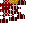 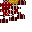 |  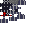 |   |

### 20.3 Memory Items

| Item | Purpose |
|------|---------|
|  Hematic Memory | Base blank memory item, crafted from Sanguine Formation, Blood Stained Stone, and Neurotic Enzyme |
|  Lethean Dew | Memory processing ingredient |
|  Lethean Brew | Cursed clay jar from the River Lethe — enables forgetting memories |
|  Fervent Husk | Memory processing ingredient |
|  Blood Stained Stone | Memory-related item |
| Blood Memory (per manipulation) | One for each registered manipulation — using it teaches the player |
| Crude Memory Shards | Early starter memories that teach and auto-equip weak manipulations without needing the Mnemonic Reliquary; current set covers `blood_shot`, `blood_rush`, `deadly_gaze`, `sanguine_mending`, `hemorrhage`, `glacial_grasp`, `sanguine_ignition`, and `void_shroud` |
| Living Weapon Grafts | Dynamic `living_weapon_graft` stacks carry a form component; the Iron Brazier + Living Staff Blood Absorption rite consumes the graft and teaches the matching Living Staff weapon-form manipulation |
| Legacy Living Weapon Memories | `memory_living_blade`, `memory_living_axe`, `memory_living_spear`, `memory_living_claws`, `memory_living_crossbow`, `memory_living_torch`, and `memory_living_flail` keep their IDs and use behavior for old saves/inventories, but their normal survival recipes are removed |
| **Canon Memory: Crimson Tithe** | Saint manipulation memory (Hemorath) — obtained through the Somatic Loom ritual with Hallowed Residuum of Hemorath, paired stored enzymes, and projected blood |
| **Canon Memory: Unclosing Eye** | Saint manipulation memory (Seraphae) — obtained through the Somatic Loom ritual with Hallowed Residuum of Seraphae, paired stored enzymes, and projected blood |
| **Canon Memory: Bloom of Rot** | Saint manipulation memory (Putriciel) — obtained through the Somatic Loom ritual with Hallowed Residuum of Putriciel, paired stored enzymes, and projected blood |
| **Canon Memory: Endless Hour** | Saint manipulation memory (Velorum) — obtained through the Somatic Loom ritual with Hallowed Residuum of Velorum, paired stored enzymes, and projected blood |

Living weapon graft recipes keep the same catalyst identities but wrap them in a crafted ritual offering instead of a direct memory item. The recipe is unlocked by a capped form-aligned behavior signal, then crafted directly as a componentized `living_weapon_graft` stack. The graft is placed in an Iron Brazier and absorbed with a Living Staff using Blood Absorption; success consumes the graft and teaches the normal manipulation.

| Graft form | Teaches | Catalyst | Enzyme/material pair | Rite |
|------------|---------|----------|----------------------|------|
| Blade Graft | `conjure_blade` | `hematic_iron_powder` | `vivacious_enzyme` + `hematic_memory` + `sanguine_formation` | Rite of the Assumed Limb |
| Axe Graft | `conjure_axe` | `chalybeate_sclerite` | `ruinous_enzyme` + `hematic_memory` + `sanguine_formation` | Rite of the Assumed Limb |
| Spear Graft | `conjure_spear` | `calcified_blood_spine` | `incandescent_enzyme` + `hematic_memory` + `sanguine_formation` | Rite of the Assumed Limb |
| Claw Graft | `conjure_claws` | `chitinous_husk` | `umbral_enzyme` + `hematic_memory` + `sanguine_formation` | Rite of the Assumed Limb |
| Crossbow Graft | `conjure_crossbow` | `puppeteering_thread` | `neurotic_enzyme` + `hematic_memory` + `sanguine_formation` | Rite of the Assumed Limb |
| Torch Graft | `conjure_torch` | `fervent_spores` | `fervent_enzyme` + `hematic_memory` + `sanguine_formation` | Rite of the Assumed Limb |
| Flail Graft | `conjure_flail` | `frigid_spores` | `frigid_enzyme` + `hematic_memory` + `sanguine_formation` | Rite of the Assumed Limb |

Focused combat memory weaving additions for Lux and Tenebris:

| Memory | Teaches | Catalyst Pattern | Enzyme Requirements | Ritual Blood |
|--------|---------|------------------|---------------------|--------------|
| `memory_hematic_flare` | `hematic_flare` | `glow_ink_sac` | `lux: 1`, `flammeus: 1` | 100 |
| `memory_gloam_laceration` | `gloam_laceration` | `phantom_membrane` | `tenebris: 1`, `mortem: 1` | 100 |

**Memory Textures Gallery:**

> **Note:** Memory items use a 2-layer model system — the base `hematic_memory.png` is overlaid with a unique per-manipulation overlay from `textures/item/memories/memory_*_overlay.png`.

| | | | |
|---|---|---|---|
|  Blood Shot |  Deadly Gaze |  Blood Needle |  Blood Rush |
|  Blood Cloud |  Blood Aneurysm |  Activation Potential |  Sanguine Ward |
|  Venous Travel |  Sanguine Alloy *(item id: memory_ferric_transmutation)* |  Living Blade |  Blood Absorption |
|  Living Axe |  Living Spear |  Living Claws |  Living Crossbow |
|  Living Torch |  Living Flail |  Hematic Flare |  Gloam Laceration |
|  Blood Projection |  Summon Avatar |  Crimson Flame Conjuration |  Blood Lamp |
|  Crimson Sight |  Crimson Harvest |  Hemosynthesis |  Pyretic Forge |
|  Vital Effusion |  Hemolymphal Pulse |  Vascular Dowsing |  Ferric Resonance |
|  Glacial Grasp |  Sanguine Mending |  Vital Reservoir |  Sanguine Excavation |
|  Umbral Step |  Summon Thrall |  Cryogenic Pulse |  Glacial Bastion |
|  Sanguine Ignition |  Vitric Combustion |  Void Shroud |  Blood Eclipse |
|  Hemorrhage |  Exsanguinate |  Glacial Circulation |  Osseous Bloom |

**Saint Canon Memory Overlays (placeholder art — unique textures pending):**

| | | | |
|---|---|---|---|
|  Crimson Tithe |  Unclosing Eye |  Bloom of Rot |  Endless Hour |

> **Memory Overlay System:** Memory items use a layered model system: the base Hematic Memory texture is composited with per-memory overlays from `textures/item/memories/memory_*_overlay.png`. Active memories, including Glacial Circulation and Osseous Bloom, have item JSONs and overlay PNGs wired through this system.

### 20.4 Diagnostic Items

| Item | Purpose |
|------|---------|
|  Blood Tendency Gauge | Inspect current blood tendency alignment |
|  Vascular Status Gauge | Inspect vein section health |
|  Bloodline Pool Monitor | View bloodline shared pool status |
|  Self Reflection Mirror | Scar-related inspection |

### 20.5 Miscellaneous

| Item | Purpose |
|------|---------|
|  Charm of Vascularium | Enables blood manipulations; retained through player death and removable only from a validated Scarlet Vanity equipment menu; its player render layer displays the item stack when equipped |
| **Mycophant Tendril** | Mycophant boss drop and Charm of Vascularium slot variant. Extends `VasculariumCharmItem`, opens the usual manipulation radial because it is still charm-compatible, and triggers `MycophantTendrilFungalizationLayer` for the full-body fungalized appearance. |
|  Liber Sanguinum | Guide book |
| **Field Notes** | Stack-local memo notebook. Captures fleeting dialogue/memo events into `DataComponents.CUSTOM_DATA` (`Memos`, `RemainingMemos`, `InkPath`). Fresh notes have no prepared pages until filled with field ink. Hematic Field Ink binds the notes to Harbinger memos and Liber Sanguinum dictation; Pale Field Ink binds them to Unstained memos and Liber Immaculatus dictation. Each refill prepares 15 memo captures. Field Notes do not become their own Liber chapter; dictation unlocks normal book pages in the player's `LiberKnowledge` attachment. |
| **Hematic Field Ink** | Harbinger Field Notes refill item crafted from Bleeding Bulb, Hematic Iron Powder, a water bottle, and an ink sac. |
| **Pale Field Ink** | Unstained Field Notes refill item crafted from Tears of Silthmere, Pale Distillate, a water bottle, and an ink sac. |
|  Unsigned Ancestral Ledger | Creates/joins bloodlines |
| **Hematic Suture Needle** | Direct blood routing tool. Degree 3+ binds blood-capable machines or Hematic Suture Nodes to the player; sneak-use on a bound link cycles nearby/fane/bloodline modes, and sneak-use in air toggles the player's bloodline routing opt-in. |
|  Engram Stamp | Engram-related tool. Right-click on a solid surface (face-sturdy from above, empty block above) to place an engram block; right-click on an existing engram block to cycle its character. Consumes 1 durability per use. |
| **Scratch-Engraving (no stamp)** | Emergency / early-game method. Hold a sharp shard — `hemomancy:vivianite_cluster`, `minecraft:flint`, `minecraft:quartz`, or `hutoslib:obsidian_flakes` — in the main hand and right-click any solid surface (face-sturdy from above, empty block above). Places a random-character engram block at the cost of **1 heart (2 HP)** of generic damage. Creative players receive the engram without taking damage. Handled by `ScratchEngramHandler` (`@EventBusSubscriber` on `PlayerInteractEvent.RightClickBlock`). |
|  Vivianite Scalpel | Vivianite-based tool |
|  Fungal Spine | Fungal tool item (unstackable, Uncommon) |
| **Qliphoth Seed** | Dropped by the Sanguine Monolith when shattered by a Degree-7 Archon (two interactions). Custom item/entity path through `QliphothSeedItem`, `EntityQliphothSeedItem`, `QliphothSeedItemRenderer`, and `QliphothSeedItemEntityRenderer`: inventory/hand renders use a small horizontally elongated 3D ovoid, while dropped stacks pulse black-red radial HutosLib tendrils. Used as a placed catalyst inside the **Bloom of the Qliphoth** rite. One-time per monolith. Tooltip: "Plant within the Bloom of the Qliphoth rite; when dropped, it reaches for soil." |
| **Monolith Fragment** | Stackable late-game shard dropped in groups of 5-8 when a Degree-7 Archon shatters the Sanguine Monolith. Custom item renderer uses the `hemomancy:item/monolith_fragment` shader for morphing black low-poly facets with pulsing red fracture light. Carried fragments burden Degree 8+ players with periodic Darkness, preserving the shard as a rejection-tier/Archon-adjacent catalyst space rather than an Apotheos reward. |
| **Qliphoth Pome** | Edible fruit dropped by the Qliphoth Bloom tree over time (9 total per bloom lifecycle). Each pome tagged with `hemomancy:bloom_origin` + `hemomancy:husk_index` (0–8). On consumption, emits a player-centered black pulse via `SpawnPomePulsePacket`, grants +300 blood, Regeneration II (12 s), Darkness (7 s), and 25% manip cost reduction (3 min). Consuming all nine from one bloom sets `hemomancy:qliphoth_communion = true` and fires the Communion whisper. See §5.9. |
|  Sanguine Salve | Heals 25 blood on use |
|  Cleansing Hemolymph | Blue vial from Hemolymphopoda mobs |
|  Structure Spawner | Debug/creative item for spawning structures. Blood Structure recipes spawn with one nearby Iron Brazier per required offering item; each brazier is preloaded and lit. |
|  Recycled Enzyme | Generic enzyme fallback |
|  Debug Showcase | Creative-mode debug item (`DebugShowcaseItem`) — right-click to spawn a complete showcase area containing every Hemomancy feature organized into 4 sections: (1) All items in labeled chests, (2) All blocks placed on platforms, (3) All mob entities in fenced pens, (4) All blood structures and cardinal rites as placed patterns. Blood Structure recipes also receive one nearby, loaded, lit Iron Brazier per required offering item. |

### 20.6 Unstained Materials (Our Lady of Still Waters)

| Item | Purpose |
|------|---------|
| Tears of Silthmere | Distilled from Lethean Dew — used at the Altar of Cleansing for a one-time purity boost (+25) |
|  Lethean Poppy Wreath | Woven from Lethean Poppies — repeatable altar offering (+5 purity) and wall-mounted Unstained decoration |
|  Silver Chalice | A ritual vessel of the Unstained — offered at the Altar of Cleansing for clarity (+5) |
| Pale Silver Bell | Handheld Unstained support equipment. Use grants short Silver Ward and weakens/slows nearby hostiles. |
| Lethean Chalice | Reusable still-water vessel. Use clears one harmful effect, extinguishes fire, grants brief regeneration, and adds Verdigris Aura after Clarity. |
| Verdigris Censer | Reusable oxidized-copper support tool. Use grants Verdigris Aura and marks nearby monsters or blood-active bodies with Glowing + Weakness. |
| Pale Humor Flask | Bottled White Humor from the Pallid Retort. Drink to replenish an active Unstained white humor reservoir, use with an Unstained weapon in the off hand to coat it with hemolytic charge, or pour into the world to create a finite White Humor source pool for purification recipes. |
| Tome of the Unstained | A book of Unstained scripture describing Our Lady of Still Waters and the path of purification |
| Icon of Our Lady | A rare relic depicting Our Lady of Still Waters — carved from pale silver, grants her protection |
|  Pale Silver Ingot | A refined metal sacred to the Unstained, used in crafting Unstained equipment |
| The Pale Distillate | Concentrated essence from Lethean Poppies, a crafting ingredient for Unstained recipes |
|  Virid Salis | Verdigris-colored salt-ash used as the Unstained counterpart to ritual ash trails. **Harvested** by right-clicking any unwaxed oxidized/weathered/exposed copper block (plain, cut, stairs, or slab) with a vanilla brush — strips one oxidation step, drops 1 Virid Salis, costs 1 brush durability. Handled by `CopperBrushingHandler`. **Living source:** Verdigris Moths (`hemomancy:verdigris_moth`) spawn at night in forests and cold biomes; they rarely shed Virid Salis while flying and can be gently brushed on a long cooldown for 1 Virid Salis. Their death loot table is empty, so killing them is intentionally a poor source. **Warding effect**: when placed as a trail (`hemomancy:virid_salis_trail`), any `Monster` mob that walks across it takes 1 magic damage per second (`ViridSalisTrailHandler`). Blood constructs and blood-type mobs (`IBloodConstruct`, `HematicConstructEntity`, `CruorFiendEntity`, `FrozenClotEntity`, `BloodDrunkPuppeteerEntity`, `ThirsterEntity`, `AbyssalSiphonEntity`, `LeechEntity`, `VenousStriderEntity`) take 2 magic damage per second and receive Slowness II for 3 seconds. **Player effect**: Harbinger players at Initiatory Degree 5 (Perfected) or higher take 1 magic damage per second and receive Slowness I for 3 seconds when crossing the trail. |

### 20.7 Food Items

| Item | Purpose |
|------|---------|
|  Gourd Slice | Edible gourd food item |
|  Gourd Stew | Stew crafted from gourd and other ingredients |
| Roasted Gourd Seeds | Smelted/smoked/campfire-cooked gourd seeds (3 cooking methods) |

### 20.8 Organ Echo Items

Produced by the **Visceral Mirror** ritual (requires Degree 3+). Spectral imprints of the player's organs — bound to the player (dissolve if placed in non-player inventory), only one per organ type can exist at a time. Organ "Tier" indicates risk level and degree requirement for extraction:

| Item | Organ | Tier | Notes |
|------|-------|------|-------|
| Echo of Spleen | `SPLEEN` | 3 | Governs blood volume and filtration |
| Echo of Liver | `LIVER` | 3 | Metabolizes toxins and purifies the blood |
| Echo of Lungs | `LUNGS` | 3 | Oxygenates blood and sustains vital rhythm |
| Echo of Kidneys | `KIDNEYS` | 3 | Filters impurities and maintains humoral balance |
| Echo of Heart | `HEART` | 4 | The seat of circulation and will — highest risk, requires Degree 4+ |

> **Status: Implemented.** Organ extraction ritual (Visceral Mirror -> cycle organs -> confirm -> produce Echo items) and all per-organ gameplay effects are fully implemented in `VisceralOrgansEvents` (player tick + capability check): **Spleen** contributes +1000 max blood per organ level through `MaxBloodLedger`, stacking with Capacity, Eternal Covenant, and scar penalties; **Liver** removes Poison (level 2+) and Wither (level 3+) on tick; **Lungs** grants Water Breathing (100xlevel ticks) while underwater; **Kidneys** grants Regeneration at (level-1) amplifier normally, **level amplifier** during a Blood Moon (overclocked filtration); **Heart** grants Damage Resistance (capped at Resistance II), **Wither immunity at level 3** (Cardiac Autonomy mastered), and drains 10/level blood per 2 s tick. **Iron Brazier reagent system is organ-specific:** each organ requires its own reagent type -- Heart=`blood_crystal_shard`, Spleen=`vivianite_cluster`, Lungs=`fervent_husk`, Kidneys=`consecrated_copper_ingot`, Liver=`bleeding_bulb`. The three reagents must all be the same type; the brazier records the locked organ and validates the echo matches before consuming it. See Section 20.8 and `IronBrazierBlockEntity`.

> **Current WIP gate:** the Iron Brazier organ-reagent/echo upgrade route is disabled. Iron Braziers now use their block entity slot for a single Blood Structure offering item instead.

> **Max-blood note:** Spleen no longer writes player max blood independently from the organ tick. It contributes +1000 max blood per organ level to `MaxBloodLedger`, which stacks it additively with Capacity and Eternal Covenant before subtracting scar penalties.

### 20.9 Banner Patterns

-  **Heart Pattern** — Vascularium Crest
-  **Veins Pattern** — Vein Border

---

## 21. Tools & Weapons

### 21.1 Tool Tiers

| Tier | Enum |
|------|------|
| Hematic Iron | `HEMATIC_IRON` |
| Living | `LIVING` |

### 21.2 Living Tools (Blood-powered)

All are single-stack, use the `LIVING` tool tier. The Living Staff is the preferred long-term interface for living weapons and blood utility, while the bare Blood Absorption / Blood Projection items remain fallback conjured hand tools.

| Weapon | Class | Notes |
|--------|-------|-------|
| Living Blade | `LivingBladeItem` | Blood-feeding sword (25 base dmg, +3 speed) |
| Living Axe | `LivingAxeItem` | Blood-feeding axe |
| Living Spear | `LivingSpearItem` | Blood-feeding polearm |
| Living Baghnakh | `LivingBaghnakhItem` | Blood-feeding Tenebris claw weapon; holding attack repeats strikes only when the attack cooldown is ready, and successful hits emit the randomized three-ribbon claw slash |
| Living Torch | `LivingTorchItem` | Flammeus staff weapon form; ignites struck targets |
| Living Flail | `LivingFlailItem` | Congeatio staff weapon form; slows struck targets and uses a physics-rendered chain/head model |
| Living Staff | `LivingStaffItem` | Channels morphlings, blood magic, and living weapon forms. First blood-structure craft unlocks the player Living Staff bond and `conjure_staff`; absorption/projection power now reads from Living Conduit, Vascular Draw, Crimson Projection, and the Blood Absorption channel/cadence skills, while Weapons Master reduces weapon-form hot-swap cost. |
| Memory of Vesper | `MemoryOfVesperItem` | Vesper Evening Star drop. Place it directly in an Iron Brazier and complete the Living Staff Blood Absorption rite to permanently awaken Vesper's memory in player staff progress instead of crafting a separate or stack-bound weapon. Right-clicking the memory itself now only guides the player to that rite. |
| Living Syringe | `LivingSyringeItem` | Extracts blood vials from mobs into a loaded Vial Rack (Shift to eject rack) |
| Living Crossbow | `LivingCrossbowItem` | Fires Blood Bolts |
| Sanguis Lancea | `SanguisLanceaItem` | Throwable blood lance (25 base dmg) |
| Annetta's Sanguis Lancea | `AnnettasSanguisLanceaItem` | Epic Harbinger-route Annetta drop. Held/item rendering uses `AnnettasSanguisLanceaItemRenderer`, `AnnettasSanguisLanceaModel`, `model_annettas_sanguis_lancea.png`, and a crimson glint overlay; the thrown form still uses the shared `SanguisLanceaEntity`/renderer path. |
|  Blood Absorption | `BloodAbsorptionItem` | Conjured blood-absorbing tool; checks `BlockBloodEndpoint` targets before living-entity absorption, and fades faltering Broken Wills without ordinary mob drain |
|  Blood Projection | `BloodProjectionItem` | Conjured blood projection tool; can banish looked-at faltering Broken Wills before checking `BlockBloodEndpoint` targets and legacy structure/tile transfer |

#### 21.2.1 Living Staff Weapon Forms

The Living Staff can inherit living weapons as temporary forms rather than creating separate inventory items. `LivingStaffWeaponFormHelper` stores the original staff stack under `HemomancyStoredLivingStaff` and marks the active form with `HemomancyStaffWeaponForm`. The transformed item is still a normal living weapon item for combat behavior, but it remains logically tied to the staff.

| Form Manipulation | Active Item | Notes |
|-------------------|-------------|-------|
| `conjure_blade` | `living_blade` | Animus living blade form; retains living tool blood-failure recoil |
| `conjure_axe` | `living_axe` | Mortem living axe form |
| `conjure_spear` | `living_spear` | Lux living spear form |
| `conjure_claws` | `living_baghnakh` | Tenebris living claw form; hold attack for cooldown-paced auto-strikes, and struck enemies flash with the claw slash ribbon effect |
| `conjure_crossbow` | `living_crossbow` | Ductilis living crossbow form; Blood Bolt firing can recoil to staff if blood runs out |
| `conjure_torch` | `living_torch` | Flammeus living torch form; ignites struck targets |
| `conjure_flail` | `living_flail` | Congeatio living flail form; slows struck targets and renders with a damped physics chain patterned after the Sporitic Thurible |

Selecting a staff weapon form through manipulation cycling/radial selection applies that form if the Living Staff is held. Selecting a non-staff-weapon manipulation restores a transformed weapon back into the stored staff. Pressing the use-manipulation key while the selected staff weapon form matches the held transformed item toggles back to staff; pressing it again reshapes back into the selected weapon.

Hot-swap cost is handled by `LivingStaffWeaponFormRules`: 250mL base, reduced by 50mL per `Weapons Master` level, minimum 50mL at level 4. Reverting a transformed weapon back to staff is not a new hot-swap and does not charge the form cost.

#### 21.2.2 Living Arsenal Guardrails

`LivingArsenalInventoryGuard` keeps the living arsenal from becoming clutter or duplication fuel. This Living arsenal guard is deliberately server-backed:

- Only one living arsenal item may remain in the player's inventory at a time: `living_staff`, `living_blade`, `living_axe`, `living_spear`, `living_baghnakh`, `living_crossbow`, `living_torch`, or `living_flail`.
- Living staff/weapon items cannot fit inside container items, and server container hooks pull them back out of non-player inventories.
- If `conjure_staff` is cast with an empty hand and a staff or transformed staff is already somewhere in the player's inventory, the guard recovers it into the main hand and removes duplicates.
- Transformed weapons stored outside the selected hotbar slot are normalized back into a Living Staff during inventory sanitation.

#### 21.2.3 Staff Blood Utility Rates

Bare Blood Absorption now acts as the fallback hand tool against one target within 5 blocks. When aimed at a block implementing `BlockBloodEndpoint`, it asks that block to provide blood before falling back to blood reservoir extraction, faltering Broken Will absorption, and then living-entity targeting; the Consecrated Bloodwell uses this to draw directly from the bound bloodline pool. Living-entity absorption is pulsed instead of every tick: the base cadence is every 10 ticks, improving through Quickened Draw, Hungry Pulse, and Arterial Cadence to every 4 ticks. Living Staff absorption uses the selected `blood_absorption` manipulation while holding the staff, starts at 4mL per target per pulse, and has a base target cap of 2 and base range of 6 blocks. It checks the same block endpoint / blood reservoir path before faltering Broken Wills and nearby living targets, and outperforms bare absorption once multiple targets are available.

While actively channeling Blood Absorption, the player is rooted in place by default. Dragging Siphon unlocks slow movement, Mobile Conduit reduces the slowdown, and Unbound Siphon removes the movement penalty. Drawing from blocks, reservoirs, bloodwells, and faltering Wills does not build strain. Draining living mobs builds Blood Absorption strain on the player: sustained overuse escalates through Weakness, Nausea, and a short Wither effect representing blood poisoning. Blood Tolerance delays those strain thresholds, and strain decays when the channel is held without successfully draining a living target. Blood Absorption target selection and absorbed-cell particles ignore players, bloodless entities, Wills, armor stands, and Hemomancy NPCs.

Staff focus scaling is centralized in `LivingStaffFocusRules`:

| Source | Staff Effect |
|--------|--------------|
| Living Conduit | +1 target cap and +1.5 block absorption range per level |
| Vascular Draw | +0.75 absorption per target and +75 tile transfer per level |
| Crimson Projection | +3 structure feed and +75 blood reservoir transfer per level |
| Hematic Focus | +1 target cap, +0.75 range, +0.25 absorption, +1.5 structure feed, +35 tile transfer per level |
| Vesper memory awakened | +1 target cap, +1.5 range, +0.5 absorption, +3 structure feed, +75 tile transfer |
| Vesper's Refusal | Only while Vesper memory is awakened: +1 target cap, +0.75 range, +0.25 absorption, +2 structure feed, +50 tile transfer per level |

Blood Projection is now server-authoritative through `BloodProjectionItem.projectFromEntity`. Projection first checks for a looked-at faltering Broken Will to banish, then checks `BlockBloodEndpoint` on the looked-at block before falling back to blood-structure feeding, Somatic Loom ritual charging, and `IBloodReservoir` transfer. The Consecrated Bloodwell endpoint contributes directly to the bound bloodline pool instead of filling a local reservoir buffer. Reservoir transfer uses `BloodVolumeTransferRules` so larger staff transfer chunks clamp to available source blood and target capacity before draining.

> *Note: Living tools (blade, axe, spear, staff, syringe, crossbow, lancea, baghnakh) use 3D entity models rather than flat item textures — see `src/main/resources/assets/hemomancy/textures/entity/` for their model textures:*
>
>   

### 21.3 Hematic Iron Weapons

| Weapon | Notes |
|--------|-------|
|  Hematic Iron Sword | Standard sword tier |
|  Hematic Iron Knapper | Specialized knapping tool (42 dmg) |

### 21.4 Other Weapons

| Weapon | Notes |
|--------|-------|
| Barbed Blade | Sword-class, Living tier, +3 speed, +25 dmg |
| Chitinite Mace | Sword-class, Living tier |
|  Blood Bolt | Ammo for Living Crossbow |
|  Blood Thrall Effigy | Summons a Blood Thrall creature (stackable to 16) |

### 21.5 Harbinger Support Tools

| Tool | Class | Notes |
|------|-------|-------|
| **Hearty Compass** (`hearty_compass`) | `HeartyCompassItem` | Degree 2 Harbinger memory tool. Player death writes a copy-on-death last-death attachment storing dimension, packed block position, and time. Its custom item renderer rotates the compass needle toward the remembered same-dimension death point, and while held it pulses a short HutosLib red tendril from the player's hand in that direction; use reports the remembered coordinates and dimension. |
| **Memory Thread** (`memory_thread`) | `MemoryThreadItem` | Degree 2 route recorder. Use toggles recording, sneak-use clears the stack memory, and selected active stacks record up to 96 route points in `DataComponents.CUSTOM_DATA`. Rendering is an ephemeral red world-space thread through recent route points plus a held lead line; no permanent blocks are placed. |
| **Void Eye Organ** (`void_eye_organ`) | `VoidEyeOrganItem` | Degree 3 single-use blood-cost utility crafted from Umbral Spores, Sanguine Formation, and Eye of Ender. Use opens the player's Ender Chest with a 35 blood cost, then consumes the organ for non-creative players. |
| **Witness Organ** (`witness_organ`) | `WitnessOrganBlock` / `WitnessOrganBlockEntity` | Degree 3 placed note-memory organ. Nearby note blocks within 8 blocks record into the organ as players play them, capped at 16 notes. Right-click plays the stored sequence once from the organ; sneak-right-click clears the sequence. V1 intentionally narrows "sound blocks" to note blocks. |
| **Vein Spider** (`vein_spider`) | `VeinSpiderItem` | Degree 4 biological logistics item. One stack owns one same-dimension inventory link, selected by right-clicking two NeoForge item-handler blocks within 256 blocks. Server ticks transfer one item every second only while both endpoints are loaded and the carrying player has active blood to pay the per-transfer cost. Transfers probe all block sides before the null-side fallback so sided inventories work, and successful moves send a short client-only red ghost spider courier carrying the moved item between endpoints. |
| **Husk Effigies** (`zombie_husk_effigy`, `desert_husk_effigy`, `spider_husk_effigy`) | `HuskEffigyItem` | Degree 3 proto-puppet consumables. Each item rehydrates into a short-lived allied zombie, husk, or spider distraction with persistent owner/expiry tags. Effigies reject their owner as a target, prevent owner damage as a backstop, and render with a red control-glow overlay. The v1 system is deliberately fixed to these three shells rather than a capture-any-mob pipeline. |
| **Sporitic Thurible** (`sporitic_thurible`) | `SporiticThuribleItem` | Degree 4 offhand Harbinger thurible. Right-clicking with the thurible in the offhand and a valid aligned spore in the main hand lights it if the player has active blood magic and Initiatory Degree >= 4. Lighting consumes one spore, stores lit/spore/burn state in custom data, and grants 6,000 ticks of burn time. Right-click while lit extinguishes it. While lit it drains `4 + 12 * swingIntensity` blood per second, emits spore-colored particles, and every 40 ticks applies a `2.5 + 2.5 * swingIntensity` aura. Nearby active Harbingers receive Sporitic Resonance keyed to the burned spore tendency; nearby `Monster` targets receive brief Blood Loss, Wither, and the spore secondary effect. The vanilla item bar is used as a catalyst burn meter, is tinted by the active spore, and computes remaining time from `BurnEndGameTime` rather than per-tick NBT rewrites. The custom held renderer also draws the active catalyst as a small full-bright spore item inside the bobbing thurible head. |

Rendering is intentionally not sprite-only. First person uses `SporiticThuribleItemRenderer`; third person hides the vanilla held item through `MixinPlayerItemInHandLayer` and renders `SporiticThuribleLayer` from the offhand. `SporiticThuribleRenderHelper` simulates a damped client-side bob and renders articulated chain links along a curved tangent path. Gameplay intensity remains server-derived from movement/yaw/swing data; client physics is visual only.

---

## 22. Armor Sets

Harbinger armor progression is centered on the **Hematic Armature** (`hematic_armature`) and the data-driven `hemomancy:armature_upgrade` recipe type. The Armature has no player-facing GUI: right-click with a reagent inserts one item into the next empty bowl, crouch/right-click withdraws the most recently filled bowl first, and blood containers fill the overhead 8,000-blood reservoir. Walking onto the block mounts the player to a hidden `ArmatureRestraintEntity`; while mounted, the Armature scans the player's worn armor in helmet, chest, legs, boots order and upgrades any piece that can consume any inserted bowl reagent. Bowl stacks are capped at 1 item, crafting takes 100 ticks per item, partial completion is allowed, and successful upgrades emit burning bowl particles plus a crimson player burst.

The Hematic Artificer / Redwright is the in-world teacher for this progression. He explains the worn-armor ritual steps, the D3 fork identities, the Vicar's Consecration Kit, and the Monolithic Cornerstone, but the `HematicArmatureBlockEntity` and data recipes remain the mechanical authority.

| Degree | Base worn armor | Armature reagent | Blood per piece | Result |
|--------|-----------------|------------------|-----------------|--------|
| D2 | Vanilla iron armor | Hematic Iron Scrap | 250 | Hematic Iron |
| D3 | Hematic Iron | Aculeate Vitriol | 500 | Barbed |
| D3 | Hematic Iron | Sclerotic Oleum | 500 | Chitinite |
| D3 | Hematic Iron | Chromatic Sublimate | 500 | Prismatic |
| D5 | Barbed, Chitinite, or Prismatic | Crimson Lacquer | 1,200 | Blood Lust, with cosmetic lineage stack data (`barbed`, `chitinite`, or `prismatic`) |
| D5-D6 | Blood Lust helmet | Tengu Mask / Grinning Mask / Lodestone Faceplate / Velorum Mask | 350-500 | Blood Lust mask variants |
| D7 Monolithic Armature | Barbed | Tengu Mask / Fargone Proboscis | 1,800 | Edacious Bloodlust |
| D7 Monolithic Armature | Chitinite | Lodestone Faceplate / Fervent Husk | 1,800 | Sheolic Bloodlust |
| D7 Monolithic Armature | Prismatic | Grinning Mask / Mnemonic Ambergris | 1,800 | Phantasmal Bloodlust |
| D7 Silent Archon | Blood Lust | Monolith Imbued Cloth | 2,000 | Silent Archon Vestments; gated by `hemomancy:archon_choice_made = "silent"` |

Direct shaped recipes for Hematic Iron, Barbed, Chitinite, and Prismatic armor are intentionally removed; weapons, shields, and reagent components remain regular crafting where present.

### 22.1 Hematic Iron Armor

Standard blood-infused iron armor set (fire resistant):
-  Helm,  Chestplate,  Leggings,  Boots
- **Stats:** Defense 3/6/8/3 (20 total), Toughness 3.0, KB Resist 0.1, Durability ×37, Enchantability 15
- **Repair:** Hematic Iron Scrap
- **Set Bonus (4 pieces):** Passive blood regeneration — +2 blood/second while wearing full set

> Armor model: 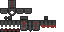 

### 22.2 Blood Lust Armor

Crimson Lodge combat vestment upgraded from either D3 armor fork:
-  Helm (no mask),  Helm (Tengu mask),  Helm (Grinning mask),  Helm (Lodestone faceplate),  Helm (Velorum mask)
-  Chestplate,  Leggings,  Boots
- Mask items:  Tengu Mask,  Grinning Mask,  Lodestone Faceplate,  Velorum Mask. These are Armature helmet upgrades, not separate set identities.
- **Lineage:** Blood Lust pieces store `hemomancy:lineage = "barbed"`, `"chitinite"`, or `"prismatic"` when upgraded. Current lineage is aesthetic/model data only; stats and set bonus are identical.
- **Mask modifiers:** Tengu grants brief Speed after direct melee hits; Grinning applies Blood Loss to the target; Lodestone trickles small blood recovery while active; Velorum grants brief Absorption.
- **Final lineage ascensions:** A Hematic Armature with the Monolithic Cornerstone installed can upgrade Barbed armor into Edacious Bloodlust, Chitinite armor into Sheolic Bloodlust, and Prismatic armor into Phantasmal Bloodlust. The Cornerstone is a permanent Armature upgrade, not a consumed recipe reagent.
- **Armor-born active abilities:** Full final Bloodlust sets register armor set abilities that appear as a third inner wedge in the manipulation radial menu beside Blood Absorption and Blood Projection. The wedge is hidden unless the complete four-piece set is worn, displays the set helmet as its icon, shows an ability-specific tooltip instead of the helmet item tooltip, tints red with a live tooltip countdown while recharging, and sends only the ability id to the server. Server activation rechecks the full set, cooldown, blood cost, and ability-specific validation before applying any effect.
- **Edacious Bloodburst:** Full Edacious Bloodlust grants slow creative-style hematic flight and unlocks `hemomancy:edacious_bloodburst`, a blood-cost radial burst that fires barbed blood needles outward and applies Blood Loss, Hunger, and Wither.
- **Sheolic Bastion Stance:** Full Sheolic Bloodlust grants fall, fire, and lava damage immunity with persistent Fire Resistance. Attackers suffer Crimson Retribution through magic fire-themed damage, crimson spore particles, and Crimson Flames placement when possible. Its radial ability `hemomancy:sheolic_bastion_stance` roots the player, suppresses movement/flying, and negates incoming damage for a short duration; selecting it again cancels the stance.
- **Phantasmal Step:** Full Phantasmal Bloodlust enhances the existing Umbral Step manipulation instead of granting a duplicate teleport. If the player already knows and uses Umbral Step, the complete set lets Umbral Step ignore the darkness and manipulation-cooldown checks while preserving its normal line-of-sight targeting, range, and blood cost. When struck, the set can blind and outline the attacker, then displace them roughly eight blocks away if a safe landing position exists.
- **Masquerade of the Forgotten:** Full Phantasmal Bloodlust unlocks `hemomancy:masquerade_of_the_forgotten` in the armor radial wedge with the Phantasmal Bloodlust Helmet icon. Activation is server-authoritative, costs 250 blood, has a 60-second cooldown, and spawns eight `phantasmal_echo` decoys for 10 seconds. Echoes mix aggressive, fleeing, circling, and mirroring behavior, deal low `hemomancy:phantasmal_echo` magic damage, and vanish when struck in a smoke burst that blinds, nauseates, slows, and briefly forces hostile mobs to reconsider their target. Natural expiration dissolves quietly without the full blinding burst.
- **Stats:** Defense 3/6/8/3 (20 total), Toughness 3.0, KB Resist 0.1, Durability ×37, Enchantability 15
- **Repair:** Hematic Iron Scrap
- **Set Bonus (4 pieces):** Lifesteal — 10% of direct melee damage dealt heals the player. Masks add minor modifiers only.

> Armor model: 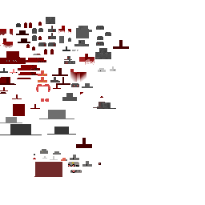 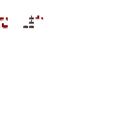
>
> Runtime rendering uses `BloodLustArmorModel` for standard Blood Lust piecewise 3D armor renders. Edacious, Sheolic, and Phantasmal Bloodlust now have independent cloned armor model classes and texture atlases seeded from Barbed, Chitinite, and Prismatic respectively, so future model/texture passes can edit the final lineages directly. Mask variants still route through the custom armor model layer and item textures above. Inventory, hand, frame, and dropped item stacks route through `ModelBackedArmorItemRenderer` instead of flat generated sprites.

### 22.3 Barbed Armor

Retaliatory coastal-venom armor blending Barbed Urchin spines, Venom Rib Centipede poison, and Desiccant scorpion stings:
-  Helm,  Chestplate,  Leggings,  Boots
- Barbed Shield 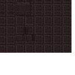
- **Stats:** Defense 3/6/8/3 (20 total), Toughness 3.0, KB Resist 0.1, Durability ×37, Enchantability 15
- **Preparation:** Aculeate Vitriol, brewed from Toxicognath, Telson, and Calcified Blood Spine.
- **Repair:** Calcified Blood Spine
- **Set Bonus (4 pieces):** Thorns — attackers take 2 damage and receive Blood Loss effect (3 seconds)

> Armor model:  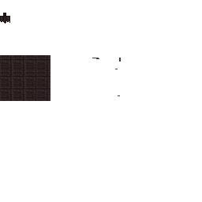
>
> Item stacks use the same model-backed 3D renderer as the worn armor.

### 22.4 Chitinite Armor

Ferric bastion armor blending Chitinite plating, Chthonian termite mandibles, and Chalybeate Snail living-mineral sclerites:
-  Helm,  Chestplate,  Leggings,  Boots
- Chitinite Shield 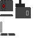
- Chitinite Arm Banner (dyeable, 16 colors)
- **Stats:** Defense 3/6/8/3 (20 total), Toughness 3.0, KB Resist 0.1, Durability ×37, Enchantability 15
- **Preparation:** Sclerotic Oleum, tempered from Chitinous Husk, Chalybeate Sclerite, and Queen's Physogastrism.
- **Repair:** Chitinous Husk
- **Set Bonus (4 pieces):** +2.0 Armor Toughness (via attribute modifier) and 25% projectile damage reduction

> Armor model: 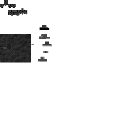 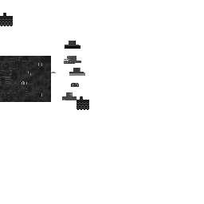
>
> Item stacks use the same model-backed 3D renderer as the worn armor.

### 22.5 Prismatic Armor

Flash-evasion armor blending Scarlet Serpent hood scales, Blood Drunk Puppeteer red-gold spectacle, and Prism Cuttle chromatophores:
-  Helm,  Chestplate,  Leggings,  Boots
- **Stats:** Defense 3/6/8/3 (20 total), Toughness 3.0, KB Resist 0.1, Durability x37, Enchantability 15
- **Preparation:** Chromatic Sublimate, sublimated from Serpent Scale, Puppeteering Thread, and Cuttlefish Chromatophores.
- **Repair:** Serpent Scale
- **Set Bonus (4 pieces):** Prismatic flash - when hit by a living attacker, briefly grants Speed and blinds, nauseates, and outlines the attacker plus nearby hostile mobs. The flash has an 8-second cooldown.

> Armor model: 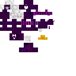 
>
> Current resources use a Blood Drunk Puppeteer-derived split armor model with blue-purple 128px armor texture atlases that preserve the yellow accents.

### 22.6 Unstained Armor

Anti-blood zealot armor (for the Unstained path):
-  Helm,  Chestplate,  Leggings,  Boots
-  **Vestment of the Final Molt:** pinnacle Enlightened reward chestpiece. Uses the Unstained armor tier for set-bonus counting, with a luna moth hood/cloak model whose hood lowers when a helmet is worn.
- **Stats:** Defense 3/6/8/3 (20 total), Toughness 3.0, KB Resist 0.1, Durability ×37, Enchantability 15
- **Repair:** Chitinous Husk (placeholder — should be Pale Silver Ingot or Consecrated Copper)
- **Set Bonus (4 pieces):** Immunity to Blood Loss and Hemolysis effects (auto-removed on tick)

> Armor model: 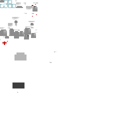 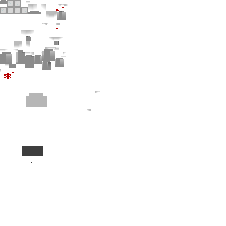
>
> Item stacks use the same model-backed 3D renderer as the worn armor.

Unstained weapon items now render through 3D custom item models rather than flat handheld sprites. `unstained_warhammer`, `silthmere_glaive`, `absolution_dagger`, and `annettas_absolution_dagger` use `builtin/entity` item model JSONs and `HemoClientItemExtensionsProvider` to route to `UnstainedWeaponItemRenderer`. Model layers are registered in `LayerEvents`: `UnstainedWarhammerModel` uses a Pale Silver Bell-inspired striking head, `SilthmereGlaiveModel` uses a long polearm shaft with a swept blade, and `AbsolutionDaggerModel` uses a narrow stiletto profile shared by Annetta's boss-drop variant. `UnstainedWeaponRendererResourceTest` guards against these items regressing to 2D handheld model JSONs or losing their client renderer/model layer wiring.

### 22.7 Crown of Sacred Marrow

Special artifact helmet (`MarrowCrownArmorItem`), uses `MARROW_CROWN` tier.
- **Stats:** Same as Hematic Iron (Defense 3/6/8/3, Toughness 3.0, KB Resist 0.1)
- **Repair:** Hematic Iron Scrap
- **Artifact Bonus:** +10% melee damage (via attribute modifier) when blood volume is above 50%

> **Note:** All armor sets share identical base stat distributions (equivalent to Netherite-tier defense/toughness) but each has a unique set bonus implemented in `ArmorSetBonusHandler`. The Marrow Crown is an artifact helmet with its own standalone bonus that doesn't require a full set.

### 22.8 Silent Archon Vestments and One-Off Pieces

**Silent Archon Vestments** are D7 survivor-duelist vestments made by reforging Blood Lust armor with Monolith Imbued Cloth after choosing the Silent Archon path (`hemomancy:archon_choice_made = "silent"`). Their full-set bonus now makes the wearer functionally incorporeal against physical force: melee strikes, projectiles, explosions, fall impacts, wall impact, falling blocks, and in-wall pressure pass through for no damage. The tradeoff is equally severe: a Silent Archon cannot deal mundane physical damage while wearing the full set, so normal melee weapons, bows, and ordinary projectiles are suppressed. Blood manipulations, Hemomancy projectiles, and living weapons remain valid offense. Their old death-refusal safety net remains as a separate last resort against damage outside that incorporeal envelope, refusing lethal damage once per 12,000-tick cooldown by spending 3,000 player blood, leaving the player barely alive and applying Resistance briefly plus harsh Weakness, Slowness, Mining Fatigue, and Darkness recovery debuffs. The bonus excludes Degree 8 Apotheos players. Runtime rendering uses `SilentArchonArmorModel`, the robe-derived `silent_archon_layer_1/2.png` armor textures, and a semi-translucent Monolith Fragment shader overlay when worn; with the complete set equipped, the base player body renders as a monolith core beneath the translucent Silent Archon armor. Inventory, hand, frame, and dropped item stacks use the same custom 3D armor-piece renderer instead of flat generated sprites.

**Silent Severance:** the full Silent Archon set registers `hemomancy:silent_archon_severance` as its armor-born radial combat ability. It appears in the manipulation radial with the Silent Archon Veil icon, costs blood, and releases a short-range monolith-shatter silence burst with red-black Qliphoth Seed-style tendrils blasting outward from the player instead of vanilla soul/portal particles. The burst deals non-physical magic damage and applies **Monolithic Dislocation** instead of a conventional debuff stack. While Monolithic Dislocation lasts, the victim is temporarily intangible: incoming damage is negated except for blood manipulations and living weapons, and the dislocated entity cannot deal damage. Affected living entities render with a thin translucent monolith shell, using a charged-creeper-style model wrap with the same black-and-red monolith shader language as Silent Archon visuals; an in-render fallback draws the shell before the model transform is popped if a renderer misses the normal layer pass.

**Silent Slipping:** the full Silent Archon set now triggers Silent Slipping through a creative-flight-style double-tap jump input instead of the manipulation radial. The client only detects the double-tap jump and sends a toggle request; the server remains authoritative for full-set validation, blood cost, cooldown, duration, active-state cancellation, and safe exit. When accepted, the player enters a short no-physics state, gains slow flight, passes through blocks, and is placed at a nearby safe position when the state ends or is manually cancelled. The no-physics state is reinforced at the movement collision boundary so vanilla player tick resets cannot restore solid-block collision while Silent Slipping is active. Instead of portal specks, the state emits small shard-only pulses from the monolith shatter renderer on activation/release and whenever the slipping player crosses into or out of solid collision.

**Why choose Silent Archon:** this path is intentionally not a weaker or foolish refusal of Apotheos. Lore-wise, it is the Archon witnessing the fungal truth and answering with silence, exile, and willpower rather than surrender to hive-mind dissolution. The shattered Monolith imagery represents the player becoming their own permanent will, carrying blood magic forward by discipline strong enough to resist the fungal source. Gameplay-wise, it preserves replayability and player choice: some players want endgame blood-magic mastery, monolith gear, and refusal-themed power without turning their character into a fully fungal body-modification endpoint.

**Why the Order still survives:** the silence also patches the recruitment paradox. The source of the silence is intentionally ambiguous: it may be self-imposed, traumatic, or the hive mind's last spiteful constraint, but no one who has seen the full truth can simply speak it aloud as a warning. Most Harbingers never reach Degree 5, and Degree 6+ practitioners are already rare enough to be saintlike. Silent Archons leave with the truth trapped behind refusal, while Apotheos-aligned beings no longer resemble or behave like ordinary Harbingers. Lower-degree recruiters therefore continue the Order without receiving a clear warning from the few who reached the end.

Future visual direction: the robe silhouette may lean toward Gael's armor from Dark Souls 3, especially the battered pilgrim-knight layering, heavy cloak mass, and worn endgame duelist feel.

One-off armor pieces intentionally use distinct material holders so they break full-set bonuses:
- **Hemolymphopoda Headpiece:** existing D3 aquatic/organic helmet.
- **Lantern Tick Helmet:** rare underground arthropod helmet dropped by Lantern Ticks. It renders as a large latched tick on the wearer's head and maintains a temporary moving light source around the wearer until removed.
- **Crown of Sacred Marrow:** D5/D6 artifact helmet with high-blood melee bonus.
- **Venous Strider Sabatons:** D3/D4 one-off boots crafted from Venous Pinions shed by rare Venous Striders; reduce projectile/fall damage and brace long falls. Uses the imported Fortress armor model/texture for worn and item-stack 3D boot renders.
- **Covenant Mantle:** D6 chest piece tied to bloodline covenant play; spends wearer blood to grant nearby initiated allies brief resistance. Uses the imported cultist leader armor model/texture for worn and item-stack 3D chest renders.

---

## 23. Functional Blocks & Block Entities

| Block                                | BlockEntity                                | Purpose                                                                                                                                                                                                                                                                                                                                                                                                                                                                                                                                                                                                                                                              |
|--------------------------------------|--------------------------------------------|----------------------------------------------------------------------------------------------------------------------------------------------------------------------------------------------------------------------------------------------------------------------------------------------------------------------------------------------------------------------------------------------------------------------------------------------------------------------------------------------------------------------------------------------------------------------------------------------------------------------------------------------------------------------|
| **Mortal Display**                   | `MortalDisplayBlockEntity`                 | Activates blood magic when clicked in a Blood Temple                                                                                                                                                                                                                                                                                                                                                                                                                                                                                                                                |
| **Scrying Podium**                   | `ScryingPodiumBlockEntity`                 | Blood-reflection podium, Hemopothecary workstation, and **Advanced diagnostic station**. Normal right-click opens the Sanguine Diagnosis screen with player-facing diagnostics split into clickable **Blood**, **Manipulations**, and **Tendency** tabs. Blood Volume shows computed max blood plus exact positive/negative max-blood modifier totals, with a `Mods` hover tooltip listing each source. Blood Flow shows positive, negative, and net mL/t, circulation bandwidth used/cap/available, scrollable per-source requested/applied rows, and a hover tooltip for the full active source breakdown. The Manipulations tab shows carried/equipped manipulations, the server-computed equipped slot cap, and the selected manipulation's base -> effective blood cost, with hover tooltips for slot and cost modifiers. The Tendency tab shows dominant/latent tendencies, the full tendency profile, and rite readiness. Shift-right-click still converts it back into an Unstained Podium and drops the Scrying Dish.                                                                                                                                                                       |
| **Scarlet Vanity**                   | `ScarletVanityBlockEntity`                 | Opens the Harbinger equipment screen for equipping the Charm of Vascularium, Blood Gourds, and Morphling Jar. The block uses a red vanity JSON model with a central blood-reflection bowl, while `ScarletVanityRenderer` displays the currently equipped items flat on the tabletop.                                                                                                                                                                                                                                                                                                                        |
| **Somatic Loom**                     | `SomaticLoomBlockEntity`                   | Degree 3 refined memory-weaving station. Stores up to 64 internal enzyme units per tendency, accepts one blank Hematic Memory plus a list of catalyst candidates, enters an editable dark-red awaiting-blood glow when an exact recipe is ready, then runs a physical orb-weaving ritual where the player projects blood and drags colored tendency-orbs home with a Living Staff. Renders expanded offscreen bounds for the ritual orbs, strands, trails, and shader-writhed orb shells.                                                                                                                                                                                                                                                     |
| **Puppeteer's Spindle**              | `PuppeteersSpindleBlockEntity`             | Harbinger puppeteer control station. Two-slot container: slot 0 accepts a `marionette_crossbar`, slot 1 accepts `puppeteering_thread`. Thread inserted into the feeder slot is consumed immediately into a persistent `threadBuffer` capped at 512, and the slotted crossbar auto-fills from that buffer up to its 256-thread cap. The screen handles summon selection, crossbar binding/attunement, and call/recall preparation for the slotted crossbar. The placed block stores horizontal facing, faces the placer, and renders through `PuppeteersSpindleRenderer` / `PuppeteersSpindleModel` plus a custom block item renderer. |
| **Hematic Armature**                 | `HematicArmatureBlockEntity`               | Standing ritual armor-upgrade machine with no player-facing GUI. Right-click inserts held reagents into the four one-item bowl slots in insertion order, crouch/right-click withdraws the most recent bowl item first, and blood containers fill the 8,000-blood reservoir. Walking onto the block mounts the player to a hidden `ArmatureRestraintEntity`; while restrained, worn armor upgrades in helmet/chest/legs/boots order through `hemomancy:armature_upgrade` recipes. Any bowl reagent can satisfy any matching worn armor piece. Crafting takes 100 ticks per item, allows partial completion, and emits windup/completion particles. The block now has three persistent visual/recipe tiers: the base Armature Rack handles normal pre-Lodge recipes; applying a **Vicar's Consecration Kit** at Degree 5 upgrades it for D5-D6 recipes such as Blood Lust armor; applying a **Monolithic Cornerstone** at Degree 7 requires the Vicar tier first and upgrades it for D7+ recipes such as Silent Archon Vestments. Breaking an upgraded Armature drops the applied upgrade item or items so the replacement block can be re-upgraded. Renders through `HematicArmatureModel`/`HematicArmatureRenderer` with tier-hidden Vicar kit ornamentation, Monolithic cornerstone/heart reservoir parts, bowl item renders, custom block item renderer, extended culling bounds, and linked filler blocks for the wide bowl stands/top arch. |
| **Vial Centrifuge**                  | `VialCentrifugeBlockEntity`                | Spins down Bloody Vials into enzymes and Hematic Iron Powder. Reworked with new 3D stand model (`CentrifugeStandModel`), custom block entity renderer (`VialCentrifugeRenderer`), and `VialCentrifugeBlockItem` with custom item renderer. Accepts **Vial Rack** right-click bulk inserts, and startup now requires at least one processable vial with valid output fit.                                                                                                                                                                                                                                    |
| **ghastly_alembic**                  | `GhastlyAlembicBlockEntity`                | Squeezes items to extract blood (requires fire below). Has 4 slots: Input (slot 0), Flask (slot 1, fills Cured Clay Flasks into Bloody Flasks), Result (slot 2), and **Catalyst (slot 3)** — an optional catalyst ingredient that modifies or enhances the recipe output. Hopper access: top → input, bottom → result, sides → flask + catalyst. Renders via custom `GhastlyAlembicRenderer` (3D entity model `GhastlyAlembicModel`, facing-aware)   .                                                                                                                           |
> **Ghastly Alembic gourd filling:** The alembic's result/blood output slot also accepts Blood Gourds. When a gourd is placed there, the block entity drains stored blood from its internal tank into the gourd's stack-backed internal blood volume instead of producing bottled blood in that slot.
> **Ghastly Alembic blood seep:** On each configured leak interval, the alembic scans venous stone variants or bone blocks in the surrounding 3x3 floor below it, skipping the center tile occupied by the alembic itself. It first places a fresh age-0 Blood Crystal in the first valid open space on top of a trigger tile; only if no placement is possible does it scan existing upward-facing Blood Crystals on those trigger tiles and grow the first immature one. If neither placement nor growth can occur, no blood is drained and the next interval starts a fresh search.

| **Cerebral Scarring Station**        | `ScarStationBlockEntity`                   | Crafts scars from patterns and blanks                                                                                                                                                                                                                                                                                                                                                                                                                                                                                                                                               |
| **Mason's Effigy**                   | `MasonsEffigyBlockEntity`                  | Cerebral scar loadout preparation block. Its menu lists the player's known scars, seeds active sockets from a server-authored opening snapshot, and stores up to four selected scar ids on the block. Right-clicking with Runic Motif Paper places a visible pending motif above the model; Blood Projection from hand or staff charges that motif at 500 blood per selected scar, then ejects a dynamic prepared Scar Pattern item with red omen particles. The screen uses the fungal inventory-panel texture, item-like scar slots, a helmetless player head/body preview, venous background art, and a compact scar-pattern prepare icon. |
| **Anastomotic Brazier**              | `AnastomoticBrazierBlockEntity`            | Scar ritual brazier with three burn paths. Burning a cerebral `ItemScar` costs 100 blood, requires Degree 4, consumes the item, and adds the scar definition id to the player's known cerebral scars. Burning a prepared `ItemScarPattern` costs 50 blood, requires Degree 4, validates all ids are known cerebral scars and within the player's active capacity, then replaces the active cerebral scar loadout. Burning blank Runic Motif Paper costs the same loadout blood and clears all active cerebral scars while preserving known scars and the fungal scar item slot. |
| **Morphling Incubator**              | `MorphlingIncubatorBlockEntity`            | Grows Morphling Polyps into specific morphling types with enzymes. Has 8 slots: Center/polyp (slot 0), 4 enzyme/catalyst slots (1–4), Output (slot 5), Blood Flask/Gourd input (slot 6), and Empty Flask output (slot 7). Craft time: 200 ticks base; enzyme feeding: 100 + 60 per item. Blood cost: 0.5/tick. Bloody Flask transfer is clamped to available player blood capacity (prevents overfill blocking). Uses `IncubatorRecipe` system with 13 recipes (one per morphling type). JEI-integrated. Renders via custom `MorphlingIncubatorRenderer` (3D entity model). 
| **Mycelial Crucible**                | `MycelialCrucibleBlockEntity`              | Cultivates fungal scars through `FungalScarCultivationRecipe`. Has 8 slots: center scar/immature culture, 4 aligned enzyme slots, output, blood flask/gourd input, and empty flask output. Phase 1 drains the recipe's flat blood cost plus 1.5/tick to produce the consolidated `immature_fungal_scar`; Phase 2 feeds aligned enzymes into the culture's custom-data progress until it matures into its stored target scar. See §13.4. |
| **Mycelial Lantern**                 | `MycelialLanternBlockEntity`               | Degree 5 passive enzyme-fruiting machine. A 1x2x1 multiblock (main block below, `filler_block` above) crafted via Blood Structure recipe. Slots: reusable spore culture (0), blood input for Bloody Flasks/Blood Gourds (1), enzyme output (2), empty flask output (3). Uses a 4,000 blood internal reservoir; each default recipe takes 2,400 ticks at 0.25 blood/tick (600 total) for 1 matching enzyme. Progress pauses without reset when blood or output space is unavailable. Automation: top inserts culture, sides insert blood containers, bottom extracts enzyme/empty containers; culture is not auto-extracted. Rendered by `MycelialLanternRenderer` / `MycelialLanternModel`, with translucent glass rendered after the displayed culture/output item and Blockbench source at `assets/hemomancy/models/block/bbmodel/mycelial_lantern.bbmodel`. |
| **Morphling Cradle**                 | `MorphlingCradleBlockEntity`               | Owner-bound morphling support cradle. Hosts one morphling, runs staged aura/leech logic, and can route blood through internal buffer / owner / bloodline fallback. Supports floor, wall, and ceiling placement. Rendered with custom block entity + item renderers (`MorphlingCradleRenderer`, `MorphlingCradleItemRenderer`). |
| **Specimen Jar**                     | `SpecimenJarBlockEntity`                   | Vivianite glass and Hematic Iron containment jar for Hemomancy specimens. Empty jars place normally and face the placer. Right-clicking a capturable Hemomancy creature with an empty jar stores that exact entity's NBT in the jar item and removes the live mob. Filled jars place with the specimen displayed inside by `SpecimenJarRenderer` / `SpecimenJarItemRenderer`, rotated with the jar's horizontal facing and animated via the renderer's client-only entity copy. Shift-right-clicking a placed jar picks it back up without releasing the specimen; breaking a filled jar releases the stored entity and drops an empty jar. Capturable scope is data-driven by `data/hemomancy/tags/entity_type/specimen_jar_capturable.json` and now covers the older special captures plus Hemomancy ecology mobs such as Barbed Urchin, Chalybeate Snail, Blood Lantern Jelly, Prism Cuttle, Desiccant, Hematic Burrower, Lantern Tick, Morphling Polyp, Hemojelly, Crimson Doe, Scarlet Serpent, Tooth Pecks, Venous Strider, Verdigris Moth, Chitinite, Fervent Chitinite, Hemolymphopoda, and Venom-Rib Centipede. Filled ecology jars can be submitted to the Alchemist's Living Bestiary; wild polyp jars preserve `MorphlingLayers` for layer-specific morphling conversion. |
| **Fungal Podium**                    | `FungalPodiumBlockEntity`                  | Portal to the Fungal Gardens dimension. Degree 2+ (Votary) required; costs 500 blood. Stores overworld return coordinates in player persistent data. Degree-7 Archons on first exit attempt see the `coreWitnessDialogue()` choice fork instead of teleporting home; subsequent uses proceed directly. See §5.6, §5.9.                                                                                                                                                                                                                                                                                                                                               |
| **Sanguine Monolith** (*The Crimson Lodestone*) | `SanguineMonolithBlockEntity` | 1×2 multiblock (base + filler above) available to Degree 5+ players. Provides degree-gated guidance (degrees 4–7) via `SanguineMonolithDialogueTrees`. The dialogue speaker is displayed as **"The Crimson Lodestone"** (`hemomancy.monolith.lodestone_name`). Each degree includes a `what_are_you` branch that progressively discloses the Monolith's nature: a sealed incubation vessel containing a dormant mycelial fragment built by the Crimson Lodge. At Degree 7 the player can press further for the pre-shatter warning (`press_again` node). At Degree 7 an Archon may interact with it **twice** to shatter it — rendering black shards plus a black orb blast client-side, dropping a **Qliphoth Seed** plus 5-8 **Monolith Fragments**, and firing `FungalWhisperDialogueTrees.postMonolithShatter()`. The first step of Qliphoth Communion. Custom animated model (`SanguineMonolithModel`). See §5.9 and LORE_REFERENCE §6.5a. |
| **Qliphoth Bloom**                   | `QliphothBloomBlockEntity`                 | 1×1×8 multiblock tree (base + 7 filler blocks) placed by the Bloom of the Qliphoth rite. Stores owner UUID and chunk radius. Effects (Regeneration I, +5 blood/tick) are tick-driven via `QliphothBloomEvents`. Slowly drops 9 Qliphoth Pomes over its lifetime — one per Qliphoth husk (Nahemoth → Ghagiel), with owner whisper alerts on each drop. Registered and synced via `QliphothBloomSavedData`. Player breaking is canceled for the bloom and its filler shell; intended removal is the Rite of Cult Pruning. The bloom keeps its custom staged `QliphothBloomRenderer`; HutosLib tendrils are reserved for seed/item and spell flourishes. See §5.9.                                                                                                                                                                                                                       |
| **Fungal Implantation Pylon**        | `FungalImplantationPylonBlockEntity`       | Sporic implantation station                                                                                                                                                                                                                                                                                                                                                                                                                                                                                                                                                       |
| **Dendritic Distributor**            | `DendriticDistributorBlockEntity`          | Degree 5 Synaptic Loadout station. Opens `SynapticLoadoutScreen`, where blood-active Degree 5+ players can save, rename, overwrite, and apply remembered manipulation patterns. Base storage is 3 patterns; `skill_synaptic_memory` adds one slot per level up to 7. Save/overwrite costs 100 blood and 25 raw XP; apply/rename are free. Fixed mechanical manipulations remain automatic and are not stored in patterns. It no longer spawns experimental HutosLib tendril pulses; its role is the quiet neural loadout station. |
| **Consecrated Bloodwell**            | *(see block/entity class)*                 | Degree 5 Founding Fane heart and bloodline-pool conduit. The Founding Fane rite binds one bloodwell position to the owner's bloodline; only one bloodwell may exist inside an active fane footprint, and breaking the heart collapses the active fane until reattuned while removing all associated stakes. Right-click opens the Bloodline Pool Monitor screen. Blood Projection contributes directly from the player to the shared bloodline pool, and Blood Absorption draws directly from that pool into the player; both require membership in the bound bloodline. The block entity only syncs linked pool fullness for the renderer. Rendered as a fullness-scaled blood fountain with real blood/glow particles; block properties use `noOcclusion()` so supporting blocks remain visible under its non-full model. |
| **Hematic Stake**                    | -                                          | Jagged hematic-metal spike block used as a Founding Fane anchor. It is manifested by the bloodline progenitor with crouch + empty-hand right-click rather than crafted. Placement is accepted only when the stake connects to the existing Soft Envelope by overlap/chaining and the bloodline is under its stake budget. Stakes are passable, non-solid, light-friendly, instant-mined by the owner/progenitor, and removed automatically when the heart breaks, the fane is reconsecrated, or the bloodline is disbanded. |
| **Non-Euclidean Hallway**            | `NonEuclideanHallwayBlockEntity`           | Creative/WIP prototype block (`hemomancy:non_euclidean_hallway`) for testing a player-only folded hallway. It is a single shallow controller for a 3x3 doorway, with default real depth 2 blocks and perceived length 32 blocks. It does not create a pocket dimension, load screen, hidden hallway, or intentional teleport; active players have the hallway-forward movement component compressed while vanilla collision is redirected to synthetic folded-space floor, ceiling, and side-wall shapes. The controller block itself remains passable so entry through the aperture is not blocked. Live opposite-exit world projection is disabled: a nested `LevelRenderer.renderLevel(...)` pass corrupted unrelated world rendering such as clouds and custom models. Interactions, block picking, breaking, and placing are suppressed while inside. Debug tools such as F3, commands, minimaps, or observers can reveal the compressed physical depth, and mobs/items/projectiles/multiplayer observer parity are not production-supported. |
| **Unstained Podium**                 | `UnstainedPodiumBlockEntity`               | Central interaction block for the Unstained path. Four recognized interaction modes (server-side only, degree-gated at > Illuminatus): **Hemolytic Solution** — first use begins purification (`begunPurification = true`, +5 purity, resets Harbinger degree); subsequent uses add +10 purity per flask while unpurified. **Consecrated Copper Ingot** — requires `isPurified() == true` and `!hasClarityUnlocked()`; performs the Rite of Clarity: sets `clarityUnlocked = true`, disables blood magic permanently (`IBloodVolume.active = false`), grants first Still Art (Silver Rebuke), runs `enforceHarbingerResetOnClarity()`, and syncs both capabilities. **Hemolytic Plating** — requires `hasClarityUnlocked()`; adds +15 clarity per plating while not yet enlightened. **Empty hand** — prints current purity stage + percent; if clarity is unlocked, also prints clarity stage + percent. Scrying Dish item converts the podium into a Scrying Podium. |
| **Altar of Cleansing**               | `AltarOfCleansingBlockEntity`              | Sacred altar of Our Lady of Still Waters — grants one-time purity boost with Tears of Silthmere; accepts Lethean Poppy Wreaths and Silver Chalices for repeatable offerings                                                                                                                                                                                                                                                                                                                                                                                                                                                                                                     |
| **Semi-Sentient Construct**          | `SemiSentientConstructBlockEntity`         | Blood construct-related block and Drudge home anchor; nearby Drudges can tend linked direct-routing machines around their SSC without creating blood                                                                                                                                                                                                                                                                                                                                                                                                                                                                                                                 |
| **Hematic Suture Node**              | `HematicSutureNodeBlockEntity`             | Optional direct-routing anchor. Stores its link in `BloodRoutingSavedData`, holds no persistent blood/reservoir, emits red routing particles, and routes adjacent linked machines from the bound source contract                                                                                                                                                                                                                                                                                                                                                                                                                                                       |
| **Earthen Vein**                     | `EarthenVeinBlockEntity`                   | Vein location marker for teleportation (Venous Travel) 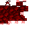                                                                                                                                                                                                                                                                                                                                                                                                                                                                                                                  |
| **Iron Brazier**                     | `IronBrazierBlockEntity`                   | Decorative/functional brazier. Right-click with an item to store one offering stack item, sneak-right-click to retrieve it, and project 50 ml of blood into the brazier with Blood Projection or a Living Staff to light it. Blood structure recipes can consume nearby lit brazier offerings without counting the braziers as structure outline blocks; completed crafts consume only the item and return the brazier to unlit. Living Weapon Grafts can also be placed as the offering and absorbed through Living Staff Blood Absorption; the Rite of the Assumed Limb consumes base-form grafts only when the matching `conjure_*` memory is granted. `memory_of_vesper` can also be placed directly and is consumed only when the existing Vesper staff memory is awakened. The previous organ echo reagent route is disabled while the organ system remains WIP.                                                                                                                                                                                                 |
| **Suspended Blood Crystal**          | `SuspendedBloodCrystalBlockEntity`         | Floating blood crystal display                                                                                                                                                                                                                                                                                                                                                                                                                                                                                                                                             |
| **Suspended Cleansed Blood Crystal** | `SuspendedCleansedBloodCrystalBlockEntity` | Floating cleansed blood crystal display (purified variant with random time offset animation)                                                                                                                                                                                                                                                                                                                                                                                                                                                                      |
| **Suspended Vivianite**              | `SuspendedVivianiteBlockEntity`            | Floating vivianite display                                                                                                                                                                                                                                                                                                                                                                                                                                                                                                                                                     |
| **Mnemonic Reliquary**               | `MnemonicReliquaryBlockEntity`             | Animated decorative/lore reliquary with opening/closing lid. Tracks open count, syncs lid angle (lerped). Has custom 3D block entity renderer and item renderer. Opened via `MnemonicReliquaryMenu`. Currently atmospheric/decorative — no inventory slots or crafting function yet. Planned: may serve as memory storage or manipulation bookmark container.                                                                                                                                                                                                                 |
| **Dictation Table**                  | `DictationTableBlockEntity`                | First implementation slice of the memo loop. Holds one Liber Sanguinum or Liber Immaculatus stack and renders an open book while one is inserted. Right-click with Field Notes to dictate captured memo IDs into the player's `LiberKnowledge` attachment, draining player blood with a cost that scales by memo count. Hematic-ink notes can only be dictated into Liber Sanguinum; Pale-ink notes can only be dictated into Liber Immaculatus. Memo entries unlock pages inside the normal book chapters for that player; chapters with zero unlocked pages are hidden entirely. The table is only one discovery source; rites, degree gains, advancement grants, item pickups, and special dialogue events can also unlock Liber pages. |
| **Humane Idol**                      | `HumaneIdolBlockEntity`                    | Idol block                                                                                                                                                                                                                                                                                                                                                                                                                                                                                                                                                                                                                                                           |
| **Serpentine Idol**                  | `SerpentineIdolBlockEntity`                | Idol block                                                                                                                                                                                                                                                                                                                                                                                                                                                                                                                                                                                                                                                           |
| **Engram Block**                     | —                                          | Translucent engram. Emits redstone comparator signal 15 when lit (LIT=true), 0 when unlit. `hasAnalogOutputSignal()` returns true.                                                                                                                                                                                                                                                                                                                                                                                                                                                                                                                                   |
| **Filler Block**                     | `FillerBlockEntity`                        | Indestructible filler for multiblocks                                                                                                                                                                                                                                                                                                                                                                                                                                                                                                                                                                                                                                |
| **Bog Body**                         | —                                          | Decorative translucent body block                                                                                                                                                                                                                                                                                                                                                                                                                                                                                                                                                                                                                                    |
| **Visceral Mirror**                  | `VisceralMirrorBlockEntity`                | Ritualistic mirror for organ extraction — gaze into your reflection to extract and modify organs (Spleen, Liver, Lungs, Kidneys, Heart). Requires degree 3+. Cycle organs (right-click) → confirm extraction (sneak right-click). Produces Organ Echo items.                                                                                                                                                                                                                                                                                                                                                                                                            |

---

## 24. Decorative & Building Blocks

### 24.1 Venous Stone Family

A full block family with variants:

| | | |
|---|---|---|
|  Venous Stone |  Polished Venous Stone |  Polished Venous Stone Bricks |
|  Chiseled Polished |  Cracked Bricks |  Gilded Venous Stone |
|  Infested Venous Stone | | |

- Venous Stone, Slab, Stairs, Wall
- Polished Venous Stone, Slab, Stairs
- Polished Venous Stone Bricks, Slab, Stairs, Wall
- Chiseled Polished Venous Stone
- Cracked Polished Venous Stone Bricks
- Gilded Venous Stone
- Infested Venous Stone

### 24.2 Hematic Iron Family

| | | | |
|---|---|---|---|
|  Hematic Iron Block |  Hematic Iron Pillar |  Chiseled Hematic Iron |
|  Hematic Iron Bars |  Hematic Iron Chain |  Hematic Iron Trapdoor |

- Hematic Iron Block
- Hematic Iron Pillar (rotatable)
- Chiseled Hematic Iron Block
- Hematic Iron Bars (vanilla iron-bars behavior, cutout render layer)
- Hematic Iron Chain (vanilla chain behavior, axis placement, cutout render layer)
- Hematic Iron Door (vanilla iron-door behavior, redstone-opened)
- Hematic Iron Trapdoor (vanilla iron-trapdoor behavior, redstone-opened)

### 24.3 Anti-Blood / Unstained

-  Hemolytic Plating Block
- Cleansed Stone — pale, smooth stone found in Unstained temples
- Pallid Lantern — softly glowing lantern sacred to Our Lady of Still Waters
- Virid Salis Trail — green Unstained salt-ash trail block placed by `hemomancy:virid_salis` / `hemomancy:virid_salis_trail`

- Pallid Silver Chain - pale-silver vanilla-chain variant for Unstained hanging decor
- Pale Silver Bars - pale-silver vanilla-bars variant for Unstained churches and cells
- Pale Silver Bells - vanilla-bell-style Unstained ritual bell with floor, wall, between-wall, and ceiling attachments

The alpha building pass intentionally favors vanilla behavior for compatibility: chains use `ChainBlock`, bars use `IronBarsBlock`, walls use `WallBlock`, and hematic iron door/trapdoor use the vanilla iron block set behavior. Recipes, loot tables, blockstates, item models, pickaxe mineability, and cutout render layers are present for the new fixture blocks. `BuildingBlockResourceCoverageTest` guards the expected resource files for the current alpha fixture set.

### 24.4 Glass & Panes

| | | | |
|---|---|---|---|
|  Sanguine Glass |  Sanguine Pane |  Vivianite Glass |  Vivianite Pane |
|  Cleansed Sanguine Glass |  Cleansed Sanguine Pane | | |

### 24.5 Wood & Organic

| | | |
|---|---|---|
|  Blood Wood Log |  Blood Wood Leaves |  Blood Wood Planks |  Conscious Mass |

- Blood Wood Log (rotatable pillar)
- Blood Wood Leaves (direct Blood Projection growth from Dead Bushes)
- Blood Wood Planks
- Conscious Mass (wart-block sound)

### 24.6 Fungal / Plant Blocks

| | | | |
|---|---|---|---|
|  Hyphae |  Hyphae Block |  Infected Stem |  Infected Cap |
|  Fruiting Infected Cap |  Erythrocytic Dirt |  Erythrocytic Mycelium |  Bleeding Heart |
|  Infected Fungus |  Stinkhorn Fungus |  Lethean Poppy | |

- Hyphae (cross-block, replaceable — crafts into Spore Sac)
- Hyphae Block
- Infected Stem
- Infected Cap / Fruiting Infected Cap
- Erythrocytic Dirt
- Erythrocytic Mycelium (spreads, random ticks)
- Bleeding Heart (flower, Absorption effect — crafts Bleeding Bulb, brews Potion of Sanguine Siphon)
- Infected Fungus (flower, Confusion effect — ghastly_alembic → Foul Paste, brews Potion of Mycorrhizal Mending, incubator catalyst for Fungal Morphling)
- Stinkhorn Fungus (Confusion effect — ghastly_alembic → Foul Paste, brews Potion of Blood Binding)
- Puffball Fungus (Saturation effect, **Unstained** — ghastly_alembic → Spore Sac, incubator catalyst for Fungal Morphling)
- Lethean Poppy (Regeneration effect, random ticks, **Unstained** — ghastly_alembic → Lethean Dew, crafts Lethean Poppy Wreath)
- Ghost Pipe (myco-heterotrophic, Night Vision effect, **Unstained** — ghastly_alembic → The Pale Distillate)
- Sarcodes (myco-heterotrophic, Regeneration effect — ghastly_alembic → Bleeding Bulb, brews Potion of Blood Rush)
- Rafflesia (parasitic, Confusion effect — ghastly_alembic → Spore Sac, brews Potion of Hemolysis)

All applicable flowers have **potted** variants.

### 24.7 Gourd

| | |
|---|---|
|  Gourd |  Gourd Stem |

- Gourd (pumpkin-like, grows from stem)
- Gourd Stem / Attached Gourd Stem

The mature `hemomancy:gourd` still uses vanilla pumpkin/melon-style ground growth through `StemBlock` and `AttachedStemBlock`, but its visible model is intentionally smaller than a pumpkin: a low cocoa-pod-like gourd centered near the ground, with small edge connector pads so attached stems meet the fruit visually from any horizontal side. `GourdBlock` supplies compact selection and collision shapes (`3,0,4` to `13,7,12`) for the main pod body, while the stem blocks render on the cutout layer. `BlockInit.attached_gourd_stem` must pass the custom stem key before the fruit key to `AttachedStemBlock`, so breaking the grown fruit restores an age-7 `gourd_stem` instead of turning the stem into another gourd. `GourdPresentationResourceTest` guards against accidentally reverting the asset back to a full cube/pumpkin column or losing stem cutout/connector/cleanup coverage.

### 24.8 Ash Trails

| | | | | |
|---|---|---|---|---|
|  Smouldering Ash |  Active Smouldering |  Befouling Ash |  Active Befouling |  Virid Salis |

- Smouldering Ash Trail / Active Smouldering Ash Trail
- Befouling Ash Trail / Active Befouling Ash Trail
- Virid Salis Trail (Unstained-aligned; currently no active variant)

### 24.9 Misc

-  Crimson Flames (special fire block)
- Blood Crystal (modeled block)

---

## 25. Recipe Systems

This section tracks shared recipe infrastructure and Harbinger-facing recipe catalogs. Unstained Still Arts, Cardinal Rites, White Humor purification, and Unstained structure recipes live in §15 so those lanes stay separate from the blood-magic path.

**Shared and Harbinger-facing recipe types:**

| Recipe Type | Serializer | Station | Purpose |
|-------------|-----------|---------|---------|
| `scar_recipe` | `ScarRecipeSerializer` | Cerebral Scarring Station | Crafting scars |
| `distillation_recipe` | `DistillationRecipeSerializer` | Ghastly Alembic / Pallid Retort | Shared distillation serializer. Ghastly Alembic is the Harbinger station; `pallid: true` routes to the Pallid Retort and is cataloged with Unstained crafting in §15.3. |
| `recaller_recipe_type` | `RecallerRecipeSerializer` | Visceral Recaller | Creating Hematic Memories |
| `memory_weaving` | `MemoryWeavingRecipeSerializer` | Somatic Loom | Refined Hematic Memory crafting. Recipes require a blank memory vessel, a `catalysts` list, integer stored-enzyme requirements, projected ritual blood, and the physical orb-weaving event. |
| `incubator_recipe_type` | `IncubatorRecipeSerializer` | Morphling Incubator | Growing Morphling Polyps into specific morphlings using enzyme catalysts (13 morphling recipes). JEI-integrated via `IncubatorRecipeCategory`. Fungal scar crafting has moved out to the Mycelial Crucible. |
| `fungal_scar_cultivation` | `FungalScarCultivationSerializer` | Mycelial Crucible | Two-phase fungal scar cultivation. Phase 1 produces `immature_fungal_scar`; Phase 2 matures the culture with aligned enzymes into one of 8 finished `ItemFungalScar` variants. |
| `enzyme_fruiting` | `EnzymeFruitingRecipeSerializer` | Mycelial Lantern | Reusable aligned spore culture + blood -> matching enzyme. Defaults: 2,400 ticks, 0.25 blood/tick, 600 total blood, output count 1; JSON-tunable per recipe. |
| `armature_upgrade` | `ArmatureUpgradeRecipeSerializer` | Hematic Armature | Data-driven worn-armor upgrades. JSONs declare required degree, armor slot, valid worn base item(s), bowl reagent, blood cost, result item, optional stack data output, and optional persistent-data gate. |
| `blood_structure_recipe` | `BloodStructureRecipeSerializer` | In-world structure | Harbinger structure crafting; Unstained entries that share the serializer are cataloged in §15.3. |
| `puppeteer_trial_recipe` | `PuppeteerTrialRecipeSerializer` | In-world Blood Crafting pattern | Instant summon unlock trials. Uses Blood Structure-style pattern matching, held Sanguine Quintessence catalyst, blood drain, pattern consumption, and unbound hostile summon boss spawn. |
| `cardinal_rite_recipe` | `CardinalRiteRecipeSerializer` | Multiblock | Harbinger Cardinal Rites for degree advancement and blood utility rites; Unstained rites are cataloged in §15.2. |
| Morphling Jar Upgrade | `CopyMorphlingJarRecipe.Serializer` | Crafting | Upgrading morphling jars |
| Blood Gourd Upgrade | `CopyBloodGourdRecipe.Serializer` | Crafting | Upgrading blood gourds |
| Blood Gourd Fill | `FillBloodGourdRecipe.Serializer` | Crafting | Filling gourds with blood |
| Vial Rack | Vanilla shaped recipe | Crafting | 8 Bloody Vials + Hematic Iron Scrap → Vial Rack |

Alpha building fixtures are regular vanilla shaped recipes under `data/hemomancy/recipe/`: Hematic Iron Scrap / Pale Silver Ingot / Venous Stone variants craft chains, bars, walls, and hematic iron door/trapdoor fixtures.

**Unstained recipe lanes:**

| Lane | Data/type | System reference |
|---|---|---|
| Unstained structure recipes | `blood_structure_recipe` entries with `unstained: true` | §15.3 |
| Unstained Cardinal Rites | `cardinal_rite_recipe` entries with `bloodCost: 0` and Unstained `required_degree` gates | §15.2 |
| White Humor Purification | `white_humor_purification`, physical White Humor pools | §15.4 |
| Pallid Retort distillation | `distillation_recipe` entries with `pallid: true` | §15.3 |
| Unstained material/tool crafting | vanilla shaped/shapeless recipes under `data/hemomancy/recipe/` | §15.3 |

Current datapack paths use the 1.21 singular directory names already present in this repository.

**Shared / Harbinger data paths:**

| Content | Path |
|---|---|
| Main recipes | `src/main/resources/data/hemomancy/recipe/` |
| Harbinger Blood Structure recipes | `src/main/resources/data/hemomancy/recipe/blood_structure/` |
| Harbinger Cardinal Rites | `src/main/resources/data/hemomancy/recipe/cardinal_rite/` |
| Memory weaving recipes | `src/main/resources/data/hemomancy/recipe/memory_weaving/` |
| Puppeteer trials | `src/main/resources/data/hemomancy/recipe/puppeteer_trial/` |
| Enzyme fruiting | `src/main/resources/data/hemomancy/recipe/enzyme_fruiting/` |
| Armature upgrades | `src/main/resources/data/hemomancy/recipe/armature_upgrade/` |
| Block loot tables | `src/main/resources/data/hemomancy/loot_table/blocks/` |
| Entity loot | `src/main/resources/data/hemomancy/loot_table/entities/` |
| Item inquiry dialogue | `src/main/resources/data/hemomancy/dialogue_inquiry/<npc>/<namespace>/<item>.json` |

**Unstained data paths:**

| Content | Path |
|---|---|
| Unstained Blood Structure entries | `src/main/resources/data/hemomancy/recipe/blood_structure/` (`unstained: true`) |
| Unstained Cardinal Rites | `src/main/resources/data/hemomancy/recipe/cardinal_rite/` |
| White Humor purification | `src/main/resources/data/hemomancy/recipe/white_humor_purification/` |
| Pallid Retort distillation | `src/main/resources/data/hemomancy/recipe/distillation/` (`pallid: true`) |
| Liber Immaculatus book data | `src/main/resources/data/hemomancy/books/liberimmaculatus/` |
| Zealot and Guardian inquiry dialogue | `src/main/resources/data/hemomancy/dialogue_inquiry/<npc>/<namespace>/<item>.json` |

### 25.1 Harbinger Blood Structure Crafting

An in-world system: build a specific block structure, then hit a particular block with a catalyst item while spending blood. The structure transforms into the desired output.

Harbinger Blood Structure crafting is introduced through the Alchemist dialogue around Votary, but individual recipes are no longer inferred from blood-cost tiers. Each Harbinger JSON carries `required_degree`; `RecipeDegreeGates` compares that value against the player's Initiatory Degree. Blood cost is only the resource cost. Unstained structure recipes that share the serializer are cataloged in §15.3.

Blood Structure JSONs may also declare optional item offerings:

```json
{
  "offerings": [
    {
      "ingredient": {
        "item": "minecraft:diamond"
      },
      "count": 2
    },
    {
      "ingredient": {
        "tag": "minecraft:flowers"
      },
      "count": 1
    }
  ]
}
```

Each `count` is the number of separate lit Iron Braziers that must hold one matching item near the activate block. Players light a brazier by projecting 50 ml of blood into it with Blood Projection or a Living Staff; normal right-clicking only inserts or retrieves the offering item. The offering scan uses the matched structure footprint as a cube, then expands that cube outward by the recipe pattern dimensions on every side; a 3x3x3 structure therefore accepts offerings up to three blocks past any face. Matched brazier items are consumed only when the craft completes; their items render as item-particle fragments flying to the center, and the brazier is returned to its unlit state. Braziers are not part of the matched structure footprint, visible outline, or structure shader position list.

The Liber Sanguinum crafting sidebar and the debug Structure Spawner group Harbinger recipes directly by required degree (`No Degree`, `Degree 1`, ..., `Degree 8`) through `RecipeDegreeGates`.

| Recipe | Required Degree/Stage | Blood Cost | Held Item | Hit Block | Result |
|--------|-----------------------|-----------|-----------|-----------|--------|
| Liber Sanguinum | 1 | 100 | Sanguine Formation | Bookshelf | Liber Sanguinum |
| Hematic Iron Block | 1 | *(see JSON)* | *(see JSON)* | Iron Block | Hematic Iron Block |
| Vial Centrifuge / Iron Brazier / Living Staff | 1 | *(see JSON)* | *(see JSON)* | *(see JSON)* | Early Harbinger machinery/tools |
| Ghastly Alembic / Mnemonic Reliquary | 2 | *(see JSON)* | *(see JSON)* | *(see JSON)* | Votary machinery |
| Somatic Loom / Mind Spike / Semi-Sentient Construct | 3 | *(see JSON)* | *(see JSON)* | *(see JSON)* | Initiate machinery |
| Runic Chisel Station / Visceral Mirror / Sporitic Thurible | 4 | *(see JSON)* | *(see JSON)* | *(see JSON)* | Adept machinery and Harbinger support tools |
| Dendritic Distributor / Consecrated Bloodwell / Hematic Stake / Morphling Incubator / Mycelial Lantern | 5 | *(see JSON)* | *(see JSON)* | *(see JSON)* | Crimson Lodge machinery, including passive enzyme fruiting and Founding Fane heart/anchor tools |
| Covenant Throne / Vascular Effigy | 6 | *(see JSON)* | *(see JSON)* | *(see JSON)* | Bloodline Covenant machinery |
| Sanguine Monolith | 7 | *(see JSON)* | *(see JSON)* | *(see JSON)* | Archon machinery |

> Harbinger recipes are in `data/hemomancy/recipe/blood_structure/`. Each recipe defines a multiblock `pattern` with `key` mapping characters to blocks, plus `heldItem`, `hitBlock`, `bloodCost`, `required_degree`, and `result`. Unstained entries in the same folder use `unstained: true` and are documented in §15.3.
> **Covenant Throne:** Degree 6 Bloodline Covenant machinery. Only the active bloodline Progenitor can bind to it. Sitting on the throne sets a forced return point at the block in front of the throne, facing back toward it; using the throne again while seated triggers the Covenant Trance if the cooldown and blood cost checks pass.
> **Mycelial Lantern blood structure:** `blood_structure/mycelial_lantern.json` is Degree 5, costs 2,500 blood, uses `spore_sac` on a `hematic_iron_block`, and builds from Sanguine Glass, brown mushroom blocks, Hematic Iron, Polished Venous Stone, and Copper Block.
> **Sporitic Thurible blood structure:** `blood_structure/sporitic_thurible.json` is Degree 4, costs 1,000 blood, uses `spore_sac` on a `hematic_iron_block`, and builds from `minecraft:chain`, `minecraft:iron_bars`, `minecraft:copper_block`, `minecraft:brown_mushroom_block`, and `hemomancy:hematic_iron_block`.

### 25.1.1 Puppeteer Trial Blood Crafting

Puppeteer summon unlocks use a Blood Crafting-adjacent recipe type rather than Cardinal Rites. Recipes live under `data/hemomancy/recipe/puppeteer_trial/` and use `type: "hemomancy:puppeteer_trial_recipe"`.

Each trial recipe extends the Blood Structure recipe data shape with summon-specific fields:

- `summon`: summon definition id, e.g. `veinwing_vulture`
- `bloodCost`: blood drained immediately on activation
- `heldItem`: currently `hemomancy:sanguine_quintessence`
- `hitBlock`: currently `hemomancy:conscious_mass`
- `pattern` / `key`: Blood Structure-style multiblock pattern
- `consume_pattern`: whether the matched pattern is cleared on activation
- `required_degree`: present in JSON as a fallback, but runtime gates use the matching `PuppeteerSummonDefinition.requiredDegree()` when the summon definition exists

Activation is instant from `BloodCraftingKeyPressPacket`: match the pattern at the hit block, verify the caster's Harbinger degree, ensure the summon is not already known, consume one Sanguine Quintessence unless the player has instabuild, drain blood, optionally clear the pattern, and spawn an unbound hostile trial version of the summon. Trial boss death grants the summon only to the recorded caster through `KnownSummonEvents.grantSummon` and syncs the known-summons capability.

Current trial recipes:

| Trial Recipe | Required Degree | Blood Cost | Held Catalyst | Hit Block | Pattern Notes |
|--------------|-----------------|-----------:|---------------|-----------|---------------|
| `puppeteer_trial/veinwing_vulture` | 3 | 500 | Sanguine Quintessence | Conscious Mass | Venous Stone + Engram Block ring |
| `puppeteer_trial/marrow_spitter` | 3 | 750 | Sanguine Quintessence | Conscious Mass | Venous Stone + Engram Block + Bone Block |
| `puppeteer_trial/gorebound_hulk` | 4 | 1100 | Sanguine Quintessence | Conscious Mass | Engram Block frame + Gilded Venous Stone core |

`PuppeteerSummonTrialEvents.awardTrialRecipes` grants all trial recipes at or below the player's current degree from degree-grant and login paths, so old saves receive newly eligible trials when the player next logs in.

### 25.2 Harbinger Cardinal Rite Recipes

Specific Harbinger cardinal rite recipes include degree advancement rites (section 5.2) plus blood-path utility rites. Progression access now comes from each recipe JSON's explicit `required_degree`; the `minor`/`lesser`/`greater`/`grand` `CardinalRiteType` remains as a ritual form that controls size, cast time, and boundary behavior.

`RecipeDegreeGates` is the shared helper for Blood Structures and Cardinal Rites. This section covers rite recipes that compare `required_degree` against `IInitiatoryDegree`; Unstained rites compare the same field against `getPlayerUnstainedLevel` and are cataloged in §15.2. The Rites tab groups recipes by required degree/stage rather than by rite form.

Cardinal rite patterns now follow a function-first visual pass: Harbinger rites favor organic veins, ribs, roots, vessels, covenant knots, wounds, and fungal growth, while Unstained rites keep cleaner font, chapel, ward, clamp, lens, and tribunal shapes. This pass intentionally changed only multiblock `pattern` arrays; costs, gates, results, rank-up flags, Unstained flags, and completion behavior stayed stable. Pattern rows are authored top-to-bottom inside each aisle; the last row of each aisle is the ground/bottom layer. Any Engram Block, Befouling Ash Trail, Virid Salis Trail, or similar fragile surface decoration used above ground level must have a non-fragile support block directly underneath it in the same pattern column.

**Degree Advancement Rites:** These recipe JSONs set `"rankup": true`, which lets client UI and tooling distinguish degree rites from utility rites. The rank-up target is inferred from the rite ID so a player who already has that degree or higher cannot start a redundant rank-up rite.

| Rite | Blood Cost | Rite Form | Required Degree | Degree -> | Description |
|------|-----------|-----------|-----------------|----------|-------------|
| Sanguine Initiation | 100 | Minor | 0 | 0 -> 1 | Basic initiation awakening hematic potential |
| Rite of the Votary | 250 | Lesser | 1 | 1 -> 2 | Binds the practitioner deeper into the Covenant |
| Rite of the Incarnadine Fane | 500 | Lesser | 2 | 2 -> 3 | Grants formal entry into the Incarnadine Fane |
| Adept Rite | *(see JSON)* | Lesser | 3 | 3 -> 4 | Fourth rite of the Hematic Order |
| Rite of the Crimson Lodge | 2000 | Greater | 4 | 4 -> 5 | Degree-advancement rite admitting the practitioner as Illuminatus; it does **not** consecrate a Fane |
| Rite of the Bloodline Covenant | 3000 | Greater | 5 | 5 -> 6 | Consecrates the practitioner to the Bloodline Covenant |
| Rite of the Hematic Order | 5000 | Grand | 6 | 6 -> 7 | Crowns the practitioner as Archon |
| Rite of Apotheos | 7000 | Grand | 7 | 7 -> 8 | Final ascension beyond Archon; requires completed Qliphoth Communion |

**Utility Rites:**

Utility rite `required_degree` values are authored per recipe rather than inferred from their form. For example, Vascular Mending is Degree 1, the Bloodline/Beacon/Hungering Earth cluster is Degree 2, Scarlet Summons and Sanguine Eclipse are Degree 3, Crimson Vessel is Degree 4, Founding Fane/Pallid Shadow/Sanguine Dominion are Degree 5, Eternal Covenant is Degree 6, and Ancestral Communion/Bloom of the Qliphoth are Degree 7.

| Rite | Blood Cost | Rite Form | Description |
|------|-----------|-----------|-------------|
| **Bloodline Founding** | 500 | Lesser | Binds the caster's essence into a new bloodline, producing a presigned ancestral ledger |
| **Bloodline Recall** | 750 | Lesser | Reconjures a lost ancestral ledger from the caster's blood memory |
| **Vascular Mending** | 800 | Lesser | Floods the caster's vascular system with purified blood, fully healing all 7 vein sections |
| **Hematic Fortification** | 500 | Lesser | Strengthens the caster's connection to the blood arts |
| **Hematic Unbinding** | 1000 | Lesser | Dissolves the caster's bloodline, freeing all members and returning shared blood |
| **Crimson Beacon** | 600 | Lesser | Anchors the caster's dying essence to this location: respawn point on fatal blow |
| **Hungering Earth** | 750 | Lesser | Feeds blood into the earth, converting terrain into blood-touched stone and ash |
| **Exsanguination** | 500 | Lesser | Drains the lifeblood of a creature within the ritual circle, crystallizing their essence into Sanguine Quintessence |
| **Sanguine Attunement** | 300 | Minor | Purges and resets the caster's blood tendency alignments to a blank slate |
| **Scarlet Summons** | 2000 | Greater | Teleports all online bloodline members to the rite location (cost scales with members) |
| **Sanguine Dominion** | 3500 | Greater | Claims the surrounding land as a Blood Domain: reduced manip cost, bleeding curse on enemies, empowered blood blocks |
| **Eternal Covenant** | 4000 | Greater | Permanently expands the caster's maximum blood volume (one-time only) |
| **Pallid Shadow** | 5000 | Grand | Strips Unstained purification from a nearby player: a blasphemous assault on Our Lady's path |
| **Ancestral Communion** | 5000 | Grand | Opens a channel to the ancient fungal consciousness. Triggers `AncestralCommunionDialogueTrees`: 5 dialogue variants (Origin, The Schism, The Infection, The Harbingers, The True Name) that reveal the fungal origins of hemomancy. Fires `communion_lore_*` events on completion. |
| **Bloom of the Qliphoth** | 1200 | Grand | Degree 7. Plants a Qliphoth Seed (placed as catalyst within the rite pattern), summons a `QliphothBloomBlock` (1x1x8 tree, 3-chunk radius), and starts the Qliphoth Communion chain. See section 5.9. |

### 25.3 Enzyme Fruiting Recipes

`data/hemomancy/recipe/enzyme_fruiting/*.json` defines Mycelial Lantern fruiting recipes. Each recipe names a reusable `culture` ingredient, an output `result`, a `duration`, and `blood_per_tick`.

Default tuning for the eight enzyme recipes is 2,400 ticks, 0.25 blood/tick, 600 total blood, and 1 matching enzyme output. The spore culture item is not consumed; the machine only consumes blood and time. Progress is preserved while paused for insufficient blood or blocked output.

Implemented outputs: `vivacious_enzyme`, `fervent_enzyme`, `neurotic_enzyme`, `incandescent_enzyme`, `ruinous_enzyme`, `frigid_enzyme`, `ferric_enzyme`, and `umbral_enzyme`.

### 25.4 Plant & Fungi Recipes

Plants and fungi found in hemomancy biomes serve as ingredients across multiple crafting systems:

**ghastly_alembic Processing:**

| Input | Output | Count | Cook Time |
|-------|--------|-------|-----------|
| Infected Fungus | Foul Paste | 2 | 100 |
| Stinkhorn Fungus | Foul Paste | 2 | 100 |
| Ghost Pipe | The Pale Distillate | 1 | 150 |
| Sarcodes | Bleeding Bulb | 2 | 120 |
| Rafflesia | Spore Sac | 2 | 120 |
| Puffball Fungus | Spore Sac | 2 | 120 |
| Lethean Poppy | Lethean Dew | 2 | 150 |

**Crafting Recipes:**

| Recipe | Type | Ingredients | Output |
|--------|------|-------------|--------|
| Lethean Poppy Wreath | Shapeless | 4× Lethean Poppy + String | 1 |
| The Pale Distillate | Shapeless | Lethean Dew + Consecrated Copper Ingot | 1 |
| Tears of Silthmere | Shapeless | The Pale Distillate + Silver Chalice | 1 |
| Pale Silver Ingot | Shapeless | Iron Ingot + The Pale Distillate | 1 |
| Spore Sac | Shapeless | Puffball Fungus + Hyphae | 2 |
| Foul Paste (fungi) | Shapeless | Infected Fungus + Stinkhorn Fungus + Bone Meal | 3 |
| Befouling Ash | Smelting | Foul Paste | 1 |
| Smouldering Ash | Shapeless | Hematic Iron Powder + Blaze Powder + Gunpowder | 3 |

**Brewing Recipes (Awkward Potion + Ingredient -> Potion):**

Only blood-faction plants brew into hemomancy potions. Unstained plants (Puffball Fungus, Lethean Poppy, Ghost Pipe) deliberately do not brew blood-positive effects — their uses are in ghastly_alembic processing and Unstained crafting chains.
Mnemonic Ambergris is the non-plant exception: it carries reef-memory chemistry rather than tendency enzyme chemistry and brews Mnemonic Whispers.

| Ingredient | Result Potion | Notes |
|------------|---------------|-------|
| Bleeding Heart | Potion of Sanguine Siphon | Blood-faction plant route |
| Infected Fungus | Potion of Mycorrhizal Mending | Blood-faction fungus route |
| Stinkhorn Fungus | Potion of Blood Binding | Blood-faction fungus route |
| Rafflesia | Potion of Hemolysis | Blood-faction plant route |
| Sarcodes | Potion of Blood Rush | Blood-faction plant route |
| Mnemonic Ambergris | Potion of Mnemonic Whispers | 60-second manipulation cooldown reducer. Drinking another while Whispers is already active removes Whispers and applies Mnemonic Screams instead. |

**Enzyme Brewing Alternatives (Awkward Potion + Enzyme -> Vanilla Potion):**

Enzyme brewing provides alternate reagent paths for vanilla potion effects after the player has a brewing stand and Nether Wart access. These recipes spend enzyme items as tendency-flavored biological reagents and do not create enzyme duplication loops.

| Enzyme Ingredient | Result Potion |
|-------------------|---------------|
| Vivacious Enzyme | Potion of Regeneration |
| Fervent Enzyme | Potion of Fire Resistance |
| Neurotic Enzyme | Potion of Swiftness |
| Incandescent Enzyme | Potion of Night Vision |
| Ruinous Enzyme | Potion of Poison |
| Frigid Enzyme | Potion of Slowness |
| Ferric Enzyme | Potion of Strength |
| Umbral Enzyme + Potion of Night Vision | Potion of Invisibility |

### 25.5 Food Recipes

| Recipe | Type | Notes |
|--------|------|-------|
| Gourd Slice | Crafting | Sliced from gourd block |
| Gourd Stew | Crafting | Stew from gourd + ingredients |
| Roasted Gourd Seeds | Smelting | Gourd seeds in furnace |
| Roasted Gourd Seeds | Smoking | Gourd seeds in smoker |
| Roasted Gourd Seeds | Campfire Cooking | Gourd seeds on campfire |

### 25.6 Faction-Associated Block Palettes (Planning Guardrail)

When drafting new ritual patterns and recipe structures, use faction palettes to avoid repeatedly reusing the same Hemomancy-only block combinations.

| Faction Theme | Vanilla Block Palette (Primary Picks) | Other-Mod / External Palette (When Available) | Pattern Guidance |
|---|---|---|---|
| **Harbinger** | Deepslate Bricks, Polished Basalt, Red Nether Bricks, Iron Bars, Red Stained Glass, Dark Oak | MnA arcane/rune-stone families, engraved occult stone variants | Keep Hematic Iron and Engram blocks as focal accents rather than the entire structure |
| **Fungal** | Mushroom Stem, Brown/Red Mushroom Blocks, Moss, Rooted Dirt, Mud Bricks, Nether Wart Block | MnA nature/verdant stone families, fungal/mycelial block sets from installed mods | Always pair infected blocks with at least two non-Hemomancy organic blocks |
| **Unstained** | Smooth Quartz, Quartz Bricks, Calcite, Diorite, Oxidized/Waxed Copper, White Stained Glass | MnA sanctified/light stone variants, chapel/shrine materials from installed mods | Favor clean, mineral, and water-adjacent palettes; blood-reactive blocks stay minimal |
| **Chitinite / Arthropod** | Dripstone, Pointed Dripstone, Tuff Bricks, Polished Blackstone Bricks, Packed Mud | Earthy/chitin-like carved stone sets, hive/amber/chitin sets from installed mods | Blend shell-like mineral textures with chitin cues; avoid all-blood-block patterns |
| **Neutral / Common Folk** | Stone Bricks, Cobblestone, Andesite, Oak Planks, Bricks, Lanterns | Non-occult builder sets from worldgen/structure mods | Use as baseline for transitional or non-faction ritual spaces |

**Recipe/Rite Planning Rules:**
- Include at least one Vanilla primary block and one non-Hemomancy block in every new ritual multiblock.
- Do not reuse the same core `hitBlock` family across multiple adjacent rite tiers unless intentionally signaling a direct progression upgrade.
- If a Hemomancy-exclusive block is mandatory for function, diversify the surrounding pattern with faction-appropriate Vanilla blocks.

### 25.7 Somatic Loom Memory Weaving Recipes

Memory weaving recipes live under `src/main/resources/data/hemomancy/recipe/memory_weaving/` with JSON type `hemomancy:memory_weaving`. The recipe data describes the memory pattern; the placed loom supplies the blank memory vessel, stored enzyme reservoirs, projected blood, and in-world orb-weaving event.

Current authored schema:

```json
{
  "type": "hemomancy:memory_weaving",
  "catalysts": [
    { "item": "minecraft:blue_ice" }
  ],
  "enzymes": {
    "animus": 0,
    "flammeus": 0,
    "ductilis": 0,
    "lux": 0,
    "mortem": 0,
    "congeatio": 2,
    "ferric": 0,
    "tenebris": 0
  },
  "blood": 100,
  "result": "hemomancy:memory_cryogenic_pulse",
  "count": 1
}
```

Recipe rules:
- The loom always requires one blank `hematic_memory` in its memory input before weaving.
- `catalysts` is a list/array of one or more ingredient definitions. Any ordinary held item can be inserted as a candidate catalyst; exact recipe matching decides validity later. The serializer retains legacy single-`ingredient` and boolean-tendency fallbacks, but new authored data should use `catalysts` and `enzymes`.
- `enzymes` accepts any unique combination of the eight tendencies. Each tendency amount is an integer from 0 to 8. A requirement of 2 for one tendency spawns two same-colored orbs, not one compressed orb.
- The Somatic Loom stores up to 64 enzyme units per tendency. Inserted enzyme items become internal integer storage and cannot be recovered.
- `blood` is the recipe-specific projected blood cost. During Blood Moons the loom applies the existing 25% ritual blood discount from `SomaticLoomBlockEntity.startRitual()`.

Ritual flow:
1. Insert the blank Hematic Memory and catalyst candidates. Inputs remain editable until orb weaving actually begins.
2. When the catalyst list exactly matches a recipe and the loom has enough stored enzymes, the block enters `PHASE_AWAITING_BLOOD`, glows dark red, and prompts blood projection. Editing the memory/catalysts during this phase clears partial `ritualBloodCharged` and recalculates the recipe.
3. Blood Projection / Living Staff use passes through to item behavior, then charges `ritualBloodCharged` only while the loom has an exact recipe-ready state.
4. Once charged, the loom emits the black pulse and enters `PHASE_WEAVING_ORBS`. One colored orb is created for each required enzyme unit, with tendency color taken from `EnumBloodTendency`.
5. Orbs wander within the ritual field, currently bounded to roughly 10 blocks in X/Z and 3 blocks in Y around the loom. The player holds right click with a Living Staff to grab one orb and drag it through the world; enzyme storage is spent during dragging.
6. An orb is absorbed when it intersects the loom's absorption bounds. Absorption plays sound/particle feedback, marks that orb complete, and leaves remaining orbs in their current world positions.
7. When all orbs are absorbed, the loom consumes the matched catalysts and blank memory, spawns the recipe result item, clears the ritual state, and announces that the memory crystallizes.

Client rendering notes: `SomaticLoomRenderer` renders expanded/offscreen bounds so ritual orbs do not vanish when the block leaves the camera frustum. Orb shells use `HemoRenderTypes.loomOrbShell(...)` and the `assets/hemomancy/shaders/core/world/loom_orb.*` shader resources for a writhing sphere surface. The center strand, drag trail, and unraveled strands remain on the separate `LOOM_EFFECT` pass so line effects and shader shells do not fight over the same buffer state.

#### 25.7.1 Saint Canon Memory Recipes (Somatic Loom)

Each of the four saints yields a Canon Memory through the new Somatic Loom ritual: one blank Hematic Memory, one Hallowed Residuum catalyst, the paired stored enzyme units, 100 projected blood, then the orb-weaving event.

| Canon Memory | Catalyst Pattern | Enzyme Requirements | Blood | Unlocks Manipulation |
|-------------|------------------|---------------------|-------|---------------------|
| `memory_crimson_tithe` | `hallowed_residuum_hemorath` | `animus: 1`, `mortem: 1` | 100 | Crimson Tithe (SUMMA, MORTEM) |
| `memory_unclosing_eye` | `hallowed_residuum_seraphae` | `ductilis: 1`, `lux: 1` | 100 | Unclosing Eye (SUMMA, LUX) |
| `memory_bloom_of_rot` | `hallowed_residuum_putriciel` | `flammeus: 1`, `mortem: 1` | 100 | Bloom of Rot (SUMMA, MORTEM) |
| `memory_endless_hour` | `hallowed_residuum_velorum` | `congeatio: 1`, `tenebris: 1` | 100 | Endless Hour (SUMMA, CONGEATIO) |

> These are SUMMA-rank manipulations — the most costly and powerful tier. They are imprinted rather than learned; no blood cost reduction from Dynamic Use applies.

#### 25.7.2 Scar-Catalyst Memory Recipes (Somatic Loom)

Five scar items can serve as Somatic Loom catalyst patterns, providing an alternative path to certain memories. These are distinct from the standard routes and are intended as mid-game rewards for players who have invested in the scar system:

| Memory | Scar Catalyst Pattern | Enzyme Requirements | Blood | Notes |
|--------|----------------------|---------------------|-------|-------|
| `memory_blood_rush` | `scar_heart` | `animus: 1`, `lux: 1` | 100 | Heart-scar resonance variant; pushes blood through willpower alone |
| `memory_umbral_step` | `scar_shade` | `tenebris: 1` | 50 | Shade-scar variant; same tendency as ender-eye route, different catalyst |
| `memory_hemorrhage` | `scar_thorn` | `mortem: 1`, `ferric: 1` | 100 | Thorn scar pierces — the wound follows the scar |
| `memory_blood_eclipse` | `scar_moon` | `congeatio: 1`, `tenebris: 1` | 100 | Moon scar harmonizes with the eclipse; overlapping tendency with fermented spider eye route |
| `memory_sanguine_ignition` | `scar_phoenix` | `animus: 1`, `flammeus: 1` | 100 | Phoenix scar kindles blood into flame; requires two tendencies vs the standard single-tendency fire_charge route |

> Recipes live in `data/hemomancy/recipe/memory_weaving/memory_*_scarred.json`. The loom's matcher checks the exact catalyst list and integer enzyme requirements, so scar-catalyst and standard-catalyst routes for the same memory coexist without conflict.

### 25.8 Hallowed Residuum Extraction (Vial Centrifuge)

Processing a **Consecrated Syringe** (tagged with a saint type) in the **Vial Centrifuge** yields the corresponding Hallowed Residuum. The syringe is obtained by using an empty Blood Vial on a consecrated Saint Sarcophagus.

| Consecrated Syringe Tag | Output |
|------------------------|--------|
| `HEMORATH` | Hallowed Residuum of Hemorath |
| `SERAPHAE` | Hallowed Residuum of Seraphae |
| `PUTRICIEL` | Hallowed Residuum of Putriciel |
| `VELORUM` | Hallowed Residuum of Velorum |

---

## 26. Mob Entities

> **Design Note — Arthropods as Natural Hemomancers:** In the Hemomancy worldbuilding, arthropods and crustaceans are treated as nature's own blood mages. They do not use blood magic consciously, but the same forces that let Hemomancers harden blood into iron or spin it into chitin are expressed instinctively across the insect and crustacean kingdoms (urchins growing blood spines, Chthonians growing iron mandibles, Chitinites growing hematic-iron shells, etc.). This informs the mod's use of these creatures as source material for crafting and the Morphling system.

### 26.1 Hostile / Monster Mobs

| Entity | Texture | Category | Notes |
|--------|---------|----------|-------|
| **Fargone** | 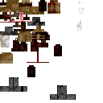 | Monster | Standard mosquito esk blood monster |
| **Thirster** | 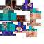 | Monster | Blood-thirsting mob |
| **Abhorent Thought** | | Monster | Large (1.5×3.25), eldritch thought entity |
| **Erythromycelium Eruptus** | 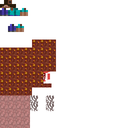 | Monster | Large fungal eruption mob (1.5×3.0) |
| **Blood Drunk Puppeteer** | 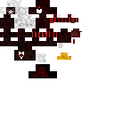 | Monster | Human-sized, controls dolls |
| **Enthralled Doll** |  | Monster | Small (0.5×0.5), controlled by puppeteer |
| **Chthonian** |  | Monster | Iron-mandible termite creature — actively chews through wood blocks and wooden tools in the area. Spawns in Chthonian Termite Mounds (Savanna biome). Part of the "arthropods as natural hemomancers" theme (they produce hematic iron shells biologically). |
| **Chthonian Queen** |  | Monster | Boss variant of Chthonian; exactly 1 spawns per Termite Mound. Associated with gold (royal). The only gold-connected creature in the mod. |
| **Lump of Thought** | 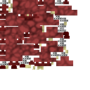 | Monster | Sentient thought blob |
| **Morphling Polyp** (mob) | 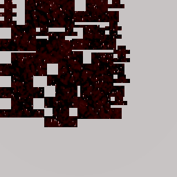 | Monster | Rare black slime-like wild morphling larva. Natural spawns receive up to three biome-shaped layers (fungal, aquatic, cave, desert, forest, or open-land hints) and provide the player's first Morphling Polyp item. |
| **Desiccant** | 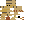 | Monster | Low desert scorpion blood-drainer. Spawns in dry hot biomes such as deserts, badlands, and savannas, and drops Telson for Aculeate Vitriol. Its sting animates the raised tail and red-swollen telson, inflicts Hunger and Blood Loss, and immediately saps 250 ml from active-blood players. |
| **Dormant tendency placeholder mobs** | | Monster | Cruor Fiend, Void Drinker, Frozen Clot, Abyssal Siphon, Synapse Hound, and Myelin Borer are currently commented out with no active registry entries, spawn placements, biome modifiers, spawn eggs, loot tables, or recipe-drop routes. |
| **Brined Votary** |  | Monster | Structure-only drowned Harbinger remnant placed by Harbinger Voyager Wrecks. Slow aquatic humanoid in corroded diving/ritual gear; wakes only at close range, is persistent when structure-placed, and has modest loot. |
| **Lantern Tick** | 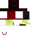 | Monster | Rare underground parasite in cave biomes. It glows as a lure when no player is nearby, leaps at close players, latches onto their head, and periodically drains active blood volume; if no active blood pool is available, it deals small fallback damage. Drops the Lantern Tick Helmet. |

### 26.2 Creature / Ambient Mobs

| Entity | Texture | Category | Notes |
|--------|---------|----------|-------|
| **Leech** | 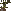 | Creature | Small (0.4×0.1) blood-sucking leech |
| **Fungling** |  | Creature | Friendly fungal creature |
| **Chitinite** |  | Creature | Iron-shelled Isopod insect (1.0×0.3) |
| **Fervent Chitinite** | 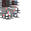 | Creature | Fire variant of Chitinite |
| **Hemolymphopoda** |  | Ambient | Small (0.9×0.3), Horseshoe crab drops Cleansing Hemolymph |
| **Hematic Burrower** | 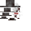 | Creature | Mole-like Hematic Field counterpart found in shallow, dark caves under forest-like biomes. It flees nearby living mobs; sustained pursuit triggers a particle-only dig-away despawn with a rare coal/raw copper/raw iron escape drop and no real block damage. Editable source: `assets/hemomancy/models/entity/bbmodel/HematicBurrowerModel.bbmodel`. |
| **Barbed Urchin** | 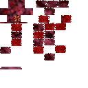 | Water Ambient | Underwater iron-barbed urchin |
| **Chalybeate Snail** | 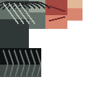 | Water Ambient | Slow vent-field grazer with defensive retraction. Does not use ordinary biome spawning; `DeepOceanVentFeature` places persistent 2-5 clusters around valid hydrothermal vent floors. Retracted, off-cooldown snails can be nonlethally harvested with any HutosLib `ItemKnapper` for Chalybeate Sclerites. |
| **Prism Cuttle** |  | Water Ambient | Warm-ocean Hematic Field counterpart that samples nearby block colors into synced camouflage variants. Approaching non-creative, non-spectator players trigger a bright defensive flash, particles, brief Blindness/Nausea, and a flee cooldown. Editable source: `assets/hemomancy/models/entity/bbmodel/PrismCuttleModel.bbmodel`. |
| **Crimson Doe** | | Creature | Blood-touched deer. Spawns on solid bright ground in plains/forest/meadow-style Overworld biomes and on solid ground in no-skylight Fungal Gardens biomes. |
| **Scarlet Serpent** |  | Creature | Territorial cobra-like wildlife in desert/badlands, swamp, and jungle biome families. Flares its hood near non-creative, non-spectator players at 8 blocks, then strikes within 5 blocks. Desert/badlands spawns use the redder texture variant, swamp/mangrove swamp spawns use the darker brown variant, and jungle spawns use the base black/red/yellow texture. Melee hits apply Poison I (100t) and Blood Binding (60t). Drops `serpent_scale` (1-2 plus Looting bonus). Its editable Blockbench source is `assets/hemomancy/models/entity/bbmodel/ScarletSerpentModel.bbmodel`. Neurotic/Fervent-aligned for sampling, but not included in `hemomancy_mob` so Unstained purity systems do not treat ordinary territorial wildlife as a factional blood-mob kill. |
| **Venom-Rib Centipede** |  | Monster | Rare damp-temperate armored arthropod with segmented body and leg animation rules inspired by Scarlet Serpent's linked-body approach. It preferentially hunts arthropods and can menace nearby players; melee hits apply venom/Poison and Blood Binding. Ferric-aligned and specimen-jar capturable. Editable source: `assets/hemomancy/models/entity/bbmodel/VenomRibCentipedeModel.bbmodel`. |
| **Hemojelly** | | Ambient | Blood jelly creature (ON_GROUND spawn) |
| **Venous Strider** | | Creature | Vein-walking strider. Spawns on solid bright ground in mushroom/swamp Overworld biomes and on solid ground in no-skylight Fungal Gardens / Fungal Isles / Hemorrhagic Plateau biomes. |

### 26.3 NPC / Summons / Player-controlled

| Entity | Texture | Category | Notes |
|--------|---------|----------|-------|
| **Blood Thrall** |  | Creature | Small (0.6×0.7), summoned blood transport creature. Can bind direct-routing sources/nodes, carry a capped amount, and deposit into target reservoirs without duplicating source blood. |
| **Blood Drunk Puppeteer** |  | Monster | Uncommon biome-gated hostile in dark/spooky, swamp, old-growth, and fungal biomes; uses solid-ground mob placement rather than vanilla darkness-only monster placement so it remains findable as a signature wild encounter. Summons four bonded Enthralled Dolls, keeps distance while commanding them, drops Puppeteering Thread, and is a bloody-jug drop candidate |
| **Enthralled Doll** | | Monster | Puppeteer-bound melee minion. Summoned dolls inherit and pursue their puppeteer's target, render red puppet strings back to the puppeteer, and vanish without loot if the owner is gone |
| **Unstained Zealot** | 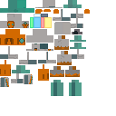 | Creature | NPC that guides Unstained path entry |
| **Unstained Guardian** | | Creature | NPC that guards Unstained sacred sites |
| **Unstained Acolyte** | | Creature | NPC acolyte of the Unstained faction |
| **Harbinger Hermit** | | Creature | NPC Harbinger recluse; full degree 0-7 dialogue (`HarbingerHermitDialogueTrees`). Drops Rite Hint item on farewell, then plays the ritual farewell death animation: crimson chest rays, irregular dissolve holes through the body, and ash-colored dust. Invulnerable until player chooses "Farewell" option. |
| **Harbinger Alchemist** | | Creature | NPC machine expert found at Harbinger Outposts; full degree 0–7 dialogue (`HarbingerAlchemistDialogueTrees`). Teaches crafting stations, dismisses purifying players. |
| **Hematic Artificer / Redwright** | 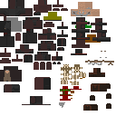 | Creature | NPC living-gear specialist found at Harbinger Outposts; degree-gated dialogue (`HarbingerArtificerDialogueTrees`). Teaches Hematic Armature use, armor forks, Blood Lust/Consecration/Cornerstone progression, and Living Staff graft/brazier practice when the player has a Living Staff bond. V1 has no trades or recruitment option. |
| **Harbinger Vicar** | | Creature | NPC doctrine keeper found at Harbinger Outposts; full degree 0–7 dialogue (`HarbingerVicarDialogueTrees`). Delivers faction history lore; reveals secret "8th degree" at Archon. |
| **Harbinger Mnemonist** | 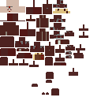 | Creature | NPC blood-memory mentor found at Harbinger Outposts; full degree-gated dialogue (`HarbingerMnemonistDialogueTrees`). Teaches crude memories, active manipulation slots, the Mnemonic Reliquary, and Somatic Loom progression. Gives eligible Degree 1+ Harbingers one starter crude memory item; purifying/Clarity players may inquire but cannot claim. |
| **Harbinger Voyager** |  | Creature | Active-vessel captain-scholar NPC; dialogue-only research leader for reef, vent, and wreck survey expeditions. Always placed by active-vessel spawn helper on Survey Cog structures. |
| **Harbinger Votary Wayfarer** | 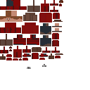 | Creature | Active-vessel junior Votary NPC with a 1-in-5 companion spawn rule. Dialogue-only observer learning from the Voyager; no trades, quests, rewards, or ordinary spawning. |
| **Vesper, The Crowned Refusal** | 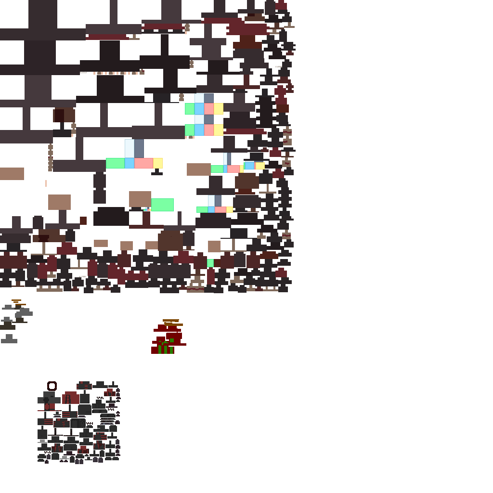 | Boss | Endgame Silent / refusal Archon boss phase 1, entity ID `hemomancy:vesper_crowned_refusal`. Uses the former Xanthous King reference as a red/black Vesper form. Stats: 520 HP, 0.16 speed, 1.0 knockback resistance. Boss bar: RED. Abilities include hostile targeting, low-health cadence scaling, blood-orb missiles, grip/spike hazards, Morphling Polyp add pressure, and shield-disabling melee hits. On defeat it transitions into `hemomancy:vesper_evening_star` and drops no final loot. Current access is direct summon until the endgame summoning ritual is wired. |
| **Vesper, The Evening Star** | 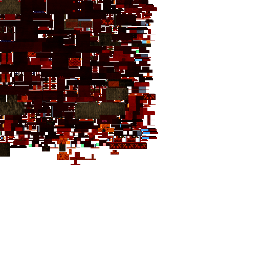 | Boss | Endgame Silent / refusal Archon boss phase 2, entity ID `hemomancy:vesper_evening_star`. Uses the former True Xanthous King reference as Vesper's final red/black form. Stats: 640 HP, 0.22 speed, 1.0 knockback resistance. Boss bar: RED. Keeps the Vesper missile/grip/spike/add-pressure kit with stronger final-phase pressure, delayed death spectacle, copied Vesper boss music, and `VesperEveningStarLinesLayer` emissive line rendering that only appears at half health or lower. Guaranteed final reward: `memory_of_vesper`, which is placed directly in the Iron Brazier and absorbed through Living Staff Blood Absorption to awaken the player's Living Staff bond. |
| **The Mycophant** | 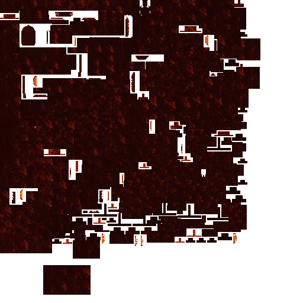 | Boss | Endgame Apotheos / fungal ascension boss, entity ID `hemomancy:mycophant`. Uses the former Uzouthrhix reference recolored into the red/orange/yellow mushroom palette. Stats: 720 HP, 0.18 speed, 1.15 knockback resistance. Boss bar: YELLOW. Abilities include hostile targeting, low-health cadence scaling, crimson flame placement, blindness/confusion/slowness pulses, repel/claw pressure, Fungling summons, fire immunity, copied Mycophant music, `hurtother` lash audio, and `MycophantAwokenMaskLayer` half-health emissive rendering. Guaranteed entity loot-table drop: `mycophant_tendril`, a Charm of Vascularium slot item that fully fungalizes the player render while equipped. |
| **Annetta Knowles (The Stained Priestess)** | | Boss / NPC | Separate Unstained boss arc with a full two-route encounter, implemented in `entity/boss/annetta/`. She spawns in COWERING state inside a `BrokenChurchStructure` (see §29), with a ToothPecks Specimen Jar placed beside her and Devil's Tooth decorations around the scene. Dedicated Java models/textures are present for the encounter entities, and Annetta's Sanguis Lancea has a custom held/item renderer; GeckoLib animation polish, fuller Phase 1 biological combat identity, and Annetta-specific thrown projectile rendering remain WIP. `AnnettaKnowlesEntity` has four states: **COWERING** (hiding, dialogue only), **PHASE_ONE** (Harbinger-route boss fight), **CURED_SUPPORT** (Unstained-route ally phase), **RESOLVED** (post-encounter).<br><br>**Harbinger route** (interact while holding a ToothPecks Specimen Jar): the jar shatters, Annetta is bitten, and she transitions to PHASE_ONE. Boss bar: PURPLE, NOTCHED_10. Stats: 350 HP, 7 ATK, 0.26 SPD, 0.8 KB resist, 8 armor. Phase abilities: ① Silver Aura (every 60t, 6-block radius, 3 magic damage + Weakness II to blood-active players) ② Hemolytic Vial throw (every 90t, projectile applies Weakness + Mining Fatigue) ③ Hair-and-Nails Slash at ≤50% HP (every 70t, 5-block AoE, 5 damage + Slowness III). When she would die: if the player holds `annettas_sanguis_lancea`, she mutates into **`StainedPriestessEntity`** (Phase 2 — see below). Harbinger-route drops: `annettas_sanguis_lancea` + hematic_iron_scrap ×4 (if Phase 2 not triggered).<br><br>**Unstained route** (interact while holding a Draught of Still Mercy and `clarityUnlocked == true`): Annetta drinks the draught, transitions to CURED_SUPPORT, and **`LatentAnnettaInfectionEntity`** spawns as a separate boss (the latent infection made physical). In CURED_SUPPORT mode Annetta moves toward the infection entity and applies slow/debuffs near it; she also heals nearby Unstained players every 80t. When the `LatentAnnettaInfectionEntity` dies, it calls `annetta.markResolvedAfterCure()`, transitioning Annetta to RESOLVED state. Unstained-route drops (from LatentAnnettaInfection): `annettas_absolution_dagger` + pale_silver_ingot ×3. |
| **Stained Priestess (`StainedPriestessEntity`)** | | Boss | Phase 2 of the Harbinger-route Annetta encounter. Stats: 420 HP, 12 ATK, 0.32 SPD, 0.9 KB resist, 10 armor. Boss bar: WHITE, NOTCHED_10. Phase abilities: ① Blood Lances (every 70t, fires `SanguisLanceaEntity` projectile in look direction + 2 angled variants) ② Lunge attack (every 100t, moves rapidly toward target and strikes) ③ Blood Pressure Bloom (every 85t, 7-block AoE, 6 magic damage + Slowness to all nearby). Melee hits drain 300 blood from blood-active players (`BLOOD_DRAIN = 300`). Drops: `annettas_sanguis_lancea` + hematic_iron_scrap ×4. |
| **Latent Annetta Infection (`LatentAnnettaInfectionEntity`)** | | Boss | Final challenge of the Unstained-route Annetta encounter: the latent infection given physical form. Stats: 360 HP, 10 ATK, 0.27 SPD, 0.85 KB resist, 8 armor. Boss bar: WHITE, NOTCHED_10. Abilities: ① Infection Bloom (every 70t, MYCELIUM particle burst, Sculk Shrieker sound, 6-block AoE, 5 magic damage + Confusion + Slowness) ② Pressure Spike (every 110t, SOUL_FIRE_FLAME particles, 9-block AoE, 4 indirect magic damage + Weakness). Melee hits apply Poison I. On death: if a linked `AnnettaKnowlesEntity` is in CURED_SUPPORT within 32 blocks, calls `markResolvedAfterCure()`. Drops: `annettas_absolution_dagger` + pale_silver_ingot ×3. |
| **Spectral Companion** | | Misc | Spectral ally entity |
| **Sanguilith** | | Misc (MnA, dormant) | Large (1.5×3.25), blood-themed summoned monster from the dormant MnA compat source. `ComponentSummonSanguilith` summons an ownable, duration-limited melee attacker with a max of 4 nearby. Authored in `MnAPluginEntityInit` with custom `SanguilithModel` and `SanguilithRenderer`, but not compiled/registered while MnA compat is excluded on the current NeoForge 1.21.1 branch. |

### 26.4 Entity Tags

Mobs are tagged by tendency: `FUNGAL_TAG`, `UMBRAL_TAG`, `INCANDESCENT_TAG`, `FERRIC_TAG`, `VIVACIOUS_TAG`, `RUINOUS_TAG`, `NEUROTIC_TAG`, `FERVENT_TAG`, `FRIGID_TAG`. Chalybeate Snails, Hematic Burrowers, and Venom-Rib Centipedes are Ferric-aligned and included in `specimen_jar_capturable`; Blood Lantern Jellies are Vivacious-aligned and also specimen-jar capturable. Prism Cuttles are Neurotic-aligned and specimen-jar capturable. Scarlet Serpents are Neurotic/Fervent-aligned, reflecting serpent morphling affinity without adding them to `hemomancy_mob`.

### 26.5 Spawn Placements

Registered in `EntityInit.commonSetup`:
- Scarlet Serpent -> `ON_GROUND`
- Barbed Urchin → `IN_WATER`
- Hemolymphopoda → `ON_GROUND`
- Hematic Burrower -> `ON_GROUND`, shallow-cave placement under forest-like biome tags with low light and sky occlusion checks
- Fervent Chitinite -> `ON_GROUND`, Nether placement under `fervent_chitinite_nether_spawnlist`, currently centered on Basalt Deltas
- Prism Cuttle -> `IN_WATER`, warm/lukewarm ocean biome tag only
- Venom-Rib Centipede -> `ON_GROUND`, rare damp temperate biome tag with low-light ground checks
- Fargone → `ON_GROUND` (monster rules)
- Desiccant -> `ON_GROUND`, dry hot biome tag with sand, red sand, sandstone, red sandstone, and terracotta surface checks
- Abhorent Thought → `ON_GROUND` (monster rules)
- Dormant tendency placeholder mobs -> disabled/commented out: Cruor Fiend, Void Drinker, Frozen Clot, Abyssal Siphon, Synapse Hound, and Myelin Borer.
- Vesper phase 1, Vesper phase 2, and The Mycophant intentionally have no natural spawn placement. Current access is direct `/summon` until their endgame summoning rituals are implemented.
- Crimson Doe → `ON_GROUND`
- Hemojelly → `ON_GROUND`
- Venous Strider → `ON_GROUND`
- Chalybeate Snail -> no ordinary biome spawn placement; spawned persistently by `DeepOceanVentFeature`
- Blood Lantern Jelly -> `IN_WATER`, ordinary ambient spawning only through the Erythrocoral Reef biome
- Mnemonic Whale -> `IN_WATER`, rare deep-water creature spawning only through the Erythrocoral Reef biome
- Brined Votary -> no ordinary biome spawn placement; spawned persistently by `HarbingerVoyagerWreckStructure`

### 26.6 Entity Loot Tables

> **Status: Implemented in resources.** Entity drops are hand-authored JSON now. The disabled `HemoEntityLootProvider` generator remains stale/commented, but the live loot tables are the JSON files under `src/main/resources/data/hemomancy/loot_table/entities/` (1.21 singular `loot_table` path). Current count: **44 entity loot tables**. Standard material-bearing mobs now guarantee at least one base drop of their associated material on valid kills, and all looting bonuses use the 1.21 `minecraft:enchanted_count_increase` function rather than the removed `minecraft:looting_enchant` id.

Notable implemented drop families:

| Entity / Family | Drop Theme |
|-----------------|------------|
| Chitinite / Fervent Chitinite / Chthonian / Chthonian Queen | Chitinous Husk, with Chthonian Queen also rolling Ferric Enzyme |
| Leech / Blood aquatic or arthropod mobs | Blood/hemolymph materials such as Swollen Leech or Cleansing Hemolymph |
| Fargone / Thirster / Abhorent Thought / Lump of Thought / Morphling Polyp | Sanguine Formation / fungal ingredients depending on mob; Fargones also drop Fargone Proboscis; Morphling Polyps drop the base Morphling Polyp item and can roll a small layer-hint item from their active appendages |
| Desiccant | Telson, the scorpion stinger and bulb used in Aculeate Vitriol; the mob's sting inflicts Blood Loss and drains 250 ml from active-blood players |
| Blood Drunk Puppeteer / Enthralled Doll | Puppeteering Thread from the puppeteer; puppeteer-summoned dolls are support minions and do not create extra loot |
| Chalybeate Snail | Killing gives only a rare small Hematic Iron Scrap fallback; reliable Chalybeate Sclerites come from knapper harvesting while retracted |
| Hematic Burrower | Ordinary death loot is clay-only; the rare coal/raw copper/raw iron reward is emitted only during the panic dig-away escape behavior |
| Blood Lantern Jelly | Empty/no meaningful combat drops; its value is ambient reef life and specimen preservation |
| Prism Cuttle | Small glow-ink fallback; intended value is observation, specimen capture, and its defensive flash ecology |
| Venous Strider | Vivacious Spores plus Venous Pinions for crafting Venous Strider Sabatons |
| Venom-Rib Centipede | Spider-eye fallback from a dangerous damp-biome predator; venom pressure and bug predation are the primary encounter identity |
| Lantern Tick | Drops the Lantern Tick Helmet; encounter value is the latch parasite behavior and mobile-light artifact, not material farming |
| Mnemonic Whale | Empty/no meaningful combat drops; intended interaction is nonlethal Mnemonic Ambergris sampling and observation |
| Brined Votary | Minimal salvage only: rare paper/book/scrap/spore material. It is a tragic wreck guardian, not a farming target. |
| Saint and boss entities | Direct/special boss rewards are handled in entity code or matching loot JSON depending on encounter |

Do not re-enable `HemoEntityLootProvider` unless the current JSON values are first ported back into the provider.

---

## 27. Projectile & Blood Construct Entities

### 27.1 Blood Constructs

Extend `BloodConstructEntity` (a `PathfinderMob` implementing `IBloodConstruct`). They are summoned by the player and have a limited lifetime (`deathTicks`):

| Entity | Notes |
|--------|-------|
| Blood Cloud (`CloudEntityBlood`) | Area-of-effect blood cloud |
| 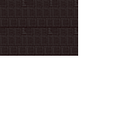 Iron Pillar (`EntityIronPillar`) | 0.75×2.8 iron construct |
| 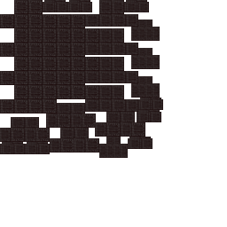 Iron Wall (`EntityIronWall`) | 1.6×2.8 iron wall construct |
| 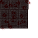 Iron Spike (`EntityIronSpike`) | 1.4×1.5 iron spike trap |
| 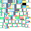 Wretched Will (`EntityWretchedWill`) | Will-based construct |

### 27.2 Projectiles

| Entity | Texture | Notes |
|--------|---------|-------|
| Directed Blood Orb | | High tracking range (150), main blood projectile |
| Tracking Blood Orb | | Homing blood orb |
| Blood Cloud Carrier | | Delivers blood clouds |
| Tracking Serpent | 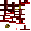 | Homing snake projectile |
| Tracking Pests | | Homing pest swarm |
| Blood Bolt |  | Crossbow ammo entity |
| Blood Needle |  | Small fast projectile |
| Blood Bullet |  | Pistol-type projectile |
| Blood Shot | 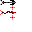 | Shotgun-style spread |
| Sanguis Lancea |  | Thrown spear entity |
| Dark Arrow | | Dark-themed arrow |

### 27.3 Item Entities

| Entity | Notes |
|--------|-------|
| Flying Charm | The Charm of Vascularium flying to the player |
| Morphling Polyp Item | Dropped morphling polyp pickup |
| Qliphoth Seed Item | Custom dropped-item entity (`EntityQliphothSeedItem`) rendered by `QliphothSeedItemEntityRenderer`. The seed body reuses `QliphothSeedItemRenderer.renderSeedBody(...)`, and throttled client-only HutosLib tendrils radiate from entity-following anchors so roots spread around the dropped item instead of locking to one world axis. |

---

## 28. World Generation & Biomes

### 28.1 Custom Biomes (via TerraBlender)

| Biome | Key | Temperature | Precipitation | Notes |
|-------|-----|-------------|---------------|-------|
| **Fungal Gardens** | `fungal_gardens` | 2.0 | None (Nether) | Hyphae tendrils, huge fungi |
| **Fungal Isles** | `fungal_isles` | 2.0 | None (Nether) | Hyphae, huge fungi, small infected fungi |
| **Sporecrown Thicket** | `sporecrown_thicket` | 1.2 | None | Dense fungal overgrowth, hostile spawns (Eruptus, Chthonian, Fargone), crimson particles, dark red fog |
| **Hyphal Spires** | `hyphal_spires` | 0.9 | None | Extreme towering terrain with calcified hyphae, conscious mass patches; high-weirdness / low-erosion zones |
| **Drifting Mycelium** | `drifting_mycelium` | 0.7 | None | Anti-gravity floating islands of fungal terrain; high-continentalness zones with 3D noise creating disconnected landmasses |
| **Erythrocoral Reef** | `erythrocoral_reef` | 0.95 | Rain | Rare warm/lukewarm deep-ocean biome injected through `ErythrocoralReefRegion`; murky red-violet water, light crimson spores, deeper Erythrocoral reef shelves, Blood Lantern Jelly, Barbed Urchins, Mnemonic Whale, tropical fish, pufferfish, squid, and rare dolphins |

The Fungal Gardens dimension uses a datapack `multi_noise` biome source in `data/hemomancy/dimension/fungal_gardens.json`. Its climate noise is intentionally tuned at a higher horizontal frequency so the dimension's fungal biomes appear as shorter, more varied patches rather than enormous single-biome regions. Its terrain density is intentionally high-relief: `continental_shape`, `erosion_shape`, and `fungal_noise_settings` amplify mid-scale rises, basins, and eroded ridges so the ground does not collapse into broad uniform shelves. Water is also meant to appear as real fungal seas and lowland basins: `fungal_noise_settings` uses sea level 32 and `continental_shape` avoids an excessive positive landmass bias. `morphic_pool` is a fungal dimension surface feature shared across the fungal dimension biomes; it gets two placement attempts per chunk in the same feature step as the other visible fungal terrain features, scans around the ocean-floor heightmap for actual fungal terrain, and carves shallow morphic nectar basins through the dimension's fungal surface palette, including `mycelium_erythrocytic_dirt`. The dimension is carved by datapack configured carvers (`fungal_cave`, `fungal_cave_large`, `fungal_canyon`); the two cave carvers use the registered `hemomancy:dry_fungal_cave` carver, which keeps vanilla-style cave branching but widens and densifies it into frequent spaghetti/Swiss-cheese tunnels while only applying strict fluid-adjacency protection near sea level, preventing exposed underwater air scars without overwhelming chunk generation. `fungal_canyon` is kept rare and deep. `#minecraft:overworld_carver_replaceables` is extended with the dimension's custom fungal stone/surface blocks. The dimension is visually dim: `dimension_type/fungal_gardens.json` uses low ambient light, the Fungal Gardens / Fungal Isles biome fog colors are darkened, and `FungalSkyBoxRenderer` tints the spore skybox down so the custom Earth, moon, and star field remain readable without washing out the realm. Its fungal biomes use End music (`minecraft:music.end`) with cave mood ambience rather than Nether ambient loops or additions. Sky-reaching hyphae tendrils are intentionally common; each tendril now chooses a varied endpoint height, with many stopping in the lower or middle sky and only rare strands approaching the ceiling, so the horizon reads as an uneven alien mycelial forest instead of a uniform set of build-limit cables. Open ground is broken up by `venous_ridge`, a sparse low surface feature that lays smoother organic ribs of infested stone, hyphae, conscious mass, and hemorrhagic crust across dry fungal terrain; some runs begin partially embedded and rise through the ground like exposed roots. Sparse canopy mushrooms are also shared into more fungal dimension biomes so big silhouettes appear outside only the dense thickets. The optional Overworld Fungal Gardens TerraBlender region is now `FungalGardensOverworldRegion` and is disabled by default behind `worldgen.enableOverworldFungalGardensRegion`; the reef region is registered separately.

`hemomancy:erythrocoral_reef` is the first true overworld ocean biome slice. It is not an `add_features` overlay: `ErythrocoralReefRegion` now uses TerraBlender's `TerrablenderOverworldBiomeBuilder` ocean table directly and maps only the deep warm/lukewarm ocean slot to `hemomancy:erythrocoral_reef`. Every shallow ocean, beach, slope, peak, plateau, shattered, and inland terrain table entry defers to vanilla or other TerraBlender regions, preventing the reef biome from painting ordinary land chunks. Exposed reef land shares the Fungal Gardens surface palette through `FungalSurfaceBiomeRules`, replacing ordinary grass/dirt/stone with erythrocytic mycelium above water, erythrocytic dirt on submerged caps and upper soil, venous stone, and hemorrhagic crust; the deepest surface checks run first so hemorrhagic crust no longer overrides the entire visible surface. The biome's own generation settings place `hemomancy:erythrocoral_reef` clusters on stable submerged ocean floors and enforce deeper water-depth/floor-distance gates so reef shelves sit farther below the surface. The biome is tagged in `#hemomancy:has_structure/harbinger_voyager_wreck` for implemented sunken wrecks and in `#hemomancy:harbinger_voyager_vessel_candidates` for implemented active Harbinger voyager expedition structures.

> **Custom environment textures:**
>
> | | | | |
> |---|---|---|---|
> |  Sun |  Moon |  Clouds |  Blood Moon Phases |

### 28.1.1 Blood Moons

Blood Moons are a world event distinct from normal nights, with their own moon texture phases (`blood_moon_phases.png`) and a client-side vein/tendril sky overlay.

**Frequency:** Natural trigger checks once per night at tick 12542 and currently has a **1-in-7 chance** to start a 11900-tick Blood Moon. A command can force one for testing; the **Rite of the Sanguine Eclipse** (Greater rite, Degree 3+) also manually triggers one — see §25.2 Harbinger Cardinal Rite Recipes.

**Effects while active:**
- Harbingers / active Hemomancers: **Strength II and Night Vision**
- Non-blood-magic players: **Weakness I** + **passive blood drain** (50 blood per effect interval, ~every 2 s) while their blood is active — the tide pulls at the uninitiated
- Thirsters and Fargones spawn near players within the Blood Moon encounter cap via direct Blood Moon event spawns, not biome spawn lists; placement allows open night sky and non-colliding ground clutter, avoids bright block-lit areas, checks full mob clearance, and only counts successful world insertion
- **Somatic Loom** ritual blood cost reduced by **25%** during a Blood Moon (applied in `SomaticLoomBlockEntity.startRitual()`; parallel to the manipulation discount in `BloodManipulation`)
- **Founding Fane** barrier: hostile mobs (non-player `Monster`) that enter a consecrated fane footprint during a Blood Moon take 4 magic damage and are knocked outward every effect interval (handled in `FoundingFaneEvents.onLevelTick()`).
- **Kidneys** organ (if extracted): regeneration amplifier increases by +1 during a Blood Moon (overclocked filtration under pressure) — see §20.8 Organ Echo Items
- Clients render the red Blood Moon phase texture and the `BloodMoonVeinSkyRenderer` tendril overlay when `PacketSyncBloodMoon` marks the event active; the RGB-only Blood Moon phase sheet is drawn additively so its black background texels do not appear as a visible square at dawn/dusk

**Lore significance:** Blood Moons represent the Pale Lady expending a burst of power to push back the fungal infection for another cycle. The moon appearing full and blood-red is her doing. After such a night, the moon may appear dim or new — she is recovering. See [LORE_REFERENCE.md](LORE_REFERENCE.md) §9 for the full cosmological explanation.

> **Status: Implemented.** `BloodMoonEvents` handles natural trigger, commands, gameplay effects, mob spawning, and client sync. Blood drain for uninitiated, loom discount, and fane mob-sealing are all implemented. Ritual trigger via the **Rite of the Sanguine Eclipse** is implemented.

### 28.2 World Features

| Feature | Notes |
|---------|-------|
| Big Mushgloom | Large mushroom variant |
| Canopy Mushroom / Brown & Red Canopy | Tree-like mushroom features |
| Small Infected Mushroom | Small scattered fungi |
| Fungus Feature | Generic fungal feature |
| Hyphae Feature | Ground-level hyphae spread |
| Hyphae Tendril | Vertical tendril features |
| Bog Body Feature | Generates bog body blocks |
| Deep Ocean Vent Feature | Rare code-generated basalt/magma hydrothermal vent field in deep ocean biome tag; spawns persistent Chalybeate Snails and provides atmosphere/hazards rather than direct ore nodes |
| Erythrocoral Reef Feature | Code-generated warm-ocean reef cluster feature using Erythrocoral blocks plus restrained Hemomancy accents; validates deeper submerged stable floors to avoid floating/surface-adjacent coral |

### 28.3 Configured/Placed Features

Managed via `ConfiguredFeatureInit` and `PlacedFeatureInit`:
- `HYPHAE_TENDRIL`, `VENOUS_RIDGE`, `HUGE_FUNGUS`, `SMALL_INFECTED_FUNGUS`
- `PLACED_INFESTED_VENOUS_STONE_BLOB`, `PLACED_MYCELIUM_BLOB`
- `PLACED_CANOPY_MUSHROOMS_DENSE`, `PLACED_CANOPY_MUSHROOMS_SPARSE`
- `PATCH_HYPHAE`, `BLEEDING_HEARTS`, `STINK_HORNS`
- `DEEP_OCEAN_VENT` / `deep_ocean_vent`: placed with `RarityFilter.onAverageOnceEvery(96)`, `HEIGHTMAP_OCEAN_FLOOR`, and a `surface_structures` biome modifier against `#hemomancy:deep_ocean_vent_spawnlist` (`deep_ocean`, `deep_cold_ocean`, `deep_lukewarm_ocean`)
- `ERYTHROCORAL_REEF` / `erythrocoral_reef`: placed directly inside `hemomancy:erythrocoral_reef` with `CountPlacement.of(9)`, `HEIGHTMAP_OCEAN_FLOOR`, and biome filtering. It is not added to vanilla warm oceans through a biome modifier.

### 28.4 Bog Body Encounters

**Bog Revenant**

- Swamp-associated undead tied directly to **Bog Body** world content and the broader Harbinger burial / ossuary motif.
- Naturally added to the same biome tag used by the **Bog Body Feature** (`#hemomancy:bog_body_spawnlist`), currently covering vanilla swamp-type biomes used by that feature.
- Also has a **rare triggered spawn** when a player breaks a **Bog Body** block, representing a waterlogged corpse or disturbed burial remnant reanimating on-site.
- Combat role is intentionally simple: a **zombie-like melee attacker** with straightforward pressure rather than boss-style mechanics.
- Common drop: **Rotten Flesh**.
- Rare drop: **Vivianite Cluster**, reinforcing the connection between bog interment, mineral staining, and Bog Body harvesting.
- Presentation uses a custom Bog Revenant model/renderer but deliberately reads as a shambling, low-complexity swamp undead.

> **Status: Implemented.** Registered in `EntityInit` / `ItemInit`, rendered through `BogRevenantRenderer`, spawned by biome modifier `add_bog_revenant.json`, can ambush players from `BogBodyBlock.playerDestroy(...)`, and uses the entity loot table `data/hemomancy/loot_table/entities/bog_revenant.json`.

---

## 29. Structures

| Structure | Type | Notes |
|-----------|------|-------|
| **Broken Church** | `BrokenChurchStructure` | Jigsaw-based overworld structure (registered in `StructureInit`). Spawns Annetta Knowles in COWERING state at `afterPlace()` by scanning the bounding box floor for a valid air-over-solid position. The corner scene includes: a **ToothPecks Specimen Jar** placed 1 block east of Annetta (facing her); three **Devil's Tooth** blocks nearby; and a scatter of random Hemolytic Plating or Bone Blocks within a 7×7 area as environmental debris. |
| **Blood Temple** | `BloodTempleStructure` | Contains the Mortal Display; gateway to hemomancy. Its `afterPlace()` hook places one hidden `abocipher_emitter` technical block for sparse client-side Abocipher ambience. |
| **Harbinger Outpost** | `HarbingerOutpostStructure` | Harbinger exploration structure. Its `afterPlace()` hook spawns outpost NPCs: Vicar/Alchemist guidance and one **Harbinger Mnemonist** in the unused opposite corner from one Alchemist, giving the structure an early manipulation teacher without requiring NBT edits. Spawned Vicar/Alchemist/Mnemonist entities are stamped with a persistent outpost recruitment key so Bloodline recruitment can enforce one pledged NPC per outpost. It also places hidden `abocipher_emitter` technical blocks across lower, middle, and upper floor bands for client-side Abocipher ambience. Chest loot now favors crude memory starter rewards over overly generous early full-memory rewards. |
| **Harbinger Voyager Wreck** | `HarbingerVoyagerWreckStructure` | Rare jigsaw/template-pool sunken research wreck in `#hemomancy:has_structure/harbinger_voyager_wreck` (currently `hemomancy:erythrocoral_reef`) with `random_spread` spacing 40 / separation 12. Placement verifies submerged ocean-floor sites with enough water depth and stable floor variation. Three compact variants exist: `broken_forecastle`, `split_keel_laboratory`, and `stern_shrine_hold`; `afterPlace()` adds common/research/lore salvage barrels, three discovery inscriptions, and 1-3 persistent Brined Votaries. |
| **Active Harbinger Voyager Vessel** | `ActiveHarbingerVoyagerVesselStructure` | Rare non-sunken Survey Cog structure in `#hemomancy:has_structure/harbinger_voyager_vessel`, fed by `#hemomancy:harbinger_voyager_vessel_candidates` (currently `hemomancy:erythrocoral_reef`) with `random_spread` spacing 72 / separation 24. Placement checks for ocean water columns, sufficient water depth, and flat water surface before placing the single `survey_cog` template at the waterline. `afterPlace()` calls `ActiveHarbingerVoyagerNpcSpawner`, which places one persistent Harbinger Voyager and a 1-in-5 Votary Wayfarer companion on validated dry deck/interior floor positions. V1 has no loot containers, trades, quests, sailing behavior, or hostile crew behavior. |
| **Sanguine Surveyor Bivouac** | `SanguineSurveyorBivouacStructure` | Harbinger camp structure that can appear in the Nether’s Crimson Forest and in Hemomancy’s fungal Nether biomes. Uses placeholder discovery inscriptions (`hemomancy:random/surveyor_log`) which are replaced at generation time with one of the Surveyor Log inscriptions. |
| **Bog-Body Ossuary Niche** | `BogBodyOssuaryNicheStructure` | Small Harbinger burial/cache niche intended for swamp biomes. Uses placeholder discovery inscriptions (`hemomancy:random/ossuary_memo`) which are replaced at generation time with one of the Ossuary Memo inscriptions. Placement is more tolerant of water depth than other overworld structures. |
| **Crimson Lodge Annex** | `CrimsonLodgeAnnexStructure` | Rare Harbinger “hall-camp” structure that implies ongoing covenant life (bunks, table, lectern, pantry). Uses placeholder discovery inscriptions (`hemomancy:random/lodge_minutes`) which are replaced at generation time with one of the Lodge Minutes inscriptions. |
| **Unstained Church** | `UnstainedChurchStructure` | Contains the Unstained Podium; gateway to the Unstained path |
| **Qliphoth Fane** | NBT structure | Dark fane used for the Qliphoth-related endgame content; contains Engram Block |
| **Qliphoth Bloom** | NBT structure | Qliphoth Bloom block structure placement |
| **Blood Tower (Core)** | NBT structure | Core segment of the Blood Tower multi-piece structure |
| **Blood Tower (Top 1)** | NBT structure | Top segment of the Blood Tower multi-piece structure |
| **Saint Trial Chamber (Hemorath)** | NBT structure (WIP) | Locked dungeon for the First Saint — four blood-basin puzzle, blood-sapping room, inner sarcophagus chamber. Unlocks once all four basins are filled to the correct level. See §5.8. |
| **Chthonian Termite Mound** | Feature/Structure (WIP) | Savanna biome structure. Always spawns with exactly 1 Chthonian Queen and a variable population of Chthonians. Contains a small loot chest (iron, gold, minerals). Chthonians will chew nearby wood. Spawn rate should be tuned (currently slightly over-common). |
| **Plains Hemopothecary** | Village structure | Hemopothecary villager house for plains biome villages |
| **Desert Hemopothecary** | Village structure | Hemopothecary villager house for desert biome villages |
| **Taiga Hemopothecary** | Village structure | Hemopothecary villager house for taiga biome villages |
| **Snowy Hemopothecary** | Village structure | Hemopothecary villager house for snowy biome villages |
| **Savanna Hemopothecary** | Village structure | Hemopothecary villager house for savanna biome villages |

> Structure NBT files are in `data/hemomancy/structure/`. Worldgen structures are registered via `StructureInit` and the datapack `worldgen/structure*` JSONs. Hemopothecary village NBTs and processors exist, but village pool injection is intentionally disabled on the alpha branch until a supported NeoForge 1.21 API path replaces the old direct `StructureTemplatePool` mutation.

---

## 30. Villagers & Professions

| Profession | POI Block | Notes |
|-----------|-----------|-------|
| 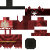 **Hemopothecary** | Scrying Podium | Blood-themed villager trader |

**Hemopothecary Trade Listings:**

| Level | Sells | Price (Emeralds) |
|-------|-------|-----------------|
| 1 | Befouling Ash | 1 |
| 1 | Fungal Morphling | 1 |
| 1 | Recycled Enzyme | 1 |
| 1 | Bloody Flask | 1 |
| 2 | Fervent Husk | 2 |
| 3 | Barbed Helm | 3 |
| 4 | Foul Paste | 4 |
| 5 | Heart Pattern | 5 |

- Custom `HemopothecaryProcessor` and village NBTs are present for future structure integration.
- `VillageEvents` currently handles Hemopothecary trades; village house pool injection is a no-op on this branch.

---

## 31. GUIs & Overlays

### 31.1 HUD Overlays

| Overlay | Location | Shows |
|---------|----------|-------|
| `BloodVolumeOverlay` | Left side | Current/max blood volume bar plus a small two-lobed equipped blood gourd indicator that reads only the Charm/Gourd slot and tints white/red/black by gourd variant 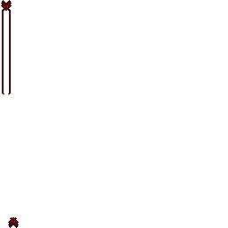 |
| `UnstainedGaugeOverlay` | Top-right | Purity + Clarity bars 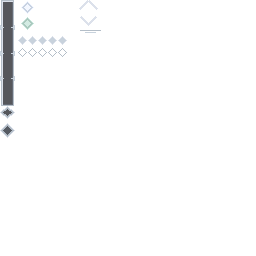 |
| `EquippedMorphlingOverlay` | Next to `BloodVolumeOverlay` | Currently equipped morphling icon only. It appears on the right side of a left-anchored blood bar, or on the left side of a right-anchored blood bar, vertically centered with the bar. No text/backplate. |
| `ManipCooldownOverlay` | — | Active manipulation cooldown timer |

> **Gauge fills:**  Blood fill &nbsp;  Purity fill &nbsp;  Clarity fill


### 31.1a Reusable Screen Widgets

- `BloodVolumeBarWidget`: reusable vertical blood reservoir bar with frame, animated red fill, meniscus, highlights, bubbles, tick marks, `Bounds`, and tooltip rendering. Used by internal blood reservoir screens including Ghastly Alembic, Vial Centrifuge, Morphling Incubator, Mycelial Crucible, and Mycelial Lantern.
- `WhiteHumorBarWidget`: dedicated Unstained counterpart with pale silver-blue fill and tooltip rendering. Extracted from `PallidRetortScreen` so future White Humor machines can reuse the same visual language without forcing a generic fluid widget yet.

### 31.2 Screens

**Key GUI Textures:**

|                                                                                                             | |                                                                                                          |
|-------------------------------------------------------------------------------------------------------------|---|----------------------------------------------------------------------------------------------------------|
|  Vial Centrifuge |  Ghastly Alembic | 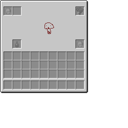 Recaller |
|  Scarring Station | Scar Binder |  Morphling Jar              |
| Tendency View     |  Vascular View |  Spore Implant |

| Screen | Opened From | Purpose |
|--------|------------|---------|
| `CharmGourdScreen` | Scarlet Vanity | Equip Charm of Vascularium, Blood Gourds, and Morphling Jar. The jar, charm, and gourd slots include eye toggles that persist per player and control whether those equipped layers render on the player for other clients. |
| `HarbingerProgressScreen` | Sanguine Conduit | Harbinger progress suite (Skills/Manipulations/Crafting/Scars/Rites/Materials), now tab-controller modularized; Skills overlay includes rank title text. The Manipulations tab detail panel wraps its description text within the available area so longer descriptions do not clip into the known-status and requirement sections. |
| `SynapticLoadoutScreen` | Dendritic Distributor | Carousel UI for remembered manipulation loadouts. Empty slots save the current normal manipulation set for 100 blood + 25 raw XP; existing patterns can be applied, renamed, or overwritten. |
| `TendencyViewScreen` | Blood Tendency Gauge | View blood tendency alignments |
| `VascularViewScreen` | Vascular Status Gauge | View vein section health |
| `VascularStatusScreen` | — | Detailed vascular status |
| `BloodlinePoolScreen` | Bloodline Pool Monitor | View/manage bloodline shared pool |
| `GhastlyAlembicScreen` | ghastly_alembic block | ghastly_alembic crafting GUI |
| `PallidRetortScreen` | Pallid Retort | Unstained distillation GUI with crystalline background and reusable `WhiteHumorBarWidget` for the internal White Humor reservoir. |
| `VialCentrifugeScreen` | Vial Centrifuge | Centrifuge crafting GUI (reworked with new 3D stand model) |
| `MorphlingIncubatorScreen` | Morphling Incubator | Incubation crafting GUI |
| `MorphlingJarScreen` | Morphling Jar / jar keybind | Unified morphling storage and selection container with green procedural background, side-slot inventory columns, and the animated bouncing morphling display in the center. |
| `MycelialLanternScreen` | Mycelial Lantern | Fungal/amber enzyme-fruiting GUI. Uses `BloodVolumeBarWidget`, centered reusable culture slot, blood input/empty flask slots under the bar, progress lane to enzyme output, and hover tooltip for the internal blood reservoir. |
| `MasonsEffigyScreen` | Mason's Effigy | Cerebral scar loadout preparation GUI. Shows known cerebral scars as item-rendered rows, seeds selected sockets from the player's active scar loadout on open, renders active slots below the list, and sends selected scar ids to the block for later motif-paper charging. The player preview suppresses head-slot equipment during rendering so helmets never hide the face/head in the Effigy portrait. |
| `UnstainedProgressScreen` | Self Reflection Mirror | Unstained progress + shared Rites/Crafting/Materials tab controller stack |
| `MnemonicReliquaryScreen` | Mnemonic Reliquary block | Reliquary viewing GUI — opens animated lid on interaction |
| `SporeImplantScreen` | Fungal Implantation Pylon | Spore implantation GUI |
| `StructureSpawnerScreen` | Structure Spawner item | Debug structure spawning |
| Various radial menus | Living Staff / keybinds | Morphling/manipulation selection |
| Guide/Codex screens | Liber Sanguinum | **Partially functional** — `HemoProgressionScreen.setupEntries()` is still commented out in Java (renderer), but the HutosLib JSON book framework is wired and the Liber Sanguinum's data folder (`data/hemomancy/books/fanesanguinium/`) now has a `manipulations/` chapter (ordinality 7) with 10 pages covering all 8 tendencies + overview + Canon Memories. |
| Guide/Codex screens | Liber Immaculatus (Unstained book) | **Populated** — `data/hemomancy/books/liberimmaculatus/` now has 4 chapters (intro, sacred_tools, our_lady, the_path), 3 pages each. Covers Hemolytic Solution mechanics, Our Lady of Still Waters lore, purity/clarity stage descriptions. |

---

## 32. Advancements

### 32.1 Shared / Early Game

| Advancement | Trigger |
|-------------|---------|
| **Strange Seeds** | Find Gourd Seeds from grass |
| **The First Awakening** | Activate a Blood Temple's Mortal Display (programmatic) |
| **Ashen Beginnings** | Craft Befouling Ash |
| **Fane Sanguinium** | Obtain the Liber Sanguinum |
| **Iron in the Blood** | Create first Hematic Iron Block via blood structure recipe |
| **Bottled Vitality** | Obtain a Blood Gourd |
| **An Extension of Oneself** | Craft a Living Staff |
| **Inherited Memory** | Obtain any Hematic Memory |
| **Scarlet Tradition** | Obtain the Charm of Vascularium |
| **Armed to the Veins** | Equip full Hematic Iron armor |
| **Cultivator** | Obtain a Morphling Jar |
| **The Blood Remembers** | Obtain a Living Blade |
| **Old Habits** | Obtain any enzyme |
| **Bleeding a Stone** | Craft a Ghastly Alembic |

**First-hour guidance:** the shared root advancement now points testers from early hooks (`gourd_seeds` / `hematic_iron_scrap`) toward a Blood Temple, Harbinger rite, or pale warning rather than leaving the opening loop implicit. The Blood Temple activation grants **The First Awakening**, early Harbinger NPCs provide Rite Hint/Liber context through dialogue, and Unstained entry is surfaced through Hemolytic Solution, Tome/Liber Immaculatus, Self Reflection Mirror, and Unstained Church/Zealot content. Liber access remains split between the HutosLib JSON book data and the WIP Java renderer noted in section 31.

### 32.2 Harbinger Path (programmatic + item triggers)

All degree advancements are granted via `HarbingerAdvancementGranter.grantDegree()` inside the `DEGREE_RITE_PATHS` completion block of `CardinalRiteEvents`. They chain from `the_first_awakening`.

| Advancement | JSON key | Frame | Trigger |
|-------------|----------|-------|---------|
| **Neophyte of the Crimson Veil** | `degree_1_neophyte` | task | Degree 1 rite (programmatic) |
| **Votary of the Hematic Covenant** | `degree_2_votary` | task | Degree 2 rite (programmatic) |
| **Initiate of the Incarnadine Fane** | `degree_3_initiate` | task | Degree 3 rite (programmatic) |
| **Adept of the Sanguine Brotherhood** | `degree_4_adept` | goal | Degree 4 rite (programmatic) |
| **Illuminatus of the Crimson Lodge** | `degree_5_illuminatus` | goal | Degree 5 rite (programmatic) |
| **Sanctified of the Bloodline Covenant** | `degree_6_sanctified` | goal | Degree 6 rite (programmatic) |
| **Archon of the Hematic Order** | `degree_7_archon` | challenge | Degree 7 rite (programmatic) |
| **Apotheos of the Hematic Order** | `degree_8_apotheos` | challenge | Degree 8 rite (programmatic) |

**Order function milestones** — branches off the degree chain:

| Advancement | JSON key | Parent | Trigger |
|-------------|----------|--------|---------|
| **Blood Is Bound** | `blood_is_bound` | `degree_3_initiate` | Bloodline founding rite succeeds (programmatic) |
| **A Lodge of Crimson** | `crimson_lodge_consecrated` | `degree_5_illuminatus` | Crimson Lodge rite completes (programmatic) |
| **This Ground Is Ours** | `founding_fane_established` | `degree_5_illuminatus` | Founding Fane first consecration (programmatic) |
| **The Covenant Cannot Be Unmade** | `eternal_covenant_sealed` | `degree_6_sanctified` | Eternal Covenant rite completes (programmatic) |

**Endgame / revelation milestones:**

| Advancement | JSON key | Parent | Trigger |
|-------------|----------|--------|---------|
| **Voices in the Vein** | `voices_in_the_vein` | `degree_7_archon` | Ancestral Communion rite (programmatic) |
| **The Blood Beneath the Blood** | `the_blood_beneath_the_blood` | `degree_7_archon` | Obtain Fungal Spine (inventory_changed) |

**Mastery side branches:**

| Advancement | JSON key | Parent | Trigger |
|-------------|----------|--------|---------|
| **Scars of the Mind** | `scars_of_the_mind` | `degree_4_adept` | Obtain Scar Binder or Scar Binder Upgraded (inventory_changed) |
| **The Land Bleeds for You** | `sanguine_domain` | `degree_5_illuminatus` | Sanguine Dominion rite (programmatic) |

### 32.3 Unstained Path (programmatic)

All granted via `UnstainedAdvancementGranter.grantIfNotDone()` from `UnstainedMilestoneHandler` (tick-based threshold checks) and `CardinalRiteEvents` (clarity ascension rite, altar of cleansing).

| Advancement | JSON key | Frame | Condition |
|-------------|----------|-------|-----------|
| **Unstained** | `unstained` | task | Obtain Hemolytic Solution |
| **Lady of the Forgotten Waters** | `lady_of_forgotten_waters` | goal | Obtain Tears of Silthmere |
| **Path of Purity** | `path_of_purity` | task | Obtain Tome of the Unstained |
| **Our Lady of Still Waters** | `our_lady_of_still_waters` | challenge | Obtain Icon of Our Lady |
| **Blessed by the Altar** | `blessed_by_the_altar` | goal | Use Altar of Cleansing (programmatic) |
| **Tainted** | `tainted` | task | Purity ≥ 25 (programmatic) |
| **Cleansing** | `cleansing` | task | Purity ≥ 50 (programmatic) |
| **Absolved** | `absolved` | goal | Purity ≥ 75 (programmatic) |
| **Purified** | `purified` | challenge | Purity = 100 (programmatic) |
| **Clarity Awakened** | `clarity_awakened` | challenge | Clarity unlocked (programmatic) |
| **Discerning** | `discerning` | task | Clarity ≥ 25 (programmatic) |
| **Vigilant** | `vigilant` | goal | Clarity ≥ 50 (programmatic) |
| **Resolute** | `resolute_stage` | goal | Clarity ≥ 75 (programmatic) |
| **Enlightened** | `enlightened_seeker` | challenge | Clarity = 100 (programmatic) |

---

## 33. Keybindings

All under the "Hemomancy" category:

| Key | Action |
|-----|--------|
| Use Manipulation | Cast the selected quick manipulation |
| Use Quick Manipulation | Alternative quick-cast |
| Use Continuous Manipulation | Toggle continuous manipulation |
| Cycle Known Manipulations | Cycle through unlocked manipulations |
| Activate Blood Construct | Activate blood construct ability |
| Blood Formation | Trigger blood formation |
| Blood Draw | Draw blood |
| Open Morphling Jar | Open the unified Morphling Jar inventory/selection screen |
| Open Morphling Jar Viewer | Legacy keybind name; now opens the same unified Morphling Jar screen |
| Toggle Gourd Open/Closed | Toggle blood gourd state |
| Toggle Scar Binder Pickup | Toggle scar pickup mode |

---

## 34. Commands

The `/hemo` command tree (via `HemoCommand`, permission level 2) is the main in-game admin/debug surface for blood state, progression, morphlings, fane previewing, and manipulation loadouts. Most player-facing subcommands accept an optional trailing `[player]` target; if omitted they act on the command executor.

**Blood Volume:**
- `blood get [player]` — show current and maximum blood, plus whether the blood capability is active
- `blood set <amount> [player]` — set current blood volume, clamped to the target's max blood
- `blood setmax <amount> [player]` — set maximum blood volume and clamp current blood down if needed
- `blood fill [player]` — fill blood to the target's maximum
- `blood activate [player]` — toggle the blood capability active state

**Bloodline:**
- `bloodline disband [player]` — disband the target's current bloodline, clear owned fanes, reset linked members, and burn bloodline ledger state where relevant

**Initiatory Degree / Qliphoth:**
- `degree get [player]` — show current initiatory degree and title
- `degree set <0-8> [player]` — set degree directly; entering the Harbinger path can reset unstained progress through the mutual-exclusion helper
- `qliphoth pome set <0-9> [player]` / `/hemo qliphoth pome set <0-9> [player]` — set Qliphoth pome progress for Communion sky and completion testing
- `qliphoth pome reset [player]` — reset Qliphoth pome progress and reseal the Communion gate

**Morphling Debug:**
- `morphling stage get [player]` — show the equipped morphling's current maturity stage
- `morphling stage set <0-5|stage_name> [player]` — force the equipped morphling to `unfed`, `fledgling`, `developing`, `mature`, `apex`, or `primal`
- `morphling stage next [player]` — cycle the equipped morphling to the next visual maturity stage
- `morphling stage previous [player]` / `morphling stage prev [player]` — cycle to the previous visual maturity stage
- Stage changes update both the equipped morphling capability and the matching morphling item stored in the player's Morphling Jar when an exact jar-slot match is found.

**Skills:**
- `skills get` — show current skill points and milestone totals
- `skills setpoints <amount>` — set skill points directly
- `skills reset` — reset skill points, milestone progress, and tracked totals

**Unstained Progress:**
- `unstained get [player]` — full overview of begun state, purity, clarity, and derived stages
- `unstained begin [player]` — toggle whether purification has begun
- `unstained purity get [player]` — show current purity and purity stage
- `unstained purity set <0-100> [player]` — set purity directly
- `unstained clarity unlock [player]` — toggle clarity unlock; can reset Harbinger progress through the path mutual-exclusion guard
- `unstained clarity get [player]` — show current clarity and clarity stage
- `unstained clarity set <0-100> [player]` — set clarity directly, unlocking clarity if needed and enforcing Harbinger-path reset rules
- `unstained reset [player]` — reset all unstained progress to zero
- `unstained max [player]` — set begun purification, purity, and clarity to their maximum values

**Visceral Organs:**
- `organs get [player]` — show all tracked organ levels
- `organs set <organ> <0-3> [player]` — set an individual organ level
- `organs reset [player]` — reset all organs to level 0

**Blood Tendency:**
- `tendency get [player]` — show all tendency values and percentage share of the current total
- `tendency reset [player]` — set all tendencies to 0
- `tendency max [player]` — set all tendencies to 100
- `tendency <tendency> <value> [player]` — set one named tendency directly

**Blood Moon:**
- `bloodmoon summon` — start a Blood Moon in the overworld and sync the state to players
- `bloodmoon cancel` — end the active Blood Moon and sync the shutdown to players

**Will Ambush Testing:**
- `/hemo will ambush anchor <school> <tier> <broken_count> <sent_present> [player]` - spawn a real Will anchor at the command source position, then let it materialize the selected Broken/Sent composition against the target player
- `/hemo will ambush immediate <school> <tier> <origin> [count] [player]` - spawn configured Broken or Sent Wills immediately around the command source position for renderer and mechanics testing

**Fane Preview:**
- `fane preview` commands are op-only single-player/debug aids for previewing relation-specific boundary rendering without needing a second account or live hostile bloodline.
- `fane preview member` — preview fane boundaries as a member
- `fane preview mundane` — preview fane boundaries as a mundane outsider
- `fane preview outsider` — preview fane boundaries as a non-member outsider
- `fane preview rival` — preview fane boundaries as a rival elder
- `fane preview clear` — clear the preview override and return to normal relation evaluation

**Manipulation Slots:**
- `slots get [player]` — show equipped manipulation slots and current slot capacity
- `slots equip <manip>` — equip a named manipulation if a slot is available
- `slots unequip <manip>` — unequip a named manipulation

---

## 35. Sound Events

Registered in `SoundInit`:

| Sample Sound Event | Registry Key | Notes |
|-------------|-------------|-------|
| Abhorent Thought Ambient | `entity.abhorent_thought.ambient` | Idle sound for the Abhorent Thought mob |
| Crimson Doe Ambient | `entity.crimson_doe.ambient` | Ambient sound for the Crimson Doe creature |
| Chthonian Queen Death | `entity.chthonian_queen.death` | Death sound for the Chthonian Queen |
| Synapse Hound Hurt | `entity.synapse_hound.hurt` | Dormant sound registration for the disabled Synapse Hound monster |
| Vesper Boss Music | `entity.vesper.music` | Looping boss music for both Vesper phases |
| Mycophant Boss Music | `entity.mycophant.music` | Looping boss music for The Mycophant |
| Mycophant Lash Hit | `entity.mycophant.hurtother` | Extra copied lash/impact sound used by Mycophant attacks |

> **Status: Implemented.** `SoundInit` currently registers **104 custom sound events** spanning item, creature, aquatic, arthropod, monster, and boss categories. Vanilla sounds are still used in many interactions where dedicated custom audio has not yet been authored.

---

## 36. Particle Types

Registered in `ParticleInit`:

| Particle | Registry Key | Data Class | Factory | Visual Purpose |
|----------|-------------|------------|---------|---------------|
| Serpent | `serpent` | `SerpentParticleData` | `SerpentParticleFactory` | Tracking Serpent projectile trail effect |
| Hit Glow | `hit_glow` | `HitColorParticleData` | `HitGlowParticleFactory` | Colored glow effect on entity hits, manipulation impacts, and Consecrated Bloodwell ambient fountain motes |
| Blood Avatar Hit | `blood_avatar_hit` | `BloodAvatarHitParticleData` | `BloodAvatarHitParticleFactory` | Blood Avatar melee hit splash effect |
| Blood Cell | `blood_cell` | `BloodCellData` | `BloodCellParticleFactory` | Blood cell floating effect (used in blood volume visuals, gourds, rituals, and Consecrated Bloodwell fountain spray) |
| Blood Claw | `blood_claw` | `BloodClawData` | `BloodClawParticleFactory` | Claw-slash blood effect (Deadly Gaze, melee manipulation hits) |
| Absorbed Blood Cell | `absorbed_blood_cell` | `AbsorbedBloodCellData` | `AbsorbedBloodCellParticleFactory` | Blood being absorbed/drawn into the player (blood draw, gourd filling) |
| Sporitic Spore | `sporitic_spore` | `SporiticSporeParticleData` | `SporiticSporeParticleFactory` | Tinted thurible smoke/spore cloud; RGB is supplied by the burned aligned spore |

- **Abocipher Structure Ambience** - Blood Temple and Harbinger Outpost generation places hidden `abocipher_emitter` technical blocks during `afterPlace`. These invisible, non-colliding block entities emit client-side Abocipher glyph particles with Blood Temple and Harbinger Outpost profiles. Harbinger Outposts spread their emitters across lower, middle, and upper ambience bands, and the glyph particles swim laterally for several blocks with slow organic turn/writhe motion instead of only rising and fading. Existing explored structures are not retroactively migrated.

> The mod also makes heavy use of HutosLib particles (`GlowParticleFactory` with `ParticleColor`) for manipulation-specific effects (crimson glows, ice crystals, flame sparks, etc.). These are not registered in Hemomancy's `ParticleInit` but are spawned via `ServerLevel.sendParticles()` in each manipulation's `getAction()` method.

Gloam Laceration is the current exception for slash-shaped manipulation visuals: the server sends `SpawnClawSlashPacket`, and the client `ClawSlashRenderer` draws a short-lived three-line tapered ribbon using `RenderTypeInit.CLAW_SLASH_GLOW` and `CLAW_SLASH_CORE`. This keeps true claw/sweep effects distinct from ordinary glow particles.

HutosLib now also supplies reusable visual-effect tooling that Hemomancy can consume without registering new Hemomancy particle types:

- **Organic tendrils:** `TendrilEffectConfig`, `TendrilAnchor`, `TendrilEffectSpawner`, and client `TendrilRenderer.INSTANCE.add(...)` provide tapered ring/tube tendrils with grow/hold/fade lifetime, branching, writhe/curl/sag, freeform or surface-snap modes, core/glow colors, optional `blendColors(false)`, fixed seeds, and repeat fields. Hemomancy uses this for selected manipulation flourishes through `HemomancyTendrilEffects` and for the dropped Qliphoth Seed item entity.
- **Generic particle tester:** HutosLib's `GenericParticleTestConfig` / `GenericParticleTesterSpawner` covers Glow, Ember, and Dark Glow test particles. It can emit burst particles or HLParticleUtils-derived shapes (`FIBONACCI_SPHERE`, `RANDOM_SPHERE`, `INVERSED_SPHERE`, `IMPLODE`, `LOTUS_FOUNTAIN`, `BLOOMING_FLOWER`, `COSMIC_BIRTH`, `COSMIC_BIRTH_INVERSE`, `SQUASH_STRETCH`, `RANDOM_SWIMMING`, and `TANGENT_FUNNEL`) with typed numeric input, repeat intervals down to 1 tick, and optional random color.
- **Effect templates:** HutosLib Lightning and Tendril Template items store JSON through `EffectTemplateJson` / `EffectTemplateType`. Tester items can read a matching template from the off hand, and tester blocks can accept matching templates on right-click, making deterministic spell visuals portable as data rather than hard-coded Java constants.

---

## 37. Mod Compatibility

### 37.1 Mana and Artifice (MnA)

> **Status: `Dormant`.** MnA compat source is preserved as the design/implementation target, but it is **not compiled or registered** in the current branch. `build.gradle` excludes `src/main/java/com/vincenthuto/hemomancy/compat/mna/**`, the MnA dependency is commented because no NeoForge 1.21.1 build is available, and the `Hemomancy.java` MnA imports/registration block is commented out. Treat this section as dormant compat until MnA publishes a compatible build and the source exclusion is removed.

Designed integration as a faction + spell system:

**Faction: The Harbingers**
- `HarbingersFaction` — custom faction with blood-red manaweave (RGB 160,0,40) 
- Token item:  Mark of Blood
- Grimoire:  Tome of the Impending End
- Faction Horn:  Horn of the Impending End
- Custom mana resource (`HarbingersMana`) 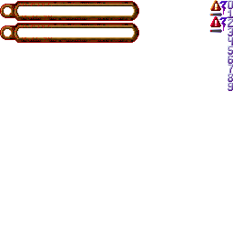

**Spell Components:**
-  `ComponentBloodBinding` — applies Blood Binding effect via spells
-  `ComponentManaToBlood` — converts MnA mana into Hemomancy blood volume (configurable magnitude, 50–200 mana per cast)
-  `ComponentSanguineFertility` — applies Sanguine Fertility via spells
- `ComponentBloodToMana` — "Sanguine Offering" — drains target's blood and converts to mana for caster (inverse of ManaToBlood). Magnitude 50–500, Blood affinity. Composable with any MnA shape.
-  `ComponentBloodLoss` — applies Blood Loss effect (movement speed debuff) via spells. Duration 60–300t, Magnitude 1–3, HARMFUL
-  `ComponentBloodRush` — applies Blood Rush effect (+move/attack speed) via spells. Duration 100–600t, Magnitude 1–3, FRIENDLY
-  `ComponentHemolysis` — applies Hemolysis effect (blood destruction DoT) via spells. Duration 40–200t, Magnitude 1–4, HARMFUL
-  `ComponentSummonSanguilith` — "Conjure Sanguilith" — summons a Sanguilith at target location. Duration 200–600t (summon lifetime), Magnitude scales damage. Requires Harbinger faction. HARMFUL

**Cross-System Mechanics (dormant until MnA compat is re-enabled):**
- **Blood Tithe** (`BloodTitheHandler`): Harbinger faction members casting blood-affinity spells have a configurable percentage of mana cost converted to blood cost instead (default 25%). Blood drained at 5 blood per 1 mana replaced. Hooks into `CalculatingManaCostEvent`.
- **Spell → Manipulation Combos** (`ManipComboHelper` + `BloodTitheHandler`): Casting blood-affinity MnA spells grants **Arcane Resonance** (reduces next manipulation's blood cost). Using Hemomancy manipulations grants **Sanguine Clarity** (reduces next spell's mana cost). Creates an alternating gameplay loop between both mod systems.

**Cross-Mod Config** (`HemoMnAConfig`):
- Blood ↔ Mana conversion ratios
- Blood Tithe enable/disable, mana reduction %, blood-per-mana ratio
- Living Thread armor set bonus values
- Trapezohedron effect radius
- Spell ↔ Manipulation combo enable/disable, durations, reduction percentages
- Sanguilith summon health scaling and max summon count

**Manipulations:**
- `SanguineTransfusionManip` — MnA-specific manipulation

**Runic Anvil Integration:**
- Living Infused Thread + Mage Armor → Living Thread armor set (Hood, Robes, Leggings, Boots)
- (3) Set Bonus: +500 Max Mana, +50% Mana Regen

**Additional MnA Items:**

| | | | |
|---|---|---|---|
|  Foul Vinteum Ingot |  Befouled Vinteum Dust |  Mana Infused Memory Blank |  Living Infused Thread |
|  Living Thread Hood |  Living Thread Robes |  Living Thread Leggings |  Living Thread Boots |
|  Blood Shot Occulus |  Mote of Blood |  Mana Memory: Sanguine Transfusion | |

> Living Thread Armor model:  

**MnA Ritual:**
- Ritual of The Weeping Wound

**MnA Block/Tile/Entity:**
- Custom blocks, tiles, and entities in `compat/mna/block`, `compat/mna/tile`, `compat/mna/entity`

**Planned / Brainstormed Features** (see `MNA_COMPATIBILITY_BRAINSTORM.md` for full details — each feature includes an "MnA Justification" explaining why it specifically requires Mana and Artifice):
- New spell shapes: Sanguine Pulse (dual mana+blood cost AoE), Hemomantic Tether (channeled tether draining blood per tick)
- New MnA rituals: Sanguine Convergence (permanently links mana regen to blood volume), Arcane Crucible (transmutes MnA materials with blood sacrifice), Mana Wound (zone that adds Hemomancy effects to MnA spells)
- Tendency ↔ Affinity mapping: Hemomancy tendencies boost corresponding MnA spell affinities
- Harbinger faction: Occulus tasks, fane structure, manaweaving recipes, raid mobs — all use MnA faction infrastructure
- Blood Construct: MnA Construct variant fueled by blood instead of mana, built at MnA's workbench
- Blood-Infused Construct Capabilities: runeforged modules for MnA Constructs
- Hemomantic Wand Core, Arcane Living Staff, Mote of Mana — crafted via MnA systems (manaweaving, runeforging)
- Hemomantic enchantments via MnA runeforging
- Cross-mod advancements, JEI integration for MnA crafting recipes
- Harbinger Mana HUD texture (`textures/mna/harbingers_resource_bars.png`) and resource hook (`HarbingersMana` implementing `ICastingResourceGuiProvider`) are authored in dormant compat source and should be treated as port targets until MnA is re-enabled

### 37.2 Curios

**Status: `Dormant`.** Curios integration for the Charm of Vascularium and other equippable items is preserved in `compat/curios`, but the current NeoForge 1.21.1 branch does not compile/register it. `build.gradle` comments the Curios dependency and `Hemomancy.java` has the Curios registration block commented out pending a compatible Curios NeoForge build.

### 37.3 JEI

**Status: `Alpha-ready`.** JEI is currently supplied by a local `libs/jei-1.21.1-neoforge-19.27.0.340.jar` while the old Maven dependency lines remain commented. Recipe category support exists for:
- Chisel Station recipes
- Visceral Recaller recipes
- Blood Structure Crafting recipes (Harbinger entries; Unstained entries share infrastructure but are documented in §15.3)
- Morphling Incubator recipes (`IncubatorRecipeCategory`)
- Mycelial Crucible recipes (`MycelialCrucibleRecipeCategory`)
- Morphic Nectar recipes (`MorphicNectarRecipeCategory`)
- White Humor Purification recipes (`WhiteHumorPurificationRecipeCategory`; Unstained-only, see §15.4)
- Enzyme Fruiting recipes (`EnzymeFruitingRecipeCategory`) with Mycelial Lantern catalyst and the enzyme-fruiting recipe list registered in `JEIPlugin`.
- Hematic Armature armor upgrade recipes (`HematicArmatureRecipeCategory`) with base armor, reagent, output, armor slot, degree, blood cost, optional persistent gate display, and Hematic Armature recipe catalyst wiring.

### 37.4 HutosLib

HutosLib is still the required shared runtime library (`com.vincenthuto.hutoslib:hutoslib`, currently `7.3.5`), but local development now uses an *optional* Gradle composite build. If a sibling `../HutosLib` checkout is present, `settings.gradle` includes it and substitutes the Maven module with the local project, so Hemomancy builds directly against workspace HutosLib sources; otherwise it falls back to resolving the Maven dependency normally.

Recent reusable effect systems live in HutosLib, not Hemomancy:

| System | Primary Classes / Assets | Notes |
|--------|--------------------------|-------|
| Lightning tester/templates | `LightningTestConfig`, `ItemLightningTester`, `BlockLightningTester`, `ItemLightningTemplate`, `EffectTemplateJson`, `effect_templates/lightning/*.json` | Expanded bolt renderer/tester stack with JSON templates that can be carried in the off hand or applied to tester blocks. |
| Organic tendril renderer | `TendrilEffectConfig`, `TendrilAnchor`, `TendrilEffectSpawner`, `PacketSpawnTendrilEffect`, `TendrilRenderer`, `TendrilGeometry`, `effect_templates/tendrils/*.json` | Reusable structural particle-like effect for organic roots, sutures, drains, void lashes, and surface crawlers. The client renderer uses `HLRenderTypeInit.TENDRIL_CORE` and `HLRenderTypeInit.TENDRIL_GLOW`. |
| Tendril tester/templates | `ItemTendrilTester`, `BlockTendrilTester`, `TendrilTesterItemScreen`, `TendrilTesterBlockScreen`, `ItemTendrilTemplate` | GUI-based tester item/block with collapsible sections defaulting closed, compact one-screen layout, no background blur, core/glow color controls, color-blend toggle, freeform/surface modes, repeat, seed, and branching/writhe controls. |
| Generic particle tester | `GenericParticleTestConfig`, `GenericParticleTesterSpawner`, `ItemGenericParticleTester`, `BlockGenericParticleTester`, `GenericParticleTesterItemScreen`, `GenericParticleTesterBlockScreen` | One item/block screen for cycling Glow, Ember, and Dark Glow particles with numeric inputs, random color, repeat, and HLParticleUtils shape presets. |

Callers that need synced gameplay visuals should prefer `TendrilEffectSpawner.spawn(ServerLevel, startAnchor, endAnchor, config)` or the overload with a primary `ServerPlayer`; this resolves anchors, clamps config, and sends `packet_spawn_tendril_effect` near the origin. Client-only visuals, such as the dropped Qliphoth Seed item entity, may call `TendrilRenderer.INSTANCE.add(new TendrilEffectData(...), partialTicks)`, but those callers should throttle their pulses and avoid adding effects every render frame.

Registered HutosLib payloads for this tooling include `packet_spawn_tendril_effect`, `packet_tendril_tester_item`, `packet_tendril_tester_block`, `packet_lightning_tester_item`, `packet_lightning_tester_block`, `packet_generic_particle_tester_item`, `packet_generic_particle_tester_block`, and `packet_effect_template_item`.

Tendril anchors support `Point(Vec3)` and `Entity(entityId, AnchorPoint, offset)` with `FEET`, `CENTER`, and `EYES` anchor points. Missing entity anchors fail cleanly; entities that need persistent-looking tendrils should use short repeated pulses rather than a render-time permanent link. For high-contrast black/gold, black/red, or black/violet looks, use `blendColors(false)` so the outer sheath draws before the inner core instead of muddying the center color.

Template samples are checked into `HutosLib/effect_templates/`: lightning examples include `abyssal_crown_bolt`, `golden_judgement`, `solar_overload`, and `viridian_mutation_web`; tendril examples include `eclipse_root_cage`, `black_altar_crown`, `parasite_surface_net`, `umbral_inversion`, and `void_lash`. The README in that folder documents which JSON files belong in Lightning vs Tendril Template items.

---

## 38. Known WIP / Incomplete Systems

This section is a maintenance rollup, not a changelog. It uses the status legend from the top of this reference and only calls out systems whose state is easy to misread from older notes.

| Status | Systems |
|--------|---------|
| Implemented | Entity loot JSONs, all 21 skill effects, visceral organs, armor set bonuses, morphling maturity powers, morphling mutation visual layer, standard scar effects, incubator recipes, fungal scar cultivation, Blood Moon mechanics, Chthonian termite mound behavior, deep ocean vent fields and Chalybeate Snail ecology, Erythrocoral Reef biome and Blood Lantern Jelly ecology, Harbinger Voyager Wreck salvage sites and Brined Votary remnants, active Harbinger Voyager Vessel structures with neutral crew placement, major NPC dialogue trees, early crude memory learning, Mycelial Lantern enzyme fruiting with JEI display/catalyst wiring, Hematic Armature armor upgrades with JEI display/catalyst wiring, Harbinger armor model/texture pass, Sporitic Thurible offhand support tool, direct blood routing, Chamber of Will Degree 6 refuge with tier-radius growth and dynamic sky themes, Flexible Founding Fane heart/stake footprint core, puppeteer spindle container/render pass, puppeteer trial Blood Crafting recipes, Mnemonic Whispers/Screams potion effects and mob-effect icons, Blood Drunkenness mob-effect icon, endgame Vesper/Mycophant entity-render-sound wiring, HutosLib tendril visuals on selected manipulations, Qliphoth Seed 3D item/drop renderer with HutosLib tendril roots, HutosLib lightning/tendril/generic-particle tester and template tooling, alpha building fixture set (chains, bars, walls, hematic iron door/trapdoor) with recipes and resource coverage test |
| Partial | Progression/Liber Java renderer, Founding Fane balance/art tuning, Saints rooms/world placement/art, Fungal Dimension terrain/content, Vesper/Mycophant summoning rituals, Annetta final animation/combat polish, Non-Euclidean Hallway prototype |
| Dormant | MnA and Curios compat source/config while their NeoForge 1.21.1 dependencies are unavailable and source exclusions remain active |
| Planned | Direct-routing polish, forced manipulation rank-up rituals, active Harbinger voyager trade/rumor/dialogue expansion, optional Our Lady apparition encounter, Spectral Companion summon flow, remaining Unstained Church palette/decor polish |

- **Entity Loot Tables** - `Implemented`: 44 entity loot table JSON files exist in `data/hemomancy/loot_table/entities/` (1.21 singular path) and are loaded automatically by vanilla/NeoForge datapack convention. The `HemoEntityLootProvider` data generator remains disabled but is not needed - loot tables work via the JSON files.
- **Manipulation Rank Advancement** — Ritual-based forced rank upgrades described as WIP in lore
- **Skill Effect Wiring** — **Implemented:** All 21 skills in `SkillPointHelper` have helper methods and are fully wired into event handlers. Iron Will wired in `BloodVolumeEvents.onPlayerDamaged`; Scar Affinity and Scar Mastery are wired through registry-backed scar definitions and scar event handling, while Scar Resonance is pending a post-refactor activation-limit pass; puppeteer summon cap/health/damage/range are wired through the Marionette Crossbar and bound summon behavior.
- **Loot Modifiers** (`AddItemModifier`) — framework exists; specific loot targets are not yet assigned.
- **Gourdvine Tap** — `Partial`: Draft living "machine plant" block (`gourdvine_tap`) that passively generates blood into an internal reservoir and slowly fills an inserted Blood Gourd; bone meal cultivation advances 4 growth stages that increase its fill rate. Anchors: `GourdvineTapBlock`, `GourdvineTapBlockEntity`, `assets/hemomancy/blockstates/gourdvine_tap.json`.
- **Visceral Organs System** -- **Implemented:** All 5 organ effects are fully implemented in `VisceralOrgansEvents`: **Spleen** contributes +1000 max blood per level through `MaxBloodLedger` and stacks with Capacity, Eternal Covenant, and scars; **Liver** (removes Poison at level 2+, Wither at level 3+); **Lungs** (Water Breathing while underwater); **Kidneys** (Regeneration at level-1 amplifier; amplifier +1 during a Blood Moon); **Heart** (Damage Resistance capped at Resistance II; Wither immunity at level 3 -- Cardiac Autonomy fully mastered; blood drain 10/level per 2 s). **Iron Brazier** reagent system is organ-specific. See Section 20.8.
- **Armor Set Bonuses** — **Implemented:** Current full sets have unique set bonuses implemented in `ArmorSetBonusHandler`, `EdaciousBloodburstArmorAbilityHandler`, `SheolicBastionBloodlustArmorAbilityHandler`, `PhanstmalBloodlustArmorAbilityHandler`, and `SilentArchonArmorAbilityHandler`: Hematic Iron (blood regen), Blood Lust (lifesteal plus minor mask modifiers), Barbed (thorns + Blood Loss), Chitinite (toughness + projectile/non-direct reduction), Unstained (Blood Loss/Hemolysis immunity), final Bloodlust lineages (radial armor abilities plus Edacious flight, Sheolic infernal defense, and Phantasmal displacement), and Silent Archon Vestments (incorporeal physical defense, mundane physical offense suppression outside blood manipulations and living weapons, radial Silent Severance, double-tap jump Silent Slipping, and blood-spending death refusal gated to Silent Archons and excluding Apotheos). One-off tradeoff pieces such as Marrow Crown, Venous Strider Sabatons, and Covenant Mantle have standalone bonuses that intentionally break full-set bonuses. See §22 for details.
- **Morphling Maturity** — **Implemented:** All 12 morphlings now have named maturity-tier reactive abilities (Developing → Mature → Apex) and secondary tendencies defined. See §16.1.
- **Morphling Mutation Visual Layer** — **Implemented:** Equipped morphlings can render player tint/swirl overlays and animated model attachments through `MorphlingMutationLayer`, `MorphlingVisualMutation`, `MorphlingModelAttachment`, and `MorphlingMutationRegistry`. Attachment state syncs to tracking players through `SyncEquippedMorphlingPacket`; replacement attachments can hide vanilla humanoid parts through `MorphlingPlayerPartVisibility`. All 12 morphlings now have registered attachment examples. See §16.5.
- **Morphling Jar Screen** - **Implemented:** `MorphlingJarScreen` is now the single storage and selection UI. It keeps the server-backed jar slots available for item dragging while rendering the animated green morphling display in the center; right-click, shift-right-click, and the jar keybind all open this unified container.
- **Scar Gameplay Effects** — **Implemented:** All standard scars now have full triggered effect implementations. Effect durations respect `getScarMasteryDurationMultiplier()`.
- **Vial Centrifuge Rework** — New 3D stand model (`CentrifugeStandModel`) and custom item renderer implemented; UI and menu updated. `VialCentrifugeBlockItem` has custom `BlockEntityWithoutLevelRenderer`.
- **Custom Block Item Render Angles** — **Implemented:** Hematic Armature, Earthen Vein, Puppeteer's Spindle, and Visceral Mirror use custom item rendering/GUI transforms so inventory icons show the 3D models at a readable down-right angle instead of flat face-on block thumbnails.
- **Memory Overlay Textures** — **Implemented for active memory set:** active memories use the layered memory item model system (`memory_blank` + per-memory overlay), including Glacial Circulation and Osseous Bloom. Memory item JSONs and overlays live under `models/item/memory_*.json` and `textures/item/memories/memory_*_overlay.png`.
- **Incubator Recipe System** — Full `IncubatorRecipe` + `IncubatorRecipeSerializer` added with 13 JSON recipes for all morphling types. JEI integration via `IncubatorRecipeCategory`. Recipes stored in `data/hemomancy/recipe/incubator/`.
- **Fungal Scar Cultivation** - **Implemented:** `MycelialCrucibleBlockEntity`, `FungalScarCultivationRecipe`, and `FungalScarCultivationSerializer` now support the two-phase fungal scar flow. Eight recipes live in `data/hemomancy/recipe/fungal_scar/`; all use the consolidated `immature_fungal_scar` culture item with target metadata and aligned-enzyme maturation.
- **Visceral Organs Brazier Route** - **Disabled/WIP:** the Iron Brazier no longer accepts organ reagents or Organ Echo upgrades. Its block entity stores one Blood Structure offering item instead.
- **Mycelial Lantern / Enzyme Fruiting** — **Implemented:** `MycelialLanternBlockEntity`, `EnzymeFruitingRecipe`, `EnzymeFruitingRecipeSerializer`, eight spore culture items, eight enzyme-fruiting JSON recipes, Blood Structure recipe, menu/screen, block entity renderer, item renderer, Blockbench source, and JEI category/catalyst/recipe registration are present.
- **Hematic Armature / Armor Upgrade Path** — **Implemented:** `HematicArmatureBlockEntity`, `ArmatureUpgradeRecipe`, custom renderer/model/item renderer, hidden restraint entity, no-GUI right-click bowl interaction, walk-on mounting, filler-block multiblock bounds, 5-second per-piece processing, bowl/player particle feedback, and JEI category/catalyst wiring are present. Recipes live in `data/hemomancy/recipe/armature_upgrade/`.
- **Harbinger Armor Model and Texture Pass** — **Implemented:** Blood Lust mask variants, Silent Archon Vestments, Barbed, Chitinite, Unstained, Venous Strider Sabatons, Covenant Mantle, Crimson Lacquer, Monolith Imbued Cloth, and the recent memory overlays all have item/model resource coverage. All custom 3D armor sets and one-off armor pieces except Hematic Iron now use model-backed 3D item-stack rendering where applicable.
- **Sporitic Thurible** - **Implemented:** Degree 4 Harbinger offhand support item with aligned-spore ignition, 6,000-tick catalyst burn time, GUI burn meter computed from `BurnEndGameTime`, blood upkeep, server-derived swing intensity, spore-colored ambient particles, hostile infection aura, Sporitic Resonance manipulation discount/cooldown hooks, Blood Structure recipe, custom first-person renderer, third-person player layer, hidden vanilla held item, active catalyst miniature rendered inside the thurible head, and articulated client-side chain physics. The supplied thurible photo remains visual reference only and is not packaged as an asset.
- **Direct Blood Routing** — **Implemented:** `HematicSutureNeedleItem`, `HematicSutureNodeBlockEntity`, `BloodRoutingSavedData`, `IBloodSourceContract`, `IBloodRoutingTarget`, and `BloodRoutingHelper` provide pull-based machine feeding without a basin, fluid, or bulk storage block. Current behavior supports nearby personal/gourd links, Degree 5 fane links, optional bloodline-pool draw with leader/opt-in checks, Blood Thrall courier draw/deposit, and Drudge tendering around an SSC.
- **Non-Euclidean Hallway Prototype** - **Partial/Prototype:** `non_euclidean_hallway` is a creative/WIP-tab spike for a straight horizontal 3x3 doorway fold. The runtime state is transient and player-only: `FoldTransform` converts world/fold coordinates for all four horizontal facings, `FoldedHallwayManager` tracks one active fold per player, `MixinEntity` compresses only the hallway-forward movement component by 2/32, `FoldedHallwayCollision` replaces active player block/entity collision queries with synthetic folded-space floor, ceiling, and side-wall shapes, and `NonEuclideanHallwayRenderer` draws a generated 32-block corridor through a stencil/aperture pass and while the local player is inside. It intentionally has no recipe, progression hook, pocket dimension, loading screen, hidden real hallway, or deliberate teleport. Live opposite-exit world projection is currently disabled because the prototype's nested `LevelRenderer.renderLevel(...)` experiment mutated main render state and shifted unrelated effects such as clouds and custom JSON/model renders. A future projection attempt needs a safer render-stage architecture rather than a block-entity nested world render. Current limitations are part of the spike: F3/commands/minimaps can reveal the compressed 2-block physical depth, multiplayer observers will not see the same interior illusion, and mobs/items/projectiles are not folded. Interaction, block picking, breaking, and placing are blocked while inside to reduce world corruption risk.
- **Puppeteer Spindle and Trial Unlocks** — **Implemented:** `PuppeteersSpindleBlockEntity`, `PuppeteersSpindleMenu`, `PuppeteersSpindleScreen`, `PacketPuppeteersSpindleAction`, `PuppeteersSpindleRenderer`, and `PuppeteersSpindleItemRenderer` provide the two-slot spindle workflow, persistent 512-thread buffer, slotted crossbar filling/binding, themed screen, custom block model, and facing-aware placement. `PuppeteerTrialRecipe`, `PuppeteerTrialRecipeSerializer`, and `PuppeteerSummonTrialEvents` provide the Sanguine Quintessence Blood Crafting trial unlock path for Veinwing Vulture, Marrow Spitter, and Gorebound Hulk.
- **Mnemonic Reliquary** — New functional block with animated lid (open/close), custom 3D block entity renderer (`MnemonicReliquaryRenderer`), item renderer (`MnemonicReliquaryItemRenderer`), block model (`MnemonicReliquaryModel`), menu (`MnemonicReliquaryMenu`), and screen (`MnemonicReliquaryScreen`). Tracks open count and syncs lid angle via block events.
- **Suspended Cleansed Blood Crystal** — Purified variant of the Suspended Blood Crystal with custom block, block entity (random time offset for desynchronized animations), block item with custom renderer, 3D model, and blockstate.
- **Cleansed Sanguine Glass & Pane** — New glass/pane variants added to the block system with blockstates, models, textures, and loot tables.
- **Debug Showcase Item** — Creative-mode testing tool (`DebugShowcaseItem`) that generates an organized showcase of all mod content in 4 sections: items in chests, blocks on platforms, mobs in fenced pens, and multiblock structures placed as patterns.
- **Cardinal Rite Boundary Renderer** — Client-side visual renderer (`CardinalRiteBoundaryRenderer`) for cardinal rite boundaries during active rites.
- **Morphling Item Textures** — All morphling types now have individual item textures and item models (bat, centipede, chitinite, cuttlefish, fungal, leeches, mole, pests, serpent, spider, tick, urchin).
- **Morphling Attachment Models/Textures** — All 12 morphlings have Java attachment models, matching Blockbench `.bbmodel` examples, and per-attachment PNG atlases under `textures/models/morphling/`. The Java-to-Blockbench exporter under `tools/model_export/java_model_to_bbmodel.mjs` supports the `morphling` batch and direct Java model conversion.
- **MnA Compatibility Expansion** — Extensive brainstorming and dormant compat source are documented in `MNA_COMPATIBILITY_BRAINSTORM.md` and `compat/mna/**`. Current NeoForge 1.21.1 branch excludes MnA compat from compilation because no compatible MnA build is available; `Hemomancy.java` registration is commented. Treat spell components, Blood Tithe, Spell ↔ Manipulation combo, and `HemoMnAConfig` as preserved design/port targets rather than active runtime features until compat is re-enabled.
- **GhastlyAlembic Custom Renderer** — `GhastlyAlembicRenderer` now renders the block as a full 3D entity model (`GhastlyAlembicModel`) with facing-aware rotation. Previously was a static block.
- **MorphlingIncubator Custom Renderer** — `MorphlingIncubatorRenderer` now renders the incubator as a full 3D entity model with custom animation.
- **Morphling Incubator Blood Flask Transfer Fix** — Bloody Flask absorption now clamps to available player blood capacity instead of requiring full flask fit. Empty flasks are routed to the dedicated incubator flask output slot.
- **New Monster Mobs** — `Partial`: Crimson Doe, Hemojelly, Venous Strider, and Desiccant remain active creature additions. Desiccant spawns in dry hot biomes, drops Telson for Aculeate Vitriol, and now has a synced sting state that plays a tail/telson swell animation while applying Blood Loss and an immediate 250 ml active-blood drain. The remaining placeholder tendency mobs (Cruor Fiend, Void Drinker, Frozen Clot, Abyssal Siphon, Synapse Hound, and Myelin Borer) are dormant/commented out with their spawn hooks, biome modifiers, loot tables, spawn eggs, and reagent drops disabled.
- **New NPC Entities Dialogue** — `Partial`: full dialogue trees are implemented for the main Harbinger and Unstained NPCs, including Zealot, Acolyte, Guardian item/ambient dialogue, Scout, and Our Lady whisper events. Item inquiry is now merged into normal NPC dialogue through `DialogueItemInquiryNodes` instead of replacing the tree when the player holds an item. Guardian/Scout/Acolyte renderers and church spawning are active. Spectral Companion is registered with AI/rendering, but its player-facing summon flow remains WIP.
- **Fungal Whisper System** — `FungalWhisperDialogueTrees` and `FungalWhisperEvents` deliver degree-gated (4–7, with degree 8 using the Archon-tier whisper set) intrusive fungal consciousness whispers. 12 variants across 4 tiers progressively reveal that hemomancy is a fungal infection masquerading as blood magic. High-degree players receive whispers on random intervals. Additional one-shot event dialogues: `postMonolithShatter()` (Entity comments on the seed hiding inside), `postBloom()` (acknowledgment of first fruiting), `pomeDropped(index, offerMemo)` (per-husk drop announcement; always delivered to the online bloom owner, with memo capture only when still relevant), `qliphothCommunion()` (nine-shell completion), `coreWitnessDialogue()` (Archon dimension choice fork). Whisper nodes now include Hematic Field Notes memo capture options where appropriate; ordinary high-tier whispers unlock Entity/Hyphae knowledge, while truth, communion, and core-witness moments unlock Truth or Qliphoth pages.
- **Ancestral Communion Dialogue** — `AncestralCommunionDialogueTrees` provides 5 unique lore-revelation dialogues for the Grand Rite of Ancestral Communion (degree 7). Variants: The Origin, The Schism, The Infection, The Harbingers, The True Name.
- **Harbinger Outpost NPCs** — Harbinger Alchemist, Vicar, Mnemonist, and Hematic Artificer / Redwright are implemented with degree-gated dialogue trees. The Alchemist covers machine lore, the Vicar covers faction history/doctrine, the Mnemonist covers crude memories, active manipulation slots, Mnemonic Reliquary loadout management, Somatic Loom memory weaving, and the one-time Degree 1+ starter crude-memory choice, and the Artificer covers living equipment: Hematic Armature use, armor forks, Blood Lust/Cornerstone frame work, and Living Staff graft/brazier teaching. Degree 5+ bloodline recruitment is implemented for Alchemist/Vicar/Mnemonist only, with mutually exclusive pledge/release dialogue, one recruited NPC per entity type, and one recruited NPC per originating Harbinger Outpost. Entities are registered with textures, lang keys, client render hooks, dialogue handlers, and outpost `afterPlace()` spawning.
- **Scar Tier System** - All three standard cerebral tiers are registered through `ScarInit` as `ScarDefinition` entries with active gameplay effects. `ItemScar` instances in `ItemInit` point at those definitions. Current active set is 24 standard cerebral scars (8 tendencies x 3 tiers), Blood-Honed as a special cerebral definition, and 8 fungal scar definitions. The old unregistered Ichor scar resource stub has been removed.
- **HemoItemModelProvider Enhancements** — Data generator now handles `BloodMemoryItem` 2-layer models, `ItemScarPattern` 2-layer models, and properly excludes special blocks (sanguine panes, cleansed sanguine panes, ash trails, engram, filler, crimson flames) from automatic block model generation.
- **Saints System** — **Partial:** Four canon Saints exist: Hemorath, Seraphae the Chain Saint, Putriciel, and Velorum. The shared sarcophagus spine and boss dispatch are implemented, and Hemorath's trial is the first complete trial flow. Bespoke Trial Chamber rooms/world placement for Seraphae, Putriciel, and Velorum remain WIP. Boss models/textures/GeckoLib animations are stub/placeholder. See §5.8.
- **Founding Fane** - **Partial:** The core Flexible Founding Fane model is implemented: Consecrated Bloodwell heart binding, one-heart-per-footprint prevention, up-front bloodline validation for the rite, bloodline-gated bloodwell conduit use, dynamic block blood absorption/projection endpoints, heart-break/reconsecration/disband stake cleanup, progenitor-manifested Hematic Stake anchors, stake budget/connection validation, `FaneFootprint` inside/outside and strength scaling, footprint-based routing/bloodwell/Blood Moon checks, full-sphere Soft Envelope rendering, viewer relation colors, bloodwell fountain renderer/particles, and `/hemo fane preview` testing commands. Remaining work is final balance, art polish, and broader gameplay tuning. See §5.7.
- **Blood Moon Mechanics** — **Implemented:** `BloodMoonEvents` handles natural trigger, commands, gameplay effects, mob spawning, Somatic Loom discount, fane sealing, organ synergy, ritual trigger, and client sync/rendering. See §28.1.1.
- **Fungal Dimension** — **Partial:** Fungal Spine access, safe travel placement, dimension mob spawning, and the Archon first-exit choice fork are implemented. Terrain feature population and broader dimension content remain WIP. See §5.6.
- **Endgame Vesper / Mycophant Bosses** — **Partial:** `VesperTheCrownedRefusalEntity`, `VesperTheEveningStarEntity`, and `MycophantEntity` are registered with attributes, models, textures, renderers, render layers, boss bars, sound events, client boss music, legacy-inspired combat behaviors, and guaranteed final entity loot-table drops. Vesper phase 1 transitions into the Evening Star phase and has no final loot. Vesper phase 2 drops `memory_of_vesper`; The Mycophant drops `mycophant_tendril`, which fits the Charm of Vascularium slot and triggers full-body fungalization rendering. Remaining work is the summoning ritual layer. See §5.10 and §26.3.
- **Annetta Knowles / Stained Priestess** — **Partial:** The two-route encounter is wired through `AnnettaKnowlesEntity`, `StainedPriestessEntity`, `LatentAnnettaInfectionEntity`, and `BrokenChurchStructure`. Dedicated encounter entity models/textures and Annetta's Sanguis Lancea held/item renderer are present. Remaining work is GeckoLib animation polish, fuller Phase 1 biological combat identity, and Annetta-specific thrown projectile rendering. See §26.3 and LORE_REFERENCE §11.
- **Chthonian Termite Mound** — **Implemented:** Savanna structure, guaranteed queen spawn, loot chest, wood-chewing behavior, wooden tool degradation, tuned spawn rate, and spawn placements are present. See §29.
- **Deep Ocean V1: Chalybeate Snail and Vent Fields** - **Implemented:** `deep_ocean_vent` is a code-generated hydrothermal vent feature registered through feature bootstrap/data JSON and added to deep ocean biomes via `neoforge:add_features`. It builds basalt/smooth basalt/deepslate/blackstone/magma vent fields with restrained Hemomancy organic accents, then spawns persistent `chalybeate_snail` clusters. The snail has defensive retraction, Ferric/specimen-jar tags, a spawn egg, renderer/model/texture, subtitles/sounds, and a nonlethal HutosLib `ItemKnapper` harvest path for `chalybeate_sclerite` with a saved 6000-tick cooldown.
- **Erythrocoral Reef V2** - **Implemented:** `erythrocoral_reef` remains a true TerraBlender-injected warm deep-ocean biome with red-violet water/fog, light crimson spore ambience, stable-floor procedural reef clusters, the Erythrocoral block family, and shears-first fragment harvesting. Reef biome placement now uses TerraBlender's overworld ocean table and only claims the deep warm/lukewarm ocean slot; all shallow ocean and land terrain tables defer. The reef feature still enforces deeper water-depth/floor-distance gates so actual coral clusters sit below the surface. The biome supports non-hostile `blood_lantern_jelly` ambient life and rare `mnemonic_whale` megafauna, including nonlethal `mnemonic_ambergris` sampling. It remains the first target biome for Harbinger Voyager Wrecks and active Harbinger Voyager Vessel structures through `#hemomancy:harbinger_voyager_vessel_candidates`.
- **Harbinger Voyager Wrecks V1** - **Implemented:** `harbinger_voyager_wreck` is a rare sunken research-vessel structure targeted at Erythrocoral Reefs through `#hemomancy:has_structure/harbinger_voyager_wreck`. It uses three compact NBT variants, modest salvage loot, discovery inscriptions (`red_current_chart`, `last_covenant_watch`, `vent_survey_fragment`), the lore-only `salt_stained_voyager_log`, and the structure-only `brined_votary` remnant.
- **Active Harbinger Voyager Vessels V1** - **Implemented:** `harbinger_voyager_vessel` is a rarer non-sunken Survey Cog structure targeted at Erythrocoral Reefs through `#hemomancy:has_structure/harbinger_voyager_vessel`, which delegates to `#hemomancy:harbinger_voyager_vessel_candidates`. It places a compact single-template vessel at the ocean waterline and has no loot containers, trades, quests, active sailing, or hostile ship behavior. `afterPlace()` uses `ActiveHarbingerVoyagerNpcSpawner` to place one captain-scholar Voyager and a 1-in-5 Votary Wayfarer companion on validated dry deck/interior floor positions.
- **Ghost Pipes as Unstained Material** — **Implemented:** Ghost Pipe is registered as a plant/potted plant and now has a Pallid Retort distillation recipe into Pale Distillate (`distillation/ghost_pipe.json`, `pallid: true`).
- **Cleansed Stone and Pallid Lantern** — **Implemented:** `cleansed_stone.json` crafts Cleansed Stone from Stone + Hemolytic Solution, and `pallid_lantern.json` crafts Pallid Lantern from Pale Silver Ingot + Pale Humor Flask + Glowstone Dust. Both are registered blocks and used by Unstained recipes/advancements.

**2026-06-18 scar workflow update:** The registry-backed scar system now has a playable Mason's Effigy / Anastomotic Brazier loadout spine. Scar items are burned in the Anastomotic Brazier to unlock known cerebral scars. The Mason's Effigy screen reads a server-authored opening snapshot of known/active scars, renders known scars as item stacks, seeds active sockets from the player's current loadout, and prepares selected scar ids on the block. Runic Motif Paper rests visibly above the Effigy, Blood Projection charges it at 500 blood per selected scar, and completion ejects a dynamic 2x2 Scar Pattern item. Burning that prepared pattern in the Brazier commits the active cerebral scar loadout. Harbinger equipment remains a separate non-overlapping system from cerebral and fungal scars. Remaining work is broader balance, final art polish, and any later progression content around Mason's Effigy rituals.

**2026-06-19 Vein-Mason update:** `masons_respite` is implemented as a sparse hermitage structure with a persistent Cicatrix Anchorite. The Vicar's Degree 4 dialogue grants a map to the site. The Anchorite's one-time lesson gives the player one dynamic Scar Pattern stack tagged with the tier-1 template for the player's strongest blood tendency, and the ledger now collapses the assignment into four visible parts: find the Anchorite, carve/burn the first Scar item, prepare the first Effigy pattern, and commit the first active scar loadout. Returning after the fourth part claims a continuation kit keyed to the player's second-strongest tendency. The old per-scar `scar_pattern_*` items and old `recipe/scar_pattern/` outputs have been removed; template acquisition now uses the single dynamic `scar_pattern` item.

### 38.1 Unstained Expansion - Current Status

The Unstained faction has moved from mostly planned design notes into a broad implemented gameplay path. This rollup keeps the remaining planned pieces visible without leaving completed systems mislabeled.

| System | Status | Code/data anchors |
|---|---|---|
| Altar of Cleansing | `Implemented` | `AltarOfCleansingBlock`, `AltarOfCleansingBlockEntity`, `altar_of_cleansing` block/entity registration, modeled item/BER, inquiry dialogue, and Unstained Church NBT entries. Tears of Silthmere grant the one-time altar blessing; Lethean Poppy Wreaths and Lethean Brew grant repeatable purity; Silver Chalices and Pallid Icons grant clarity once unlocked. |
| Unstained temple/church expansion | `Partial` | `UnstainedChurchStructure` spawns one Zealot, two Guardians, three-to-five Acolytes, and rite-fragment inscriptions; `unstained_church.nbt` includes the Altar of Cleansing and Unstained Podium. Pallid Lantern/cleansed decorative density is still a tuning/art pass. |
| Our Lady presence | `Partial` | `OurLadyWhisperEvents` and `OurLadyWhisperDialogueTrees` now deliver purity/clarity-stage whispers with memo capture. A physical Our Lady apparition/entity remains a future concept; `SpectralCompanionEntity` exists as an Unstained summon shell, not the Lady herself. |
| Unstained dialogue expansion | `Implemented` | Zealot, Acolyte, Guardian, Scout, and Our Lady whisper dialogue trees exist. Unstained inquiry data covers Zealot/Guardian item dialogue, and the church structure now spawns the relevant NPCs. |
| Lethean / pale crafting recipes | `Implemented` | Tears of Silthmere, Lethean Poppy Wreath, Pale Distillate, Pale Silver, Cleansed Stone, Pallid Lantern, Pallid Silver Chain, Pale Silver Bars, Pale Silver Bells, Pale Field Ink, Lethean Chalice, Pallid Icon, Verdigris Censer, Unstained armor/tools, Pallid Retort distillation, and White Humor purification recipes are present under `data/hemomancy/recipe/`. Ghost Pipe now has a Pallid Retort recipe into Pale Distillate. |
| Unstained advancement branch | `Implemented` | `UnstainedAdvancementGranter` and `UnstainedMilestoneHandler` grant altar, purity-stage, and clarity-stage advancements. JSONs exist for `unstained`, `path_of_purity`, `blessed_by_the_altar`, `tainted`, `cleansing`, `absolved`, `purified`, `clarity_awakened`, `discerning`, `vigilant`, `resolute_stage`, `enlightened_seeker`, and `lady_of_forgotten_waters`. |
| Silver Ward / Verdigris Aura indicators | `Implemented` | `SilverWardEffect` spawns ambient END_ROD particles and reduces hemomancy-mob damage; `VerdigrisAuraEffect` spawns SCRAPE ring particles and weakens hemomancy mobs. `UnstainedProgressScreen` exposes toggles through `PacketToggleUnstainedBonus`, and `PacketSyncUnstainedProgress` syncs toggle state. |
| Still Arts | `Implemented` | `StillArtInit`, `IKnownStillArts`, `KnownStillArtEvents`, Still Art packets, radial screen, cooldown overlay, and advancement-backed grants are active. See §15.1. |
| Unstained Cardinal Rites | `Implemented` | Purity and clarity rites are authored under `data/hemomancy/recipe/cardinal_rite/` and handled by Unstained rite event systems. See §15.2. |
| White Humor purification | `Implemented` | Recipe type/serializer, placed White Humor pools, finite pool charges, witness-block acceleration, JEI category, and Liber Immaculatus page are present. See §15.4. |

Remaining work should now be tracked as polish/expansion rather than baseline implementation: finish any desired Unstained Church block-palette pass, decide whether Our Lady ever receives a visible apparition entity, wire any Spectral Companion summoning flow if it becomes player-facing, and continue balancing purity/clarity rewards.

---
